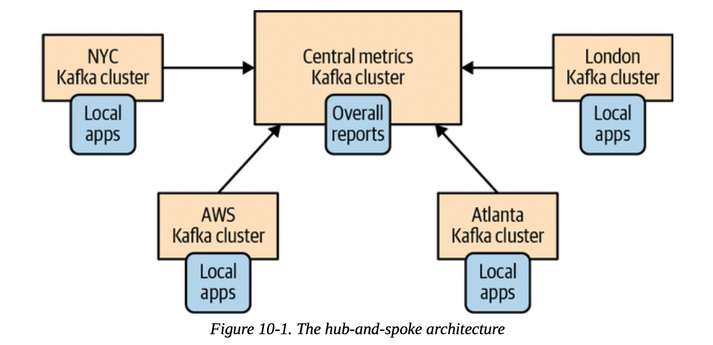
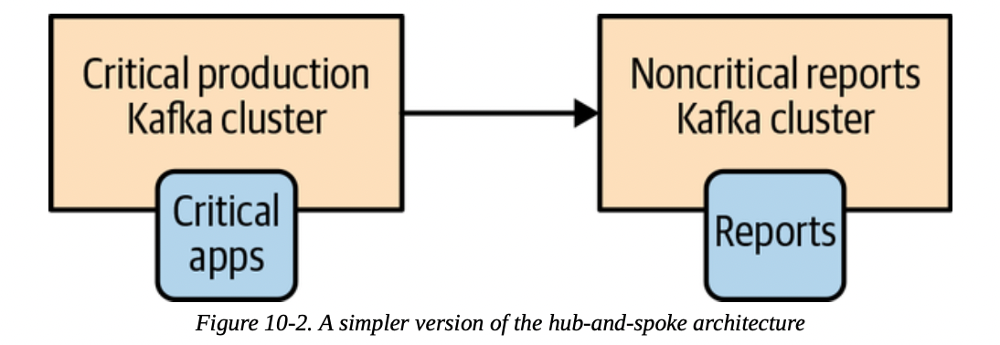
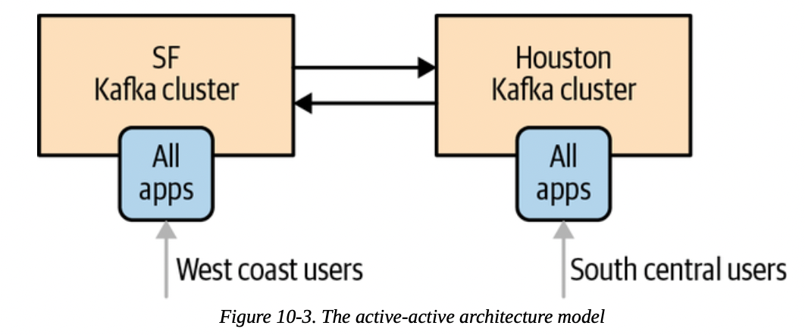
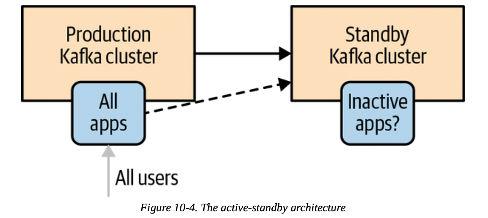
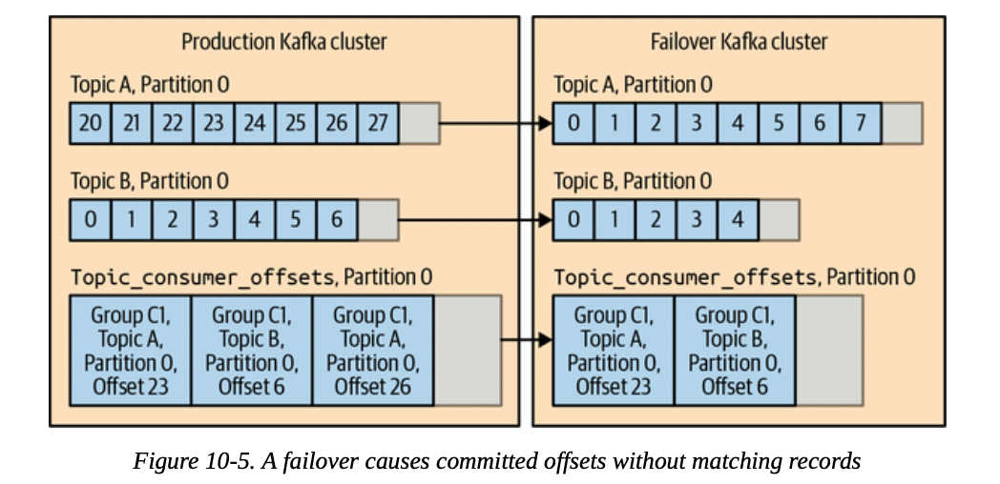
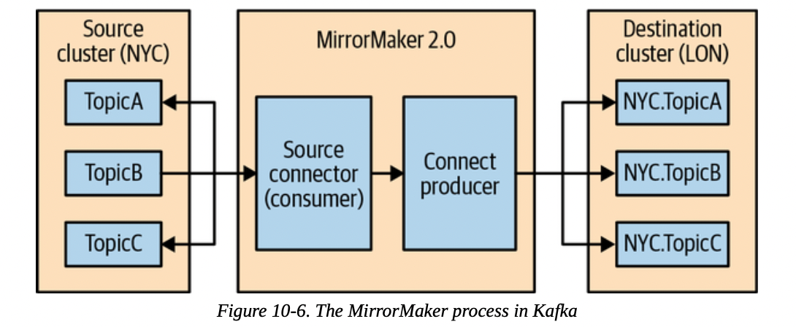
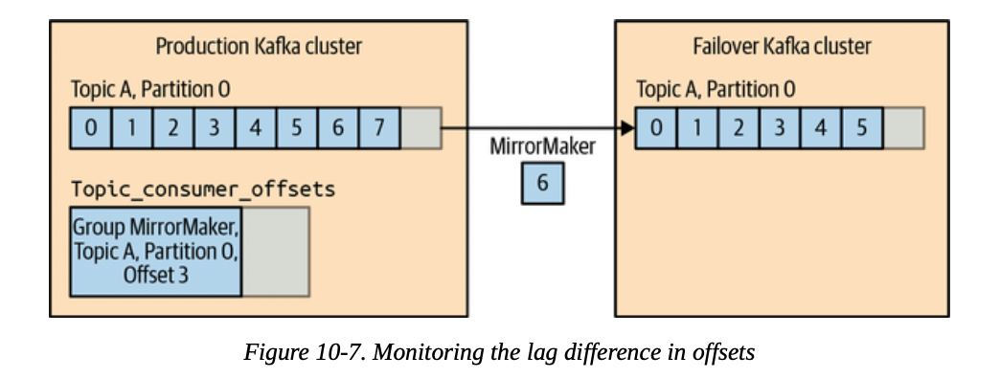

# Chapter 10. Cross-Cluster Data Mirroring

## Use Cases of Cross-Cluster Mirroring

常见的需要集群级别数据同步的场景如下：

- **Regional and central clusters**
  一个公司在地理上分布有多个集群，处于不同的数据中心，通常一些应用程序仅依赖当前集群即可，而一些应用程序则要求与多个集群的数据进行交互
- **High availability (HA) and disaster recovery (DR)**
  应用程序仅依赖一个集群即可，但是考虑到整个集群宕机的灾难事件，采用多集群作为灾备和高可用
- **Regulatory compilance**
  一些国家的法律要求用户数据的存储不允许在其他地区（例如欧洲），因此不同国家需要自己的集群，但是由于用户交互并不存在这种边界，因此不同的集群依然需要相互通信
- **Cloud migrations**
  云部署的多个集群之间存在数据的同步需求，例如每个on-premise的数据中心和cloud region都部署有Kafka集群，而一些数据需要在数据中心和云之间高效迁移
- **Aggregation of data from edge clusters**
  电信、零售、工业、运输等场景下可能需要有一个聚合数据的集群来从边缘集群获取数据并进行一些分析任务

## Multicluster Architectures

- **无法避免的现实 Realities of Cross-Datacenter Communication**
  - 高延迟 High latencies
  - 有限带宽 Limited bandwidth
  - 高成本 Higher costs

  Apache Kafka的brokers和clients都是**假定低延迟、高带宽来设计的（部署在一个数据中心内），因此一些缓冲大小、超时等配置并不适用于跨数据中心的环境**，因此同一集群的brokers也不建议部署到不同的数据中心中

  同时也应尽可能避免producer和brokers部署在不同的集群，否则应该谨慎的调整重试、超时等参数；但是为了跨集群的通信，必须**考虑consumer和brokers部署在不同的集群**，同时consumer主动读取远端集群的数据，当出现网络等问题时无法读取也能保证本地集群的数据安全，并且只会出现集群之间数据暂时不同步（out-of-sync）而不会真正丢失数据

  跨集群的数据同步会尽可能考虑以下原则：
  - 每个数据中心**至少有一个集群**
  - 任意两个数据中心的集群间**replicate event恰好一次**（除非网络出错导致的重试）
  - 尽可能**从远端集群consume**数据，而不是将本地数据produce给远端
- **Hub-and-Spoke架构**
  常见于有**一个中心集群和多个本地集群**的结构，如下图：

  

  若只有一个本地集群，则模式简化为了类似leader-follower的形式：

  

  这种模式主要用在数据在多个本地集群中产生，而有部分consumer需要访问全局的数据，因此通过一个中心集群来订阅所有本地集群的消息，从而允许在中心集群访问到全局数据，而在每个本地集群依然只能访问到局部数据，实现这种架构时**每个本地集群需要在中心集群维护至少一个mirroring进程**来消费本地集群的数据

  这种架构模式简单，数据单向流动，易于维护和部署，但缺点也很明显，即不同的本地集群之间无法相互访问数据，只有在**数据明确可以区分为多个本地集群**，且不会发生相互访问的情况下才适合

- **Active-Active架构**
  即**双活/多活架构**，两个或多个集群均可以相互访问所有数据，并且通常这些集群可以在不牺牲功能的情况下服务另一个集群的用户，**只需要重定向用户的请求就可以起到高可用容灾且延迟不会太高**

  

  这种模式的挑战在于**解决冲突conflicts resolution**，由于两个集群均可以读写数据，因此可能出现数据的不一致，例如：
  - 用户向A集群写入一条数据，并且访问B集群读取，则这条数据有可能尚未被复制到B集群从而出现**stale read**，即无法保证读己之写一致性，通常采用这种架构时在没有出现故障的情况**一个用户总是会被定向到固定的集群**，从而在大部分时间内避免需要处理这种一致性问题
  - 用户向A集群写入一条数据，并且因为某些原因向B集群写入一条冲突数据，此时需要有特殊的逻辑来处理这种冲突事件，并且确保**处理结果能够在A和B集群上保持一致性**

  当上述常见的问题能够有效解决时，这种架构通常是最高效、最弹性、最具有性价比的高可用架构

- **Active-Standby架构**
  即**主备架构**，与Active-Active的最大区别就是主备架构中的**Standby通常情况下并不会服务用户，而是作为冷备份的存在**，一旦Active集群整体宕机时，才会需要Standby集群服务用户，因此这种架构下的数据是从Active到Standby单向流动的

  

  这种模式极其简单，不需要考虑Active-Active架构中的两大难题，同时数据流单一，维护简单，显然代价就是性价比不高，Standby集群在大部分时间都不服务任何客户，并且Standby上的数据与Active存在一定延迟（异步备份），在**故障转移时可能并不能立即作为Active集群使用**

  一些优化其成本的措施包括转移读负载到Standby集群上，即类似**读写分离**的设计，主集群负责处理写入请求，而从集群负责处理读取请求，这同样需要解决stale read问题

  这种架构在故障转移时需要考虑诸多问题：
  - **Disaster recovery planning**
    在设计故障恢复时需要特别关注两个指标，代表**最大恢复时间的Recovery Time Objective RTO**，和代表**最大数据丢失时间的Recovery Point Objective RPO**，显然RTO越低代表服务可用性越好，RPO越低代表数据丢失可能性越小，并且`RPO=0`意味着**同步复制synchronous replication**
  - **Data loss and inconsistencies in unplanned failover**
    通常主备模式下并不会采用同步复制，因此Standby可能会落后Active一些消息，从而需要时刻监控Standby的进度以避免落后太多导致出现宕机时丢失过多的数据
  - **Start offset for application after failover**
    在宕机故障转移后，应用层从哪个位置开始恢复消费也非常关键，不当的配置可能导致丢失或重复处理过多的消息，通常有以下选项可以参考：
    - **自动选择起点Auto offset reset**：当应用程序并不会将offset也作为故障恢复的一部分时，此时应用程序只能选择从头开始消费，可能导致重复处理；或是从最新开始消费，可能导致丢失；取决于应用层对消息的重复或丢失的容忍性
    - **复制offset数据Replicate offsets topic**：将`__consumer_offsets`该保存消费位置的topic也同样备份到Standby集群中，从而当故障转移时直接从该topic中寻找消费的位置并继续消费，这种方案存在非常多的细节风险，例如在Active集群中offset所对应的消息并不一定还在Standby中存在

      

    - **给予时间的故障转移Time-based failover**：Kafka中每条消息携带有时间戳，并且支持**根据时间戳来找到消息的offset**，从而允许启用基于时间戳的故障转移，例如Active宕机发生在4:05，则可以指定Standby从4:03开始消费消息，从而在较少重复消息的情况下完成故障转移
    - **Offset translation**：考虑到offset与对应的消息在Active和Standby中可能不一致，因此可以引入特殊的**offset转换topic**或是**外部存储**，来存储这种映射关系，例如Active上offset=495的消息实际上对应Standby中offset=500的消息，则记录`(495, 500)`，并且在出现变化时实时维护这个映射关系

  - **After the failover**
    假如故障转移完全成功，此时的Standby已经是事实上的Active集群，那么此时需要同样引入一个新的Standby集群（通常就是原先的Active集群），重要问题在于**从哪个offset开始mirroring**，以及对于两个集群**不一致的数据如何处理**

- **Stretch Clusters**
  这种架构严格来说是**将一个Kafka集群部署在多个数据中心**上，从而是的一个Kafka集群可以容忍单个数据中心的整体宕机，这种部署不需要额外的复制，仅需要Kafka内部自身的replication即可

  显然由于Kafka的设计场景，这种架构需要**所部署的数据中心之间存在高带宽和低延迟的信道**，例如自建数据中心，或是采用云服务商**一个region内的三个availabiltiy zones**

  注意：需要三个zones主要因为Kafka依赖的Zookeeper需要奇数节点，而Kafka本身并没有此要求，因此也有所谓的2.5DC设计，即2个zones部署Kafka和Zookeeper，0.5个zone只部署Zookeeper

## Apache Kafka's MirrorMaker



MirrorMaker 2.0支持非常灵活的replication方式，自动复制指定的topic，partition，parition变更等等，并且可以通过配置文件定义复杂的拓扑关系，其配置包括但不限于：

- **Configuring MirrorMaker**
  - **Replication flow**

    ```text
    clusters = NYC, LON
    NYC.bootstrap.servers = kafka.nyc.example.com:9092
    LON.bootstrap.servers = kafka.lon.example.com:9092
    NYC->LON.enabled = true
    NYC->LON.topics = .*
    ```

  - **Mirror topics**
    支持正则匹配的方式来指定需要复制的topics，通常建议通过前缀来区分，例如复制`prod.*`而不复制`test.*`，并且在**Active-Active模式下复制的过程中会自动加上前缀**，避免出现回环复制，例如NYC中的`orders`被复制到LON中的`NYC.orders`，此时目标集群中的consumer就可以通过正则匹配的方式来选择消费全部的`.*orders`还是仅消费本地产生的`orders`

    MirrorMaker会周期检查是否有新topic符合规则并进行复制，同时已有的topic出现partition变化时也会在对端生效，确保所有partition、消息的顺序在两个集群上是一致的
  - **Consumer offset migration**
  - **Topic configuration and ACL migration**
  - **Connector tasks**
    当有大量topics需要复制时，采用较多的connector tasks有利于提高吞吐量
  - **Configuration prefixes**
- **Multicluster Replication Topology**
  通常建议**对每个MirrorMaker都采用同一份完整的配置文件**，从而避免出现冲突

    ```text
    clusters = NYC, LON
    NYC.bootstrap.servers = kafka.nyc.example.com:9092
    LON.bootstrap.servers = kafka.lon.example.com:9092
    NYC->LON.enabled = true
    NYC->LON.topics = .*
    LON->NYC.enabled = true
    LON->NYC.topics = .*
    ```

- **Securing MirrorMaker**
  `TODO`
- **Deploying MirrorMaker in Production**
  通常**MirrorMake也可以部署成一个独立的服务**，从而实现可扩容、高可用、高性能的特性，对于指向同一个目标集群的replication flow，多个MirrorMaker会自动进行负载均衡

  注意，从[上文](#multicluster-architectures)可以看出，**MirrorMaker应该作为"consumer"部署在replication flow的终点集群这一侧**，这是因为consumer不稳定时对数据和集群的影响更小，而producer（假如部署在replication flow的起点集群）不稳定则会大大影响正常的数据流程

  注意，若是**希望在夸集群间的复制采用加密，则推荐MirrorMaker部署在起点侧**，这是因为加密需要对数据进行处理，从而无法再利用到consumer的zero-copy优化，此时对consumer的性能影响非常巨大，因此更推荐在起点侧MirrorMaker首先收取常规的数据，并且通过SSL连接加密发送给处于远端的终点侧，特别注意此时需要**配置更长的超时时间和更大的重试次数**

  

- **Tuning MirrorMaker**
  **MirrorMaker的吞吐量因依据被复制的集群峰值吞吐量来确定**，若不能容忍延迟，则MirrorMaker应该确保与被复制集群的吞吐量一致，若允许少量延迟和消息堆积，则通常可以给定较小的吞吐量，从而当集群空闲时MirrorMaker就可以追赶上

  MirrorMaker以及其内部的producer/consumer有非常多的参数可以进行调整，同时所部署的环境中TCP协议栈也有非常多的参数可以进行调整

## Other Cross-Cluster Mirroring Solutions

- Uber uReplicator
- LinkedIn Brooklin
- Confluent Cross-Datacente Mirroring Solutions：`TODO`
