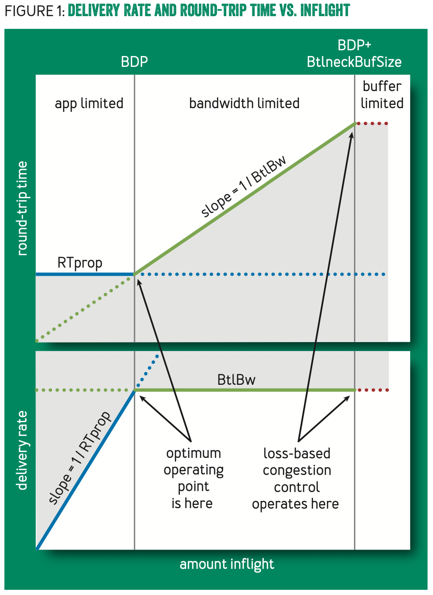
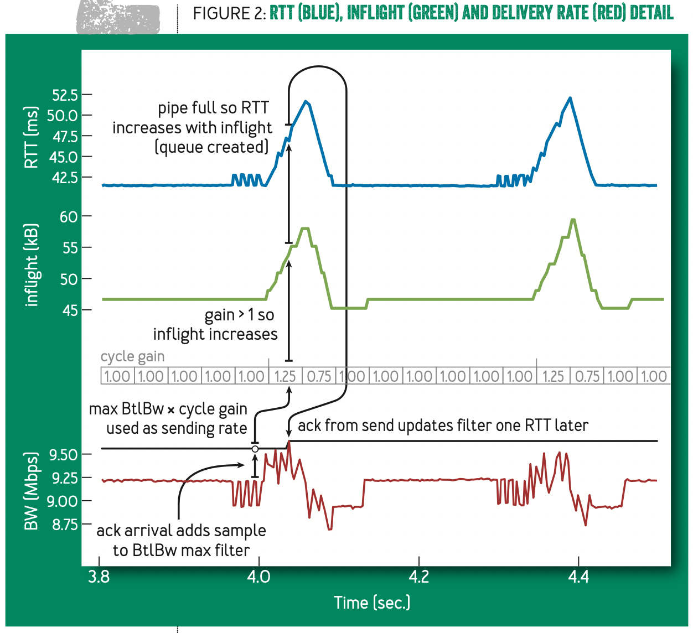
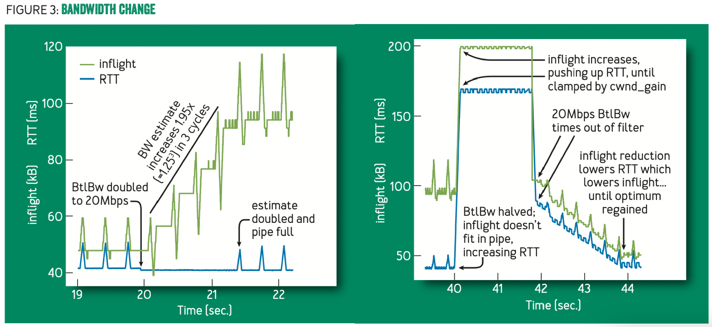

# BBR: Congestion-Based Congestion Control

[original paper](https://dl.acm.org/doi/abs/10.1145/3012426.3022184)

## TCP Congestion Control

[brief](https://github.com/JasonYuchen/notes/blob/master/tcpip1/16.TCP_Congestion.md)

TCP的拥塞避免机制在于希望**链路上正在传递的数据包数量最大化且守恒**，因此当出现丢包时就认为已经最大化，此时TCP拥塞避免机制就会控制发送的数量来避免丢包

随着网卡等硬件设备的进步，TCP这种拥塞避免机制所基于的假设-*丢包意味着网络过载出现拥塞*-也不再合理，现今网络设备往往有极大的缓存空间，而这种传统的拥塞避免机制（即使是当下最好的CUBIC算法）倾向于将**所有缓存都填充满**（即数据包数量最大化）

因此一旦整个链路上**某个设备的缓存较小导致丢包**时，TCP就会**误认为是链路已经饱和**并且进入拥塞避免状态，极大限制了数据包的发送数量，反而导致了吞吐量远低于链路能够承载的数量

早期的TCP拥塞避免算法存在局限性，且**不符合第一性原理 first principles**，需要重新考虑拥塞和瓶颈的本质

## Congestion And Bottlenecks

由于TCP是全双工的协议，因此任意时刻TCP单向链路上只会有一个最慢的节点，即**瓶颈节点，决定了整个链路的最大吞吐量**（类似水管中最细的一段管路决定了整个水路的最大流量），**传播延迟 round-trip propagation time RTprop**和**瓶颈带宽 bottleneck bandwidth BtlBw**两者一起约束了传输的性能

采用这两个特征来描述一条TCP链路的性能可以获得如下关系（类似硬盘延迟和带宽描述[硬盘的性能](https://github.com/JasonYuchen/notes/blob/master/seastar/Disk_IO_Scheduler.md#part-iv-新调度器-new-io-scheduler)，或者是RPC流控中的[little's law](https://github.com/JasonYuchen/notes/blob/master/brpc/flow_control.md#littles-law)，均符合第一性原理）：



- 第一阶段app limited的蓝色线描述了**由传播延迟限制**导致了RTT不可能超过RTprop，并且由于带宽并未完全占满因此随着发送数据的提升，延迟不变且系统吞吐量线性上升
- 第二阶段bandwidth limited的绿色线描述了**由带宽限制**导致了继续增加发送数据量并不能提高该节点的传输，而是堆积在了缓存队列中，由于排队导致了数据延迟线性上升
- 第三阶段buffer limited的红色线描述了由**缓冲队列限制**导致了继续增加发送数据量会直接产生丢包事件，不能提高节点的传输数据量，注意也不会进一步增加延迟
- **灰色阴影部分则是理论上不可能达到的区域**

基于丢包重传的TCP拥塞控制机制就相当于将系统维护在bandwidth limited区域和buffer limited区域的临界点，虽然同样达到了理论上的最大带宽，但是**延迟较高且面临丢包重传**的额外代价

在**早期的网络设备中缓存往往非常小，因此该控制面与app limited和bandwidth limited的控制面非常接近**，即bandwidth limited区域非常小，因此这样的拥塞机制也是符合当时情况的，而现在的网络设备往往拥有较大的缓存，导致了**因大缓存而显著上升的RTT**，容易看出app limited和bandwidth limited的控制面才是最优的运行状态，同时拥有最低的延迟和最大的带宽

## Characterizing the Bottleneck

由于在一个连接的生成周期内，BtlBw和RTprop都有可能随着时间流逝而**独立改变**，因此需要**持续采样来获得相应的估计值，从而持续调整拥塞控制策略**，定义任意时刻$t$的往返时延如下，而现有的TCP协议会追踪每个数据包的RTT：

```math
RTT_t = RTprop_t + \eta_t
```

式中的$\eta \ge 0$代表由于链路上的队列、接收方延迟发送ACK等机制引入的额外延迟，另一方面由于链路节点变化时间往往远大于传播延迟，因此可以通过对一个**最近窗口内的延迟采样来获得最准确的传播延迟**，窗口$W_R$通常是数秒至分钟：

```math
\widehat{RTprop} = RTprop + min(\eta_t) = min(RTT_t)\  \forall t \in [T-W_R, T]
```

现有的TCP协议并不会追踪瓶颈带宽，因此需要从数据包发送速率中估计出一个瓶颈带宽值，平均发送速率可以通过某个数据包的发送时间及该包的ACK时间期间发送的数据量除以相应的时间求出，即$deliveryRate=\Delta delivered/\Delta t$，显然这里得到的发送速率一定是低于瓶颈速率的，瓶颈速率通常是一个理想值，并且发送的数据量很明确而所需要的时间$\Delta t$存在不确定性（接收方可能延迟回传ACK等），因此同样可以通过**最近窗口内的发送速率采样来获得最准确的瓶颈带宽**，窗口$W_B$通常是6至10倍的往返时延：

```math
\widehat{BtlBw} = max(deliveryRate_t)\ \forall t \in [T-W_B, T]
```

从前图中容易发现，在app limited阶段即数据量较少时就可以估计出较为准确的RTprop，而在bandwidth limited阶段即数据量中等时就可以估计出较为准确的BtlBw，因此通常**无法同时准确估计出RTprop和BtwBw**，当其中一项被准确估计时另一项就无法准确估计

## Matching the Packet Flow to the Delivery Path

核心的BBR算法包含两个部分

1. **当收到确认时 When an ack is received**
   每次收到新的ACK就可以获得新的RTT并有相应的发送速率估计值，从而可以相应的更新RTprop和BtlBw的估计值，算法如下：

   ```python
   def onAck(packet):
       rtt = now - packet.sendtime
       update_min_filter(RTpropFilter, rtt)
       delivered += packet.size
       delivered_time = now
       # 根据该数据包send-ack期间累计ack的数据包量来估计出传递速率
       deliveryRate = (delivered - packet.delivered)
                      / (now - packet.delivered_time)

       # 仅在获得更大的速率，或是非app limited阶段才更新BtlBw
       # 注意app limited获得的速率是低估值 underestimate
       if (deliveryRate > BtlBwFilter.currentMax
           or not packet.app_limited):
           update_max_filter(BtlBwFilter, deliveryRate)

       if (app_limited_until > 0):
           app_limited_until -= packet.size
   ```

2. **当数据发送时 When data is sent**
   BBR必须**协调数据包的发送速率与瓶颈带宽相匹配**，`pacing_rate`是BBR的主要控制参数，而另一个重点控制参数`cwnd_gain`则限制了在途的数据包量为BDP的略高值（主要用于应对延迟ACK的因素导致的过度低估瓶颈带宽）

   ```python
   def send(packet):
       bdp = BtlBwFilter.currentMax * RTpropFilter.currentMin
       # 若在途的数据包超过了约束值，则暂缓发送数据
       if (inflight >= cwnd_gain * bdp):
           # wait for ack or timeout
           return
       # 若已经进入了下一个发送时间点，则获取数据包并且进行发送
       if (now >= nextSendTime):
           packet = nextPacketToSend()
           if (not packet):
               # 在应用层数据包不够时就更新app_limited状态
               app_limited_until = inflight
               return
            packet.app_limited = app_limited_until > 0
            packet.sendtime = now
            # 每个数据包都会携带有在发送时刻已经确认ACK的数据量
            # 从而在接收该包ACK时可以计算send-ack这段时间内的新抵达数据量
            # 用于计算发送速率
            packet.delivered = delivered
            packet.delivered_time = delivered_time
            ship(packet)
            # 协调下一次发送时间，确保不会超出瓶颈带宽太多
            nextSendTime = now + packet.size / (pacing_gain * BtlBwFilter.currentMax)
        timerCallbackAt(send, nextSendTime)
   ```

3. **稳定状态 Steady-state behavior**
   在稳定状态下的控制情况如下图所示

   

   - BBR通过绝大多数时间都维持**在途的数据包恰好为一个`BDP ~ RTprop * BtlBw`的量**即维持`pacing_gain = 1`来实现最大带宽和最低延迟
   - 若一直固定BDP为一个则无法观测到BtlBw上升的情况，因此会**周期性的利用一个RTprop的周期`pacing_gain > 1`发送更多的数据检测BtlBw是否有可能更大**
     - 若不变则会导致出现队列因此`rtt`上升而`deliveryRate`不变（如图中蓝色和绿色一起增加，`pacing_gain = 1.25`），此时再下一个RTprop周期就通过`pacing_gain < 1`进行补偿降低发送数据量（如图中蓝色和绿色线一期减少，`pacing_gain = 0.75`）
     - 若增大则此时`rtt`不会上升而`deliveryRate`增大，继而更新BtlBw的值，继续增大`pacing_gain`使得发送更多数据来进一步探测最新的BtlBw，指数级收敛到新的BtlBw

     

## Single BBR Flow Startup Behavior

## Multiple BBR Flow Sharing a Bottleneck

## Google B4 WAN Deployment Experience

## Youtube Edge Deployment Experience

## Mobile Cellular Adaptive Bandwidth

## Delayed and Stretched ACKs

## Token-bucket Policers

## Competition With Loss-based Congestion Control
