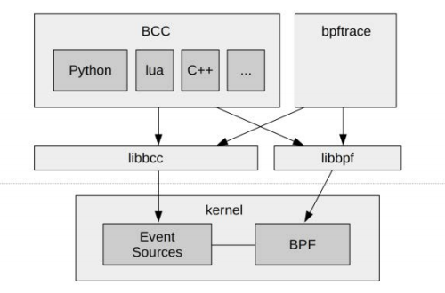
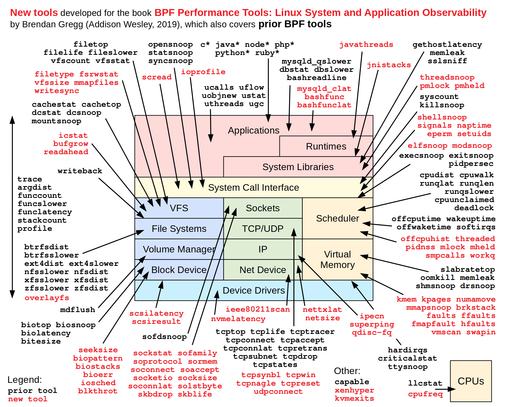
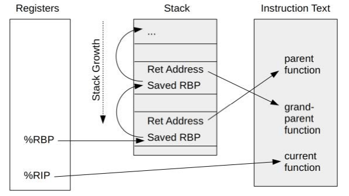
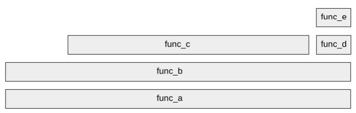

# BPF Performance Tools

[BPF Performance Tools: Linux System and Application Observability](http://www.brendangregg.com/bpf-performance-tools-book.html) Part I: Technologies

## 1. 简介 Introduction

### 术语

- **Tracing 跟踪**：基于事件的记录event-based recording，BPF工具也基于此，此类tracing工具例如Linux下的`strace`记录了系统调用事件
- **Snooping 嗅探**：tracing、snooping、event dumping通常都指基于事件的记录
- **Sampling 采样**：对程序运行进行采样，使用采样结果来描述整个运行情况，也被称为性能剖析profiling，显然定时采样的性能代价要比tracing要小，前者使用采样结果来描述全局，而后者记录了每个事件，但缺点就是采样有可能失真
- **Profiling 剖析**：通常就是指创建采样进行性能剖析
- **Observability 可观测性**：指采用一系列不同种类的工具对系统进行多个方面的分析和理解，注意可观测性并不包括性能测试benchmark，性能测试会模拟工作负载从而改变了系统的运行状态，**可观测性旨在分析和理解系统，性能测试旨在模拟不同工况下系统的响应**

### BCC，bpftrace，IO Visor的关系

BPF非常底层，直接采用BPF编程极其艰深，因此诞生了多种前端辅助工具



- **BCC, BPF Compiler Collection**：提供了多种语言内的BPF框架，并且[BCC repo](https://github.com/iovisor/bcc)已经提供了多种BPF工具可以直接用于性能分析和问题追踪
- **bpftrace**：新的BPF前端辅助工具，地位与BCC类似，用于构建新的BPF工具
- **IO Visor**：BCC和bpftrace隶属于[IO Visor项目](https://github.com/iovisor)，而IO Visor属于Linux Foundation

### 实例`biolatency`

使用BPF提供的`biolatency`工具可以观测block I/O的请求响应延迟，如下：

```text
# biolatency -m
Tracing block device I/O... Hit Ctrl-C to end.
^C
 msecs              : count      distribution
     0 -> 1         : 16335     |****************************************|
     2 -> 3         : 2272      |*****                                   |
     4 -> 7         : 3603      |********                                |
     8 -> 15        : 4328      |**********                              |
    16 -> 31        : 3379      |********                                |
    32 -> 63        : 5815      |**************                          |
    64 -> 127       : 0         |                                        |
   128 -> 255       : 0         |                                        |
   256 -> 511       : 0         |                                        |
   512 -> 1023      : 11        |                                        |
```

### BPF跟踪的可见性

在生产环境中可以直接使用BPF提供的工具而**不需要重启服务器或是重启应用**



### 动态跟踪：kprobes和uprobes

在应用运行过程中，**动态插入追踪点探测运行状况**，而在没有跟踪时不会造成任何性能损失

- **kprobes**：dynamic instrumentation for kernel functions
- **uprobes**：dynamic instrumentation for user functions

|Probe example|Description|
|:-|:-|
|`kprobe:vfs_read`|追踪点为内核`vfs_read()`函数开始|
|`kretprobe:vfs_read`|追踪点为内核`vfs_read()`函数结束|
|`uprobe:/bin/bash:readline`|追踪点为`/bin/bash`程序的`readline()`函数开始|
|`uretprobe:/bin/bash:readline`|追踪点为`/bin/bash`程序的`readline()`函数结束|

### 静态跟踪：Tracepoints和USDT

**动态跟踪依赖于运行时的函数**，那么由于应用程序内的函数可能随着版本变化而改变，此时已经完成的动态跟踪脚本可能会不适用，例如追踪的函数在新版本中已经被移除等，同时编译应用时的函数内联inline等也可能会导致动态跟踪不可用，而**静态跟踪通过由应用开发者自行在源码中维护追踪点**，从而避免这些问题

- **Tracepoints**：kernel static instrumentation
- **USDT, User-level Statically Defined Tracing**：user-level static instrumentation

|Probe example|Description|
|:-|:-|
|`tracepoint:syscalls:sys_enter_open`|追踪点位于内核`open()`系统调用|
|`usdt:/usr/sbin/mysqld:mysql:query__start`|追踪点位于`/usr/sbin/mysqld`中的`query_start`函数|

使用bpftrace静态追踪`open()`系统调用的示例如下，输出了调用`open`的进程名以及传给`open`的参数`filename`：

```text
# bpftrace -e 'tracepoint:syscalls:sys_enter_open { printf("%s %s\n", comm, str(args->filename)); }'
Attaching 1 probe...
slack /run/user/1000/gdm/Xauthority
slack /run/user/1000/gdm/Xauthority
^C
```

## 2. 技术背景 Technology Background

### Extended BPF, eBPF

历史与底层实现技术暂时跳过

### 调用栈回溯

1. **基于栈帧指针的栈 Frame Pointer-Based Stacks**
  通常栈帧都可以通过链表的方式连接起来，从而可以通过`%RBP`访问最顶层的栈，随后基于固定的偏移值（+8）来逐层获取所有栈——**调用栈回溯stack walking**
  注意：AMD64 ABI指出使用`%RBP`是冗余的，因此通常GCC等编译器会默认忽略栈帧指针，而将`%RBP`用作通用寄存器，通过编译时`-fno-omit-frame-pointer`可以显式要求使用`%RBP`
  
2. **符号Symbols**
   当前内核仅记录栈回溯时的地址，随后在用户空间将地址转换成对应的符号（例如函数名等），因此有可能会出现记录时的地址与翻译时符号对应的地址不一致的情况
   未来有可能在内核直接进行地址到符号的转换

### 火焰图

[火焰图flame graph](http://www.brendangregg.com/flamegraphs.html)是最重要的性能数据可视化方式之一

假定进行定时对栈采样10次，结果如下：

```text
   1          2          7
func_e              
func_d                func_c
func_b     func_b     func_b
func_a     func_a     func_a
```

则可以转换成这样的火焰图：



- **每一个方块代表栈中的一个函数**（即一个stack frame）
- **Y轴**：从底层往上就是调用栈从底部到顶部，即**函数的调用关系**
- **X轴**：宽度代表每个**函数出现在每次采样中的比例**，注意这不代表时间上从左到右是调用的先后，图中`func_c`在`func_d`前面并不是先调用`func_c`再调用`func_d`，**从左到右的函数排序只是字母顺序**

**每个函数顶部未被其他函数覆盖的长度就是每个函数自身的性能开销，越宽越有可能是性能瓶颈（the widest towers）**，例如：

- `func_a`几乎被`func_b`完全覆盖近似没有开销
- `func_b`在图中左侧大约有20%的耗时
- `func_c`在图中中间大约有70%的耗时
- `func_d`几乎被`func_e`完全覆盖近似没有开销
- `func_e`在图中右侧顶部大约有10%的耗时

通常火焰图还会支持一些高级特性如下：

- **颜色 color palettes**：不同色调hue代表函数种类（用户、内核、库等等），不同饱和度saturation代表不同函数名（相同函数名的饱和度相同以区分不同的函数），背景色background表示火焰图种类帮助识别（蓝色代表IO、红色代表CPU等）
- **提示 mouse-overs**：当鼠标掠过某个函数时展示额外的提示
- **缩放 zoom**：可以选择某个函数名作为最底层的函数，只显式该函数上方的所有调用关系与耗时
- **搜索 search**

### kprobes

kprobes提供了Linux内核的动态探测功能，能够**对生产环境下的内核进行实时探测**而不需要重启系统或是以特殊模式运行内核，另外可以使用kretporbes对函数返回进行探测，从而**基于kprobes和kretprobes的时间差就可以直接探测函数的运行时间**

1. **kprobes接口**
   - kprobe API：例如`register_kprobe()`等
   - /sys/kernel/debug/tracing/kprobe_events：通过对该文件写入配置字符串来控制kprobe
   - `perf_event_open()`：实际上已经在`perf`工具中使用
2. **BPF和kprobes**
   - BCC：提供了`attach_kprobe()`和`attach_kretprobe()`
   - bpftrace：提供了`kprobe`和`kretprobe`类型

   例如BCC中提供了`vfsstat`工具来探测对VFS的调用情况，其实现就是利用了`attach_kprobe()`：

   ```text
   # vfsstat
   TIME READ/s WRITE/s CREATE/s OPEN/s FSYNC/s
   07:48:16: 736 4209 0 24 0
   07:48:17: 386 3141 0 14 0
   07:48:18: 308 3394 0 34 0
   07:48:19: 196 3293 0 13 0
   07:48:20: 1030 4314 0 17 0
   07:48:21: 316 3317 0 98 0
   [...]

   # grep attach_ vfsstat.py
   b.attach_kprobe(event="vfs_read", fn_name="do_read")
   b.attach_kprobe(event="vfs_write", fn_name="do_write")
   b.attach_kprobe(event="vfs_fsync", fn_name="do_fsync")
   b.attach_kprobe(event="vfs_open", fn_name="do_open")
   b.attach_kprobe(event="vfs_create", fn_name="do_create")
   ```

### uprobes

### Tracepoints

### USDT

## 3. 性能分析 Performance Analysis

`TODO`

## 4. BCC

`TODO`

## 5. bpftrace

`TODO`
