# Monitoring Modern Infrastructure - Datadog

## 1. Constant Change

- Elastic, Dynamic, Ephemeral Infrastructure
  > Auto-scaling is a key feature of cloud services.
- Pets vs. Cattle
  > With dynamic infrastructure, focusing on individual servers rarely makes sense.
- Devops
  - **continuous delivery**
  - **observability**
- Modern Approaches to Monitoring
  - **built-in aggregation**
  - **comprehensive converage**
  - **sophisticated alerting**
  - **collaboration**

## 2. Collecting the Right Data

> Collecting data is cheap, but not having it when you need it can be expensive, so you should instrument everything, and **collect all the useful data you reasonably can.**

- Metrics
  Metrics capture a value **pertaining to your systems at a specific point in time**, e.g. the number of users currently logged in.

  work metrics:
  - **throughput**
  - **success**
  - **error**
  - **performance**, e.g. latency (average or percentile)

  resource metrics:
  - **utilization**
  - **saturation**, e.g. queue length, the amount of requested work that the resource cannot yet service
  - **errors**, internal errors that may not be observable in the work the resource produces
  - **availability**, the percentage of time that the resource responded to requests

- Events
  Discrete, infrequent occurrences that provide **crucial context for understanding changes** in your system's behavior, e.g. code releases, alerts, scaling events

- Tagging
  > Tagging your metrics enables you to reorient your monitoring along any lines you choose. When you add a key:value tag to a metric, you’re actually **adding a new dimension** (the key) and a new attribute in that dimension (the value).

  

- Good Data
  - **well-understood**, keep your metrics and events as simple as possible, use standard concepts, and name them clearly.
  - **granular**, collect metrics for each system at a frequency that will not conceal problems, without collecting so often that monitoring becomes perceptibly taxing on the system or samples time intervals that are too short to be meaningful.
  - **tagged by scope**
  - **long-lived**, retaining your raw data for a year or more makes it much easier to know what "normal" is, especially if your metrics have monthly, seasonal, or annual variations.

## 3. Alerting on What Matters

- Levels of Alerting Urgency
  - **alerts as records, low severity**: e.g. serving queries much slower than usual, but not slow enough. transient issues that could be to blame.
  - **alerts as notifications, moderate severity**: e.g. data store is running low on disk space and should be scaled out in the next several days.
  - **alerts as pages, high severity**: e.g. any instance of response times exceeding your internal SLA would warrant immediate attention, whatever the hour.

- Data for Alerts, Data for Diagnostics
  - **page on symptoms**: e.g. if your website has been responding very slowly for the last three minutes, **that is a symptom**. possible causes include high database latency, failed application servers, Memcached being down, high load, and so on. whenever possible, **build your pages around symptoms rather than causes**.
  - **durable alert definitions**: regardless of how underlying system architectures may change, if the system stops doing work as well as it should, you will get an appropriate page.
  - **exception: early warning signs**: early warning metrics reflect an unacceptably high probability that serious symptoms will soon develop and require immediate intervention. e.g. disk space is low.

## 4. Investigating Performance Issues

## 5. Visualizing Metrics with Timeseries Graphs

- Aggregation Across Space: e.g. it is hard to make sense of a host-level graph of web requests, but the same data is easily interpreted when the metrics are **aggregated by availability zone**.
  
  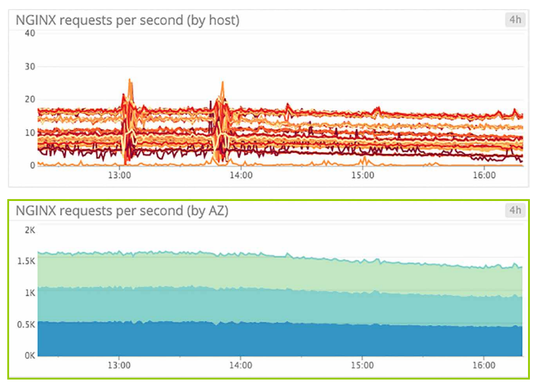

- Line Graphs: e.g. cpu idle, median latency across all web servers, disk utilization

  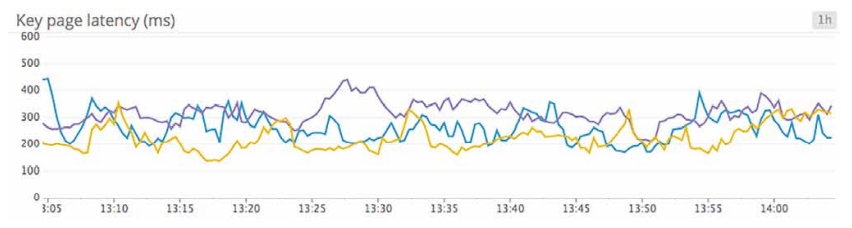

- Stacked Area Graphs: e.g. load balance requests per availability zone, metrics that can be added sensibly

  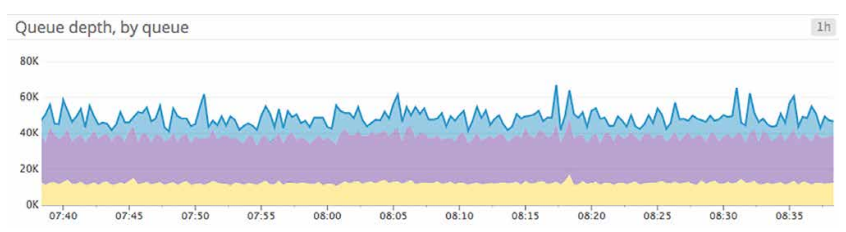

- Bar Graphs: e.g. failed jobs

  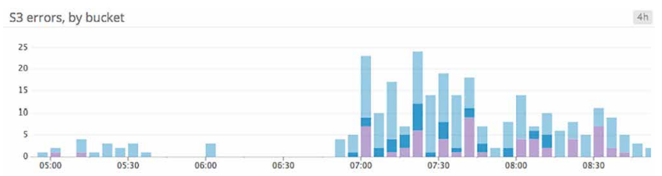

- Heat Maps: to see trends
  
  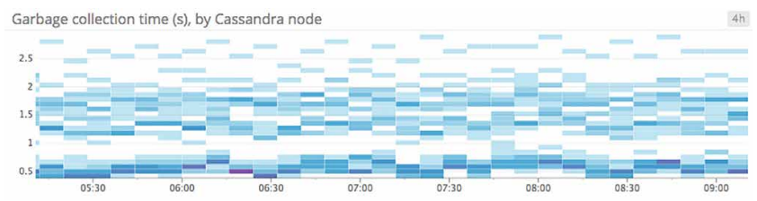

## 6. Visualizing Metrics with Summay Graphs

- Aggregation Across Time: e.g. max redis latency by host over the past 1 hour

  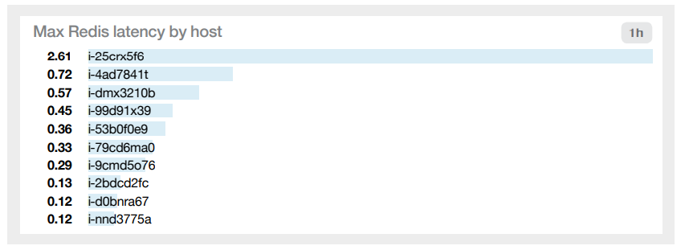

- Aggregation Across Space: e.g. max redis latency by service over the past 1 hour

  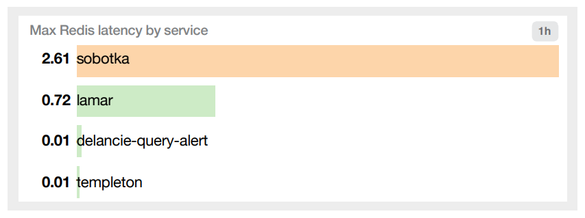

- Single-Value Summaries: e.g. current number of OK hosts, current web server requests per second
  
  

- Toplists

  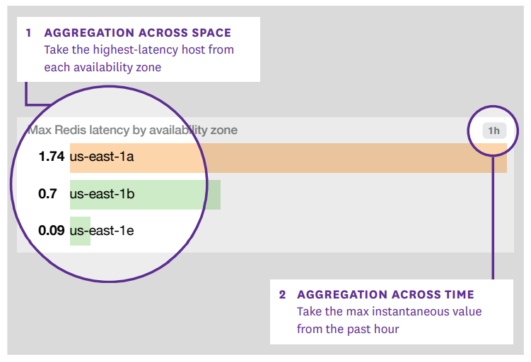

- Change Graphs: compare a metric's current value against its value at a point in the past

  

- Host Maps

  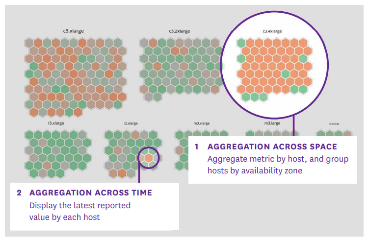

- Distributions

  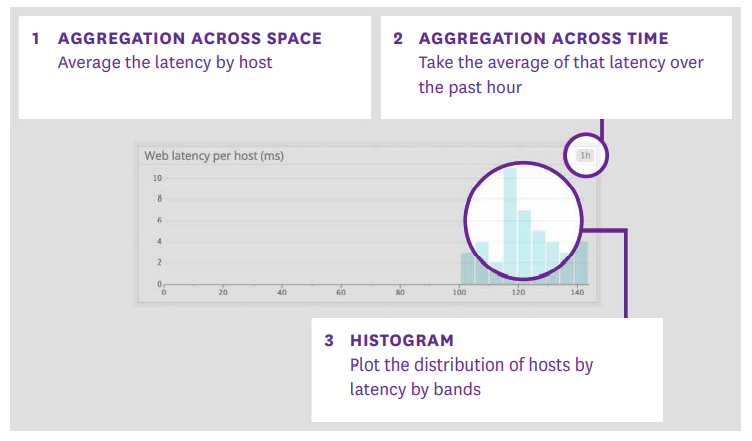

## 7. Putting It All Together: How to Monitor ELB

- Key ELB Performance Metrics
  - **RequestCount**: number of inbound requests accepted (Work: throughput)
  - **SurgeQueueLength**: number of inbound requests waiting to be accepted (Resource: saturation)
    This metric should remain as low as possible.
  - **SpilloverCount**: number of inbound requests dropped due to surge queue full (Work: error due to saturation)
    When requests dropped, user receives a 503, this metric should always be equal to zero in a healthy system.
  - **HTTPCode_ELB_5XX** (Work: error)
    e.g. 502 Bad Gateway, 503 Service Unavailable, 504 Gateway Timeout
  - **HTTPCode_ELB_4XX** (Work: error)
- Backend-Related Metrics
  - **HealthyHostCount** (Resource: availability)
  - **UnhealthyHostCount** (Resource: availability)
  - **Latency** (Work: performance)
  - **HTTPCode_Backend_2XX** (Work: success)
  - **HTTPCode_Backend_3XX** (Work: success)
  - **HTTPCode_Backend_4XX** (Work: error)
  - **HTTPCode_Backend_5XX** (Work: error)
  - **BackendConnectionErrors**: connection errors between ELB and backend servers (Resource: error)
- Monitoring ELB with Datadog
  
  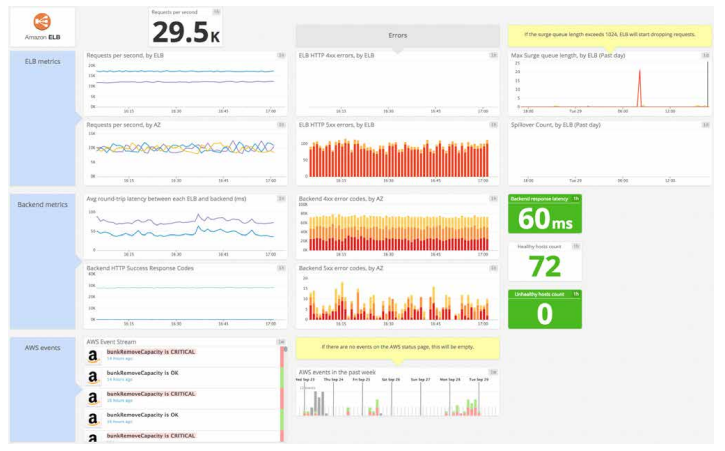

## 8. Putting It All Together: Monitoring Docker

## 9. Datadog Is Dynamic, Cloud-Scale Monitoring

- Comprehensive monitoring
- Flexible aggregation
- Effortless scaling
- Sophisticated alerting
- Collaboration baked in
