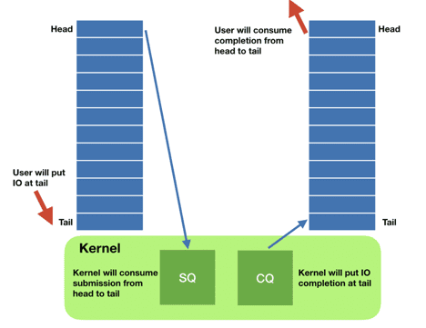

# io_uring

## Evolution of Linux I/O system calls

### 阻塞 Blocking

早期Linux提供了**阻塞的系统调用**用于文件描述符（文件/socket等）的I/O，调用时当前线程就会阻塞等待直到调用完成

```cpp
ssize_t read(int fd, void *buf, size_t count);
ssize_t write(int fd, const void *buf, size_t count);
```

### 非阻塞 Non-blocking

随着硬件设备的发展，阻塞的系统调用愈来愈无法满足要求，频繁的context-switch显著抑制了并发能力和数据处理能力，此时Liunx提供了非阻塞的方式访问网络资源：`select(), poll(), epoll()`

这些非阻塞的方式通过等待一组文件描述符，并每次只返回已经就绪的子集，从而保证在已就绪的文件描述符上执行`read/write`是一定能立即成功并返回而不会阻塞的

但是缺点在于这些**非阻塞的方式仅对网络资源有效**，而对磁盘等文件资源无效（可以认为文件始终是"就绪"状态），传统的做法是采用**线程池**的方式，主线程分发文件的I/O请求给线程池中的工作线程，由工作线程执行、阻塞等待、完成这些文件资源的I/O请求

随着数据库等特殊应用对文件资源更深入的管理，操作系统的缓存（**page cache**）效果不如数据库系统自身的缓存，从而Linux提供了**绕过操作系统缓存**的方式：打开文件时使用`O_DIRECT`标志，并且这种直接访问的方式也是**零拷贝zero-copy**的，即应用的数据可以直接存入存储设备

### 异步 Asynchronous

由于以下几个方面的演进，传统的I/O操作本身越来越成为瓶颈：

- **存储/网络设备发展**
  现代存储设别和网络设备进展迅速，吞吐量和延迟都显著进步，例如Intel Optane设备的延迟可以达到微秒级别，与通常线程context-switch的耗时相当，即**每一次context-switch可以认为是错过一次I/O**，而现在诸如RocksDB之类的基于LSM存储引擎的数据库瓶颈也已经[由存储层转移到了内核以及CPU](TODO)
  
  网卡也已经可以达到100G的带宽，远超过CPU的处理能力，从而诞生出了绕过内核直接由网卡处理数据的[DPDK](https://www.dpdk.org)

- **系统调用的代价上升**
  由于不断增加的内核安全补丁，syscall的代价也越来越高，例如[Spectre/Meltdown漏洞](https://meltdownattack.com)的修复导致部分系统调用的代价大幅提升，如下图所示的系统调用延迟变化

  

- **CPU单核性能提升有限，多核成为发展方向**
  `TODO：NUMA架构，跨核心延迟，CAS的代价等`

在Linux 2.6之后引入了异步I/O接口，即AIO，但是Linux AIO的设计非常臭名昭著：

- 只能使用在`O_DIRECT`标记打开的文件上
- 不良的接口设计，每一次IO submission需要复制64+8字节，每一次completion也需要复制32字节，从而一次IO操作要额外复制104字节，对于高频率的IO操作显然这是不利的，同时每个IO操作需要两次系统调用
- 技术上接口被设计为非阻塞的，但是实际上[可能会导致阻塞](https://lwn.net/Articles/724198/)

## Introduction of io_uring

### What is io_uring

从Linux 5.1开始引入了全新的异步I/O方式：`io_uring`

充分考虑到现代存储/网络设备的性能演进迅速，系统调用的代价提升，**interrupt-driven形式的I/O已经无法比拟polling for completion形式的I/O**，Jens Axboe设计了`io_uring`这种接口易于扩展，充分考虑了各方面约束的新异步I/O接口

- Easy to use：接口应是直接易懂不易误用的
- Extendable：不仅仅是对阻塞IO，应该同样容易扩展到网络IO、非阻塞IO
- Feature rich
- Efficiency：充分考虑并优化每一次IO的代价
- Scalability：性能在极端情况下应也有所保证

`io_uring`的基本原理与Linux AIO类似，如下图，**用户程序将I/O请求塞入submission queue entry, sqe等待内核完成，而内核完成的I/O请求被放置在completion queue entry, cqe等待用户程序处理**，从而在用户侧只是塞入请求因此是真正的异步：



sqe所在的**submission ring**和cqe所在的**completion ring**就是由kernel和user space共享的两个环形队列，并且由内存屏障memory barrier来保证可见性

相比于Linux AIO，`io_uring`在以下方面更为出色：

- 能兼容任意类型的I/O包括缓存的文件、`O_DIRECT`的文件、网络套接字等
- 接口极其可扩展，目前为止依然在继续新增新的操作方式，目前已经兼容的有：`TODO`
- 单次系统调用可以提交一组IO任务，从而尽可能减少系统调用本身的额外代价
- sqe和cqe的内存通过mmap完成，消费处理完的IO请求不需要任何系统调用

### Event driven

基于`io_uring`可以非常直观的基于producer-consumer的形式构建一个**事件驱动event-driven的执行引擎**：

- 发起IO请求

    ```cpp
    /* Describes what we need from a read */
    struct read_descriptor {
        int fd;
        char *buf;
        unsigned long long pos;
        unsigned long long size;
        int result;
    };

    /*
    * given an array of struct read_descriptors, dispatch them in the
    * io_uring
    */
    int
    dispatch_reads(struct io_uring *ring, struct read_descriptor *descv, int nr_desc)
    {
        int i;
        for (i = 0; i < nr_desc; i++) {
            struct io_uring_sqe *sqe;
            struct read_descriptor *desc = &descv[i];
            sqe = io_uring_get_sqe(ring);
            /* Each operation will have a special prep function */
            io_uring_prep_read(sqe, desc->fd, desc->buf, desc->size, desc->pos);
            /*
            * Whatever value we put here will be reflected when it is
            * ready. This is how we know which read we are talking about
            */
            io_uring_sqe_set_data(sqe, desc);
        }
        /* For all of the reads above, there will be only one system call! */
        return io_uring_submit(ring);
    }
    ```

- 处理完成的IO请求

    ```cpp
    /*
    * Consume reads that are available and returns how many were consumed.
    * System calls issued: ZERO!
    */
    unsigned
    consume_reads(struct io_uring *ring)
    {
        unsigned completed;
        unsigned head;
        struct io_uring_cqe *cqe;

        io_uring_for_each_cqe(ring, head, cqe) {
            completed++;
            /* Remember what we passed in io_uring_sqe_set_data?. It's here */
            struct read_descriptor *desc = (struct read_descriptor*)cqe->user_data;
            desc->result = cqe->res;
        }
        io_uring_cq_advance(ring, completed);
    }
    ```

### Advanced features

- **SQE ordering**
  处于**sqe中的I/O任务可以以任意顺序被并发执行**，假如某个操作需要在提交给sqe的该操作前所有操作都完成后才开始执行，可以使用`flags|=IOSQE_IO_DRAIN`来标记该操作（**pipeline barrier**）

  由于这种顺序限制的操作也**可能会导致I/O操作流水线的暂停**，可以考虑采用多个独立的`io_uring`精细控制不同I/O操作流水线
- **Linked SQEs**
  处于sqe中的I/O任务可以以任意顺序被并发执行，而有一些I/O操作存在依赖关系，例如希望A->B->C的顺序执行，此时在提交A和B时都使用`flags|=IOSQE_IO_LINK`来标记该操作执行**成功后才开始执行下一个提交的操作**，没有使用该标记的C操作为顺序执行的终点，C以及之后的I/O操作就没有这种依赖关系

  若依赖的**前序操作失败，则后续操作都会被取消**，错误码被设置为`-ECANCELED`，不同的操作链chain之间可以独立并发执行
- **File/Buffer registration**
  对一个文件描述符的每一次I/O操作，内核都需要将传入的FD映射到内部数据结构，I/O操作完成后这个映射又被丢弃，此时可以使用`io_uring_register`提前注册一组需要频繁使用的FDs从而避免I/O期间的内核反复映射开销

  对一个以`O_DIRECT`方式使用的缓冲区，内核同样需要映射，此时也可以使用`io_uring_register`提前注册一组需要频繁使用的缓冲区
- **Timeout commands**
  `io_uring`支持传入超时操作，分两种使用方式：
  - 传入一个`struct timespec`形式的超时值，当时间到达超时值时，超时操作就会完成
  - 传入一个完成操作阈值completion count，当超时操作被加入队列时开始计算，在加入队列后完成的I/O操作达到该阈值时超时操作就会完成

  注意这两种方式可以同时使用，此时当第一种传统超时触发方式达成时就会产生操作完成事件，无论第二种触发方式的阈值是否已经满足
- **Polled IO**
  传统的基于中断的I/O方式是等待硬件完成I/O后主动中断唤醒并通知应用程序，而轮询的方式允许应用程序不停询问硬件操作是否完成，对于延迟极其敏感或是I/O频率极高的应用程序而言，poll的方式延迟更低性能更好

  在`io_uring_setup`时设定`flags|=IORING_SETUP_IOPOLL`来启用poll，此时就不能再通过检查并消费cqe队列来处理完成的I/O事件，而是需要通过`io_uring_enter`并搭配`IORING_ENTER_GETEVENTS`和`min_complete`主动获取完成事件（类似`select/poll/epoll`）

  注意只有部分操作类型可以采用poll的方式，并不是所有方式都支持poll
- **Kernel side polling**
  `io_uring`的设计已经充分考虑了系统调用的开销，并可以通过创建内核线程进行polling进一步减少系统调用的次数，此时应用程序不再需要`io_uring_enter`进行提交I/O操作，**只需要直接修改SQ ring**此时内核polling线程会直接注意到新的sqe

  注意为了避免在没有新I/O操作时内核polling线程浪费资源，会在idle一段时间（idle市场可以通过`sq_thread_idle`设置，默认为1秒）后进入休眠，此时需要主动使用`IORING_ENTER_SQ_WAKEUP`唤醒，流程如下：

    ```cpp
    /* fills in new sqe entries */
    add_more_io();
    /*
     * need to call io_uring_enter() to make the kernel notice the new IO
     * if polled and the thread is now sleeping.
     */
    if ((*sqring->flags) & IORING_SQ_NEED_WAKEUP) {
        io_uring_enter(ring_fd, to_submit, to_wait, IORING_ENTER_SQ_WAKEUP);
    }
    ```
  
  从而当应用程序在不断的提交IO操作时，内核polling线程一直活跃，不再需要使用任何系统调用，近似达到zero syscall

### Performance

测试摘自Reference 1

存储设备采用NVMe协议的磁盘并拥有3.5M的读取IOPS，8 CPUs运行72个fio任务，每个任务执行随机读取4个`O_DIRECT`文件并设置`iodepth=8`从而确保每个CPU都完全满载：

|backend|IOPS|context switches|IOPS vs `io_uring`|
|:-:|:-:|:-:|:-:|
|`sync`|0.814M|27.6M|-42.6%|
|`posix-aio` thread pool|0.433M|64.1M|-69.4%|
|`linux-aio`|1.32M|10.1M|-6.7%|
|`io_uring` basic|1.42M|11.3M|-|
|`io_uring` enhanced|1.49M|11.5M|4.9%|

完全相同的配置除了所有文件已经预先被操作系统缓存，**使用操作系统缓存**的方式来访问文件：

|backend|IOPS|context switches|IOPS vs `io_uring`|
|:-:|:-:|:-:|:-:|
|`sync`|4.91M|105.8K|-2.3%|
|`posix-aio` thread pool|1.07M|114791.2K|-78.7%|
|`linux-aio`|4.13M|105.1K|-17.9%|
|`io_uring`|5.02M|106.7K|-|

## io_uring in action with liburing

`liburing`对`io_uring`的API进行了封装，更易于使用，并且依然可以混合使用底层`io_uring`的接口

### Basic usage

```cpp
// setup
struct io_uring ring;
io_uring_queue_init(ENTRIES, &ring, 0);

struct io_uring_sqe sqe;
struct io_uring_cqe cqe;

// get an sqe and fill in a READV operation
// different operations have different prep functions in liburing
sqe = io_uring_get_sqe(&ring);
io_uring_prep_readv(sqe, fd, &iovec, 1, offset);

// tell the kernel we have an sqe ready
io_uring_submit(&ring);

// wait for the sqe to complete
io_uring_wait_cqe(&ring, &cqe);

// read and process cqe event
app_handle_cqe(cqe);
io_uring_cqe_seen(&ring, cqe);

// teardown
io_uring_queue_exit(&ring);
```

### `cp` as an example

`TODO`

## Modern storage is plenty fast: It is the APIs that are bad

[original post](https://itnext.io/modern-storage-is-plenty-fast-it-is-the-apis-that-are-bad-6a68319fbc1a)

当前存储设备发展迅速（例如[KVell的测试结果](https://github.com/JasonYuchen/notes/blob/master/papers/2019_SOSP_KVell.md)），而**上层的API没有及时适配现代存储设备的特性**，导致很多误解的存在，例如：

> Well, it is fine to copy memory here and perform this expensive computation because it saves us one **I/O operation, which is even more expensive**
>
> I am designing a system that needs to be fast. Therefore **it needs to be in memory**
>
> If we split this into multiple files it will be slow because it will generate random I/O patterns. We need to optimize this for **sequential access and read from a single file**
>
> **Direct I/O is very slow**. It only works for very specialized applications. If you don’t have your own cache you are doomed

本节的分析基于下一代**Intel Optane NVMe存储设备**

### 传统基于文件的API存在以下三个主要问题

1. **由于I/O的代价大，因此API做了其他更多高代价的操作**
   一次传统API的读取过程通常会有如下流程：首先产生**page fault**，随后在数据就绪时发生中断**interruption**，若是system call的读取就通过**copy**将数据放置到用户的缓存buffer，若是mmap的读取就需要更新虚拟内存映射**update virtual memory mappings**

   这些操作均不是没有开销的，只是在存储设备更慢时，使用这些操作的额外开销可以忽略，而在存储设备已经有微秒级延迟的现在，**这些操作的开销和存储设备的开销在一个量级从而不能忽略**
2. **读放大 Read amplification**
   现代NVMe存储设备支持并发操作，因此单纯的在多个小文件上执行随机读取并不应该比单个文件执行多次随机读取要开销大，但是读取的**总数据量依然需要考虑the aggregate amount of data read**

   OS单次读取的粒度最小就是4kB，因此假如读取1kB数据，分别从2个文件中读取512B，则实际上OS会从2各文件中各读取4kB，从而读取了9kB但是只有1kB会被使用到，更加不利的是OS通常还会执行**预读取read ahead**一次读取实际上会读取128kB（数据局部性原理，但是在随机读取上往往相邻数据并不一定后续就会被使用到），从而**2个文件中一共读取1kB最终使得256kB数据被读入**，99%的读取数据实际上都被浪费了

   假如真的进行测试会发现，读多个小文件确实会更加慢，但这和存储设备无关，存储设备实际支持并发读取，这是上述OS读取流程的问题——*It is the APIs that are bad*
3. **传统的APIs并没有充分利用并行**
   即使是最新的存储设备，依然比CPU要慢，因此当发起I/O请求时，在数据返回前，CPU实际上是在等待的，浪费了计算力，而如果要挖掘并行的可能，例如采用多个小文件则又出现了**读放大的问题read amplification**，例如采用线程池多个线程并发读取则又**放大了每个I/O请求本身的代价**（上下文切换，跨核通信等）

### 面向更好的APIs

前述章节提到的`io_uring`是新的一代API，但是如果使用buffered I/O，则上述问题并没有直接解决，[Glommio](https://www.datadoghq.com/blog/engineering/introducing-glommio/)在以下方面做了更好的设计：

- 采用**Direct I/O**
- 采用`io_uring`的**registered buffer**
- 采用`io_uring`的**poll-based completion**

#### 1. streams

对于streams通常会执行连续读取，因此**更大的block**和**预读取read-ahead**依然会被使用，但是在Glommio中的read-ahead设计与OS的设计不同：OS会在read-ahead出来的内容被彻底使用完后才会进行下一次read-ahead读取，而Glommio充分挖掘存储设备的并行性，每次使用一部分缓存的数据就会立即发起新的读取，试图保证一直有稳定量的数据可供读取**keep a fixed number of buffers in-flight**，类似双指针，"用户的读取指针"前进时，"Glommio的预读取指针"也会进行

|Type|Result|Throughput MB/s|
|:-|:-|:-|
|Buffered I/O|Scanned 53GB in 56s| 945.14|
|Direct I/O (4kB buffers, **parallelism of 1**)|Scanned 53GB in 115s|463.23|
|Direct I/O (4kB buffers, **read-ahead factor to exploit parallelism**, data copied from Glommio)|Scanned 53GB in 22s|2350|
|Direct I/O (4kB buffers, read-ahead factor to exploit parallelism, **directly read Glommio internal buffer**)|Scanned 53GB in 21s|2450|

当配置如下时：单次I/O大小为512kB，维持5个inflight缓存，内存预先分配以及注册到`io_uring`，直接读取Glommio内部缓存避免拷贝，采用`io_uring`的poll mode确保没有中断和上下文切换

|Type|Result|Throughput MB/s|
|:-|:-|:-|
|Direct I/O|Scanned 53GB in 7s|7290|

#### 2. random reads

对于random access file，随机读取**只接收position和size两个参数**，数据会被读取到**已经预先注册到`io_uring`的缓存**中，从而免去了一次数据拷贝，存储设备的数据被拷贝到注册的缓存中，用户直接使用该缓存中的数据

对于随机读取来说OS页缓存就非常不必要甚至有害了，在下列测试中，1.65GB的数据可以完全放入内存。从而**Buffered I/O完全利用了内存实现了比Direct I/O快20%，而后者仅使用了20x4kB缓存**，而当读取足够多的数据直接击穿OS页缓存时，Buffered I/O性能如预期的剧烈下降

|Type|Result|IOPS|
|:-|:-|:-|
|Buffered I/O|size span of 1.65GB, 20s|693870|
|Direct I/O|size span of 1.65GB, 20s|551547|
|Buffered I/O|size span of 53.69GB, 20s|237858|
|Direct I/O|size span of 53.69GB, 20s|547479|

## References

1. [How io_uring and eBPF Will Revolutionize Programming in Linux](https://www.scylladb.com/2020/05/05/how-io_uring-and-ebpf-will-revolutionize-programming-in-linux/)
1. [io_uring](https://kernel.dk/io_uring.pdf)
1. [liburing](https://github.com/axboe/liburing)
1. [It is the APIs that are bad](https://itnext.io/modern-storage-is-plenty-fast-it-is-the-apis-that-are-bad-6a68319fbc1a)
