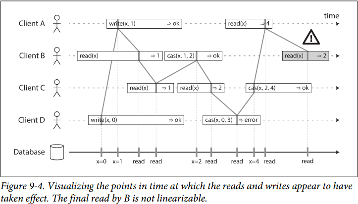

# Lecture 7. Raft Log

阅读材料笔记[Basic Raft Algorithm](https://github.com/JasonYuchen/notes/blob/master/raft/03.Basic_Raft_Algorithm.md)以及[Log Compaction](https://github.com/JasonYuchen/notes/blob/master/raft/05.Log_Compaction.md)

由于Raft dissertation中对于算法的过程和原理已有详细的描述，因此参考阅读笔记，下面课程笔记仅记录少量讨论点

## 线性一致性 Linearizability

参考[DDIA](https://github.com/JasonYuchen/notes/blob/master/ddia/09.Consistency_and_Consensus.md)中的线性一致性图解如下：

**所有读取都能读到最近一个成功的写入，所有读取一旦读到了一个值，此后都只会读到更新的值，即所有操作有一个全局顺序total order**，因此图中B读到了过时的`x=2`不满足线性一致性，而A,C,D均表现为线性一致性

[Test for Linearizability](https://www.anishathalye.com/2017/06/04/testing-distributed-systems-for-linearizability)

## 使用租约 leases

当read请求要通过ReadIndex协议由leader来处理时，leader负担较大且容易成为系统性能瓶颈，通过**使用lease可以绕过check quorum而直接处理read请求**，原理如下：

- 每当leader收到majority的消息时(heartbeatResp, replicateResp, readIndexResp, etc)就重置当前节点的lease，因为**在lease超过election timeout前不可能出现第二个leader**
- 当leader收到read请求时，检查lease是否超过election timeout，未超过就可以直接响应读请求而不需要"commit"一条read请求，从而显著提高read请求服务能力
- 缺点是**风险取决于当前节点时钟精度**（不同节点如果时钟快慢不一致，则可能出现当前节点lease未过期，但其他节点已经发起选举且有新leader，从而导致出现stale read违背线性一致性）
