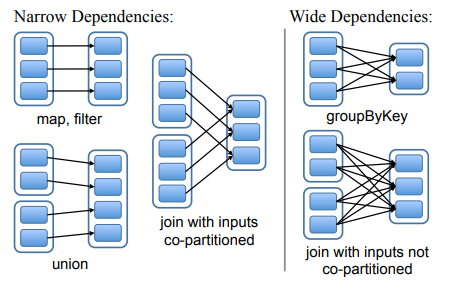

# Lecture 15. Big Data: Spark

阅读材料笔记[Resilient Distributed Datasets: A Fault-Tolerant Abstraction for In-Memory Cluster Computing](Spark.md)

## programming model

```scala
val lines = spark.read.textFile("in").rdd
    // what is lines? does it contain the content of file "in"?

lines.collect()
    // lines yields a list of strings, one per line of input
    // if we run lines.collect() again, it re-reads file "in"

val links1 = lines.map{ s => val parts = s.split("\\s+"); (parts(0), parts(1)) }
links1.collect()
    // map, split, tuple -- acts on each line in turn
    // parses each string "x y" into tuple ( "x", "y" )

val links2 = links1.distinct()
    // distinct() sorts or hashes to bring duplicates together

val links3 = links2.groupByKey()
    // groupByKey() sorts or hashes to bring instances of each key together

val links4 = links3.cache()
    // cache() == persist in memory

var ranks = links4.mapValues(v => 1.0)

// now for first loop iteration
val jj = links4.join(ranks)
    // the join brings each page's link list and current rank together

val contribs = jj.values.flatMap{ case (urls, rank) => urls.map(url => (url, rank / urls.size)) }
    // for each link, the "from" page's rank divided by number of its links

ranks = contribs.reduceByKey(_ + _).mapValues(0.15 + 0.85 * _)
    // sum up the links that lead to each page

// second loop iteration
val jj2 = links4.join(ranks)
    // join() brings together equal keys; must sort or hash

val contribs2 = jj2.values.flatMap{ case (urls, rank) => urls.map(url => (url, rank / urls.size)) }
ranks = contribs2.reduceByKey(_ + _).mapValues(0.15 + 0.85 * _)
    // reduceByKey() brings together equal keys

// the loop &c just creates a lineage graph.
// it does not do any real work.

val output = ranks.collect()
    // collect() is an action which causes the whole computation to execute!

output.foreach(tup => println(s"${tup._1} has rank:  ${tup._2} ."))
```

## execution strategy

Spark的应用程序由driver进行执行，driver会首先创建依赖关系图lineage graph，并把编译后的Java字节码发送到worker上，随后driver进行管理和数据移动

wide依赖的执行流程：

1. driver已知wide操作的位置，上下游都是transfomations
2. 上游产生数据shuffle后进入下游产生新的分区
   - 在上游transformation后：所有数据根据shuffle条件（通常根据key）存储进内存的不同下游分区
   - 在下游transformation前：每个worker从对应的上游分区内存中获取数据
3. 所有数据都通过网络交互，代价大，并且必须**同步等待所有数据都完成shuffle**后下游transformation才能继续执行，因此wide操作不能流水线化



当数据被第二次读时，往往需要重新从源开始计算一次，或**使用`persist()/cache()`显式要求缓存，从而下次可以直接使用**

**由于driver会生成整个依赖lineage对应的处理流程图DAG，从而可以进行全局的优化，例如数据局部性、流水线执行、并发执行等**

## fault tolerant

通过**在其他节点上重新计算丢失数据分区**进行容错和故障恢复

- 对于narrow依赖，仅丢失的数据分区需要重新计算
- 对于wide依赖，由于丢失的数据分区依赖上游多个分区，因此所有分区都可能需要从头重新计算（重新计算向上游递归到有checkpoint的部分，因此**从checkpoint开始重新计算**）

例如下图中共有6个节点，RDD 2与RDD 5之间、RDD 4与RDD 6之间都发生了wide转换（并且shuffle后的数据写入了磁盘`persist()`），其余均是narrow转换，假如在计算RDD 8时，Node 1崩溃丢失了所有数据：

- 由于shuffle后的数据已经持久化，因此此时RDD 5 partition 2,3和RDD 6 partition 1,2,3目前可以重用
- Node 1直接丢失数据，对应的**RDD 1,2,5,7,8 partition 1数据需要重新计算**
- 对于wide依赖，RDD 5的上游**RDD 2的所有分区需要重新计算**从而才能得出RDD 5的partition 1
- 对于narrow依赖，RDD 2的上游**RDD 1的所有分区需要重新计算**
- 对于wide依赖，由于RDD 4到RDD 6的shuffle过程都在未宕机的Node 4,5,6，因此写入磁盘的shuffle数据可以直接重用，从而**RDD 6及其上游都不需要重新计算**

```text
p1 : partition 1
-> : narrow transformation
X  : wide transformation
                                  |--------------------------------------|
|---------------------------------|Stage 2                               |
|Stage 0         [RDD 1]  [RDD 2] |[RDD 5]                               |
|Node 1: Block ->   p1  ->   p1   X   p1 ----\                           |
|Node 2: Block ->   p2  ->   p2   X   p2 ---\ \         [RDD 7]  [RDD 8] |
|Node 3: Block ->   p3  ->   p3   X   p3 --\ \ \_Node_1->  p1  ->   p1   |
|---------------------------------|         \ \/                         |
|Stage 1         [RDD 3]  [RDD 4] |[RDD 6]   \/\_Node_2->  p2  ->   p2   |
|Node 4: Block ->   p1  ->   p1   X   p1 ----/\/                         |
|Node 5: Block ->   p2  ->   p2   X   p2 -----/\_Node_3->  p3  ->   p3   |
|Node 6: Block ->   p3  ->   p3   X   p3 ------/                         |
|---------------------------------|                                      |
                                  |--------------------------------------|
```

## 总结

- Spark提升了**表达力expressivity**和**性能performance**（相比于MapReduce）
- 生成**完整的数据流（lineage，DAG）能够帮助性能优化和错误恢复**
- 性能的核心点在于**transformation前后的数据依然保存在内存**中（而MapReduce会频繁从GFS中读取写入数据），充分利用了内存