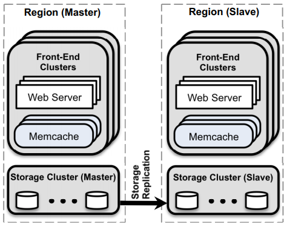
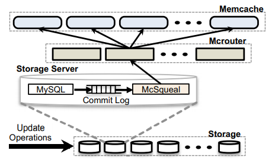

# Lecture 16. Cache Consistency: Memcached at Facebook

阅读材料笔记[Scaling Memcache at Facebook](Memcached_FB.md)

## 理论与现实

可以从以下方面来看待原文：

- 从一开始就不严肃考虑一致性问题带来的教训
- 如何从几乎全是现成组件来实现超高性能
- 挣扎在性能和一致性之间

**Yahoo PNUTS storage**也许是更好的设计？

## web服务器的设计随请求量变化

1. 单机单节点，web服务器+应用+数据库 **all-in-one**
   数据库提供持久化存储、故障恢复、事务，应用执行查询请求，构造页面等，很快随着请求量的增加，**应用成为瓶颈**
2. 多个前端，一个共享数据库
   前端是无状态的，天然和后端数据库解耦，数据库负责并发控制，很快随着请求量继续增加，**共享数据库称为瓶颈**
3. 多个前端，数据分片到**数据库集群**
   当数据没有热点时，集群提供超高并行处理能力，但是一旦涉及跨分区事务时就会明显受限，并且**数据库对读请求响应依然较慢**
4. 多个前端，**多个缓存服务读**，多个数据库服务写
   适合read-intensive的场合，memcached类的缓存性能远高于数据库读，但要注意：
   - 缓存和数据库的数据**一致性**保证较难
   - 缓存未命中时会给数据库带来较大压力甚至**雪崩**
   - 数据库的**写入可能是下一个瓶颈**

## memcache

memcache被作为按需的缓存服务（**demand-filled look-aside**），并**不与数据源直接交互（由缓存和数据源交互更新的称为look-through）**，实际上memcache的缓存数据都来自基于web server提供（从而可能出现**缓存一致性问题**）


实际上从路径可以看出采用缓存并不一定能显著减少尾延迟（依然需要访问数据库，但是很明显可以**防止数据库过负载而雪崩**）

另外在图中右侧更新路径中，**采用`delete`要求下一个client通过cache miss的方式来更新memcache**，是因为如果**改用`set`直接由当前client来更新，可能会出现stale set**，即缓存更新的顺序与数据库更新的顺序不一致导致了过时的数据存在于缓存中，而读取时采用set的方式会额外与memcache合作使用lease来避免这种情况

```text
Client 1              Client 2
UPDATE x=1
                      UPDATE x=2
                      set(x, 2)
set(x, 1)
// ooops!!!
// stale set
```

从Facebook的使用场景来看，不需要强一致性保证，**仅需最终一致性保证，并且stale数据有界**，不足以让用户观测到不一致即可（特别情况：用户自己进行的更新必须能够从后续的读取返回，**读己之写**一致性很重要）

## 性能设计

### 1. 分区或复制能提高吞吐吗？

- 分区将keys分布在多个memcache节点
  - *good* 更有效利用内存
  - *good* 如果没有热点key，则分区就能分布负载
  - *bad* web服务器需要和更多的节点通信
- 复制将clients分布在多个memcache节点
  - *good* 少数热点key下表现出色
  - *good* 更少的连接数
  - *bad* 数据冗余多份，内存利用率低，可以缓存的对象更少

### 2. 域region的设计思考



- **域作为数据的完整复制**，每个域都有所有数据
  一个集群可以跨地理分布多个域，从而clients可以从更近的域得到读服务，域从内部缓存和数据库获取数据更快，但是**写服务求依然要唯一的主域master region**提供
- 将用户分区由不同域提供服务意义不大
  Facebook作为社交网络，不同用户的局部性未必与地理上的局部有关，因此根据用户分区由地理上不同的域提供服务没有明显收益
- 完全由master region提供写入服务有可以接收的性能
  社交网络的read请求数量远多于write数量，并且对于用户来说，一次write由于跨域带来数百毫秒的延迟几乎无感知

### 3. 域内的性能表现

- **每个域内有多个前端集群，集群内有独立的缓存节点，集群之间共享域缓存池，一个域内有多个缓存池regional pools**
  - 少数的热点keys并不能通过增加memcache节点来均衡负载，但是通过多个缓存池，**每个缓存池内都有热点keys的replicas**可以减轻负载
  - 若只是增加memcache节点（而只有一个缓存池），则前端集群内的web服务器需要**与更多的memcache节点通信**，反过来web服务器也会收到**更多incast流量**
  - 采用多个前端集群共享缓存池，从而**不活跃的keys不会有过多冗余replicas**，缓存池的内存利用率更高，并且前端集群可以根据keys的特征自主选择放置在哪个缓存池（**冷热分离**）
- **预热新入域的缓存节点**
  由于新缓存节点没有缓存任何数据，cache miss极高，因此需要**预热warmup**
- **惊群thundering herd**
  当client在读负载较重时发起了数据更新，从而从缓存中`delete`了某个key，导致大量`get`缓存未命中，造成数据库压力骤升

  通过租约lease解决，租约的给出频率受限制，因此**并发`get`时通常只有第一个client会拿到租约并执行真正的更新**，其他未拿到的client被要求等待一段时间后重新`get`访问缓存
- **Gutter集群应对缓存节点宕机**
  Gutter是一组代偿缓存服务器，当client发现**某个缓存节点宕机时，就会访问Gutter节点**：
  - 不能直接由数据库应对巨大流量
  - 不能直接把流量转移给其他某个未宕机的缓存节点，流量过大
  - 不能重新分区数据后再给其他缓存节点，过于耗时

  并且Gutter设置key会短期内很快失效，**且client/数据库不会给Gutter发送`delete`请求**，因为Gutter节点是给所有缓存节点的代偿，如果也接收`delete`请求，会导致海量的`delete`请求涌入
- **采用mcrouter消息队列传递`delete`进行invalidation**
  - 直接将所有数据库的mcsqueal对接所有缓存节点，n对n关系，$n^2$ 条连接代价过大
  - UDP无法保证可靠和有序
  - mcrouter消息队列还可以批量化发送请求

## 一致性保证

- 写入直接通过主数据库，保证一致性
- 读取可能会发生stale read，但是由于**写入会主动`delete`缓存，从而保证了读己之写一致性read-your-own-writes consistency**

### 1. 跨域的数据库一致性

只有一个主域，所有写入通过主域完成，从域通过MySQL的replication跟随主域，从而可能存在一定延迟和落后

除了发起更新的client进行`delete`，数据库在事务提交时也会主动发起`delete`（通过mcsqual和mcrouter），显然`delete`是幂等的



### 2. 请求并发时竞争导致不一致

`get/set`发送给缓存，`read/write`发送给数据库

--------------------------------------

```text
Race 1: k not cached
    Client 1               Client 2
    get(k) miss
    v1 = read(k)
                           write(k, v2)
                           delete(k)
    set(k, v1)
    // ooops!!!
    // stale set
```

采用**租约lease**可以解决上述情况，`C1 set(k, v1)`会被忽略，**因为`C2 delete(k)`将`C1 get(k)`获得的lease失效**

--------------------------------------

```text
Race 2: when warmup a cold cache node, k=v1 initially
    Cleint 1               Client 2
    write(k, v2)
    delete(k) [cold]
                           get(k)     [cold] miss
                           get(k)     [warm] hit
                           set(k, v1) [cold]
                           // ooops!!!
                           // stale set
```

采用**延迟hold off**可以部分解决（保证了stale的程度，最终一致性且不一致有界），只对cold集群有效，在被`delete`后2s内忽略所有`set`，从而**2s后大概率delete已经扩散到了warm集群**，此后的`set`是有效的

--------------------------------------

```text
Race 3: cross-region inconsistency, k=v1 initially
    Client 1 [secondary region]               Client 2
    write(k, v2) [primary]
    delete(k)    [local]
    get(k)       [local] miss
    v1 = read(k) [local]
    // ooops!!!
    // stale read
```

采用**远端标记remote mark**可以解决，在`delete`时在local设定remote，当`read`时如果**local数据k不存在而存在remote，则从primary集群读取**，当primary的数据扩散到secondary时就将rk删除

### 3. 为什么不采用look-through避免一致性问题？

- 通常缓存的是前端集群获得所有数据后处理过的一定结果，未必是所有从数据库获取的原始对象数据，因此look-through的设计数据库并不知道如何计算出这些结果
- 会增加读己之读的延迟
