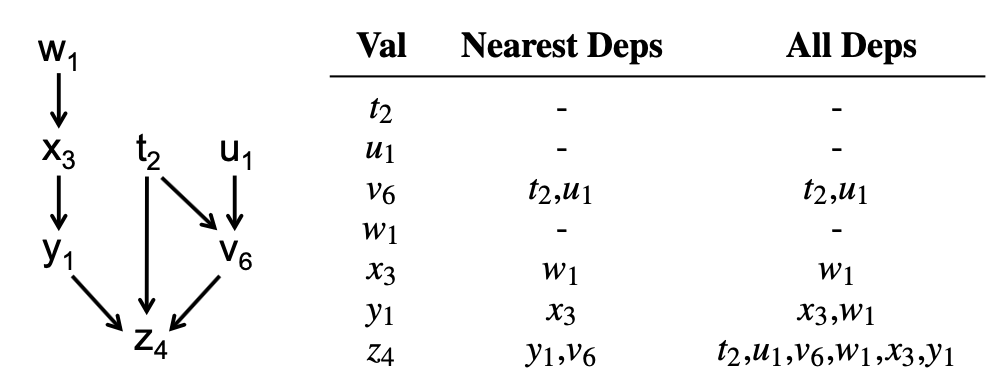

# Lecture 17. Causal Consistency: COPS

阅读材料笔记[Don't Settle for Eventual: Scalable Causal Consistency for Wide-Area Storage with COPS](COPS.md)

## 地理分布系统

- **Spanner**
  - write引入Paxos和2PC
  - write导致的Paxos quorum需要等待远端节点
  - 没有数据中心可以独自写入
  - 提供transactions，强一致性，相对较快
- **Memcache**
  - write必须通过主数据中心primary MySQL
  - 没有非主数据中心可以独自写入
  - 提供极高性能的read

## 整体架构和分布式设计

- 多个数据中心（集群），每个数据中心拥有完整的数据，即**数据中心之间replication**
- 本地数据中心提供读，高性能低延迟
- 本地数据中心写入，异步replicate到其他数据中心，但是本地写入就视为成功
- 并发写入采用last-writer-wins解决冲突

## Can we have a system that allows writes from any datacenter?

### 1. 原始设计 straw man one

设计：

- 3个数据中心，每个数据中心完整的副本，并且数据中心内部数据分区shards
- clients只与本地的shard交互读写，每个shard都会把writes异步推送给其他数据中心对应的shard
- write需要通过quorum等方式达成跨数据中心最终一致

评价：

- read/write完全并行处理，极高并发度parallelism
- 属于**最终一致性eventual consistency**系统，client可能无法按照顺序看到其他节点的修改

### 2. 确定write的顺序 straw man two

1. **采用wall-clock作为版本号**
    通过时间作为版本号来判断write的发生顺序，从而可以保存最近的write；但是问题在于不同节点、不同数据中心的**wall-clock快慢不一致**，可能出现某个较快wall-clock的数据中心写入总是成功并且甚至阻塞其他数据中心的写（因为wall-clock快的数据中心version总是更新，其他数据中心的写入都会被覆盖）
2. **采用Lamport clocks作为版本号**
    采用逻辑时钟（a.k.a. Lamport clocks）来分配版本号确定**全局顺序single global order**：

    ```text
    Tmax = highest version seen (self and others)
    T = max(Tmax + 1, wall-clock time)
    put() with version=T
    ```

    此时即使某个节点wall-clock运行更快，也只是看到该节点数据和版本的节点会更新版本号，而不是写入都被单纯覆盖，全局依然可以维持单一顺序

    但是有版本号后**COPS采用last-writer-wins, LWW来解决冲突，这往往在现实世界中不足以构建可用的系统**，LWW会丢失更新，例如并发递增计数器就会丢失一些递增，因此现实世界往往希望有更灵活可行的方式处理冲突：
    - **事务 transactions**
    - **微事务 mini-transactions**，例如支持原子递增，TestAndSet/CompareAndSwap
    - **用户定义的冲突解决方案**，例如对并发修改购物车支持union

设计：

- 提供**同步写入操作`sync(k, ver)`，直到所有数据中心都至少有版本`ver`时才返回**，充当了类似barrier的作用
- 调用`put`会返回分配的新版本号，从而可以使用`sync(k, ver)`进行同步

评价：

- 使用`sync`操作配合`version`显示要求所有数据中心完成同步，但显然高延迟
- 不涉及事务时（操作多个不同shards的数据）可用
- **确保了write的顺序**，一旦`sync`返回，则此后再发生的其他write一旦可见，在`sync`前的write也一定可见
- read依然由本地节点服务保持高性能，并且由于write被同步，read保证可以读取到最新同步的write数据
- write性能可以接受（Spanner同步等待majority，Memcache同步等待primary）

### 3. 降低同步代价 straw man three - COPS

设计：

- 每个client（由client library自动累积）维护**context来追踪所有client的操作**，在每次`put/get`后都会追加依赖关系给context
  

  ```text
  execution      context (maintained by library)
  get(x)->v2     x:v2
  get(y)->v4     x:v2 y:v4
  put(z,-)->v3   x:v2 y:v4 z:v3
  // The client sent z=v3 along
  //  with its dependencies [x:v2,y:v4]
  // Actually, only z:v3 in the context
  //  after the put(z,-)->v3 returned
  ```
  
  由于写入`put(z,-)->v3`会等到其依赖全都被写入才会真正写入，因此此后不必再保存`z`的依赖，此后的操作都会在`z`及其依赖已经可见的情况下发生，**即使后续操作再带上`z`的依赖也已经被`z:v3`本身给隐式commit了**，作为优化只保存`z:v3`即可

- 保证**因果一致性 causal consistency**，当一个key复制给远端集群时，**只有该key的所有因果依赖都已经被写入时，才会写入该key的数据**，从而任何集群中的client都会在本地集群中先看到"因"再看到"果"，并且**发送数据的一方并不等待**
  
  例如上述例子，其余集群在看到`x:v2, y:v4`之前会等待而不直接提交`z=v3`

- 额外可以使用**get transaction支持读取一组数据的一致性快照**
  通过**两阶段获取每个数据的值**，第2个阶段基于第1个阶段分析出来的依赖关系从而获得一致性快照

评价：

- **readers看到的更新一定是和writers写入的更新顺序时一致的**，因为因果依赖
- COPS要求**client只与本地集群通信，并且client之间是独立的**，如果允许clients通信以及允许连接任意集群，则**退化到最终一致性**

## COPS和因果一致性局限性

- 出现**冲突时解决非常困难**，仅仅采用last-writer-wins无法满足大多数场合的需求
- 需要clients侧来追踪因果依赖关系，例如web不可能利用browser来追踪因果
- **限制client只允许与固定节点通信**且相互之间不能通信，而实际情况中**任意节点相互通信几乎是必然的**，即COPS不是externally consistent
- **只支持一批数据的读事务get transaction**，适用场合有限，写事务同样重要
- 远端节点必须**等待依赖关系**，从而可能出现**级联等待cascading denpendency waits**，延迟不断累积
- 追踪和保证因果关系代价不小

## 总结

基于因果关系的系统依然是研究热点，**实际场合中往往极少系统会采用因果一致性系统**，更多的如：

- primary-site：Yahoo/PNUTS，Facebook/Memcache
- eventual consistency：Dynamo，Cassandra
- strong consistency：Spanner
