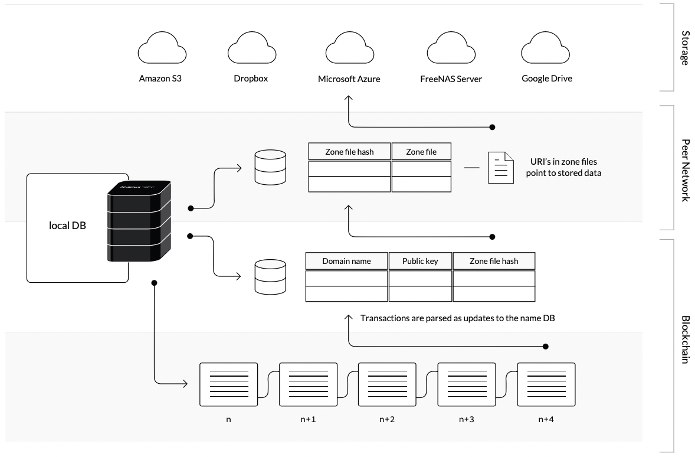

# Lecture 20. Blockstack

阅读材料笔记[Blockstack](Blockstack.md)

## centralized & decentralized

传统上中心化的设施，例如web站点，用户数据一定会经过服务提供方的代码，从而数据隐私并不是完全得到保证的，**application+data**的设计更容易实现

新型的去中心化设施，用户数据完全由去中心化的程序处理，并且通过RSA加密确保了用户才是数据的所有者，**user+data**的思想，数据完全由用户控制，从而可以轻易改变使用的application

## Blockstack从命名服务开始

- name符合人类用户的习惯
- `name -> location`的关系，并且复用了现有的存储设施（AWS，Azure，etc）从而所有用户都可以根据name访问到数据
- `name -> public key`的关系，从而在不信任现有存储设施（数据加密）的基础上实现共享数据，加密后的数据只有持有密钥的可以访问，**end-to-end** security

实现流程：

1. 采用比特币区块链作为底层区块链（通过virtualchain处理）确保了区块的全局顺序
2. Blockstack在比特币区块中嵌入了命名的事务name-claiming records

## Blockstack架构

- **Bitcoin区块链**
- **Blockstack服务器**
  - 读取Bitcoin区块链数据
  - 获取有效的naming records更新本地数据库
  - 服务查询请求 `name -> public key + zone hash`
- **Atlas网络**
  - 存储zone files `name -> location`
  - 每个节点持有全部数据
- **Gaia服务器**
  - 将存储与每个用户分离，基于AWS等云存储设施

使用流程：

1. 根据`name`，在virtualchain中找到`(name, hash)`
2. 根据`hash(name)`在Atlas网络中找到对应的zone file（Atlas网络每个节点都有数据可以提供zone file）
3. 根据zone file获得对应的URI从而获取底层存储位置
4. 验证并访问数据

## 可能存在的问题

- 由于**user+data**的设计，没有传统意义上的后端，如果要进行一些数据操作等，没有SQL的支持，全量从云存储下载到本地，海量网络传输和延迟
- 原先由服务提供商存储数据（无论加密与否），此时由用户付费存储在云存储上
- 一些数据通过私钥加密并分发公钥给期望的用户，如何控制权限？例如一些用户被revoke权限，通过重新加密并分发新的密钥给其余人？
- 所有数据交互都需要通过加密解密，显著提升了交互复杂度和性能开销
- 用于保存自身数据和密钥的设备例如手机和电脑需要特别注意保管

## Q&A

- 如果用户希望注册一个已经被分配的name？
- 为了隐私而加密，需要持有密钥解锁数据，如何控制权限？
- 只信任用户设备和Blockstack的软件，真的更好吗？
- 所有资源和服务都使用naming真的更好吗？
- 对比Certificate Transparency，CT只能尽快发现不合法的记录，而不能解决，并且不同的CT logs的顺序并不完全一致
