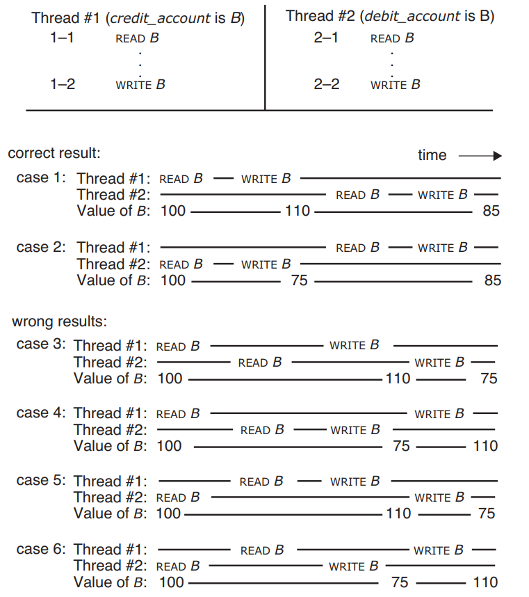
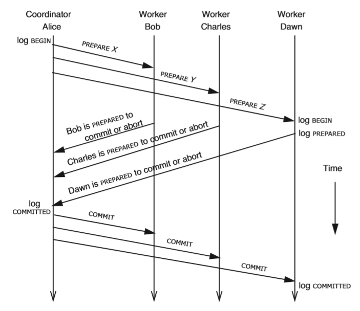

# [6.033] Chapter 9. Atomicity: All-or-Nothing and Before-or-After

## 9.1.5 原子性 Before-or-After Atomicity: Coordinating Concurrent Threads

- **顺序协调 sequence coordination**
    为了并发操作的正确性，第一个操作必须在第二个操作开始前结束，从而保证了数据被并发处理的正确性，同时由于操作的顺序往往由应用决定，因此会是显式体现出来
- **原子性 before-or-after atomicity**
    从调用者来看，如果并发操作时产生的效果和一个操作完全在另一个操作之后执行（或一个操作完全在另一个之前执行）产生的效果相同（**类似数据库事务的可序列化[serializable](https://en.wikipedia.org/wiki/Serializability)**），就称为并发操作有before-or-after属性

    > Concurrent actions have the before-or-after property if their effect from the point of view of their invokers **is the same as if the actions occurred either completely before or completely after one another**

before-or-after与sequence不同的点在于后者要求已知所有会访问相同数据的操作并进行顺序约束，而前者任意一个操作对其他会访问相同数据的操作完全未知

## 9.1.6 正确性与序列化 Correctness and Serialization

并发操作是正确的：**当操作的结果可以通过某一种完全顺序执行操作的方式获得**

> coordination among concurrent actions can be considered to be correct **if every result is guaranteed to be one that could have been obtained by some purely serial application** of those same actions

当并发操作具有before-or-after属性时，他们是**可序列化的serializable**：即存在一种顺序执行所有操作的方式可以获得相同的并发执行的结果

> serializable: there **exists some serial order of those concurrent transactions** that
would, if followed, lead to the same ending state

部分情况下会要求比可序列化更强的保证，例如多核处理器在执行指令时要求**[顺序一致性sequential consistency](https://en.wikipedia.org/wiki/Sequential_consistency)**，即全局所有并发的指令可以序列化成某一个顺序执行每个指令，并且每个核心在处理指令时的顺序就和程序中写的顺序一致（但是每个核心不一定立即看到其他核心执行完成的指令结果）

**顺序一致性sequential consistency（操作完成不一定立即全局可见，但是一定按照操作完成的顺序全局可见）在加上时间约束（操作一旦完成就全局可见）后就是线性一致性linearizability**

**[并发下的一致性模型与分析](https://github.com/JasonYuchen/notes/tree/master/consistency)**

## 9.5.2 简单锁 Simple Locking

简单锁有两个规则：

- 每一条事务在尝试读写共享数据时，必须首先获得锁（提交一个可能读写数据的锁的集合lock set）
- 只有在事务提交，或完全回滚且将共享数据恢复后，才能释放锁（一次性释放整个锁集合）

简单锁有较为严重的性能问题导致难以提升并发度，由于事务过程中，对**可能要读写的数据都首先获得了锁，而可能最终实际读写的数据比加锁的数据要少**

## 9.5.3 两阶段锁 Two-Phase Locking

在简单锁的基础上，为了避免需要一次性提交锁集合，两阶段锁将锁的时机划分为两个阶段：

- **获得锁阶段**：随着事务的进行，每次需要读写某个共享数据时，尝试获得对应的锁，期间即使前序某个数据已经处理完也不会释放相应的锁，在**获取所有需要的锁之后的节点就叫lock point**，此后进入释放锁阶段
- **释放锁阶段**：此时对于**仅read，且后续也不会再read的对象就可以释放相应的锁**，而对于write的对象就需要等到事务提交或彻底回滚之后再释放，在此阶段不会尝试获得任何锁

在事务放弃并回滚abort，或是系统恢复recovery时需要额外考虑锁和日志的交互关系：

- 在事务放弃并**回滚所有数据时，就相当于是一个事务没有修改任何数据并直接提交**，对于write的对象的锁要等到事务提交/回滚时才释放也是因为如果一旦已经释放了锁并且其他事务开始读写该对象，而当前事务决定回滚需要对象回滚，此时就发生了冲突，因此**必须持有修改对象的锁直到提交/回滚**
- 假如出现系统宕机并启动恢复，则在事务恢复完成时，系统中应该没有任何进行中的事务，**所有已提交但还未来得及处理数据的事务通过redo log继续完成，所有未提交进行中的事务通过undo log回滚**，而对于这些事务而言，修改对象的锁一定是在各自事务的锁集合lock set中且**互不重叠non-overlapping**，并且在回滚过程中不允许开始新事务，而锁是用来协调进行中事务的，因此实际上在正常运行时，**锁所构造出的顺序执行关系serialization，已经由redo log (execute forward)和undo log (execute backward)捕获，在恢复过程中根据log进行而不需要考虑原先持有的锁情况**

## 9.6.3 分布式两阶段提交 Multiple-Site Atomicity: Distributed Two-Phase Commit

**两阶段提交Two-Phase Commit, 2PC指将事务的处理和提交分为prepare和commit两个阶段进行**，如下图：

1. 事务协调者coordinator发送prepare给所有事务参与者participants
2. 所有参与者根据事务进行情况，回复给协调者Commit或Abort
3. 协调者发现所有参与者都是Commit就发送给参与者Commit，并标记事务已经Commit，有任一参与者拒绝，就会发送Abort并回滚

难点在于**分布式系统中的通信延迟、消息丢失和消息重复**

> Mathias Verraes: "There are only two hard problems in distributed systems:  2. Exactly-once delivery 1. Guaranteed order of messages 2. Exactly-once delivery"

两阶段提交过程中的prepare/commit/abort的消息都有可能丢失或重传，因此需要处理各种可能的异常：

- **协调者必须持久化记录每条事务的最终结论**，当需要重传或是收到对已知结论的事务的查询时，可以返回一个一致的结果
- 当协调者prepare或参与者的commit/abort丢失时，协调者无法获知某个参与者的情况，就会**持续重传**prepare消息，而参与者收到prepare消息就会根据事务情况持续回复相同的结论，直到协调者收到结果；协调者也可以根据设定的超时，当始终无法收到参与者情况时，可以认为参与者宕机，直接发送abort
- 当参与者在prepare后还未commit时出现宕机时，必须**根据log重建事务prepare的状态包括重新获得所有相关的锁**，准备commit/abort
- **一旦协调者裁定一条事务，则所有参与者都必须服从**，即使宕机重建状态后也必须根据协调者回复的结论进行事务的处理

两阶段提交往往会引入更难解决的问题（**两阶段提交有将错误放大化的能力**）：

- **某个节点（协调者或参与者）在宕机期间，直接导致整个集群的事务无法继续进行**，而集群内出现任一单体故障的概率随着集群规模的增加而显著增大
- 当不同的系统之间都采用2PC协议时，一旦某个节点出现故障，会导致包含该节点的模块不可用，会继续导致包含该模块的系统不可用，最终错误被放大到整个集群无法工作
- 通常需要**备份replication的机制进行单点Single Point Of Failure, SPOF容错**
