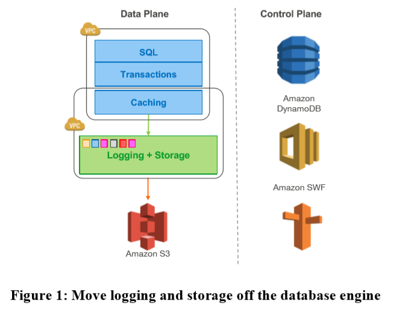
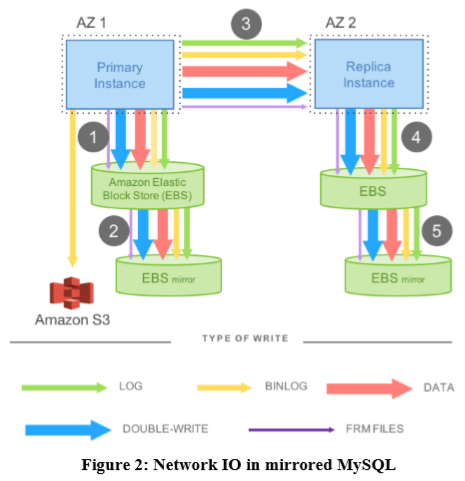
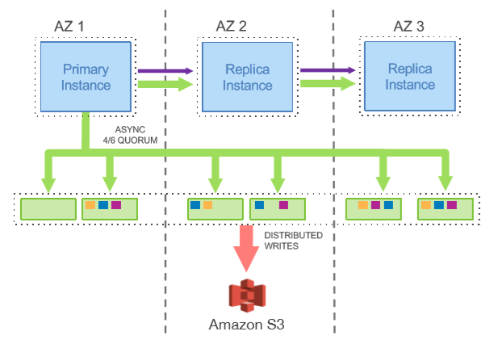
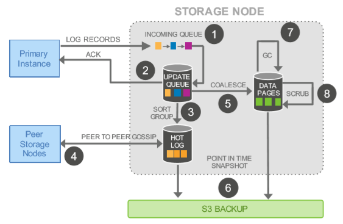
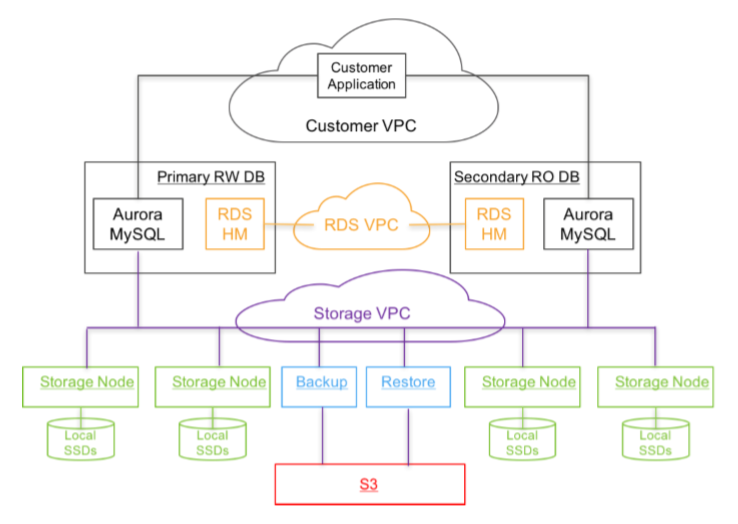
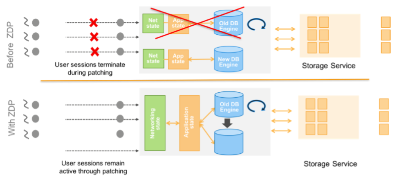

# [SIGMOD 2017] Amazon Aurora: Design Considerations for High Throughput Cloud-Native Relational Databases

## 简介 Introduction

在现代云服务中，可恢复性resilience和可扩展scalability逐渐由存储与计算分离实现，存储通过副本备份replication到多个节点从而允许动态替换故障节点、扩容伸缩，因此**网络network往往成为了系统的主要瓶颈**（磁盘I/O通过多副本扩容已经不再是系统瓶颈，单个节点也很难成为热点hot spot）

有一些场景下，**同步操作会导致暂停stall和上下文切换context switch**成为系统性能的瓶颈：

- **缓存未命中cache miss**：由于数据不在数据库的缓存中导致读线程需要直接同步读磁盘，并且进行缓存替换cache replacement
- **事务提交transaction commit**：当某个事务在提交时耗时过长，会进一步导致其他事务等待，例如常见的分布式事务两阶段提交2PC由于需要全体参与者提交因此取决于受最慢节点的速度

Aurora通过将redo log抽象成**分段式日志segmented redo log并分布在多种可扩容的底层存储上**解耦日志和数据库，具体来说数据库本身依然包含传统的核心组件（`query processor, transactions, locking, buffer cache, access methods, undo management`），而其余组件则分离到存储服务上（`redo logging, durable storage, crash recover, backup/restore`）

Aurora相比于传统的架构有三项显著的优势：

- **存储层storage独立**作为容错fault-tolerant和自恢复self-healing的服务，分布在多个数据中心
- 向**存储层仅写入redo log**从而显著减小网络IOPS
- 将原先最复杂的单次高开销函数backup/restore重新设计成异步持续运行的服务

## 规模下的持久化 Durability at Scale

### 1. 复制和相关的错误 Replication and Correlated Failures

在大规模的集群系统下，网络、磁盘、节点等会持续出现一些错误如同背景噪音，因此通常**采用复制replication进行持久化，并通过投票quorum-based voting protocol确保数据一致性**

假定有V个节点可以用于数据备份，在写入时数据至少存储到Vw个节点才认为成功，在读取时数据至少从Vr个节点读出且一致才认为成功，此时为了一致性必须保证以下两点：

- `Vr + Vw > V`：从而**写入和读取的节点必然有重合**，因此能够保证每次读取一定能读到最新的写入
- `Vw > V / 2`：**写入至少一半的节点（majority）**从而能够达成共识避免写入冲突avoid conflicting writes

在Aurora中，假定任一时刻总有一个region是失败的，那么对于`V=3`的情况来说，余下2个节点必须一直可靠，因此为了更高的可靠性，Aurora实际采用了`V=6, Vw=4, Vr=3`的配置，并且每个region放置2个节点，此时可以在任一整个region宕机以及另一个region的单个replica失效（`2+1=3`）依然保持可read（但不可write），在任意两个replica失效（包括单个region宕机）依然保持可wread/rite

### 2. 分段存储 Segmented Storage

当故障发生（Mean Time to Failure, MTTF）时，不相关的两个故障同时发生的概率必须要显著低于修复的概率（Mean Time to Repaire, MTTR），即单次出现故障应尽可能在出现其他故障前被修复

由于MTTF往往和硬件设备本身或是不可抗力有关几乎不可能人为减少，因此通过提高MTTR来提高系统的稳健性，主要方式是将**数据库卷分区成固定大小的段segments，并且多副本6路6-way存储到Protection Groups, PG上**，从而当某节点宕机时，对应的segments可以快速从其他节点恢复

## 日志即数据库 The Log is the Database

### 1. 写放大带来的负担 The Burden of Amplified Writes

由于采用了`V=6, Vw=4`的备份设计，因此导致了**写放大write amplification、延迟高dilate latencies和写暂停write stall**的负担

传统的数据库系统如MySQL的写数据流程往往包含数据页data page（包含heap files, b-trees等数据）和redo log，两者通常会写入磁盘上的**write-ahead log, WAL**，每个redo log包含了data page的差异，从而可以通过应用rede log将data page修改为新的状态，一个主备primary-backup备份的MySQL数据库数据流参考如下图

- BINLOG：redo log和binary statement log会被归档到AWS S3
- 第1&2步中，从primary MySQL写入到EBS和其镜像中，BINLOG写入到AWS S3，1&2均完成时发送ACK，并开始进行3
- 第3步中，同步写入到replica MySQL中，完成时发送ACK，并开始进行4&5
- 第4&5步中，从replica MySQL写入到EBS和其镜像中，完成时发送ACK，从而所有写入完成

显然这样的设计由于同步关系`(1&2)->(3)->(4&5)`，会带来显著的写入延迟，并且系统的性能会受到最慢节点的限制

### 2. 将Redo过程下放给存储层 Offloading Redo Processing to Storage

Redo log是用来应用到数据页上，从而可以在同步写入redo log的时候，异步使用redo log applicator修改数据页来提升系统性能，事务提交时只需要保证redo log已经持久化即可

在Aurora中，**只有redo log会通过网络进行复制replication**，所有page等其他数据和修改都不会通过网络备份；同时redo log applicator也由存储层负责运行，异步处理redo log并进行page的更新，同时为了避免每次都需要从头replay redo log进行page重建，**对于修改链（redo log chain）较长的page可以进行物化materialization**（注意与快照checkpoint相区别，**checkpoint取决于整个redo log的长度，而materialization取决于单个page的redo log的长度**）

如图，Aurora的primary节点批量化将redo log直接六路写入存储层并且流式复制给replica节点，通过只备份redo log，显著减少了网络IO的负载和写放大，相当于redo log构成了实际的Aurora数据库，日志即数据库：

| Configuration | Transactions | IOs/Transaction |
| :-: | :-: | :-: |
|Mirrored MySQL|780000|7.4|
|Aurora|27378000|0.95|

同时，故障恢复时，由于**restore snapshot，replay log等重建数据库的过程已经全部由存储层作为后台服务运行continuously, asynchronously**，因此Aurora在启动时不需要额外做传统数据库恢复的操作

### 3. 存储服务的设计要点 Storage Service Design Points

**存储层作为后端background的核心要求就是尽可能减少前端foreground的写入请求延迟**，因此当前端请求较多业务繁忙时，后端会尽可能满足前端要求而主动减少例如垃圾回收garbage collection等服务的资源占用，即**前端和后端的负载是负相关关系**（传统数据库中前端和后端的负载是正相关关系，例如写入较多产生压力较大时，后端垃圾回收就会频繁运行），由于将日志相关的过程全都下放给了独立的存储层并且有quorum保证`V=6, Vw=4`，因此即使某个节点忙碌变慢时也不会拖慢整体

存储节点的处理流程如图:

1. 收到Primary的log，加入到内存中的等待队列incoming queue中
2. 将log存储到磁盘中持久化并直接ACK给Primary
3. 对log进行分析处理，找出缺损的部分
4. **若有缺损的log，通过[gossip](https://en.wikipedia.org/wiki/Gossip_protocol)协议从其他存储节点的replicas中恢复**
5. 合并log为新的数据页data pages
6. 周期性将data pages写入AWS S3
7. 周期性垃圾回收garbage collection
8. 周期性更新pages中的CRC

显然**只有第1&2步会影响到foreground的延迟**，第3-8步均是异步运行的

## 深入日志的设计 The Log Marches Forward

### 1. 解决方案设计：异步处理 Solution sketch: Asynchronous Processing

Redo log流本质上就是数据库的**修改序列ordered sequence of changes**，每一条redo log都有对应的单调递增的**Log Sequence Number, LSN**，从而在维护全局状态时依赖异步的处理（gossip协议用来达成PGs间的共识），而不是传统的2PC等容错性差的协议

为了**确保Aurora能够在storage层看到统一的redo log，存储服务storage service在重启时会首先进行redo log恢复**（与数据库级别的transaction恢复不同），确认**最大可靠的LSN号 Volume Complete LSN, VCL**，在此VCL之前的所有redo log确保可靠，并且所有`LSN > VCL`的日志都可以被截断

另一方面，Aurora也可以进一步定义一些允许截断的**一致性日志点Consistency Point LSNs, CPL**，从而可以定义**Volume Durable LSN, VDL为最大的小于等于VCL的点`VDL <= VCL`**，例如storage发现完整的log最大可到`VCL=1007`，但是上层Aurora人为一致性的日志点只有`CPL=900, 1000, 1100`，从而实际截断的是`VDL=1000`后的所有日志

Aurora在实际运行过程中与storage的交互如下：

- 所有数据库级别的事务都被分拆为多个**微事务mini-transactions, MTRs**，并且可以被按顺序原子的执行
- 每个MTR都包含了多个**相邻的日志记录contiguous log records**
- **最后一条MTR就是CPL**
- 数据库恢复时，Aurora在storage层恢复所有log到VCL后，通过一系列CPL获得VDL，并要求截断VDL后的log

### 2. 常规操作 Normal Operation

- **写入 Writes**
    Aurora持续操作，写入redo log到PGs，并在获得quorum后更新当前的VDL值，任意时刻都会有并发允许的一批事务在执行，每个事务都会产生redo log，由Aurora分配单调递增的唯一LSN，并且为了避免过多的redo log还未被storage ACK同时通过这种**背压back pressure的方式限制并发事务**，引入了LSN的限制`LSN < VDL + LAL`，即分配的**LSN必须小于当前的VDL和一个常数LSN Allocation Limit, LAL的和**
    每个PG维护一个**Segment Complete LSN, SCL**记录该PG所持有的所有log records里的最大值，即所有`LSN <= SCL`的日志都持有，同时Aurora会追踪记录所有PGs的SCL
- **提交 Commits**
    Commit的处理是完全异步的，当client commit一条事务时，Aurora仅仅在提交事务列表中记录该事务被commit以及对应的LSN，仅当VDL不断被推进到`VDL >= commit LSN`时，异步通知client事务结束
- **读取 Reads**
    Aurora也采用buffer management对data page进行缓存，当缓存满时访问未命中的数据会导致从磁盘读取page并替换缓存中的某一页，传统数据库在剔除dirty page时会将该page写回磁盘来确保其他read一定能读取到最新的page，Aurora策略不同但提供了一样的**read到最新数据的保证**：eviction时不写回磁盘，而**读取page时保证缓存内的版本最新**
    当Aurora剔除page时会检查该page对应的最新LSN，并且**仅剔除`LSN >= VDL`的page**，从而保证了对该page的所有修改都已经体现在log中（见replicas应用log records的规则），并且当访问该page且未命中时从磁盘中以当前VDL读取出来的就是可靠durable的版本
    Aurora在常规情况下不需要quorum read，当正常read且未命中需要从磁盘中读取时建立一个**读取点read-point代表了当前的VDL**，由于Aurora会记录所有SCL，因此**只要满足`SCL >= read-point`的storage节点就可以满足read请求**
    同时Aurora控制所有正在执行的read请求并知道所有PGs的SCL，因此可以计算出每个PG需要服务的最小read-point, Minimum Read Point LSN，PGs通过gossip协议广播这个最小的read-point从而**Protection Group Min Read Point LSN, PGMRPL可以作为一个水位线标志low water mark，在此之前的所有log records不再被需要可以垃圾回收**，每个storage节点在获知PGMRPL后就可以推进materialization并garbage collection
- **副本 Replicas**
    同一个共享存储volume至多有1个writer和15个reader，当writer生成log后会**同时发送给storage节点和所有read replicas**，在reader侧数据库对每一条log record单独处理：
  - 如果log record使用到了缓存中的page，则applicator将record应用给该page，并且遵循下述规则
    - 只有`LSN <= VDL`的log records会被apply，这些log是确保可靠的
    - 属于同一个微事务的log records会被原子应用
  - 如果log record没有使用到缓存中的page，则直接丢弃该log record

### 3. 恢复 Recovery

**Aurora同样采用redo log以及宕机重启时applicator重新应用这些log来恢复的策略**，但是通过redo log applicator被解耦到storage层面作为一项后台服务持续执行而不仅仅在启动时运行，从而显著提升了系统的性能以及恢复的速度

当宕机恢复时，Aurora的恢复流程如下：

1. **连接每一个PG，只要能够达到read quorum即`Vr=3`，PGs就确保所有写入达到write quorum即`Vw=4`的数据能够被发现**
2. 通过read quorum的PGs计算出VDL，并对后续的log截断
3. 将VDL以及截断后续log加上版本号epoch numbers，并写入持久存储以防止恢复过程被打断重新开始
4. 进行undo recovery将执行到一半的事务进行回滚操作

## 整合所有设计 Putting It All Together

> 个人认为核心思想就是**The Log is the Database**
>
> 参考Martin Kleppmann的*Making Sense of Stream Processing*

## 思考 Lessons Learned

### 1. 多用户架构和数据库集成 Multi-tenancy and database consolidation

大量提供SaaS服务的厂商习惯于采用一个instance服务多个用户和采用一张数据库表table，从而不需要为每一个用户提供一个instance（因为不可能一个instance下所有用户同时活跃)，这与通常的[multi-tenancy](https://en.wikipedia.org/wiki/Multitenancy)架构不同，通常的multi-tenancy由单个instance服务多个tenancy，每个tenancy包含一组拥有相同权限的用户，会将用户数据放置在一张统一的大表中；因此大量提供SaaS服务的厂商往往在一个数据库内需要维护大量的表，导致数据库表元数据metadata的维护开销也较大

### 2. 高并发自扩容的负载 Highly concurrent auto-scaling workloads

Internet负载往往需要考虑到突然产生的高并发冲击（例如重大新闻事件导致用户访问流量激增）

### 3. 模式演进 Schema evolution

由于业务迭代变化快，往往schema也经常需要做修改，传统的MySQL在执行修改schema时会引起全表拷贝，这是不可接受的；Aurora实现了在线DDL，通过**将每个schema的版本绑定在具体的数据页上，解析数据时会采用schema history并且通过懒惰升级lazy upgrade对每个数据页进行写时修改modify-on-write逐步更新到最新的schema**，从而支持schema的高效修改

### 4. 可用性与软件升级 Availability and software upgrades

由于数据库往往需要极高的稳定性，由于数据库软件升级导致中断服务等是不可接受的，Aurora采用Zero-Downtime Patch, ZDP的方式进行运行时动态升级：

1. 首先寻找没有活跃事务的instance，
2. 将instance上的服务程序假脱机至本地暂时的存储local ephemeral，类似于双写double write
3. 对数据库引擎进行升级
4. 重新加载服务程序，所有前端用户的session一直保持

