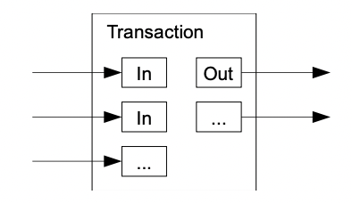

# Bitcoin: A Peer-to-Peer Electronic Cash System

## 简介 Introduction

传统交易方式基于信任，需要引入受信的第三方，而加密货币可以实现不基于信任而是基于密码学的可靠交易

## 事务 Transactions

定义电子货币为一个数字签名的链chain of digital signatures，货币所有者转移货币给下一个人的流程如图所示：

1. 计算上一次事务和下一个拥有者的公钥（Owner 2's Public Key）的散列值
2. 货币所有者（Owner 1）通过使用私钥（Owner 1's Private key）对该散列值进行签名
3. 将公钥、散列值和签名追加到电子货币的末尾，从而获得货币的接受者（Owner 2）可以通过公钥（Owner 1's Public Key）对签名进行验证

这种流程存在一个问题，即接收者（Owner 2）无法确认支付者（Owner 1）**是否付给了多个人（double-spend the coin）**，常见解决做法就是引入受信的第三方监控所有事务，而这与加密货币的初衷违背，即不依赖受信第三方完成交易

唯一的解决方式是**使接收方对每一次交易都已知**，则在支付方支付时就可以检验此前是否已经将该货币支付给其他人，从而避免了double-spend问题，因此每一次事务都应该被公布，即所有事务的**参与者应该对交易历史达成共识**

## 时间戳服务器 Timestamp Server

引入时间戳服务器，对包含多个项目的一块数据和上一个散列值进行散列如下图，并**公布该散列值**，从而由时间戳来证明在该时间对应的项目就已经存在了，但这同样有一个问题，如何避免不同的时间戳服务器都宣称自己的区块链是合法的，换言之如何选定一个时间戳服务器公布的散列值作为下一个区块被电子货币网络接受并达成共识

## 工作量证明 Proof-of-Work, PoW

为了在分布式多节点的环境下可以实现一个**点对点形式的peer-to-peer时间戳服务器**，引入了**工作量证明proof-of-work系统**

在进行散列时，实际上每个区块还会包含一个随机变化的值称为[nonce](https://en.wikipedia.org/wiki/Cryptographic_nonce)，**工作量证明要求寻找一个nonce使得计算出的散列值开头会有一些0比特位**（也可以描述为要求计算出的散列值比某个值小），显然随着要求的0数量变多，寻找nonce的计算量会指数增大，但是验证是否符合要求仅需一次散列

目前的网络实现中，通过逐渐递增nonce来寻找合适的值使得散列值满足要求，一旦工作量满足并找到了值，新的区块就会被增加到链上，而**如果要修改对应的区块就必须重新计算nonce**，随着后续继续有新的区块被链接上，就必须重新计算每一个后续链接的区块，而**最长的链就代表着整个电子货币网络的majority的结果**（想要篡改历史数据就必须占有整个网络一半以上的计算力）

为了应对硬件速度的增加，工作量证明中要求的**0的数量会随着新添加区块的速度而改变**（反应了整个网络计算力情况），当添加区块较快时工作量证明要求的0的数量就会增多，从而减慢区块的增加速度

综上，由**工作量证明来保证单个节点不可能迅速形成更长的区块链**从而实现双重支付

## 网络 Network

网络的运行流程如下：

1. 新的事务被广播给所有节点
2. 每个节点都收取新的事务到一个块中
3. 每个节点进行工作量证明**尝试为新的块找到nonce**
4. 当一个节点首先完成计算时将块广播给所有节点
5. 每个节点只会接受块中所有事务都是有效的块，即**没有二次支付的事务**
6. 每个节点接受块时，**将块添加到区块链尾部，并采用这块的散列值作为下一个自己的块的`Prev Hash`并继续进行工作量证明**

每个节点都认为拥有**最长长度的区块链为合法的链并且只会基于最长链进行计算和添加新块**，假如出现两个节点同时广播了新的区块，从而出现分支，则**节点会基于收到的第一个块进行下一步计算，但保存收到的第二个块，当下一个块也收到时就会抛弃较短的链分支**：如果是基于第一个快则抛弃保存的第二个块，反之丢弃第一个块而改为基于第二个块继续计算

新事务的广播并不要求被所有节点收到，块也不被要求所有节点收到，如果一个节点发现丢失某些块（在收到更新的块时发现gap）就会要求网络发送丢失的块

## 激励 Incentive

通常**每个块代表了一个新的币，并且由该块的创建者拥有**，从而激励节点能够持续支持网络的运行，并且是**一种发行加密货币的方式**（加密货币没有所谓的央行等机构可以发行货币）从而也可以提升加密货币的流动性

当**一定数量的加密货币生成完成**后，就可以**转向由事务扣除一定手续费作为激励**（一次事务的输入金额少于输出金额）而停止继续使用加密货币作为激励，这可以从根本上避免了通胀

另一方面，即使完全占有了计算网络的majority，由于激励的存在，也依然鼓励majority作为诚信节点继续正常运行而不是攻击整个网络（正常运行带来的激励也许比攻击网络的回报更多）

## 回收磁盘空间 Reclaiming Disk Space

当一个币的最后一条事务已经**被足够多的区块覆盖**时，在该事务之前的事务都可以被丢弃来解决磁盘空间

一个区块中所有事务都被散列随后构成Merkle树如下图，一旦丢弃了一部分事务后只需保存实线方块的散列值即可：

## 简化的支付验证 Simplified Payment Verification

通常节点以**全节点full network node**的方式加入到加密货币网络中，这要求节点本地有最长链的完整数据，相对来说较占据空间，而也可以通过以**简化节点**的模式（也叫**SPV节点**），仅保留最长链的区块头进行事务的确认如下图：

当需要确认一笔交易时，SPV节点向网络获取Merkle树的相关散列值从而将等待确认的事务链接到某一区块，从而可以**获知网络是否接受了该事务**

## 合并和分离数额 Combining and Splitting Value

通过事务允许包含**多个输入**和**至多两个输出**（一个支付payment，一个可能有的找零returning change），从而单个加密货币**可以被拆分或合并，以允许不同数额的货币交易**

## 隐私 Privacy

加密货币通过**采用public key/private key的方式完全匿名进行**（每一笔交易都可以采用新的key pair从而不能简单从相同public key来推导接收者）并且每一笔交易都完全公开到加密货币网络而不暴露任何关于双方的信息

## 计算 Calculations

**即使占据了网络的majority算力并进行攻击行为，攻击也只能是double-spend**，即收回自己支付出去的货币，而不可能凭空产生更多的货币、或是获取更多不属于攻击者的货币（节点不会接受包含无效事务的区块）
