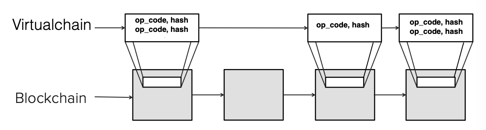
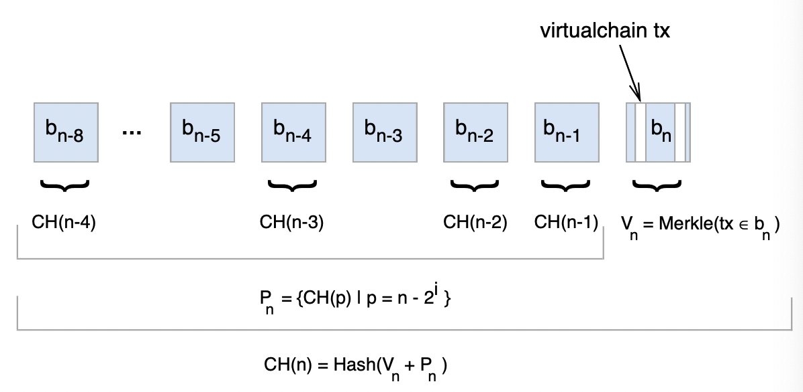
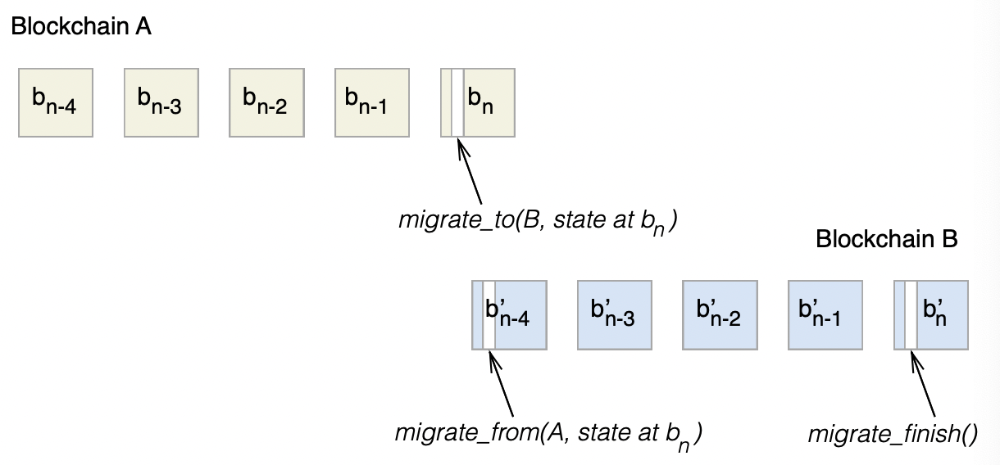

# Blockstack: A New Internet for Decentralized Applications

## 简介 Introduction

当下的互联网生态依赖一些受信的中心基础设施（如DNS，public-key设施，存储中心等）从而容易因为中心基础设施受到攻击而暴露在风险中

**Blockstack设计实现了基于区块链的去中心化新型互联网**，底层依然基于现有的网络协议（TCP/UDP）而是通过应用层实现去中心化，包含了三个模块：

- **基于虚拟链virtualchain的区块链设施**，用于绑定数字资产，例如将域名绑定到公钥上（类似Certificate Transparency），从而一个网络中的节点可以独立的验证所有数据绑定
- **点对点网络，称为Atlas**，用于全局索引
- **去中心化存储，称为Gaia**，用于全局高性能存储且不依赖任何中心受信设施

## 系统架构 System Architecture

Blockstack有以下设计目标：

- **去中心化命名和发现 Decentralized Naming & Discovery**：终端用户可以注册并发现网络资源而不需要信任任何服务
- **去中心化存储 Decentralized Storage**：终端用户可以可靠的保存数据
- **可比的性能 Comparable Performance**：整个系统的性能应与传统网络可比

架构如下：

- **Layer 1: Blockchain**
  区块链层（也是**控制层control layer**）主要目的是对**操作以及操作的顺序达成共识**，从而在其上层的应用只需要考虑在全序操作上实现自己的功能即可

  这一层包含了**虚拟链virtual chain**这一个抽象，从而可以适配不同的底层区块链，底层区块链对虚拟链并不感知
- **Layer 2: Peer Network**
  点对点网络用于资源发现（资源的发现过程和实际存储被分离成两个过程），使用存储在**发现层discovery layer**的`zone files`存储路由信息，格式上与DNS的zone file完全一致
  
  **用户并不需要信任发现层**，而是校验发现层的数据和存储在控制层的散列值来确保完整性，发现层的`zone file`只允许已经在控制层发现了`hash(zone file)`的被写入，从而保证了资源路由信息`zone files`无法被篡改
- **Layer 3: Storage**
  存储层所有数据都被拥有者的key加密，而拥有者的key则定义在控制层中，通过分离了数据的实际存储和发现过程，允许任意大小的数据存储在任意存储底层（Azure, AWS, etc），并且从而也保证了性能

  **用户并不需要信任存储层**，数据同样可以通过控制层的散列值进行校验

## 区块链命名系统 BNS: Blockchain Name System

名字通常有以下三种属性：**独一无二unique**；**可读human-readable**；**去中心化decentralized**；而Zooko's Triangle证明了三者只能取其二，但是通过区块链的方式可以三者同时达到

### 1. BNS操作

BNS中名字由加密地址和对应的私钥拥有，用户可以通过**preorder**和**register**类似两阶段提交的方式获取一个名字，这种方式避免了竞争（假如一个用户直接注册了name并通过区块链扩散，而恶意攻击者在看到name后抢在合法用户前占为己有并首先扩散给网络majority），一个名字赋予第一个成功preorder和register的用户，随后用户可以执行`update/transfer/revoke`等操作

### 2. BNS中公钥

传统网页的CA方式存在漏洞，见[CT想要解决的问题](Certificate_Transparency.md)，基于区块链的BNS已经提供了将public key绑定到域名上的方式

## 虚拟链 Virtualchain

由于公开的区块链很难再修改特性，例如引入新特性需要所有节点都升级容易引入**fork攻击**，而如果从较小的区块链重新开始则可能因为节点少也容易收到**fork攻击**

Blockstack采用了额外一层抽象**虚拟链virtualchain**从而能够适配公有的区块链，从而特性的修改只需要在虚拟链层面完成即可，安全性依然由不变的底层区块链实现

### 1. 虚拟链的设计

虚拟链提供了**fork-consistency**的模型，如图中虚拟链只会处理合法的操作，并且也通过散列值的方式构成链，从而对于散列值不符合的操作会直接忽视，通过这种方式构建BNS状态机

- **Nakamoto consensus**
  在比特币网络中，有时会出现[临时的fork](19.P2P.md#事务的确认)，多个分支通过Proof-of-Work的方式竞争成为主链，而**失败的分支上的事务就会消失silently discarded**
- **Consensus Hashes**
  每个节点对每个块计算一个consensus hash, CH，定义`Vn`为这一块`bn`中所有事务构成Merkle树根节点的散列值，定义`Pn`为从`bn`块开始向前的几何系列值对应的`CH`，从而共识散列值`CH(n)=Hash(Vn+Pn)`
  

  用户必须在每一次提交事务时都附带已知的最新`CH(n)`，而应用程序则忽略持有过时或未知`CH`的事务，从而应用程序就可以忽略来自于fork的日志，并且用户可以重试事务（事务处于fork分支并且被丢弃后），**应用程序只在接受了所有`CH(n)`之前的事务才会接受持有`CH(n)`的事务并更新状态机**
- **Fast Queries**
  轻量级节点（非全节点，不持有整个链的数据）可以从受信的全节点上获取当前`CH(n)`，随后使用该`CH(n)`在不受信的节点上迭代向前查询每一步操作的结果
- **Fork Detection & Recovery**
  对于**short-lived forks**可以简单通过增加应用层等待确认的区块数来避免，而**deep chain reorgs**可能导致应用程序状态出现分歧，需要引入人工纠正

### 2. 跨链迁移

通过跨链迁移来避免底层的区块链失效：

1. 在当前链上宣告一个**未来的区块**，该区块后不再接受任何事务
2. 进行**两阶段提交**过程，在新区块链上持有锁
3. 将当前状态与新区块链相绑定，转移当前状态，并且抛弃所有历史状态转移historic state transitions
4. 释放锁并允许在新区块链上提交事务

## 阿特拉斯网络 Atlas Network

每个节点都拥有完全数据，当新节点加入时，**采用Metropolis-Hastings Random Walk with Delayed Acceptance的算法决定自己的K个直接连接节点，并且将自身有而邻节点没有的数据发送给对伐，从邻节点处获取自身没有的数据**，从而更容易做到数据丢失时的恢复node recovery

**通过虚拟链，Atlas节点已经知道了zone file的散列值**，从而无效的zone file不会被Atlas节点接受

## 去中心化存储 Gaia: Decentralized Storage

Blockstack的完整资源寻找流程如下所示：

1. 根据`name`，在virtualchain中找到`(name, hash)`
2. 根据`hash(name)`在Atlas网络中找到对应的zone file（Atlas网络每个节点都有数据可以提供zone file）
3. 根据zone file获得对应的URI从而获取底层存储位置
4. 验证并访问数据
