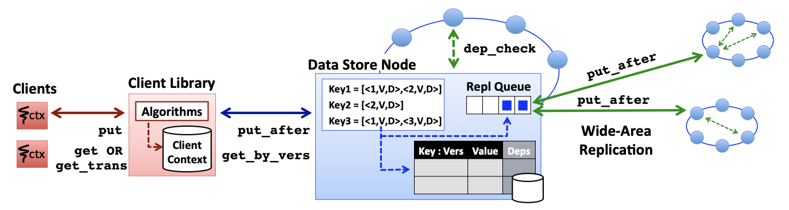

# [SOSP 2011] Don't Settle for Eventual: Scalable Causal Consistency for Wide-Area Storage with COPS

## Introduction

由于CAP的约束，绝大多数早期的web搜索系统都选择了AP而牺牲了一致性（web搜索中一致性不是那么重要），但是随着社交网络和交互式的系统出现，一致性也变得更加重要

**ALPS系统**（Availability, low Latency, Partition-tolerance, high Scalability）必须牺牲强一致性保证，但是实现尽可能强的一致性会对上层应用更友好，本文提出了满足ALPS约束的**带有冲突收敛的因果一致性模型causal+ consistency（causal consistency with convergent conflict handling）**，并基于这种模型设计了键值存储Clusters of Order-Preserving Servers, COPS

- **因果一致性 casual consistency**
  因果一致性是顺序一致性sequential consistency的弱化，顺序一致性中要求一定能按照发生的顺序看到所有操作的执行，而因果一致性**仅要求能按照发生的顺序看到有因果依赖操作的执行**而对无依赖的操作可以是任意顺序
  
  例如节点A发生了`1.上传图片 -> 2.保存图片 -> 3.返回图片引用`这三个操作（显然因果依赖），随后节点B在得到图片引用后一定能访问保存了的图片，因为一定按照`1->2->3`的顺序观测到操作的执行，而在常见的最终一致性eventual consistency下，B得到图片引用时去访问可能会发现不存在，需要经过一段时间，才能看到操作2保存的图片
- **冲突收敛 convergent conflict handling**
  确保数据的replicas不会永久出现分歧，最终相同key的数据会在所有replicas上收敛至完全相同的状态
  
  与因果一致性相结合后，确保了所有clients一定**只会看到不停按照顺序更新的数据 progressively newer versions of keys**，而在最终一致性下这些更新可能是乱序的

COPS系统在本地数据中心以线性一致性顺序执行所有put/get操作，以causal+的保证复制到其他数据中心，COPS提供多个独立数据对象之间的causal+保证（跨数据中心），而COPS-GT通过**get transaction**提供多个对象的一致快照（跨数据中心）

## ALPS Systems and Trade-offs

- Availability
- Low Latency
- Partition Tolerance
- High Scalability
- Stronger Consistency

## Causal+ Consistency

当操作之间有**潜在因果关系potential causality**时，采用 $\leadsto$ 标记，由以下情况来定义：

- **执行流 Execution Thread**：如果操作 $a, b$ **都在一个执行流**中，则 $a \leadsto b$ 代表 $a$ 在 $b$ 之前发生（**happens-before**）
- **依赖读 Gets From**：如果操作 $a$ 是写入put操作，操作 $b$ 是读取get操作**且读取了**被 $a$ 写入的数据，则 $a \leadsto b$ 代表 $b$ **依赖** $a$
- **传递性 Transitivity**：如果 $a \leadsto b$ 且 $b \leadsto c$ 则 $a \leadsto c$

例如下述操作体现了执行流：$get(y)=2 \leadsto put(x,4)$，依赖读：$put(y,2) \leadsto get(y)=2$，传递性：$put(y,2) \leadsto get(y)=2 \leadsto put(x,4)$

```text
Client 1: put(x,1) -> put(y,2) -> put(x,3)
                        |
                        v
Client 2:             get(y)=2 -> put(x,4) 
                                    |
                                    v
Client 3:                         get(x)=4 -> put(z,5)
```

### 1. 定义 Definition

- **因果一致性 causal consistency**
  [因果一致性](https://github.com/JasonYuchen/notes/blob/master/consistency/Strong_consistency_models.md#%E5%9B%A0%E6%9E%9C%E4%B8%80%E8%87%B4%E6%80%A7-causal-consistency)要求读取get操作返回的值一定**满足所有存在因果关系的操作构成的因果序**，即由 $\leadsto$ 定义的顺序

  例如上例中，由 $\leadsto$ 明确了因果顺序是 $put(x,1) \leadsto put(y,2) \leadsto put(x,4) \leadsto put(z,5)$，从而任意观测者也必须以 $get(x)=1$ 然后再 $get(x)=4$ 的顺序观测到 $x$ 的数据，如果先看到4后看到1就说明违背了因果一致性

  显然**因果一致性不对并发操作有任何约束**，并发操作即 $a \nrightarrow b$ 且 $b \nrightarrow a$，从而为提高并发操作的复制replication性能提供了可能，**没有因果依赖的操作可以以任意顺序可见而不需要一个串行化点serialization point**

  假如没有因果关系的两个或多个并发操作，都写入put了同一个数据，则称为**冲突conlict**
- **冲突收敛处理 convergent conflict handling**
  冲突的处理最终要求所有数据在所有副本上最终都收敛到完全相同，通常通过定义一个满足**结合性associative**和交**换性commutative**的处理函数 $h$ 来实现，**从而每个副本可以按照接收到数据的顺序处理**，即一个replica执行 $h(a,h(b,c))$ 与另一个replica执行 $h(c,h(b,a))$ 结果相同

  常见的冲突处理方式是**最终写者获胜last-writer-wins**（也叫Thomas's write rule），通过声明某一个写入为最终写入，从而所有replicas仅保留最终写入的数据

  另外也有由用户处理冲突、调用应用层的冲突处理程序等方式解决冲突

### 2. 对比其他一致性模型 Causal+ vs. Other Consistency Models

由强到弱的一致性模型主要有：

- 线性一致性 linearizability（强一致性 strong consistency，原子一致性 atomic consistency，外部一致性 external consistency）：要求全局实时有序
- 顺序一致性 sequential consistency：仅要求全局有序
- 因果一致性 causality consistency：要求因果依赖有序，属于部分有序
- FIFO一致性：仅要求单个执行流内有序，属于部分有序，跨执行流任意顺序
- per-key顺序一致性：对每个单独的key的操作有顺序一致性，多个key之间任意顺序
- 最终一致性 eventual consistency：任意顺序但最终一致，往往不同情况下的具体保证有差别

**causal+ consistency从一致性强弱的角度来说，位于顺序一致性和因果一致性之间**，并且已经证明了（CAP理论和low latency要求）ALPS系统不可能支持线性一致性和顺序一致性

### 3. Causal+ in COPS

COPS中采用**版本version**和**依赖dependency**来实现causal+一致性

COPS对version的分配满足：假如 $x_i \leadsto y_j$ 则 $i<j$ ，并且一个replica一旦返回了 $key_i$ 数据，则此后返回的 $key_j$ **或是同一个数据或是因果上更晚**的数据，即 $i \leqslant j$ （注意，对冲突数据的处理在因果上一定晚于出现冲突，先有冲突才有解决）

假如 $x_i \leadsto y_j$ 则 $x_i$ 一定在 $y_j$ 之前生效，即依赖关系dependencies，当且仅当 $put(x_i) \leadsto put(y_j)$ 时称 $y_j$ **依赖depends on** $x_i$ ，并且COPS在replicaiton时通过**先写入数据的所有dependencies后才写入其version**来实现causal+一致性

### 4. 可扩展的因果性 Scalable Causality

假如采用常见的将操作写入单个操作日志log，并且通过节点之间的log交换以及版本向量version vector来实现因果一致性，则要求**所有数据都能存储在一个单一的节点上**（才有可能在单个操作日志中串行化所有因果操作），从而是不可扩展的

COPS通过不同节点负责一部分数据，由整个系统来追踪存储在不同节点上所有操作之间的因果关系，来实现因果一致性，从而是可扩展的scalable，**依赖关系dependencies会被编码进与version相关的数据元信息metadata中**，从而当另一个数据中心收到数据时可以首先检查依赖关系

## System Design of COPS

### 1. 概览 Overview of COPS

COPS可以部署在多个数据中心上，每个数据中心内有一组节点即一个集群，存储了完整的数据（即**不同数据中心为replicas**），每个节点存储了一部分数据（即**同数据中心不同节点为shards**），应用程序通过client库与COPS通信，并且**只与local数据中心**进行通信



每个数据中心内的**local集群是线性一致性**的键值存储（数据被分为多个shards，每个shard由单个节点负责，每个client独立访问每个shards从而**由负责的是单节点保证了线性一致性**），跨数据中心的**replicaiton通过异步完成**降低数据中心内的延迟

### 2. 键值存储 The COPS Key-Value Store

在COPS中，每个元信息metadata是version，即`(key, val, version)`；在COPS-GT中是version+dependencies(其他keys以及相应的version)，即`(key, val, version, deps)`

在一个集群内通过**一致性散列consistent hashing将数据的keys分成多个shards**，每个shard可以由单个节点负责（为了容错，**每个shard采用了少量节点构成的[链式复制 chain replicaiton](CRAQ_Chain_Replication.md)**），所有client的操作在本地集群完成后就会立即返回

每当本地数据写入完成时，就会异步replicate到对应的远端节点，**远端节点会直到数据的依赖关系在远端集群内全部满足后才会提交修改**，这种等待依赖满足的设计实现了写入数据操作的跨集群因果一致性，并且读永远不会阻塞

### 3. 接口 Client Library and Interface

COPS内部采用**context来追踪所有操作的因果依赖关系**，当put/get时都会在context内部记录依赖关系从而可以生成依赖关系图

```python
# Alice's Photo Upload
ctx_id = createContext()
put(Photo, "xxx", ctx_id)
put(Album, "add &Photo", ctx_id)
deleteContext(ctx_id)

# Bob's Photo View
ctx_id = createContext()
"&Photo" = get(Album, ctx_id)
"xxx" = get(Photo, ctx_id)
deleteContext(ctx_id)
```


通过**隐式确认依赖关系**来减少每次commit时需要检查的依赖关系复杂度，例如图中 $w_1 \leadsto x_3 \leadsto y_1$ ，假如当前要commit $y_1$ 而 $x_3$ 已经committed了，则认为 $w_1$ 已经被隐式commit了，不需要再commit一次，同样的对于 $z_4$ 依赖了 $t_2$ 和 $v_6$ 而 $t_2$ 可以被 $v_6$ 隐式commit，每次写入数据**只需要commit最近的依赖nearest deps**即可

在COPS-GT中客户端需要存储`(key, version, deps)`表并通过垃圾回收机制回收不再被需要的依赖关系，保存**完整的历史依赖关系是为了get transaction提供一组数据的一致性快照**；在COPS中由于只需要保证每个单独数据的因果一致性，因此只需要存储`(key, version)`表即可，不会存储任何依赖关系

### 4. 写入 Writing Values in COPS and COPS-GT

COPS的写入均是**写入本地集群**，随后通过跨数据中心**replication扩散到其他数据中心**

1. **写入本地集群**
   - 当client发起写入时，**同步调用**`put(key, val, ctx_id)`时，即每个client只能有一个在执行的`put`操作因为每个`put`需要相应key的当前version
   - 由client library计算出完整的依赖关系，并且找出其中属于**最近nearest依赖关系**的，随后调用`<bool,ver> = put_after(key, val, [deps], nearest, ver=null)`（若是COPS-GT则会有`deps`参数）并且会返回相应key的version以供后续`put`使用
   - 在集群内提供线性一致性因此每个数据在commit时其依赖已经确定写入了
   - version采用**Lamport timestamp**的方式分配，version的高位是Lamport timestamp，低位是node uid，因此**每个key的所有写入操作可以构成一个全局顺序single global order**，从而实现了最后写者获胜last writer win的冲突解决函数
2. **复制到远端集群**
   - 当写入在**本地集群commit后，就会异步复制**到其他集群，并且replicate时调用的`<bool,ver> = put_after(key, val, [deps], nearest, ver)`包含了该数据的version
   - `put_after`操作只会在对应数据的**所有依赖关系`deps`都写入之后才在该集群commit**，每当集群收到`put_after`操作时都采用`bool = dep_check(key, ver)`检查**最近依赖关系**是否在本地已经完全满足（只检查最近依赖是**隐式commit优化**）

### 5. 读取 Reading Values in COPS

读取只需要本地集群提供服务即可，通过调用`val = get(key, ctx_id)`，随后client library会调用`<val,ver,deps> = get_by_version(key,ver=LATEST)`，在收到结果后就会**将结果的`<key,ver[,deps]>`加入context中**从而满足后续操作的因果一致性

在COPS中，`ver=LATEST`来返回最新的数据，而在COPS-GT中可以指定`ver`从而获取某个历史数据构成一致性快照

### 6. 事务 Get Transactions in COPS-GT

单个key的读取操作满足因果一致性但多个keys的读取操作可能会返回不同时刻的数据，从而**整体不一定满足因果一致性**

COPS-GT通过提供**get transaction来实现读取某一历史时刻的一致性快照**，参考实现如下：

```python
def get_trans(keys, ctx_id):
  # 1st round: get keys in parallel
  for k in keys:
    results[k] = get_by_version(k, LATEST)
  
  # calculate causally correct versions, ccv
  for k in keys:
    ccv[k] = max(ccv[k], results[k].version)
    for dep in results[k].dependencies:
      if dep.key in keys:
        ccv[dep.key] = max(ccv[dep.key], dep.version)
  
  # 2nd round: get needed ccvs in parallel
  for k in keys:
    if ccv[k] > results[k].version:
      results[k] = get_by_version(k, ccv[k])
  
  # update metadata stored in the context
  update_context(results, ctx_id)

  return extract_values(results)
```

- 对每个返回的key需要检查其依赖并计算正确的版本，如果依赖的keys也存在于此次get transaction中，则要**确保key的版本不能比其依赖的版本要旧**，而对于依赖的keys不存在于此次get transaction中的则已经被满足了因果一致性
- 对版本有问题的keys（版本比依赖keys的版本旧）发起第二次获取数据，并**附带满足条件的版本信息（从依赖的所有keys中看到的最新的version）**
- get transaction相当于提供了第一次返回的所有keys及其依赖keys下所有可见的最大version时刻的数据一致性快照
- **第二轮**的获取数据由于需要的version已经可见，因此一定能够**在当前集群立即获得数据**（集群仅在key的所有依赖keys已经写入的情况下才commit并可见）
- **第二轮**通过`ccv`提供第一轮中已知的依赖关系和version，而**不是直接采用`ver=LATEST`从而避免了引入新的依赖关系**，因为第一轮的`ccv`已经获取了完整的依赖关系，如果采用`ver=LATEST`很有可能引入并发写入的其他新依赖，导致第二轮依然因果不一致

## Garbage, Faults, Conflicts

### 1. 垃圾回收 Garbage Collection Subsystem

`TODO`

### 2. 容错 Fault Tolerance

- client错误
  COPS的接口设计要求每个client的所有请求都被COPS独立处理，因此client相互不干涉，并且由于因果一致性和追踪依赖关系，即使client宕机也不会引起数据不一致违背因果关系
- 集群节点错误
  集群可以采用任何满足线性一致性的底层设计，例如链式复制chain replication，因此集群节点宕机由线性一致性底层来容错
- 数据中心错误
  COPS支持分区容错，因此整个数据中心宕机也不会影响其余集群的正常运行，但是如果是当前正在宕机集群的**队列中等待异步扩散到其他集群的数据修改就会不可避免的丢失**

  如果**只是网络分区，修改不会丢失，只是会被延迟到分区问题被解决**，并且基于每个client只固定与某个集群通信的模型，不会出现违背因果一致性的读写

### 3. 冲突检测 Conflict Detection

当出现并发写入同一个key的情况发生时，就会出现冲突，COPS采用**对比version的方式来保留version更新的数据**，即最后写者获胜last writer win的方式进行冲突解决
