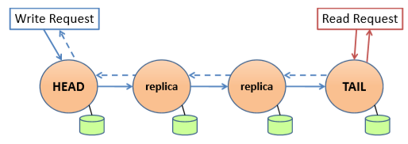
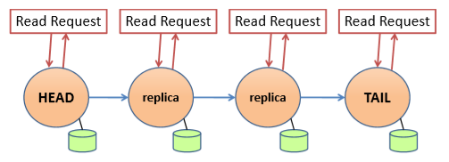
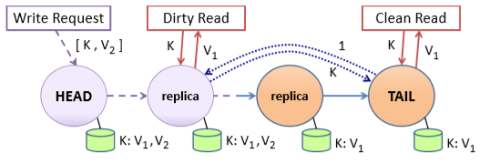
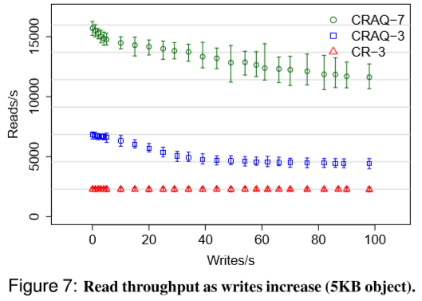

# [ATC 2009] Object Storage on CRAQ - High-throughput chain replication for read-mostly workloads

## 简介 Introduction

Chain Replication with Apportioned Quieries, CRAQ

基于**链式复制Chain Replication保证强一致性**，通过将**查询分配给链上所有节点**而不是尾节点来提供高吞吐量

## 基本系统模型 Basic System Model

### 1. 接口和一致性模型 Interface and Consistency Model

对象存储系统提供两种基本接口：

- write(objID, V)
- V <- read(objID)

对于每个独立的对象，我们考虑两种一致性模型：

- **强一致性 Strong Consistency**
    CRAQ保证对任意单个对象的读取和写入是按某一个顺序执行的，读取总能获取最新的值
- **最终一致性 Eventual Consistency**
    对于在非尾节点的读取是最终一致性的，假如写还未扩散到读的节点，则读可能返回过时的数据，但是依然保证最终所有节点被写入从而读能保证最终一致性；同时在**同一个节点的读取始终保证单调一致性读monotonic read consistency**

### 2. 链式复制 Chain Replication

链式复制Chain Replication, CR通过在链式节点上复制，仅在头节点head写入，仅在尾节点tail读取，从而提供强一致性的保证，所有节点通过[Distributed Hash Table, DHT](https://en.wikipedia.org/wiki/Distributed_hash_table)来管理

当写入扩散到tail时，所有节点都已写入，此时写入被认为已提交committed并且会返回给写入的client（CR原论文中由tail返回给client，而CRAQ中由收到了tail ACK的head返回给client），此后client进行读只会读到已提交的写入

### 3. 链式复制与分配的查询 Chain Replication with Apportioned Queries

CRAQ通过放宽CR只能在tail上进行读的限制，分配读请求到所有节点，从而提高系统在read-mostly系统下的吞吐量和表现，原理如下（对每一个节点而言行为如下）：

- 可以存储一个对象的**多个版本**，版本通过单调递增的版本号version number以及该版本是否是脏数据clean or dirty来维护，所有版本初始都是clean
- 收到某个对象新版本的写入时（从前序节点扩散）将新版本链接到该对象的版本链上version list，并且：
  - 若该节点非tail，则标记该新版本为**dirty并且继续写入后序节点**
  - 若该节点为tail，则标记该新版本为**clean并commit**写入，并且**广播ACK给所有节点**该写入被commit
- 收到某个对象某个写入的ACK时，标记对应的版本为**clean并删除版本链上所有前序版本**
- 收到某个对象的读请求时：
  - 如果节点有该对象，并且**最新的版本是clean，即响应**请求返回该对象，每个节点都能响应clean对象的读请求如图：
    
  - 所有其他情况，节点**访问tail并获取最后提交的版本号last committed version**，返回该版本号对应的对象（注意，**tail返回版本号的同时可能commit了更新的版本，但这不违背强一致性**，因为读写依然都是通过tail序列化的）dirty对象的读请求通过**tail进行序列化**如图：
    

注意，由于clean read是各节点并发处理的，因此CRAQ仅**保证r/w，w/r，w/w的顺序关系，不保证r/r的顺序关系**

由于一旦收到ACK请求就会立即删除对应版本之前的所有版本，因此当中间节点发现某个对象的**版本链上只有一个版本时，即该对象是隐式clean，否则该对象就是dirty**，并需要访问tail获得committed的版本号

CRAQ在以下两种场景中的吞吐量优于CR：

- **Read-Mostly**：大量读请求可以额外被非tail节点处理，吞吐量与节点长度可以线性扩展
- **Write-Heavy**：读请求依赖tail节点处理（访问版本号），但是访问版本号的请求处理更快更容易并发，同时读请求本身还是由非tail节点处理，从而依然可能比CR更快

### 4. CRAQ的一致性模型 Consistency Models on CRAQ

除了默认的与CR相同的强一致性支持外，CRAQ提供可选的不同级别的**读一致性保证**：

- **最终一致性 Eventual Consistency**：允许直接读到最新的值即使没有commit，在同一个节点上连续的读是单调的monotonic read，而跨节点的读不保证单调性，但是所有节点上的读最终都能读到一样的值
- **有限不一致程度的最终一致性Eventual Consistency with Maximum-Bounded Inconsistency**：允许直接读到最新写入还未commit的对象，但是**受时间或是版本号的限制，比如只允许读到至多committed+3版本号的数据**，因此这个级别下可以确保读到的对象的不一致程度有限（maximum inconsistency period），但是当出现网络分区时，也可能读到比committed版本更久的数据

### 5. CRAQ故障恢复 Failure Recovery in CRAQ

CRAQ采用了CR的故障恢复模型，每个节点都必须知道自身的前序节点predecessor和后序节点successor，当head宕机时successor继任成为head，当tail宕机时predecessor继任成为tail

CRAQ额外放宽了节点加入的限制（CR仅允许在tail之后之间加入新节点），允许直接加入新节点在任意位置，但同时也对故障恢复过程有一定修改，引入了**前向传播数据back-propagation**的要求，具体见[成员变更的实现](#3-成员变更-handling-memberships-changes)

## Scaling CRAQ

采用不同的链配置策略（链的长度、是否跨数据中心、服务发现与协调等）以迎合不同应用的需求

`TODO`

### 1. 链的放置策略 Chain Placement Strategies
### 2. 数据中心内的CRAQ
### 3. 跨数据中心的CRAQ
### 4. ZooKeeper协调服务 ZooKeeper Coordination Service

## 扩展 Extensions

### 1. 微事务 Mini-Transactions on CRAQ

- Single-Key操作：CRAQ已经提供了简单的操作
  - `Prepend/Append`：head直接修改最新的版本数据并replicate即可
  - `Increment/Decrement`：head直接修改最新的版本数据并replicate即可
  - `Test-and-set`：head检查最新的committed版本号是否匹配，若匹配就set并replicate，若有dirty的uncommitted数据就直接拒绝由client重试
- Single-Chain操作：
    微事务定义为一组`compare, read, write`集合，当**一组对象共享相同`chainid`的就会被分配给同一个节点作为这组对象的head**，由head对这组对象进行操作，head来控制事务涉及数据的提交，唯一影响写吞吐量的可能是head需要等待这组对象中某些dirty对象变为clean才能进行事务操作
- Multi-Chain操作：
    多组对象进行事务处理时，也仅需要每组对象对应的head参与即可，而不需要所有链上节点参与，所有heads参与进行2PC即可

### 2. 使用多播降低写延迟 Lowering Write Latency with Multicast

对于较大的对象或是较长的链，CRAQ可以采用多播来加快全链路写入，减少按链传递并ACK带来的延迟，此时head只需要扩散少量元数据对全链路的写入进行控制即可

## 管理和实现 Management and Implementation

### 1. 集成ZooKeeper

通过ZooKeeper来维护链的成员信息，具体使用方式见原文

`TODO`

### 2. 链节点功能 Chain Node Functionality

节点加入系统时，会生成一个随即识别号random identifier，从而确定自己在DHT上的位置，并通过DHT环来找到自己的predecessor和successor

### 3. 成员变更 Handling Memberships Changes

在CR的描述中，由于新节点总是加在tail后，因此在中间出现故障节点时仅需跳过该节点，tail后加入新tail时仅需旧tail将自身数据全部扩散给新tail，故障恢复和成员变更模式都更为简单

CRAQ允许在任意位置引入新节点，包括新节点作为head，因此引入了**反向传播back-propagation**的模式作为故障恢复的一部分，当加入新节点时，该节点需要接收predecessor的数据（forward）和successor的数据（backward）来保证正确性，在此期间将停止对client的服务

## 评估 Evaluation

见原文，简要如下图：

