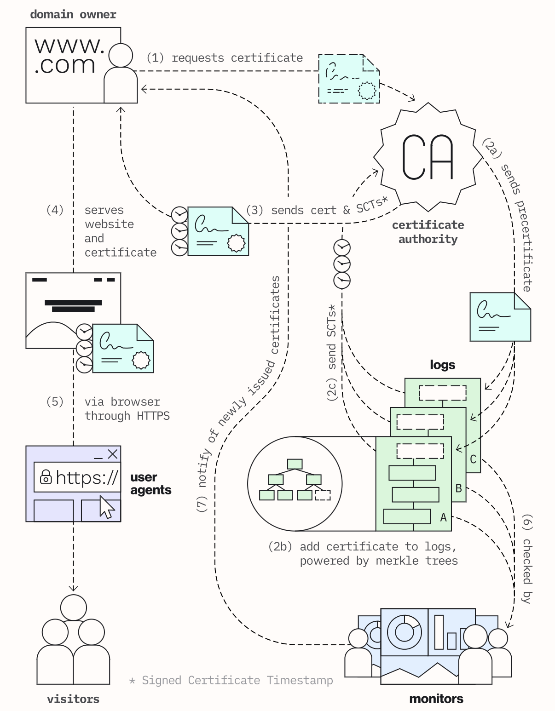
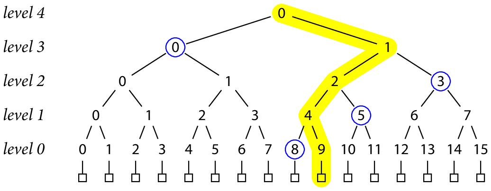
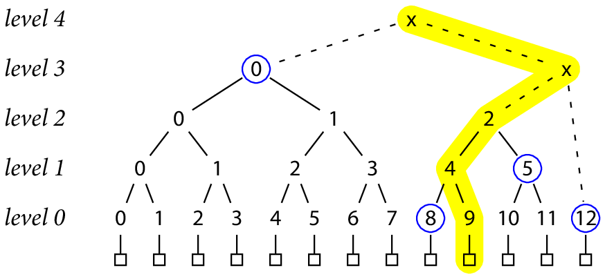
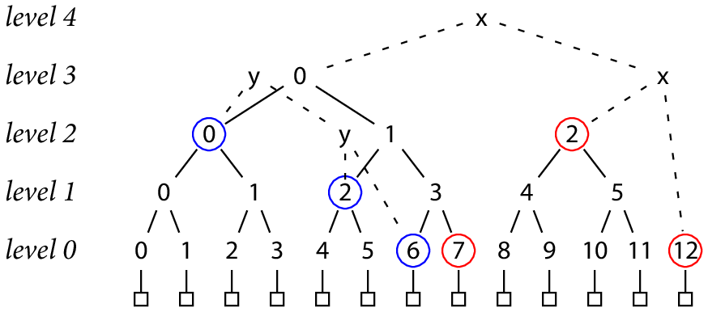

# Certificate Transparency

## What is Certificate Transparency, CT ?

**Certificate Transparency, CT**是一个生态系统，用于提供**更透明transparent**和**可验证verifiable**的website证书分发

- **证书、加密和安全通信** Certificates, encryption, and secure communication
  CT属于Web Public Key Infrasturcture, Web PKI生态的一部分，Web PKI包含了web基于TLS进行安全通信所需要的证书分发和验证的所有组件
- **证书授权机构的重要作用** Certificate Authorities, CAs play an important role
  证书由证书授权机构Certificate Authorities进行分发，将公钥与域名绑定，从而用户（浏览器）就可以通过CA分发的证书来确认所访问的域名是受到加密保护的，并且域名的所有者是受CA认证的
- **不可信授权机构** What if a CA can't be trusted?
  可见信任体系的顶端就是CA，假如CA自身被攻击而分发了恶意证书，则虽然浏览器与域名的通信依然是加密的，但是域名及其所有者本身就是恶意的，从而导致用户数据有安全风险
- **谁来监管授权机构** Who watches the watchers?
  由于历史原因，浏览器通过可信的第三方来确认CA是否值得信任，但这种方式并不安全（只是早期为了可操作性等原因）**CA被恶意攻击后分发了恶意证书**，可能会出现相当长的延迟后CA才能响应，从而大量用户已经暴露在了风险之中

可见CA本身依然也会带来风险，因此**CT带来了新的信任体系**

- **独立可信的日志** Independent, reliable logs
  CT依赖独立可信的日志，日志是一个基于**Merkle树**的分布式生态系统，**公开可验证publicly verifiable、只追加append-only、防伪造tamper-proof**
- **日志公开且被监控** Logs are publicly available and monitorer
  域名所有者、浏览器、学术机构及任何人都可以分析和监控日志，可以检查在什么时候哪个CA对哪个站点分发了哪个证书
  
  > which CAs have issued which certificates, when, and for which domains
- **运行CT日志来保护网页** Protect the web by running a CT log
  CT的日志依赖大量不同的机构在不同的地点稳健的运行日志系统

## How CT works ?



1. **Website owner requests a certificate from the CA**
   域名所有者首先向CA发起申请证书certificate的请求，证书将域名和公钥相绑定
2. **CA issues a precertificate**
   CA收到请求后检查域名所有者的权限，随后分发一个预先证书precertificate（预先证书与正式证书包含的有效内容完全一样，同时额外包含了标志要求用户不接受该预先证书），预先证书是因为**正式证书需要一个签名时间戳Signed Certificate Timestamp, SCT，而时间戳是通过将证书追加给log才能获得，因此后续正式证书包含的SCT实际上是预先证书提交给log获得的**，预先证书仅是为了SCT
3. **CA sends precertificates to logs**
   CA将预先证书提交给log并获得SCT（实际上任何人都可以向log提交证书，但通常是CA来完成）
4. **Precertificates are added to the logs**
   logs维护了一系列证书，采用**Merkle树加密**，只允许追加**append-only**并且允许任何人发起证书查询**publicly auditable**

   Merkle树是一种二叉树，叶节点是已经被添加进log的**证书的散列值**，非叶节点是两个**子节点的散列值**，log服务器会周期性的将所有新的证书构造成一棵Merkle树，并且将新Merkle树和旧Merkle树合并，根节点的散列值会被**log服务器的私钥加密签名后生成Signed Tree Head, STH**进行分发
5. **Logs return SCTs to the CA**
   log会立即返回SCT给CA，以及一个最长时间保证Maximum Merge Delay, 代表**MMD内可以确保证书被合并进Merkle树**，MMD通常是24小时

   CA收到SCT后，使用X.509v3扩展将SCT追加到证书上
6. **CAs send the certificate to the domain owner**
   CA将带有SCT的证书发送给域名所有者，对应的网页服务器必须在一次TLS握手就将证书连带SCT发送给用户
7. **Browsers and user agents help keep the web secure**
   浏览器和代理可以额外帮助增强安全性，每一次访问log都会主动检验log本身的可信度
8. **Logs are cryptographically monitored**
   log可以被公开监测，即monitors会周期性与所有log服务器通信来检查可疑证书
   - 对于log的一致性，一个新log的version包含了其前version的所有信息，从而monitor可以生成一个**consistency proof**进行一致性校验
   - 对于证书是否存在，monitor可以生成一个对应证书的**audit proof**并进行校验该证书是否存在于log中

## Transparent Logs for Skeptical Clients

Transparent Logs的属性：

- 对任意一个位于长度N的log中的特定记录R，可以生成一个长度O(lgN)的验证来**验证R是否存在于log中**
- 对任意早期的log，可以生成一个长度O(lgN)的验证来**验证该早期log是否是当前log的前缀**
- 任意观察者可以高效的**在log中迭代观察每一个记录**

### 1. 密码散列、验证和提交 Cryptographic Hashes, Authentication, and Commitments

一个密码散列函数是一个确定性的函数`H`，能够将任意长度的消息`M`映射到固定输出长度的散列值`H(M)`，并且在现实中不可能简单构造出`M1 != M2`但是`H(M1) = H(M2)`的消息`M1`和`M2`，目前主流使用的`SHA-256`被认为满足要求（也许未来的某一天会被破解）

任意文件都可以通过预先给定的散列值以及密码散列函数进行散列对比结果来验证，但是这需要对整个文件进行散列，通过**Merkle树可以实现大文件的分部分校验**，每一部分的散列值作为Merkle树的叶节点即可

### 2. Merkle Trees

一个Merkle树由N个记录构造而成，N是2的幂次，算法如下

1. 首先对每个记录都进行散列，产生N个散列值
2. 每一对散列值再进行一次散列，产生N/2个新散列值，重复直到最终生成1个新散列值
3. 从而每一轮散列都构造了Merkle树的一层，从叶子层向上到根节点，每个非叶节点都是其两个子节点产生的散列值，叶节点就是每条实际记录产生的散列值

    ```text
    h(0, K) = H(record K)
    h(L+1, K) = H(h(L, 2K), h(L, 2K+1))
    ```

假如对一个有16个记录的Merkle树，验证某一段数据B是否就是第9个记录（`RecordProof(R, N)`），可以如下实现：



```text
T = h(4, 0)
  = H(h(3, 0), h(3, 1))
  = H(h(3, 0), H(H(h(1, 4), h(1, 5)), h(2, 3)))
  = H(h(3, 0), H(H(H(h(0, 8), h(0, 9)), h(1, 5)), h(2, 3)))
  = H(h(3, 0), H(H(H(h(0, 8), H(record 9)), h(1, 5)), h(2, 3)))
  = H(h(3, 0), H(H(H(h(0, 8), H(B)), h(1, 5)), h(2, 3)))
```

即只需要根节点的散列值T，给定的B以及`h(3, 0), h(0, 8), h(1, 5), h(2, 3)`就可以判定B是否就是第9个记录，且显然对于任意记录，在**每一层需要一个节点辅助**，从而一共需要O(lgN)的辅助节点，**所谓的Proof就是这些特定散列值，用户根据记录的散列值+Proof的散列值是否可以向上生成根节点散列值**

> 对应属性一：生成一个长度O(lgN)的验证来**验证R是否存在于log中**

### 3. A Merkle Tree-Structured Log

为了允许非2的幂次个记录来构造Merkle树，可以采用**将多个独立的完整（满足2的幂次）Merkle树连接起来**，例如13个记录可以是`13=8+4+1`由3棵Merkle树连接而成，例如：



给定一棵Merkle树的状态T和T'，验证T是否是T'的前缀，例如下图中y虚线连接的是T，x虚线连接的是T'，验证T的7个记录是否也被包含在T'中（即前缀，`TreeProof(N, N')`）：



```text
T = H(h(2, 0), H(h(1, 2), h(0, 6)))

T' = H(h(3, 0), H(h(2, 2), h(0, 12)))
   = H(H(h(2, 0), h(2, 1)), H(h(2, 2), h(0, 12)))
   = H(H(h(2, 0), H(h(1, 2), h(1, 3))), H(h(2, 2), h(0, 12)))
   = H(H(h(2, 0), H(h(1, 2), H(h(0, 6), h(0, 7)))), H(h(2, 2), h(0, 12)))
```

即T中采用`h(2, 0), h(1, 2), h(0, 6)`可以计算出原Merkel树根节点的散列值，在新Merkle树中**额外再搭配**上`h(0, 7), h(2, 2), h(0, 12)`就可以计算出新Merkel树根节点的散列值，假如**原Merkel树计算出的根散列值与T相等，新Merkel树计算出的根散列值与T'相等**，则T就是T‘的前缀

> 对应属性二：可以生成一个长度O(lgN)的验证来**验证该早期log是否是当前log的前缀**

### 4. 日志存储 Storing a Log

一种方式是log分为一对append-only的文件进行存储，第一个文件存储记录的数据record data，第二个文件存储索引序列record index从而可以**使用索引访问第一个文件中的任意记录**，但是这种存储方式在计算包含N个记录的Merkle树的散列值时就**需要重新计算所有散列值**，从属性二可以看出前缀版本的Merkle树的节点散列值随着新记录的加入并不会改变，从而**保存预先计算好的散列值**可以更高效的访问任意一个节点的散列值

改进方法是在上述data/index文件外进一步维护lgN个append-only的文件，**每个文件存储Merkle树的一层节点的散列值**，散列值是固定大小的，从而也可以随机访问任意节点的散列值，由属性二可知随着新Merkle树的合并进入并不改变文件中保存的前缀Merkel树节点的数据

加入新记录的流程如下：

1. 将记录append到record data file
2. 将记录在record data file的位置append到record index file
3. 将记录的散列值append到level-0 hash file
4. 若在level-0 hash file完成了一对新的散列值，从而可以计算出散列值append到level-1 hash file，逐层向上
5. 若达到了根节点完成了一对新的散列值，就可以生成新的level文件

### 5. 日志服务 Serving a Log

日志服务必须能够提供下述服务，以供订阅者查询指定的记录是否存在、早期的log是否是当前log的前缀：

- `Latest()`：返回当前log的大小和顶层的散列值（被log服务器私钥加密为Signed Tree Header, STH，从而只要能用该log服务器公钥解密的STH就一定是该log服务器产生的，不可抵赖**non-repudiation**）
- `RecordProof(R, N)`：返回判断记录R是否在N中的proof
- `TreeProof(N, N')`：返回N是否是N'前缀的proof
- `Lookup(K)`：查询K对应的记录R的索引
- `Data(R)`：获得记录R的数据

### 6. 日志验证 Verifying a Log

用户通过`Latest(), RecordProof(R, N), TreeProof(N, N')`在本地维护一个缓存的log，并且可以验证服务端并没有删除任何记录：

1. 客户端缓存一个log，对应大小N和顶层散列值T，当收到服务器新的数据B以及代表记录R的编号时
2. 如果编号大于当前缓存log的大小时，先进行获取新的log作为缓存，验证已经缓存的log是新获取的log的前缀后才替换缓存
3. 判断数据B对应的记录R是否存在于缓存log中
4. 接受B作为新纪录R

```python
validate (bits B as record R):
    if R >= cached.N:
        N, T = server.Latest()
        if server.TreeProof(cached.N, N) cannot be verified:
            fail loudly
        cached.N, cached.T = N, T
    if server.RecordProof(R, cached.N) cannot be verified using B:
        fail loudly
    accept B as record R
```
