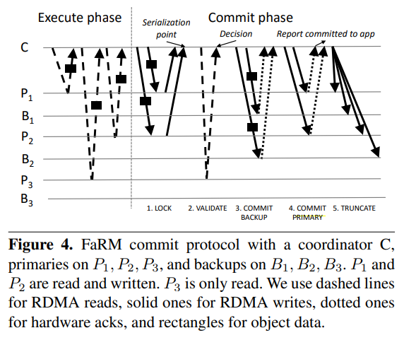

# [SOSP 2015] No compromises: distributed transactions with consistency, availability, and performance

## 简介 Introduction

**FaRM是基于内存的分布式计算平台**，提供严格可串行化strict serializability、高可用high availability、高吞吐highthroughput、低延迟low latency的分布式ACID事务

FaRM在设计上考虑了现在的新硬件：

- **带有[RDMA](https://en.wikipedia.org/wiki/Remote_direct_memory_access)的网络**
- **non-volatile DRAM**：通过电池持续供电，当电源故障时，将DRAM的内容完全转储到SSD中，从而实现非易变内存

由于这两种方式分别减轻了storage和network的负载，但是都增了CPU的负载，因此FaRM额外通过三种原则来减轻CPU的负载：

- 减少消息数量 reduing message counts
- 使用单侧RDMA读写 using one-sided RDMA read/write instead of messages
- 充分挖掘并行性 exploiting parallelism effectively

FaRM支持数据分布在多个服务器上，并且事务支持涉及任意多的服务器，事务的**coordinator不会复制**，而**数据分区通过vertical Paxos进行primary-backup复制**

FaRM的事务采用**乐观并发控制optimistic concurrency control**并且是**四阶段提交**协议（lock，validation，commit backup，commit primary）

## 硬件发展 Hardware trends

### 1. Non-volatile DRAM

采用锂电池作为distributed uninterruptible power supply, UPS供电，当电源故障时将内存完全存储到磁盘中，从而既在常规操作中避免了对磁盘的同步写入延迟，又减少了SSD的寿命损耗，仅在电源故障时一次性写入

采用这种方式实现的non-volatile DRAM, NVRAM在成本上远优于原生的非易变内存NVDIMMs

### 2. RDMA networking

## 编程模型和架构 Programming model and architecture

FaRM提供**全局内存空间抽象global address space abstraction**给应用程序，底层实际上分布在多个服务器上从而应用程序对对象实际存储位置是无感知的，一个应用程序可以在任意时刻**启动事务（自身变为coordinator）**并在执行结束时进行提交commit，期间所有**写入都会缓存在本地**（乐观并发控制）并仅在成功commit时才对外可见

如下图是拥有四台服务器的FaRM实例的架构示意图：

- **事务执行**
  - **单个对象的read保证原子性**，并且只会读取到已提交的数据（read committed），事务内连续对同一个对象的读一定返回相同的数据（repeatable read）
  - **多个对象的read不保证原子性**，而如果出现对多个对象的read返回了不同事务提交的结果（该事务执行期间，其他事务修改了一部分数据并且提交）则该**事务的[提交会被拒绝](#1-事务执行)，从而保证了可串行性**（Spanner通过一个事务内一定读取同一版本数据的快照隔离保证可串行性）
  - 单个对象的只读事务被优化可以达到lock-free并且提供位置提示locality hint，从而应用层可以主动将通常需要一起访问的数据放在一台服务器上co-locate

- **成员配置处理**
  当出现宕机或新服务器加入时，FaRM会处理一条**configuration日志，包含四元组`(i, S, F, CM)`**
  - `i`代表64bit单调递增的唯一ID标识这条configuration
  - `S`代表此configuration的一组服务器
  - `F`代表了服务器到[故障域failure domain](https://en.wikipedia.org/wiki/Failure_domain)的映射（故障域允许单独失效而不影响其他故障域）
  - `CM`代表configuration manager并也是`S`中的一台服务器

  FaRM依赖外部服务Zookeeper进行configuration的存储和共识，而configuration manager `CM`负责管理租约lease、故障检测detect failures，协调恢复coordinate recovery

- **备份**
  FaRM提供的内存空间被划分为2GB的regions，每个regions通过primary-backup备份，由**1个primary replica和f个backup replicas**组成，region到replicas的映射关系由`CM`维护
  
  每个对象都带有一个版本号version number用于并发控制，**read时都会通过primary replica**（本地读取或RDMA读取）

  当需要分配新的region时，`CM`首先分配一个单调递增的ID，并且基于**负载均衡的原则**挑选节点用于存储该region的replicas，每个**replica需要位于不同的故障域**，同时replica也会参考**局部性原理locality constraint**与亲和度高的数据就近存储，随后通过**2PC协议**与所有被挑选的节点通信并达成配置更新

- **消息传递**
  每个节点都使用环形缓冲区ring buffers实现了FIFO队列，用于消息传递，当sender需要发送消息时，就通过RDMA直接写入到receiver的队列末尾，并且由网卡NIC直接确认而不需要引入receiver的CPU处理

## 分布式事务和副本 Distributed transactions and replication

### 1. 事务执行

FaRM中，**事务日志transacton logs和数据data都会通过primary-backup的方式备份**，而coordinator不会进行备份，并且事务采用**带读验证的乐观并发控制**optimistic concurrency control with read validation

在执行事务时，coordinator首先采用单侧RDMA**从primary上读取对象**（如果对象在本地就直接访问内存），并将**写入缓存在本地，同时也会记录对象的地址和版本信息**，当执行结束时就按照如下流程进行事务提交：

1. **Lock**
   协调者在每个**write对象所在的primary**上写入一条`LOCK`日志，包含版本、write的新数据和所有本次write涉及到regions列表

   Primary通过`LOCK`日志，对指定版本的对象进行加锁，并将是否全部成功汇报给协调者，若**对象被其他事务加锁、或是先前已经read的对象此时版本出现了变化**（乐观锁）就会失败协调者就会写入`ABORT`日志给所有primary并返回错误给应用程序
2. **Validate**
   除了加锁时的确认，在全部加锁成功后，协调者还会额外对全部**此前read-only的对象进行版本确认**（直接RDMA读primaries），如果任意对象版本不符（事务中间有其他事务commit）或是发现正被加锁（可能冲突的事务正在运行），事务就会失败
3. **Commit backup**
   协调者在每个涉及的backup上写入一条`COMMIT-BACKUP`日志并等待所有NICs确认，`COMMIT-BACKUP`与`LOCK`携带数据相同
4. **Commit primary**
   `COMMIT-BACKUP`都确认后，协调者在每个涉及的primary上写入`COMMIT-PRIMARY`日志并等待NIC确认，仅需一个primary的NIC确认就可以回复应用层，所有primaries在处理时都进行对象数据更新、版本号增加释放锁
5. **Truncate**
   primaries和backups都一致保持日志记录直到被截断，**协调者会在收到所有primaries的确认后懒惰进行primaries和backups日志的截断**，primaries在处理`COMMIT-PRIMARY`时即进行数据更新等操作，而**backups在日志截断时才会进行数据更新等操作**

|Log Record Type|Contents|
|:-|:-|
|`LOCK`|TID, IDs of all regions with objects written by the transaction, and addresses, versions, and values of all objects written by the transaction that the destination is primary for|
|`COMMIT-BACKUP`|same as `LOCK`|
|`COMMIT-PRIMAR`Y|TID to commit|
|`ABORT`|TID to abort|
|`TRUNCATE`|low bound TID for non-truncated transactions and TIDs to truncate|

### 2. 正确性 Correctness

已提交的读写事务的序列化点就是commit过程中**所有锁被成功获得的时刻**，已提交的只读事务的序列化点就是执行过程中的**最后一次read的时刻**，从而所有事务都可以根据上述两个时间点进行序列化（类似Spanner根据commit timestamp进行事务的序列化），没有错误发生时事务可以认为是**在相应的序列化点被原子执行**的，而序列化点是全局有序的，并且每个**序列化点一定在对应事务的开始invocation和完成completion中间的某一刻**，即满足[线性一致性](https://github.com/JasonYuchen/notes/blob/master/consistency/Strong_consistency_models.md#%E7%BA%BF%E6%80%A7%E4%B8%80%E8%87%B4%E6%80%A7-linearizability)

- **需要等待所有`COMMIT_BACKUP`的ACK**：假如对region r的某个backup b的ACK返回之前就继续执行后续的事务，后续一旦**除了backup b以外的replicas出错**就有可能会丢失数据，因为primary上已经有了数据（Lock阶段发送），但**backup b可能未收到`COMMIT_BACKUP`，从而region r丢失了事务的修改**
- **只需要等待一个`COMMIT_PRIMARY`的ACK**：由于日志和数据已经到达所有replicas，但是事务commit的消息（**隐含Read Validate成功**）必须至少有一个primary进行存储，否则如果协调者宕机，只有Lock的状态能够在故障后维持，而Read Validate是否成功未知从而事务必须回滚，因此在返回应用程序前至少需要等待一个`COMMIT_PRIMARY`的ACK

### 3. 性能 Performance

- **Spanner**
  Spanner中采用了Paxos复制状态机的方式对两阶段协议2PC的数据和日志进行复制备份，从而`2f+1`可以容忍`f`出错，相应的每次操作就需要至少`2f+1`个RTT，从而一次2PC协议就需要`4 * participants_num * (2f+1)`个RTT

- **FaRM**
  FaRM采用了primary-backup的方式，仅需`f+1`就可以容忍`f`出错，从而显著减少了传递消息的数量，并且不复制协调者的状态从而进一步降低了延迟
  
  在事务的commit阶段，**采用`Pw * (f + 3)`次单侧RDMA写入**（`Pw`为此次事务read/write的primaries所在服务器数量，`3`指Lock阶段两次以及Commit Primary一次）**加上`Pr * 1`次单侧RDMA读取**（`Pr`为此次事务read-only的primaries所在服务器数量，`1`指Validate阶段单次读取但有往返延迟）

## 故障恢复 Failure recovery

- **可靠性durability**：committed事务即使整个集群宕机也不会丢失数据，所有committed状态都可以从NVRAM中恢复，并且也可以容忍`f`个副本数据永久丢失
- **可用性availability**：网络分区但有一个分区包含了集群majorit或集群minority节点故障的情况下依然可用

FaRM的故障恢复包含以下五个阶段

### 1. 故障检测 Failure detection

FaRM中除了`CM`以外的每一台服务器都在`CM`上持有一个租约lease来检测故障，任意一个lease过期都会触发故障恢复，而为了提供足够快的容错，lease的时间往往非常短（类似Raft中的心跳），并且在经过每1/5过期时间就会尝试更新lease，避免lease更新数据丢失导致的假警报

### 2. 成员变更 Reconfiguration

当一个节点由于配置更新不再属于集群时，所存储的对象就不应该再被修改，否则就可能违背一致性保证，通常可以通过检查lease是否过期来确定节点是否有效，从而**在lease过期时可以拒绝请求**

在FaRM中，由于read请求都是通过RDMA进行的，绕过了CPU从而无法在RDMA时检查lease是否依然有效，通过**精确成员precise membership**来解决，在**一次成员变更后，新集群中所有节点都必须对新成员配置达成共识**，在达成共识前不能修改对象，并且节点不会对配置外的成员发起RDMA请求，也会忽略配置外的成员返回的RDMA结果，从而RDMA本身无须检查lease的有效性，一次成员变更流程如下：

1. **Suspect**
   当一个节点的lease过期时，`CM`就会怀疑节点宕机，从而启动一次成员变更，此时集群会阻塞所有clients请求

   如果节点怀疑`CM`宕机，就会尝试连接备选`CM`（多个`CM`构成散列环consistent hashing作为备份）进行成员变更，此时一段时间内没有进行成员变更，则节点自身尝试进行成员变更并成为新的`CM`
2. **Probe**
   当前或新任`CM`会对所有除了怀疑失效的成员发起RDMA read进行探测，无法正常响应的节点也会被认为失效，只有获得majority响应，`CM`才会继续执行下一步
3. **Update configuration**
   收到探测请求的响应后，`CM`就会尝试在Zookeeper上更新配置项为`(c+1, S, F, CM)`，`c`为当前配置id，`S`为响应了探测的节点集合，`F`是节点到故障域的映射，`CM`是自身的id
4. **Remap regions**
   `CM`对失败节点上存储的regions进行再映射，分配到其他节点上，从而保证副本数恢复到`f+1`，对于失败节点存储的primary，就会选择一个backup升级到primary
5. **Send new configuration**
   再映射结束后，`CM`就会发送`NEW-CONFIG`消息给所有当前成员节点，如果`CM`发生了变化，这条消息也会重置lease
6. **Apply new configuration**
   当节点收到的`NEW-CONFIG`消息的序列号比自身拥有的更大时，就会进行配置更新应用`NEW-CONFIG`，此刻开始，节点就不会再对新配置外的成员发起RDMA请求也不会响应从配置外成员收到的RDMA回复，同时也会阻塞所有clients的请求，节点也会回复`NEW-CONFIG-ACK`给`CM`
7. **Commit new configuration**
   `CM`收到所有新配置下成员的`NEW-CONFIG-ACK`后，等待直到保证所有非新配置成员的lease过期，随后发送`NEW-CONFIG-COMMIT`给所有新配置成员对配置变更进行提交，此刻开始集群恢复响应clients的请求

### 3. 事务状态恢复 Transaction state recovery

- **恢复流程**

  在一次成员变更后，FaRM通过分布在所有replicas上的事务log进行恢复，包括事务对对象的修改以及事务本身的状态，流程如下：（其中，步骤2是所有logs并行进行的，步骤1,3-5是所有regions并行进行的，步骤6-7是所有recovering transactions并行进行的）

  

  1. **Block access to recovering regions**
    若出现backup需要被提升为primary，则所有对该region都访问都会被阻塞，直到所有事务恢复并且新primary能反映最近的事务修改（直到第4步恢复所有事务的锁状态）
  2. **Drain logs**
    由于事务执行时`COMMIT-BACKUP`和`COMMIT-PRIMARY`都是由NIC进行直接ACK的，因此无法通过判断configuration是否最新进行选择性的拒绝，并且协调者等待相应的回复来使得事务继续执行因此不能总是拒绝，FaRM通过Drain logs来处理所有logs：**在收到`NEW-CONFIG-COMMIT`时再处理所有logs**，此时会首先记录相应configuration ID作为`LastDrained`，从而后续处理logs时会拒绝事务唯一标识内configuration ID小于等于所记录`LastDrained`的logs
  3. **Find recovering transactions**
    commit阶段跨过了成员变更的事务需要恢复，相应的事务修改可能只完成了一部分
  4. **Lock recovery**
    每个region的primary replica会一直等到drain logs完成并且从所有backup replicas收到了`NEED-RECOVERY`消息，从而可以建立完整的影响此region的需要恢复事务的集合，随后根据恢复事务涉及的数据进行加锁
  5. **Replicate log records**
    每个region的primary relica会向所有backup replicas发送`REPLICATE-TX-STATE`对backup缺失的log records进行复制备份
  6. **Vote**
    每个恢复事务的协调者需要根据涉及的每个region的primary replica的结论最终决定commit/abort该事务，每个region的primary则基于所有replicas的状态回复`RECOVERY-VOTE`，可能的结论有：
      - **commit-primary**：任意replica有`COMMIT-PRIMARY`或`COMMIT-RECOVERY`
      - **commit-backup**：如果不满足commit-primary，但是任意replica有`COMMIT-BACKUP`并且没有`ABORT-RECOVERY`
      - **lock**：如果不满足commit-primary以及commit-backup，但是任意replica有`LOCK` record并且没有`ABORT-RECOVERY`
      - **truncated**：如果该事务已经被截断，从而没有任何log records
      - **unknown**：没有被截断也没有任何log records
  7. **Decide**
    事务协调者若收到一个commit-primary就可以直接进行commit，否则需要等待收到所有结果；若所有结果内至少有一个commit-backup并且其他结果都不是unkown则也可以进行commit；否则只能abort

    随后协调者将结论`COMMIT-RECOVERY`/`ABORT-RECOVERY`发送给所有事务参与者的所有replicas，消息包含configuration ID和transaction ID，并且在收到replicas确认后再发送`TRUNCATE-RECOVERY`消息

  `TODO: add message table here`

- **正确性**
  `TODO`
- **性能**
  `TODO`

### 4. 数据恢复 Recovering data

为了避免对lock recovery阶段造成影响，FaRM将**数据恢复（维持`f`个backup replicas）阶段推迟到所有replicas都已经就绪时**（当一个replica就绪时会发送`REGIONS-ACTIVE`给`CM`）

当`CM`收到所有就绪信息时，就会发送`ALL-REGIONS-ACTIVE`给所有节点，此时就会开始进行数据恢复，将replicas的数量维持在`f`，恢复时会将一块**新的region分割为数个区域，并行从primary replica上获取数据**
