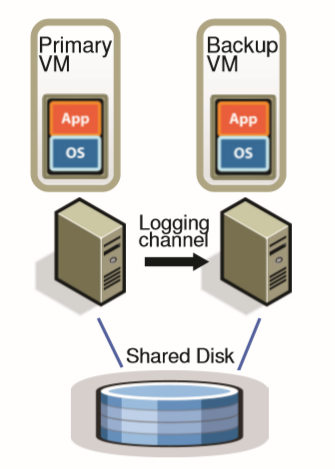
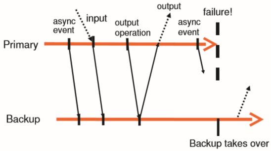
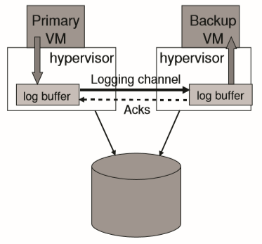

# [SIGOPS 2010] The Design of a Practical System for Fault-Tolerant Virtual Machines

## 基本容错设计 Basic Fault Tolerant, FT Design

原理在于视VM为一个**由hypervisor管理的[确定状态机deterministic state machine](https://en.wikipedia.org/wiki/Deterministic_finite_automaton)**，将primary VM的deterministic指令直接传递给backup VM执行，将non-deterministic的指令通过一定处理再传递给backup VM执行而确保backup VM的输出和primary VM一致

注意：文中FT VM暂时仅支持single-processor VM，因为**multi-processor VM中对memory的访问都是non-deterministic的**

Primary VM和backup VM处于一个**虚拟同步virtual lockstep**中，只有primary会接受所有的input，而backup会通过一个**网络连接logging channel**接收primary的input（存在一定延迟），从而backup可以用与primary相同的input执行相同的指令，同时backup的output则直接被hypervisor丢弃

### 1. 确定性回放 Deterministic Replay Implementation

由于除了确定性的输入外，还有可能出现：

- Non-deterministic事件，例如虚拟中断virtual interrupts
- Non-deterministic操作，例如读取CPU时终计数clock cycle counter

因此对带来了下述三种要求：

1. 正确捕获所有输入以及为了deterministic execution的**非确定性信息non-determinism**
2. 正确将输入和非确定性信息应用给backup
3. 尽可能不影响性能的实现1和2

VMware deterministic replay提供了录制并回放事件和操作的功能，这里不展开

### 2. 容错协议 FT Protocol

- **容错协议的基本要求**：当backup替代primary后，backup的所有输出与primary应有的输出保持完全一致entirely consistent（并不要求primary和backup的状态完全一致，只需要输出一致从而用户无感知）

- **容错协议的规则**：primary只有在backup **ACK**一条与output操作相关的特殊log entry后，才将对应的操作和结果output

通过**延迟output直到backup收到output前的所有信息**（从而replay时能够将output前的所有事件和操作都覆盖）来确保backup的output和primary的一致；由于primary可能在output操作后立即宕机，而backup此时应该**持续replay到output操作，随后再"go live"（成为primary）**，否则backup会出现不一致，因此对于**每个output操作需要对应有一条特殊的log entry**

同时对整个系统primary+backup是**无法确保所有output是exactly once的**，backup无法得知primary是在一次output前还是后就宕机的，除非引入2PC等事务协议进行约束

### 3. 错误检测和响应 Detecting and Reponding to Failure

通过UDP heartbeat结合监控primary->backup的logging channel数据流量来进行错误检测，一旦无法收到heartbeat或logging channel没有数据量达到一段时间，即超时认为primary发生了错误

但是一切分布式系统下的错误检测都有可能导致出现脑裂split-brain问题，为了避免primary和backup出现脑裂，primary和backup共享一块磁盘，当backup试图go live时，需要在**共享磁盘上执行test-and-set, TAS**来确保始终只有一个VM作为primary

同时当一个backup成功成为primary时，会启动一个新的VM作为新的backup

## 实际容错设计 Practical Implementation of FT

### 1. 启动和重启容错虚拟机 Starting and Restarting FT VMs

采用FT VMotion将基于当前的primary，在远端（同cluster内，因为共享相同的磁盘）的另一台服务器上克隆出一台backup

`TODO`

### 2. 管理日志通道 Managing the Logging Channel

在primary和backup分别维护一个固定容量的log buffer进行日志的传输：

- 当backup的buffer为空时，暂时没有可执行的日志，因此backup被暂停直到有新日志，这不影响用户的可用性
- 当primary的buffer耗尽时，primary不得不停止服务等待buffer被清空，因此backup原则上应该与primary具有相近的执行速度
- 另一方面如果使用较大容量的buffer会导致primary和backup的时间差更大，一旦backup需要go live时需要更长的时间来达到primary fail时的状态，期间引起不可用

当backup所在的服务器由于负载过重，执行速度减慢时，系统会检测到backup与primary执行状态的时间差过大，从而会主动限制primary对CPU资源的使用来减慢primary的速度

### 3. 容错虚拟机的操作 Operation on FT VMs

`TODO`

### 4. 磁盘IO的实现问题 Implementation Issues for Disk IOs

对磁盘的并发IO会导致不确定性，因此系统负责检测对磁盘的读写，一旦发现竞争就会强制要求顺序执行相关的IO的请求

当primary发起磁盘IO还未结束即宕机时，backup在go live的过程中会重新发起相关的IO，即使primary的pending IO最后成功也没有关系，IO针对的是具体的内存/磁盘块，因此重新发起一个相同的IO请求不会导致状态改变，即磁盘IO是幂等的idempotent

### 5. 网络IO的实现问题 Implementation Issues for Network IO

由于hypervisor引入了异步更新VM的网络设备这一优化，而这一优化也是不确定的因此在primary-backup replication中被禁用，导致了性能的下降

- 集群层面优化减少VM traps和interrupts，当VM在发送数据流时，hypervisor每次trap都发送一批数据包，同时每次interrupt接收一批数据包，即批量化来减少traps和interrupts
- 减少数据收发的延迟

## 其他设计 Design Alternatives

`TODO`