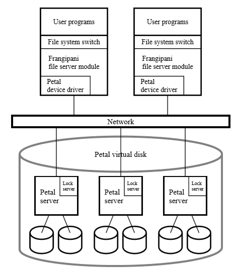
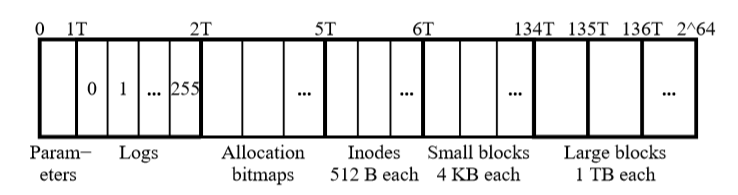

# [SOSP 1997] Frangipani: A Scalable Distributed File System

## 简介 Introduction

Frangipani是一个可扩展的分布式文件系统，管理一组分布在不同服务器上的磁盘，并对上层应用表现为一个共享的存储，特点如下：

- 同样一组文件对所有用户是一致的consistent view of the same set of files
- 支持动态增加服务器资源来扩展存储容量和带宽并且不需要现有的服务器修改配置或中断服务
- 系统管理员增加新用户时不需要关心具体服务器
- 系统管理员可以进行全部一致性备份，且不需要暂停服务
- 容错，支持从服务器、磁盘、网络错误中自动恢复
  
**重点为[同步和缓存一致性](#同步和缓存一致性-synchronization-and-cache-coherence)**

## 系统结构 System Structure

图中展示了Frangipani的基本架构，没有磁盘的服务器可以作为Frangipani服务器（图中上侧两台），运行Petal的服务器提供虚拟磁盘服务，注意Frangipani和Petal可以运行在同一台服务器上；另外distributed lock服务是整个系统中独立的，可以单独部署也可以如图部署在每个Petal服务器上

### 1. 组件 Componenets

用户程序通过标准系统接口访问文件，通过File system switch转换为Frangipani调用，并且**所有磁盘文件对所有运行的用户程序来说是一致的coherent**，所有程序都可以得到Unix file system一样的保证（fsync达到确保落盘、操作系统缓存、etc）

每个Frangipani服务器在Petal磁盘上各自保存有自己的**redo log记录还未落盘的修改**，从而当服务宕机时，替代服务器能够通过redo log恢复文件的修改；另外Frangipani不需要直接相互联系，而是**仅与Petal和lock service联系**

分布式锁服务distributed lock service提供读写锁multiple-reader/single-writer，Frangipani通过**分布式锁来控制对Petal的访问并达成多个服务器间的buffer coherent**

### 2. 安全和配置 Security and the Client/Server Configuration

`TODO`

## 磁盘布局 Disk Layout

Petal虚拟磁盘提供`2^64`的地址空间，当数据被写入虚拟磁盘空间时，Petal才会提交**commit给物理地址空间**，同时Petal也支持从物理地址空间反向提交**decommit给虚拟地址空间**从而释放物理空间占用

Frangipani对Petal的磁盘利用如图：

## 日志和恢复 Logging and Recovery

**Frangipani通过使用write-ahead redo logging记录metadata来进行容错恢复**，以及提升系统性能，**用户数据并不会被日志记录**，且每个Frangipani服务器的log在Petal上独立存储

当Frangipani需要修改metadata时，首先生成一条描述修改的log并写入自身内存，所有**log会按顺序周期性的写入Petal，直到写入Petal成功时，才会被周期性的真正修改metadata**，同时为了保证恢复时的log可以被顺序处理，每条**log会带有单调递增的Log Sequence Number, LSN**

Frangipani宕机时，系统会最终检测到故障并基于log运行恢复程序，检测的时机如下：

- 宕机服务器当前的clients交互时
- lock service要求宕机服务器释放先前获得的锁时

进行故障恢复时：

1. recovery demon被赋予宕机服务器log的所有权
2. 找出日志的start和end，逐条扫描找出还未应用的记录（根据LSN的顺序处理）
3. 释放所有锁和log，从而其他Frangipani服务可以恢复运行
4. 宕机的服务器此时重启后log已被清空，并且可以以新服务器的身份加入运行

对于multiple-log的情况需要额外注意：

- 由分布式锁服务确保，当多个server（**Frangipani或recovery demon**）修改同一块数据时，**修改操作是序列化的serialized**，因此当一个server修改数据时，只有当脏数据写入Petal后才能被下一个server修改，这也能隐式推出**任意一块数据至多被一个server的log持有一条未完成的修改记录**
- Frangipani在recovery时保证只apply那些在获得锁的情况下记录的log对应的修改，而这种保证通过更强的限制来实现：**不会replay一条对应的修改已经complete的log**，每一个512byte block都会带有一个版本号version number，每一条log都会带有修改的版本号，**recovery时只有log version > block version才会应用相应的修改**
- 任意时刻对任意单个server，只可能有至多一个recovery demon在replay该server的log，通过分布式锁实现

由于**Frangipani仅会记录metadata的日志**，从而提供更好的性能和更简单的恢复过程，因此**对于用户程序来说，在一次crash前后可能会看到不一致的实际数据**，这也正是Unix file system提供的保证（需要程序主动调用`fsync`来确保真正写入和crash前后的一致性）

## 同步和缓存一致性 Synchronization and Cache Coherence

Frangipani通过分布式锁服务的读写锁multiple-reader/single-writer locks进行同步和缓存一致性的控制

- **读锁read lock**：允许一个server读取并缓存相应的文件数据，当持有读锁的server被要求释放锁时，server也要同时使对应的缓存失效以避免从缓存中读取了过时的数据（已经被其他持有写锁的server修改）
- **写锁write lock**：允许一个server读写并缓存相应的文件数据，当持有写锁的server被要求释放锁，或是被要求降级为读锁时，server也要确保将缓存的脏数据写回到磁盘，如果是降级为读锁，则缓存可以不被失效
- 磁盘结构被分为**多个逻辑段logical segments并且每个段都由相应的锁**，为了避免[伪共享false sharing](https://en.wikipedia.org/wiki/False_sharing)，每个段内至多只存储一个可共享的数据结构，从而锁的粒度就是段
- 由于有一些操作要求原子更新多个数据结构，被不同的锁保护，因此为了**避免死锁deadloc avoidance**，通过两个阶段处理这种操作（类似[2PC协议](https://en.wikipedia.org/wiki/Two-phase_commit_protocol)）：
  1. server分析需要获取那些锁，在分析的过程中也会获取和释放一些锁（例如在目录中查找名字）
  2. 对所需要的锁**根据相应的inode地址排序，根据顺序依次获得锁**，此时获得了所有锁并检查在一阶段分析的过程中的获取释放的锁对应对象是否有变化（有变化则可能影响了2阶段操作所需要的锁）
  3. 若有变化则释放所有锁并重新进入1的分析过程

## 锁服务 The Lock Service

Frangipani只需要用到简单的锁服务（读写锁multiple-reader/single-writer），因此锁服务本身不应该是系统的性能瓶颈，锁采用**租约leases的方式**来处理用户宕机失败，用户必须在锁过期前重置租约的时间，否则租约过期就会被判定为失败并被释放，同时**若出现网络问题等原因导致节点与锁服务失联，则节点会立即放弃所有修改以及缓存数据和对Petal的访问**，并且后续所有对脏数据进行访问的应用程序的都会收到错误信息

每个锁都必须携带一个**令牌token fence，从而在每次租约失效时，锁的回收和新的租约分配都需要更新token**，而当petal遇到新的token时就会拒绝一切过时token的访问，从而避免出现以下情况的竞争：

1. 由于网络或GC等原因，Frangipani节点恰好错过了及时更新租约的时机，且没有发现锁已经过期，导致锁服务认为节点宕机
2. 同一时刻，另一个节点获得了该节点持有的锁，并对Petal进行访问
3. 该节点在同一时刻依然在正常读写Petal并人为自己的锁依然有效

**分布式锁服务本身采用和Petal相同的设计模型 Paxos**：采用心跳交换信息、采用majority quorum应对网络分区和脑裂

**当Frangipani节点宕机时，其所持有的锁不能自动释放，对应的锁服务节点会要求另一个Frangipani节点介入进行recovery**，赋予该节点相应恢复日志的锁，该锁也带有租约lease从而确保同一时间同一个log只有一个Frangipani节点在访问

## 增减服务器 Adding and Removing Servers

- 新增Frangipani节点，**仅需配置Petal虚拟磁盘的地址以及锁服务的地址**，新增节点访问锁服务获得租约，并根据lease identifier获得log的位置，此后正常服务
- 移除Frangipani节点，由于设计上的节点宕机容错，因此**直接关闭需要移除的节点**即可，由系统进行recovery
