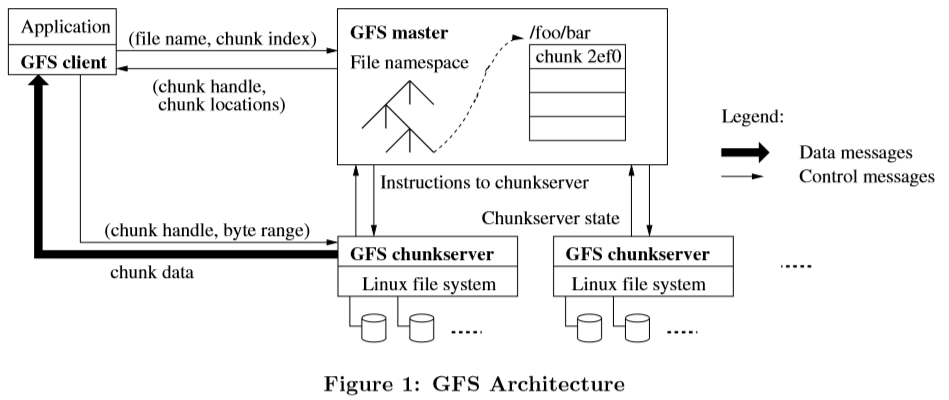
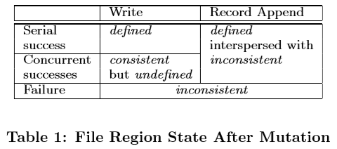
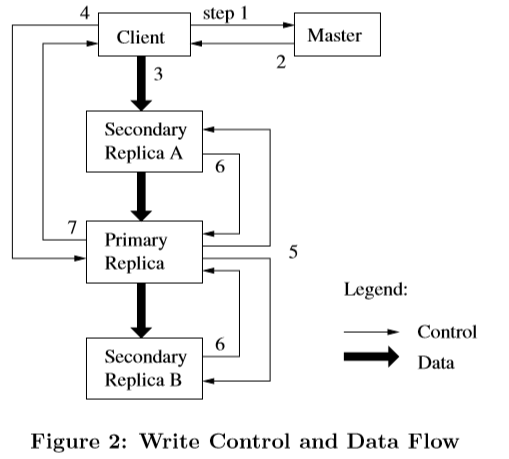

# [SOSP 2003] The Google File System

## 设计概览 Design Overview

### 1. 假设 Assumptions

- 整个系统基于廉价的商用组件，因此频繁的故障宕机以及恢复重启是可能的
- 存储的文件数量在百万级，每个文件的大小在100MB及以上的量级
- 读负载主要包括大数据量的流式读streaming reads以及小数据量的随机读random reads
- 写负载几乎只有大数据量的连续追加sequential append写入，极少会有修改
- 需要支持多个客户端高效并发追加写入同一个文件
- 相比低延迟，更需要维持高吞吐量

### 2. 接口 Interface

文件通过目录的方式层次管理，并且支持常见的`create, delete, open, close, read, write`以及`snapshot, record append`

`snapshot`支持快速创建一个文件或目录的快照，`record append`支持多客户端高效追加记录，每个客户端的追加是原子的，所有客户端不需要竞争锁

### 3. 架构 Architecture

GFS由单个主节点master，多个数据服务器chunk server组成，以及被多个客户端访问client

所有文件被分割成固定大小的块fixed-size chunks（除了分割后最后一个chunk可以不足固定大小），每一chunk都由全局唯一号访问globally unique 64 bit chunk handle，在chunk创建时由master分配；同时chunk都有多个备份replicas提供容灾服务

master管理所有files和chunks的元信息metadata，包括命名空间namespace、访问权限access control、file->chunks映射、chunks地址，同时master还负责执行全局操作包括块租约管理chunk lease management、垃圾回收garbage collection、块迁移chunk migration

master通过定期心跳heartbeat与chunk server进行通信来获取全局状态和调度存储

考虑到前提假设即流式读为主和少量随机读，所有chunk server和client均不会对数据做任何缓存，但是client会缓存一部分metadata用于快速访问



### 4. 单主节点 Single Master

master执行全局操作，同时只有限的参与读写操作，即client只与master沟通metadata，一个典型的读流程如下：

1. client收到application的读请求，将读请求基于fixed chunk size转化成filename和chunk index发送给master
2. master收到请求后根据chunks的位置，返回给client相应的chunk handle和replica locations
3. client缓存收到的handle和locations一定时间，随后基于自身的位置，挑选最近的replica所在的chunk server直接发起读请求，同时在超时之前所有相应的访问不再询问master

### 5. 块大小 Chunk Size

默认的chunk size是64MB，选择一个较大的chunk size有以下几个显著的好处：

1. 每个chunk在访问前，client都需要访问master获得相应的metadata，**而根据局部性locality原理，应用程序的多次读请求往往落在同一个chunk中**，因此一个较大的块可以满足更多次的读请求，减少与master的交互，提升效率
2. 由于一个大chunk可以服务更多的client请求，因此一条持久的client到chunk server的TCP连接可以进一步减少网络开销
3. 大chunk从而使得一个**大文件的chunks数量减少，master需要维护更少的metadata**，从而甚至可以在内存中维护metadata，效率更高

但即使chunk是按需分配的，同样也会有以下缺点：

1. 较小的文件可能几乎不会被分割，**只有单个chunk，导致了读写热点hotspot**

### 6. 元数据 Metadata

master主要保存了三类metadata：file和chunk的namespace，file->chunks的映射关系，chunk locations

所有metadata都保存在master内存中，但是**前两者同样也持久化到操作日志中operation log**从而确保master crash后恢复依然能快速恢复工作，operation log进一步备份到另一台主机上防止丢失

1. **内存数据结构 In-Memory Data Structures**
    master内存中保存了namespace和file->chunks的映射，由于默认每chunk的大小是64MB，因此保存这两项数据占用较小的内存就可以代表相当多的文件内容；同时master还可以周期性扫描内存数据进行chunk垃圾回收和针对宕机chunkserver的chunk re-replication
2. **块位置 Chunk Locations**
    master不持久化chunk locations，每次宕机重启后，master直接访问所有chunk server重建chunk locations，随后正常运行过程中通过heartbeat不断更新数据
3. **操作日志 Operation Log**
    operation log包含了持久化的metadata，同时也定义了并发操作的实际执行顺序即充当了逻辑时钟logical time line，是GFS的核心，因此operation log还会被replicate到另一台主机上，只有本地和远端均flush后master才会回复client请求
    由于operation log会不断增长，每次重启时需要replay进行恢复master状态，因此为了避免过长的恢复时间，operation log会定期进行checkpoint

### 7. 一致性模型 Consistency Model

GFS提供了较为宽松的一致性模型relaxed consistency model

1. **GFS的保证 Guarantees by GFS**
    namespace的操作都是原子的（例如创建文件），由master互斥执行，并且通过operation log确定全局执行顺序，对于file region的操作一致性保证取决于操作类型、成功与否、并发与否，总结如下表：

    

    一个region是consistent就意味着所有client从任意replica上读取都能看到相同的数据；一个region是defined就意味着在一次数据修改后region是一致的且所有client都能看到这次修改后的完整数据；**defined比consistent要求更高**

    如果出现一系列成功的文件操作，那么master通过在每个replica上都以相同的顺序执行来确保defined，同时master通过chunk version版本号来使得缺失一些操作的replica被标记为stale

2. **对应用程序的含义 Implications for Applications**
    应用程序应该依赖append操作而不是overwrite操作，并且写入能够self-validating，self-identifying的数据

## 系统交互 System Interactions

### 1. 租约和变化顺序 Leases and Mutation Order

master会分配给一个replica一个租约，该replica就被认为是主副本primary，所有对primary的修改会根据修改顺序在所有其他replica上执行，**从而一个全局变化顺序首先通过lease的分配顺序（由master确定），随后通过在lease内的primary执行顺序，确定全局顺序**

lease有一个超时时间，当持续进行操作时master可以不断延长超时时间，当primary失联时master可以通过等候超时随后分配一个新的lease给另一个replica



1. client向master获得当前chunks的位置
2. master响应并返回chunks的位置（primary和其余replicas，如果当前没有primary则此时master会分配一个），此时client会缓存chunks的位置，随后除非相应的chunk server失联或lease过期，否则的话client不再访问master
3. client将data以任意顺序推送给所有replicas，chunk servers会在LRU中缓存这些数据
4. data推送完成后client向primary提交写请求，primary此时确定操作顺序分配consecutive serial numbers给每一个操作
5. primary把写请求推送给所有replicas，每个chunk servers都以serial numbers的顺序执行
6. 所有chunk servers回复primary操作完成
7. primary回复client操作完成

**可见，写入时是先推送数据给chunk servers缓存，随后再发起请求完成写入**

### 2. 数据流 Data Flow

由于命令流control flow和数据流data flow解耦，从而数据流采用了流水线pipeline的模式可以更高效的利用网络

```text
 chunk
+------+
| 4MB  |---1.send--->[replica A]---2.send--->[replica B]---3.send--->[replica C]
+------+               ↑     ↑                 |     ↑                 |
| .... |---6.send------+     +------5.ack------+     +------4.ack------+
+------+
| 4MB  |
+------+
```

单个chunk的数据被进一步分为更小的块，例如4MB，然后发送给最近的chunk server，随后chunk server立即推送数据给下一个chunk server，直到末尾写入的chunk server完成写入，逐级返回ack到第一个chunk server，再同样流水线的方式发送下一小块数据（类似[链式复制chain replication](http://dsrg.pdos.csail.mit.edu/2013/08/08/chain-replication/)）

### 3. 原子追加记录 Atomic Record Appends

`TODO`

### 4. 快照 Snapshot

GFS的快照基于**写时复制copy-on-write**，因此在创建时非常快速，收到snapshot请求时，master直接revoke所有相关的lease，从而所有clients此时需要重新访问master获取primary的位置，这就给了master创建新chunk的机会

master将snapshot涉及到的文件metadata都复制一份，并且都指向原来的数据文件，当某个数据文件被修改时，master在响应clients前首先要求所有chunk server进行chunk的本地复制，从而让clients最终修改了新创建的版本，snapshot的版本不受影响

## 主节点操作 Master Operation

### 1. 命名空间管理和锁 Namespace Management and Locking

由于snapshot等操作非常耗时，因此为了提高master的处理效率，master以树的结构组织namespace且不允许软/硬连接，树采用前缀匹配直接将每个文件或目录的路径直接映射到metadata，每个节点都拥有一个读写锁read-write lock（**类似数据库B+树的锁机制，逐层下降到叶节点，逐层获取锁**，从而确保涉及到具体文件或目录的操作并发安全）

### 2. 副本位置 Replica Placement

由于chunk servers可能位于同一机架的不同主机、不同机架上，因此副本放置策略和访问策略需要充分考虑到带宽和延迟，例如如果有3个replicas，则1个replica放置在机架A，另2个replicas放置在机架B，均在机架B的replica在复制等操作时降低带宽需求（同一机架），在机架A的replica确保高可用性（防止机架B整体宕机带来不可用）

### 3. 创建，重新备份和再平衡 Creation, Re-replication, Rebalancing

- **创建 creation**
    master在创建replicas时主要考虑以下3点因素：
    1. 新创建的replicas需要放置在磁盘占用率较低的chunk servers，从而提高磁盘利用率
    2. 限制chunk server在一段时间内的新创建replica的数量，新创建replica即意味着写入，过多新建replica会耗尽chunk server的带宽
    3. replicas应该分布在不同机器和不同机架上

- **重新备份 re-replication**
    master在检测到一个chunk的replicas数量低于用户指定的数量时，会立即开始re-replication，此时新创建的replica也遵循上述3点因素

- **再平衡 rebalancing**
    master会周期性的rebalance所有replicas，主要参考因素也是分布位置和负载均衡

### 4. 垃圾回收 Garbage Collection

在clients请求删除文件时，文件会被立即重命名为特别文件并标记为deleted，随后垃圾回收时才会被真正删除（**懒惰删除**），master会进行周期性的垃圾回收操作，真正删除时也会删除metadata，此时不可恢复，而在真正删除前通过特别文件名找到并重命名删除文件可以进行文件恢复

垃圾回收操作时，chunk servers会上报所有chunk的信息，master通过对比metadata返回给所有chunk servers不再被需要的chunks，从而chunk servers可以自由删除这些数据

### 5. 旧副本检测 Stale Replica Detection

master在metadata中会维护chunk的版本信息chunk version number来区别最新的chunk和过时的chunk，每次再分配lease时都会将version递增，随后才会响应clients从而所有clients都只会访问最新的chunks

失联或是宕机导致version落后的chunk servers也会在垃圾回收时更新数据

## 容错和诊断 Fault Tolerance and Diagnosis

### 1. 高可用 High Availability

高可用通过下述方式实现：

- **快速恢复 Fast Recovery**
    GFS的master和chunk server都被设计成能够快速启动，无论程序是否是异常终止

- **数据备份 Chunk Replication**
    通过chunk的跨机器/跨机架replication达成高可用，如果需要进一步降低磁盘占用（replication导致一份相同的数据占用数倍的磁盘），可以考虑[纠删码erasure code](https://en.wikipedia.org/wiki/Erasure_code)，将**原始数据采用纠删码处理后作为replicas备份**，显著降低磁盘占用，但是会提高读写的延迟（需要计算纠删码）

- **主节点备份 Master Replication**
    master的checkpoint和operation log也会备份到多台主机上，如果由于磁盘等原因旧master无法再启动，则需要GFS以外的干预，在replication所在的机器重新启动master进程，并通过DNS的方式更新master的位置

### 2. 数据完整性 Data Integrity

chunk servers通过校验和checksum检验所有chunk的完整性，由于数据写入方式的设计，因此在同一时刻，不同replicas不必是完全相同的，因此仅需chunk servers确保自身拥有的chunk完整即可

### 3. 诊断工具 Diagnostic Tools

`TODO`
