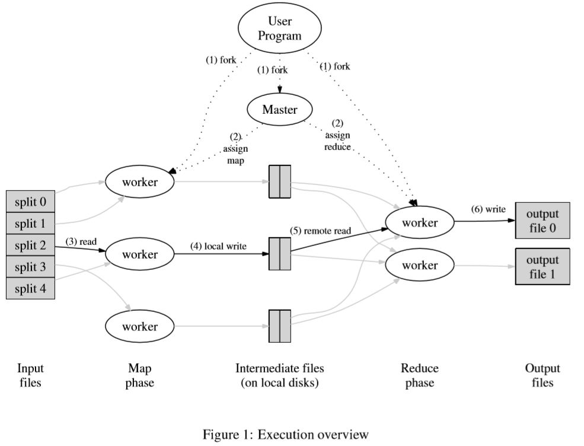

# [OSDI 2004] MapReduce: Simplified Data Processing on Large Clusters

## 编程模型 Programming Model

计算被抽象为Map和Reduce两个函数如下：

- Map
  由用户实现，接收一组`key/value`，输出一组中间值`key/value`，而库负责将中间值基于`key`对分组，例如`key1/{value1, value2, value3}, key2/{value1, value2}, ...`，随后将分组后的数据基于`key`传递给Reducer函数，每个Reducer函数只接收并处理相同`key`的数据
- Reducer
  由用户实现，接收一系列中间数据，例如`key1/{value1, value2}, key2/{value4, value5}, ...`，随后将全部数据进行合并，通常会输出单个值
  同时为了避免过多数据无法放入内存，数据会以迭代的方式逐个输入Reducer
  **注意：Reducer接收的`key`可以不同，但是相同`key`的中间数据一定流向同一个Reducer，多对一关系**

例如海量文档的词频统计word count：

map函数接收被统计的文章标题作为key和文章内容作为value，并将该文章中出现的每个单词都以单词作为key/出现1次作为value发送给reducer

reducer函数接收每个单词key在不同文档中的出现次数values并累计求和，最终输出key在海量文档中总共出现的次数

```java
map(String key, String value):
    // key: document name
    // value: document contents
    for each word w in value:
        EmitIntermediate(w, "1");

reduce(String key, Iteratr values):
    // key: a word
    // values: a list of counts
    int result = 0;
    for each v in values:
        result += ParseInt(v);
    Emit(AsString(result));
```

容易使用MapReduce来完成的案例：

1. Distributed Grep
2. Count of URL Access Frequency
3. Reverse Web-Link Graph
4. Term-Vector per Host
5. Inverted Index
6. Distributed Sort

## 实现 Implementation

MapReduce的接口非常灵活可以有不同的设计和实现，取决于具体环境和需求，以下设计实现基于Google的常用场景（2004年及以前）：

1. 单台机器x86双核，2-4GB内存，Linux
2. 100/1000M网络
3. IDE磁盘，通过分布式文件系统进行数据存储，通过副本进行容灾和高可用
4. 单集群有数百上千台上述机器，硬件故障较为常见
5. 用户提交任务给调度系统

### 执行流程 Execution Overview



1. 用户输入的数据被分割为M块，通常单块16-64MB，在集群的一批设备上启动MapReduce流程
2. 所有设备角色分为Master和Worker，Master进行任务分配和调度，每次挑选空闲的Worker分配单个map或reduce任务，共有M个map任务和R个reduce任务
3. Worker执行map任务时，读取输入的数据，解析成`key/value`的形式并传递给用户的Map函数，Map函数的输出被缓存在内存中
4. 被缓存的Map中间输出周期性写入本地磁盘，并且根据分区函数被分为R个区域（随后每个区域传递给相应的一个reducer），R个区域的位置信息被上报给Master用于reduce任务
5. Worker执行reduce任务时，Master会告知中间输出的位置，随后通过RPC的方式从所有对应的磁盘区域中获取数据；由于获得的数据可能包含多个`key`的数据，因此当读取完全部中间数据时会进行排序，从而相同`key`的数据连续出现在一起（数据过多无法全部放入内存时会进行外排序）；最后再在所有数据上迭代处理，对于连续相同的`key`的数据会一起传递给用户的Reduce函数，Reduce函数的输出被追加到一个属于该reducer的最终的文件中（位于分布式文件系统中，最终有R个结果文件）

### Master的数据结构 Master Data Structures

Master会追踪所有map和reduce任务的进行状态，以及所有Worker的工作状态

### 容错 Fault Tolerance

1. **Worker故障 Worker Failure**

    Master会周期性发送心跳给Worker，一旦响应超时就会标记该Worker为失败，并且所有该Worker的未完成任务和已完成的map任务（map中间数据保存在Worker本地磁盘，如果是宕机则即使完成也无法获得结果，reduce结果保存在分布式文件系统）都被重置，需要调度给其他Worker重新进行运算；同时所有进展中的reduce任务依赖失败Worker上的map任务的都需要被重新执行，重新读取新的map结果

    这样的设计非常稳健，即使单次出现大量故障和失败，也仅仅是耗时变长，任务重新运行而不会有其他影响

1. **Master故障 Master Failure**

    Master可以周期性将自身状态作为checkpoint存储，如果失败时从checkpoint重启即可

1. **故障时的语义 Semantics in the Presence of Failures**

    当用户提供的Map和Reduce函数是确定性的（deterministic functions of their input values），MapReduce库可以确保每次执行输出结果都和完全没有故障时的执行结果一致

    每次执行时输出结果到临时文件上，当执行完成时依赖原子性的rename来生成最终文件，因此即使有故障发生时或是有多个map/reduce做了相同的任务，最终生成的文件一定是某个完整的结果，并且和没有故障时的结果是一样的

### 局部性 Locality

由于输入数据存储在[GFS](https://en.wikipedia.org/wiki/Google_File_System)这一分布式文件系统上，并且有多副本，因此在map和reduce执行时会充分考虑局部性，从尽可能近的源获取数据，减少网络流量，提升处理性能：Master在调度map任务时，会首先考虑拥有输入数据副本的节点，若无法达成则考虑最近的节点（如同一个机架下的节点）

### 任务粒度 Task Granularity

map和reduce任务分别有M项和R项，任务应该被充分细化使得M+R应该远远大于设备数量，从而每个Worker在执行任务时可以充分动态负载均衡和调度以实现最佳的系统整体性能和吞吐量

通常情况下reduce的数量往往被用户限制，取决于具体的输出，而map的数量则可以充分调整

### 备份任务 Backup Tasks

由于用户提交的任务最终耗时是取决于整个系统中最慢的reduce任务完成的时间（而这又取决于最慢的map任务完成的时间），因此为了避免某个map/reduce任务拖慢了整个系统的速度，当整个系统只剩少数几个任务正在运行，而某个在执行的任务又超过限定时间还未返回结果时，Master就可以将相同的任务在另一个节点上调度执行，随后等待先响应的结果
**这种减少任务耗时的方式和通过备份请求backup request来减少长尾延时long-tail latency的方式是相同的**

## 改进 Refinements

### 分区函数 Partitioning Function

用户可以指定希望的输出结果数量，即reduce任务/R的数量，map输出的中间结果就会根据分区函数Partitioning Function分为R个区域并且分别由一个reducer来处理一个区域内的数据

默认可以使用hash分区，但是依据不同的场合不同的分区函数可以更均匀有效的进行分区，因此用户也可以实现自己的分区函数来指导MapReduce的进行

### 顺序保证 Ordering Guarantees

在同一个分区内，`key/value`数据是基于`key`排序的，排序有利于基于`key`对结果的查找定位等

### 合并函数 Combiner Function

由于某些场合下map输出的重复`key`的中间结果非常多，即产生了较多的琐碎结果，例如word count时可能会有大量重复`<the, 1>`这种结果，也可以进行一定程度的局部合并以提高整体处理效率，用户可以指定Combiner函数在map时进行中间结果的合并（Combiner函数和Reducer函数基本是一致的，两者的差别在于执行的时机以及数据的输入输出）
