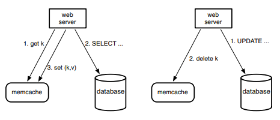
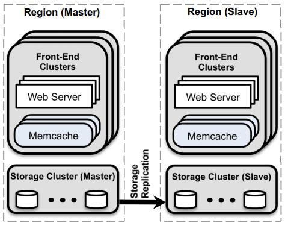
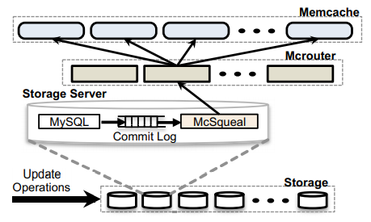

# [NSDI 2013] Scaling Memcache at Facebook

## 简介 Introduction & Overview

memcache系统（基于开源的memcached）设计的主要考量：

- 用户基本**都是读取而极少写入 read-intensive**，因此采用缓存可以显著提高系统吞吐量
- **底层数据异构存储**，分布在MySQL、HDFS、后台服务等，因此需要有灵活的缓存策略

memcache的两种使用场景：

- **查询缓存Query cache**：memcache被作为按需的缓存服务（**demand-filled look-aside**），并**不与数据源直接交互**
  - 当web server收到查询请求时，首先访问缓存，若未命中则访问数据库，从数据库取出数据后也会同时更新缓存（图中左侧cache miss流程）
  - 当web server收到写入请求时，直接更新数据库，**随后再将缓存失效确保后续读取能够从数据库中获取最新的写入**（图中右侧write流程）

  
- **通用缓存Generic cache**：可以作为通用K-V存储

在单机memcached的基础上，memcache系统集成了配置管理configuration、聚合aggregation、路由服务routing，架构如下图：

## 集群内延迟和负载 In a Cluster: Latency and Load

### 1. 降低延迟 Reducing Latency

由于一个网页可能包含大量基本元素分布在不同的memcache节点上，因此一次web请求需要web server访问大量memcache节点

**延迟降低主要通过优化memcache client侧实现**，每个web server都会有相应的client，集成了序列化serialization、压缩compression、请求路由request routing、错误处理error handling和请求批量化request batching

clients会维护所有可用服务器的映射关系，并且通过配置管理器进行更新

- **并行请求和批量化 Parallel requests and batching**
  web服务器会尝试找出所有一次页面请求内**所有数据项的依赖关系（DAG）**，从而尽可能多的并行、批量从memcache节点获取数据
- **客户端服务器通信 Client-server communication**
  **memcache节点之间并不通信**，复杂流程都通过在无状态stateless的clients侧实现，从而尽可能保持memcache节点功能简单并且高性能

  client采用**UDP发送`get`请求来降低延迟**（TCP仅建立连接就需要三次握手，并且TCP需要维护一条连接更加占用内存），并且会在请求中附加**序列号sequence number**，通过出现乱序的结果来检测数据包丢失，若出现丢失则会抛弃请求的所有收到数据并视为请求失败（不会重试），当请求失败时就认为是缓存未命中并继续访问底层存储

  client采用**TCP发送`set`和`delete`请求来确保可靠性**（memcache系统是read-intensive的）

- **连入阻塞 [Incast](https://www.pdl.cmu.edu/Incast/) congestion**
  client实现了**流控机制flow-control mechanism来防止出现大量请求导致incast阻塞问题**，若没有流控机制，则当client访问大量keys时，返回的资源过多可能直接导致机架或集群交换机阻塞丢包，流控机制类似TCP的滑动窗口

### 2. 降低负载 Redcuing Load

- **租约 Lease**
  采用租约主要是为了解决以下两个问题：
  - **过时的更新 stale set**，主要发生在并发请求时，从数据库读取值的顺序和更新缓存的顺序不一致，导致旧值覆盖了新值，随后读取缓存就会获得旧数据，发生 stale read
  - **[惊群 thundering herd](https://en.wikipedia.org/wiki/Thundering_herd_problem)**，当某个集群负载很重时正在发生大量的读，此时一个写入会导致缓存失效从而发生大量读取发送给更缓慢的底层数据库
  
  每个缓存节点会给client一个租约来允许client在缓存节点中更新数据，**租约（单调递增的64bit token）和读请求的对象绑定**，当需要更新对象时需要提供租约，从而根据租约的大小确定了`get`的顺序，从而可以**拒绝旧数据（带有过时租约）的更新**，并且通过**限制给出租约的频率（粒度为keys，限制每个key给出lease的频率），也间接控制了节点数据更新**的频率，从而减缓了惊群效应

  进一步如果允许返回短期内刚过时的数据，可以进一步降低负载，例如被`delete`的数据暂时转移到一个数据结构中短暂存活，`get`请求就可以返回这些短暂过期的对象而不需要去读底层数据库
- **池化 memcache Pools**
  当将memcache作为通用K-V存储服务时，不同的应用程序有不同的访问模式，可能会导致缓存命中率下降，通过**将集群缓存节点分区成不同的缓存池来提高缓存命中率**，例如：
  - 小缓存池服务经常被访问（缓存可能频繁更新）但是缓存未命中代价较小的keys
  - 大缓存池服务不常访问（缓存较为稳定）但是缓存未命中代价很大的keys
- **池内复制 Replication Within Pools**
  通过池内复制可以进一步降低延迟，主要针对应用程序经常**同时访问大量keys**、这些数据可以**完整放入1~2个节点**并且**请求量远大于单个节点处理能力**，此时通过池内复制可以显著缓解单个节点的压力并满足应用程序的需求

  原因在于通常单个请求包含100个key或是1个key差别较小，假如一个server存有100个keys能够支持500K并发请求，而应用程序需要1M并发请求
  - 进行keys的拆分，则每个server存有50个keys，请求拆分成2个各包含50个keys的请求分别发到两个节点上，结果每个节点依然需要提供1M并发量
  - 进行复制，则每个server依然100个keys，请求不必拆分直接发到任意节点，两个节点一共提供1M并发即可

### 3. 故障处理 Handling Failures

故障处理分为两大类：

- **集群少数节点失效**（宕机或网络问题）
  每个集群有一个较小的**代偿缓存池称为Gutter池**，当clients请求没有响应时，假设对应节点失效，并将访问Gutter池，此时往往会缓存未命中从而访问底层数据库并更新Gutter池，Gutter池内的数据会短期内失效并放入stale数据结构内，从而通过提供**略微过时的旧数据来减轻底层数据库压力**
- **集群大规模失效**
  所有请求都会被重新路由给另一个的集群，从而失效集群的流量会直接清零

## 域级的复制 In a Region: Replication

将web服务器和memcache服务器组成多个前端集群frontend clusters：

并且数组前端集群可以组成一个域，**域是复制的单位，并且存在一个主域master region提供写服务，slave region只能提供读服务**

### 1. 失效 Regional Invalidations

用户需求导致数据被复制到了前端集群中的缓存，此时**底层存储集群就必须负责当数据更新时需要及时使前端的缓存失效**，从而保持数据的一致性，通常当某个web服务器修改了数据时也会同步发送失效请求给自身所在的集群缓存进行数据失效，而其他底层存储的数据更新就会通过在**commit时通过一个daemon mscqueal服务**进行前端缓存的失效

- **降低数据包率 Reducint packet rates**
  由于底层有大量存储节点构成的集群，每个节点都由mscqueal服务，前端也有大量memcache节点构成的集群，假如直接允许mscqueal与每个memcache交互，会导致海量的网络请求，通过**mcrouter作为消息队列**可以显著降低数据包的量（本质上是**流式处理streaming processing**）
- **通过网页服务器使失效 Invalidation via web servers**
  直接通过web服务器发送请求面临额外的问题：
  - web服务器只能合并自身的所有发送至同一个memcache节点的请求，其**效率无法与直接对数据库所有修改都有感知的mcrouter比拟**，因此会带来额外的网络数据
  - 当出现系统问题（配置错误、路由转发错误等）导致的**大规模失效时，web服务器无能为力**，此时往往需要重启整个memcache集群，而采用类似消息队列的mcrouter仅需**简单的缓存消息并在配置更新后重新发送**即可（**消息队列以及流式处理的优越性**）

### 2. 池 Regional Pools

通过多个前端集群frontend cluster共享一组memcache服务器（即**一个域内的缓存池, 一个域可以有多个缓存池reginal pools**）从而可以提升内存使用率，减少数据replicas的数量（相比于每个前端集群都有一个memcache集群，则可能都有一份相同的数据），在一个缓存池内带宽更充分，延迟更低

并且前端集群可以**根据key的特征自主选择缓存在独占的缓存节点，还是缓存在共享缓存池中**（例如根据key进行冷热分离）

### 3. 冷集群热身 Cold Cluster Warmup

当全新的memcache集群上线时，由于内部完全没有任何数据，因此cache miss率极高，**直接全流量引入会引起雪崩**，因此需要一个预热环节

通过允许**cold集群内的clients在cache miss时首先去warm集群尝试获取数据**而不是直接访问底层数据库，可以有效减轻数据库压力，并逐步将数据缓存到cold集群内完成热身

注意这种设计有可能会引入不一致，例如cold集群的client发起了数据库更新请求，而访问相同数据的另一个client从warm集群中读取了过时的数据并放入了cold集群（此时warm集群还未收到异步的invalidation要求），通过**cold集群延后hold-off time允许放入warm的数据来减少过时的可能性**（延后一段时间可能warm集群已经有了新的数据，但这**依然存在风险**，如前所述，为了性能牺牲一致性，略微过期的数据不影响用户）

## 跨域一致性 Across Regions: Consistency

通过地理上的集群分布可以有效提高可用性和降低用户侧延迟，每个集群中都有一个域region部署主数据库，其他域上有用于备份的read-only从数据库

整个集群在**保证最终一致性eventual consistency**的前提下，尽可能提高性能和可用性

- **主域写入 Writes from a master region**
  通过主域写入后，需要在主域内和从域中失效数据，此时采用mcsqueal和mcrouter直接避免了主域的数据还未被replicate到从域，从域就收到了invalidate请求这种事件
- **非主域写入 Writes from a non-master region**
  由于从域的数据可能和主域存在延迟，此时在从域写入（实际上**由主域完成后replicate到从域**）后再发起读就可能会无法读到自己的写入即stale read，因此需要从域在收到新数据前拒绝这种读取，采用**标记remote mark**：
  1. web服务器在从域发起更新k的请求，在从域中设定标记rk
  2. 更新k的请求被路由到主域执行
  3. 在从域中删除k

  当此后从域收到读k的请求时，如果**发现k不存在，并且存在rk，则将读请求转发给主域执行**，当从域最终获得k时就会移除rk
- **运维考虑 Operational considerations**
  跨域的带宽有限且通信代价高，因此数据replication和delete流（invalidation请求）是共享一个通道的

## 单机提升 Single Server Improvements

提升memcache节点的单机处理能力（即优化memcached）可以有效提升整个系统的处理能力

`TODO`
