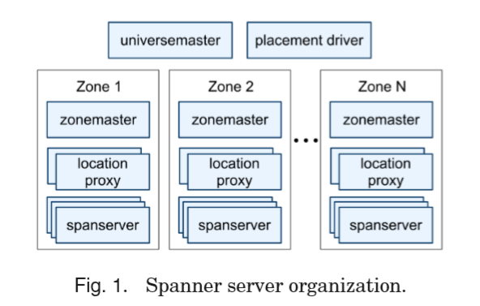
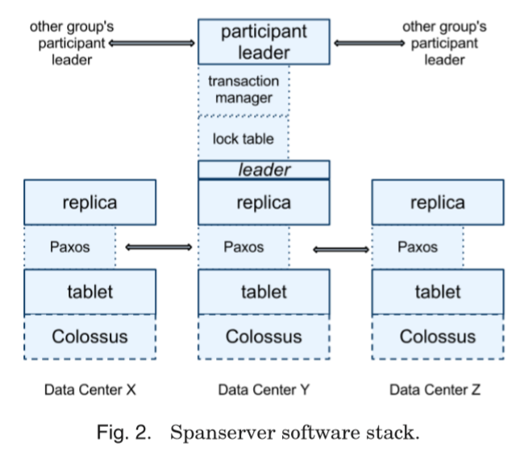
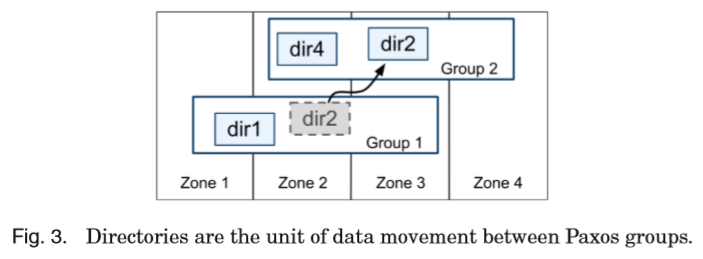
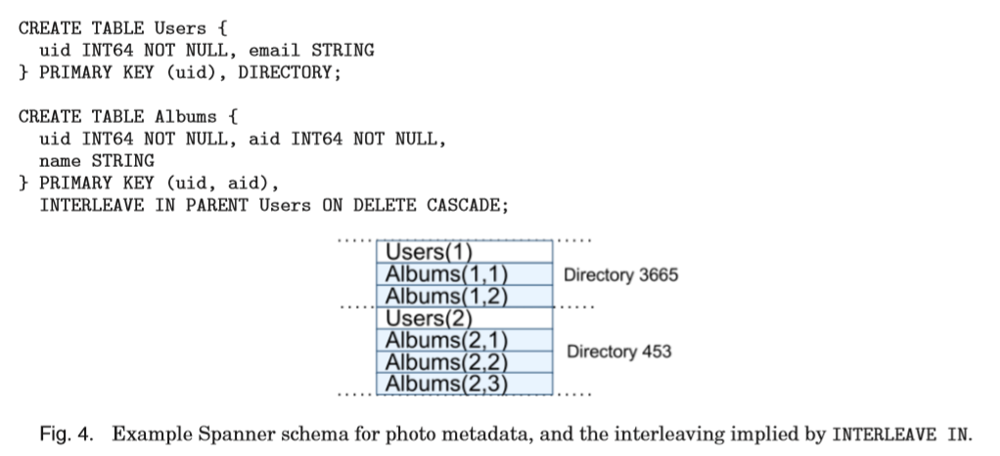

# [TOCS 2013] Spanner: Google's Globally Distributed Database

## 简介 Introduction

Spanner是一种可扩展scalable、全球分布globally的数据库，使用**多组Paxos复制组**实现全球多数据中心的可用性和地理上的局部性访问，clients会在副本之间**自动故障转移failover**，Spanner在复制组成员变更或是数据变化时**自动重新分布数据automatically reshards**以实现负载均衡和节点容错

数据在Spanner中会被存储在**有模式的半关系型表中schematized semirelational tables**，并且附带有版本信息verision，版本信息会自动打上提交时的时间戳commit time

作为全球分布式的数据库，Spanner提供特性如下：

- **复制策略replication configuration可以由应用程序动态细粒度调整**，例如
  - 应用程序可以指定由哪个数据中心来存储哪些数据
  - **读研迟read latency**来控制数据与用户的距离
  - **写延迟write latency**来控制数据与其副本replicas的距离
  - 副本数量来控制可用性availability、持久性durability和读性能read performance

  整个过程中数据都会被自动动态透明的在数据中心和节点间迁移进行负载均衡
- 提供**外部一致性读写externally consistenty** reads/writes（即**强一致性strong consistency、线性一致性linearizability**）
- 基于时间戳的**全球一致性读 globally consistent** reads

基于这些特性，Spanner上允许在**全球范围内**的存在进行中事务时的一致性备份、一致性MapReduce、原子模式升级atomic schema updates，核心原因在于Spanner**基于GPS/原子钟提供的[TrueTime API](#真实时间-truetime) timestamps，由**提交时间戳来串行化事务的顺序**

TrueTime API也存在精度，因此**Spanner会在时间不确定时进行等待直到可靠**（例如精度是10ms，则Spanner等待20ms以确保两个时间戳不可能重叠）再进行操作

## 实现 Implementation

Spanner将数据管理的单元抽象为**directory**，用于复制和和局部性，同时也是数据移动的单位，一个Spanner部署称为**universe**，管理一组**zone**，zone是管理部署的单元

Universe中包含单个**universemaster**和单个**placement driver**，universemaster主要用于提供交互式访问所有zone的状态，placement driver进行分钟级的数据自动转移，通过定期轮询spanserver来寻找需要转移的数据

Zone中包含一个**zonemaster**和数百数千类似BigTable服务器的**spanserver**，zonemaster负责将数据交给spanserver，用户首先访问**location proxy**获知数据所在的spanserver，随后spanserver负责将数据提供给用户



Zone实际上位于一个数据中心，物理上的隔离单元，在新数据中心加入Spanner或是旧数据中心被移除时，就会相应增减Zone，因此一个数据中心也可以包含多个Zone存储不同的应用数据

### 1. Spanserver架构

每一台Spanserver与其他节点的交互如下图所示，每个Spanserver负责100~1000个**tablet**实例，一个tablet包含**一组形式如`(key:string, timestamp:int64) -> string`的数据结构**，由于包含了时间戳，因此相比于KV存储，Spanner更像一个多版本multiversion数据库

tablet的状态存储在一组类似**B-tree的文件**和一个**write-ahead log, WAL**中，文件和WAL均存储在分布式文件系统**Colossus**中，Colossus是GFS的继任者

在**每个tablet上都有一个single-Paxos状态机**，用于replication，并且状态机自身的metadata和log也存储在tablet中，从而每次写入需要通过Paxos leader，而读取只需要通过任意一个replica即可

在主节点副本leader replica之上有一个**锁表lock table**来支持并发控制concurrency control和一个**事务管理器transaction manager**来支持分布式事务：

- 对于并发控制来说，具体[见此](#并发控制-concurrency-control)，**锁表的状态是易变的volatile，即不会通过Paxos进行复制**
- 对于事务来说，事务管理器所在的leader replica相当于是事务的**participant leader**，而复制组的其他replicas相当于是**participant slaves**，
  - 当事务**只涉及到单个复制组时**，事务的执行通过leader协调和锁表控制就能够保证事务性transactional，从而**可以绕过事务管理器**
  - 当事务**涉及多个复制组时**，每个复制组的participant leaders参与进行**2PC协议**，某一个pariticipant leader会被选择称为2PC协议的协调者coordinator，就变为**coordinator leader**，而其相应的participant slaves就变为**coordinator slaves**，**事务的状态会通过Paxos进行复制**（2PC协议本身的弱点：任一参与者/协调者宕机就会导致整个协议阻塞，在这里通过Paxos的复制容错，避免了单点故障SPOF）



### 2. 目录和放置 Directories and Placement

基于tablet，Spanner将key有**相同前缀的连续KV pair抽象为一个目录directory**（或者叫**桶bucket**），**directory是Spanner数据放置和移动的基本单元，因此也是复制策略修改的单元**，在同一个directory中的所有数据享有相同的复制策略

- Bigtable中的tablet是一组连续key的数据的集合
- **Spanner中的tablet包含多个directory**，每个directory是一组连续key的数据的集合，而同tablet内**每个directory之间可以没有任何关系**（不连续、来自多个表等），但是由于访问的局部性，这些directory经常**一起被访问从而被放置co-locate在一起**



### 3. 数据模型 Data Model

Spanner提供的数据模型如下：

- 模式化半关系型表schematized semirelational tables：在一个universe下，应用程序可以创建一个或多个数据库，每个数据库可以包含无限制的表，每个表的**存储形式为`(主键的值作为key+时间戳timestamp) -> 非主键的值作为value`**，从而数据可以根据局部性细粒度的控制存储在不同的位置，例如下图，应用程序可以通过`INTERLEAVE IN`的方式**显式申明层级关系，从而更好的控制数据的局部性**
- 查询语言SQL-like query language
- 通用的事务general-pupose transactions：2PC的协议，并且单点故障导致的可用性问题由底层的Paxos解决



## 真实时间 TrueTime

TrueTime API将时间表达为一个**区间（时间精度）TTinterval**，来确保真实的时间一定在这个区间内即`earliest <= t_abs <= latest`，如下表，并且基于`TT.now()`额外封装了`TT.after(t)/TT.before(t)`进行基于时间区间的顺序判断，TrueTime API底层依赖GPS和原子钟atomic clocks授时服务

|Method|Returns|
|:-:|:-:|
|`TT.now()`|TTinterval: `[earliest, latest]`|
|`TT.after(t)`|`true` if `t` has definitely passed|
|`TT.before(t)`|`true` if `t` has definitely not arrived|

每个数据中心配置了一组**time master**，每台主机配置了一个**timeslave daemon**，time master的majority配置了GPS接收器，并且物理上分隔以避免GPS设备干扰等问题，余下的minority配置了原子钟（也称为**Armageddon masters**），所有time master上的时间参考都会周期性的相互对比确保一致，并且也会周期的对自身的计时器进行同步校准

每台主机配置的daemon会周期的**poll一组不同的time masters来获取时间**，并且采用Marzullo算法的变种来检测异常时间数据，随后根据可靠的时间对自身的计时器进行同步校准，并且对于经常超出可靠区间（计时器也可能故障）的机器进行淘汰

实际在**两次同步时间的期间，daemon所发布的时间会加入一个缓慢增长的不确定时间偏移worst-case local clock drift**，其值取决于time master的不确定度以及通信延迟

## 并发控制 Concurrency Control

|Operation|Timestamp Discussion|Concurrency Control|Replica Required|
|:-:|:-:|:-:|:-:|
|Read-Write Transaction| [here](#assigning-timestamps-to-read-write-transactions) | pessimistic | leader |
|Snapshot Transaction| [here](#assigning-timestamps-to-read-only-transactions) | lock-free | leader for timestamp; any for read, subject to [here](#serving-reads-at-a-timestamp) |
|Snapshot Read, client-chosen timestamp| -- | lock-free | any, subject to [here](#serving-reads-at-a-timestamp) |
|Snapshot Read, client-chosen bound| [here](#serving-reads-at-a-timestamp) | lock-free | any, subject to [here](#serving-reads-at-a-timestamp) |

### 1. 时间戳管理 Timestamp Management

Spanner提供**读写事务read-write transaction**，**快照事务snapshot transaction (a.k.a. snapshot-isolation transaction)**，**快照读snapshot read**操作，并且单独写standalone write会被实现为read-write transaction，非快照单独读non-snapshot standalone read会被实现为snapshot transaction

- 快照事务 snapshot transaction：**快照事务需要被事先申明predeclared为不会含有任何writes**（与不包含writes的读写事务不同），快照事务被系统分配一个timestamp后执行且**不需要锁lock free**，因此不会阻塞当前其他writes，且在**任意replica上读取都能保证up-to-date**
- 快照读 snapshot read：**快照读是读取历史的某一时刻的数据**，client指定一个timestamp来读取或是指定一个upper bound并让Spanner来选取一个符合限定的timestamp，从而在**任意replica上读取保证满足给定timestamp的要求**，且**不需要锁lock free**

#### Paxos Leader Leases

Paxos的leader使用基于TrueTime的**租约lease来保持leadership**，一个节点首先通过**lease votes**来获得集群的quorum，在**lease内leader确保自己是唯一有效leader**，并且在每次成功write之后lease都会被更新从而保持leadership，若持续没有write请求，则在lease临近过期时会再一次发起lease votes，Spanner通过**确保每两个leader的lease区间都互不重叠**来确保没有脑裂和唯一合法leader，具体做法[见此](#paxos-leader-lease-management)

Spanner也允许一个leader主动退出lease，并且让指定的follower进入lease，为了确保此时的安全性，old-leader使用的最大timestamp定义为`s_max`，在转移leadership之前，**old-leader必须主动等待直到`TT.after(s_max) == true`来确保old-leader和new-leader的lease不重叠**

使用**lease进行优化read在[Raft中提到](https://github.com/JasonYuchen/notes/blob/master/raft/06.Client_Interaction.md#%E6%9B%B4%E6%9C%89%E6%95%88%E7%9A%84%E5%A4%84%E7%90%86%E5%8F%AA%E8%AF%BB%E8%AF%B7%E6%B1%82-processing-read-only-queries-more-efficiently)**，但是不同节点时钟不准确可能导致lease内出现stale read，但是Spanner采用的**TrueTime API避免了时钟不准确**的问题

#### Assigning Timestamps to Read-Write Transactions

读写事务会执行[严格两阶段锁strict two-phase locking](https://en.wikipedia.org/wiki/Two-phase_locking#Strict_two-phase_locking)，因此对于一个读写事务，一旦获得了所有锁，在释放之前的任何时间点都可以被分配一个timestamp（strict 2PL的持有所有锁期间，资源是被该事务独占的，因此期间任意时刻分配的timestamp都可以充分代表该事务），**Spanner会分配给该事务的timestamp，就是代表该事务提交commit时产生的Paxos write的timestamp**

Spanner在每个Paxos组内，都由**leader来分配单调递增的timestamps**，并且通过lease不重叠disjointness来确保当leader出现改变时，不同leader分配的timestamps单调递增，一旦leader分配了一个timestamps，当前`s_max`就会更新，并且等待`TT.after(s_max) == true`

**Spanner提供外部一致性保证external-consistency：当事务T2的Start晚于事务T1的Commit，则T1的commit timestamp一定早于T2的commit timestamp**

定义事务 $T_i$ 的start和commit事件为 $e_i^{start}$ 和 $e_i^{commit}$ ，定义事务的timestamp即对应的commit timestamp为 $s_i$ 从而外部一致性保证转化为 $t_{abs}(e_1^{commit})<t_{abs}(e_2^{start})\Rightarrow s_1<s_2$ ，定义commit请求到达coordinator leader的事件为 $e_i^{server}$ ，那么通过以下两个约束就可以提供外部一致性保证：

- **Start**：coordinator leader将会给事务 $T_i$ 分配的 $s_i$ 不会早于`TT.now().latest` ，并且是在commit请求达到后计算，即晚于 $e_i^{server}$，可以表示为 $t_{abs}(e_i^{server})\leqslant s_i$
- **Commit Wait**：coordinator leader确保clients**不会在`TT.after(si) == true`之前看到任何被 $T_i$ commit的数据**，commit wait保证了commit的timestamp会比对外可见的commit事件要早，因为wait直到`TT.after(si) == true`，即 $s_i<t_{abs}(e_i^{commit})$ ，完整过程如下：

    ```math
    \begin{aligned}
    &commit\ wait:& s_1&<t_{abs}(e_1^{commit})\\
    &assumption:& t_{abs}(e_1^{commit})&<t_{abs}(e_2^{start})\\
    &causality:& t_{abs}(e_2^{start})&\leqslant t_{abs}(e_2^{server})\\
    &start:& t_{abs}(e_2^{server})&\leqslant s_2\\
    &transitivity:& s_1&<s_2\\
    \end{aligned}
    ```

#### Serving Reads at a Timestamp

基于读写事务的timestamp单调递增的约定，Spanner就可以直接判断任意一个replica的数据是否足够新up-to-date来满足一个读请求

每个replica都会追踪一个**安全时间值safe time $t_{safe}$** ，代表了访问该时间及以前的timestamp都是安全且最新的，**即 $t\leqslant t_{safe}$ 的read请求都可以满足**，定义 $t_{safe}=min(t_{safe}^{Paxos},t_{safe}^{TM})$

- $t_{safe}^{Paxos}$ 是每个Paxos状态机都有的一个安全时间
  代表当前**已经applied的最高Paxos write的timestamp**，因为Paxos状态机的write是顺序执行，且timestamp是单调递增的，因此不可能在早于 $t_{safe}^{Paxos}$ 的时间内出现写入，从而对早于此timestamp的读请求提供服务是安全的
- $t_{safe}^{TM}$ 是每个事务管理器transaction manager都有的一个安全时间
  - **若当前没有处于prepared状态的事务**（prepared事务还未commit，处在2PC的中间）则 $t_{safe}^{TM}=\infty$
    由于依赖Paxos对transaction participants做到高可用，因此**coordinator slave会通过Paxos replication来获知coordinator leader事务管理器TM的 $t_{safe}^{TM}$**
  - **若当前有任何处于prepared状态的事务**，则pariticipant replica无法得知该事务是否已经commit，但是根据[读写事务timestamp分配的实现](#read-write-transactions)，replica可以知道该prepared事务timestamp的下限lowerbound
    对于任意一条事务 $T_i$，一个组`g`的participant leader分配给其prepare record一个timestamp $s_{i,g}^{prepare}$，根据2PC的流程，由**coordinator leader确保 $T_i$ 的commit timestamp一定晚于`g`内所有参与者的prepare timestamps**，即 $s_i\geqslant s_{i,g}^{prepare}$ ，从而对于`g`内的所有replicas上的所有prepared事务，$t_{safe}^{TM}=min_i(s_{i,g}^{prepare})-1$ ，因此对于read timestamp比所有prepared事务的所有prepare timestamps都要小时，一定能安全访问到已经commit事务的修改，不会读取到进行中事务的数据（此处假设所有timestamp对应的Paxos writes都已经成功，因为Paxos writes可能还在进行中，所以真正的 $t_{safe}$ 需要在Paxos和TM中取小者）

#### Assigning Timestamps to Read-Only Transactions

快照事务snapshot transcation的执行分为两个阶段：

- **分配时间戳，$s_{read}$**
- **快照读的方式在 $s_{read}$ 执行事务读**，快照读随后可以在任意replicas上进行

一种简单的分配方式如 $s_{read}=TT.now().latest$ 也能确保读到最新的方式，原因与[前述讨论](#serving-reads-at-a-timestamp)一样，但可能会出现 $s_{safe}<s_{read}$ ，此时Spanner必须等待直到满足要求才可以执行读，因此在timestamp分配时，通常会分配**尽可能早但是也满足外部一致性**的一个时间戳，[详细方式见此](#snapshot-transactions)

### 2. 细节 Details

#### Read-Write Transactions

Spanner对于还未commit的事务写入数据会缓存在client侧，并且由于事务读取实际上会返回相应的数据带有的timestamp，而uncommitted的写入还未被分配timestamp因此不会被读到

在Read-Write事务内部的读**通过[wound-wait机制](https://stackoverflow.com/a/32794401/8311638)来避免死锁**，client对leader replica发起读请求，获取读锁，并读取最近的数据（随后会**持续发送心跳**直到事务结束来确保participant leader不会认为事务超时）

> if **Timestamp(Tn) < Timestamp(Tk)**, then Tn forces Tk to be killed − that is Tn **wounds** Tk. Tk is restarted later with a random delay but with the same timestamp(k).
> if **Timestamp(Tn) > Timestamp(Tk)**, then Tn is forced to **wait** until the resource is available.

当client事务完成所有读写时，**写入已经被client本地全部缓存**，随后开始进行两阶段提交2PC：

1. **client选择一个协调组coordinator group**并发送commit请求，随后写入的数据以及coordinator的身份就被发送给每一个participant leader，这种**由client发起并驱动的2PC**有利于减少数据的传输次数和coordinator的负担并提升性能，client可以基于策略综合选择coordinator group
2. 事务参与者leader节点（non-coordinator-participant leader）首先会获得写锁，选择timestamp分配给prepare record（要保证timestamp disjointness），并通过Paxos进行复制这条prepare record，随后每个participant（Paxos里的follower）就会获知coordinator选择的prepare timestamp
3. 事务协调者leader节点首先获得写锁，但是**跳过prepare阶段**，而是在收到所有事务参与者leader节点的prepare timestamp直接**选择commit timestamp代表整个事务**，并且满足以下不等式来确保disjointness

   ```math
   \begin{aligned}
   timestamp_{commit}&\geqslant max(timestamp_{prepare})\\
   timestamp_{commit}&>TT.now().latest\\
   timestamp_{commit}&>max(timestamp_{previous\ transactions})
   \end{aligned}
   ```

4. 事务协调者leader节点随后将commit record通过Paxos进行复制（或是在等待participant超时后abort）

只有Paxos的leaders节点会获取锁（包括participant leader和coordinator leader），**锁的状态只会在事务prepare阶段进行Paxos log记录**，如果在prepare之前锁已经丢失（例如持有锁的leader发生切换、为了避免死锁采用的wound-wait导致事务被中断锁被释放）则participants就会直接放弃abort，Spanner保证一条**prepare/commit record只会在所有锁都持有时才会被Paxos log记录**，当出现leader切换时，**new leader在接受新事务请求前从日志中恢复prepared but uncommitted事务的锁状态**，从而避免新事务和未完成事务操作同一块数据

**在协调者任意节点应用commit record之前**，由于协调者leader节点选择了参考 $TT.now().latest$ 的commit timestamp（见3中的不等式第二项），因此会**主动等待直到 $TT.after(s) == true$ ，见[commit wait](#assigning-timestamps-to-read-write-transactions)**，等待结束后，此时commit timestamp已经确保不会重叠，**此时协调者leader节点才会将commit timestamp发布**，即发送给所有participant leaders以及client，相应的participant leaders继续通过Paxos log这条事务的所有结果，对事务的commit timestamp达成共识，并释放所有锁

#### Snapshot Transactions

快照事务分配timestamp需要所有read涉及到的Paxos组之间协调，因此Spanner对每一个快照事务要求提供一个**scope**表达式来代表整个事务会读到的keys，对于standalone的查询会自动推断出scope；定义一个Paxos组内最近一条提交的事务的commit timestamp为 $LastTS()$

- **如果scope的值可以由单个Paxos组服务**，则client就会直接向该组的leader发起快照事务，由该leader分配timestamp $s_{read}$ 并且执行读
  - 对于单节点的读single-site read，若当前没有prepared事务，则直接 $s_{read}=LastTS()$ 会比采用 $TT.now()$ 性能更好并且保持了外部一致性，事务可以读到最近事务的修改
- **如果scope的值需要由多个Paxos组服务**，可以有多种选择
  - 通过每个Paxos组leaders之间通信并基于 $LastTS()$ 达成 $s_{read}$ 共识，非常复杂
  - **跳过协调negotiation，直接采用 $s_{read}=TT.now().latest$**（可能需要等待安全时间更新），随后事务中所有读请求可以发送至任意replica都能读到足够新up-to-date的数据，较为简单（Spanner实际采用这种方法）

#### Schema-Change Transactions

由于变更schema直接涉及到了所有数据，因此常规的事务无法支持原子变更分布式多节点海量数据的schema，例如BigTable中仅支持单个数据中心的schema-change，并且期间会阻塞所有读写操作

Spanner中会给schema-change事务分配一个**在未来的timestamp并注册为prepare record**，随后在所有涉及schema-change的节点进行处理，而同时期的所有读写操作（隐式依赖了schema）会与当前注册的schema-change prepare record timestamp进行同步，只要**对应的timestamp比schema-change timestamp要早的正常执行，要晚的就会阻塞**

显然，只有提供了TrueTime API的情况下，**定义一个在未来执行的操作**才有意义

#### Refinements

1. $t_{safe}^{TM}$
    当前的 [$t_{safe}^{TM}$ 定义](#serving-reads-at-a-timestamp)存在弱点，当仅有一个prepared事务时，$t_{safe}$ 就会被限制，即需要满足 $t_{safe}=s^{prepare}-1$，即使与该事务不存在read冲突也受此限制

    - **通过更细粒度的从`key ranges -> prepared-transaction timestamps`的映射来强化 $t_{safe}^{TM}$**
    - 将映射存储在锁表lock table中，锁表自身有`key ranges -> lock metadata`信息
    - 当有read请求到达时，只需要检查read涉及的`key ranges`所对应的`prepared-transaction timestamps`，而不需要满足当前的每一个prepared事务，即**key不冲突就无须限制**

2. $LastTS()$
    当前的 [$LastTS()$ 的定义](#snapshot-transactions)也存在类似的弱点，当某一条事务刚结束提交时，非冲突的快照事务也必须被分配一个满足该提交事务的timestamp，即 $s_{read}=LastTS()$ ，导致快照事务被不必要的延迟执行

    - **通过更细粒度的从`key ranges -> committed-transaction timestamps`的映射来强化 $s{read}$**
    - 将映射存储在锁表lock table中，锁表自身有`key ranges -> lock metadata`信息
    - 当有快照事务到达时，只需要检查read涉及的`key ranges`所对应的`committed-transaction timestamps`，而不需要满足最近的committed事务，即**key不冲突就无须限制**

3. $t_{safe}^{Paxos}$
    当前的 [$t_{safe}^{Paxos}$ 的定义](#serving-reads-at-a-timestamp)存在一个弱点，当Paxos没有新的write时，$t_{safe}^{Paxos}$ 就无法更新，即当一个快照读要求timestamp为t且晚于当前Paxos组的最后写入时，就必须等待

    - 通过**利用leader-lease区间的disjointness来放宽timestamp的限制**
    - 每个Paxos始终有一个阈值threshold，当超过此阈值时就会发生Paxos write，即维护从`Paxos sequence number n -> minimum timestamps may be assigned to n+1`映射，可以从`MinNextTS(n)`立即计算出下一个timestamp，显然在此timestamp之前不可能发生新的write，从而read的要求在此timestamp之前的都可以得到服务
    - **每当有新write被applied时，就可以更新$t_{safe}^{Paxos}=MinNextTS(n)-1$**
    - 在leader-lease内，由于leader-lease自身的disjointness保证，leader可以简单的直接更新`MinNextTS()`
    - 如果leader需要更新`MinNextTS()`超出了leader-lease，则leader必须首先更新leader-lease
    - leader用于记录所分配的当前最大timestamp变量 $s_{max}$ 也会被更新到`MinNextTS()`以保证disjointness

#### Paxos Leader-Lease Management

最简单的维护leader-lease区间disjointness的方式就是leader发起一个同步的Paxos write请求包含了lease interval信息（类似Raft优化读中引入了lease，再通过定期发起write来更新lease）

基于TrueTime API可以免除这些额外的Paxos writes：

- 潜在的第`i`个leader保存从每个replica r收到的的lease vote的发起时间下限为 $v_{i,r}^{leader}=TT.now().earliest$ ，是在leader发出lease请求 $e_{i,r}^{send}$ 前计算的（**对应(3)式**）
- 每个replica r都在 $e_{i,r}^{grant}$ 时刻grant lease，一定是在收到lease请求 $e_{i,r}^{receive}$ 后发生的，leader发送lease请求一定在replica收到lease请求之前（因果关系，**对应(4)式**）
- 对每个replica r而言的租约lease的有效期到 $t_{i,r}^{end}=TT.now().latest+lease\_length$，是在收到lease请求 $e_{i,r}^{receive}$ 后计算的（**对应(5)式**）
- 每个replica r都要保证直到 $TT.after(t_{i,r}^{end})==true$ 前只会投lease vote一次（**single-vote rule**，**对应(6)式**），将投出去vote会在发送前被记录到log中
- 当第`i`个leader收到quorum时 $e_{i}^{quorum}$，一定是在每个replica r对应的grant vote时间之后（**对应(7)式**），随后才能计算出所拥有的lease区间 $lease_i=[TT.now().latest,min_r(v_{i,r}^{leader})+lease\_length]$（**对应(1),(8)式**），当leader上的lease已经过期时一定有 $TT.before(min_r(v_{i,r}^{leader})+lease\_length)==false$ 从而下一个leader可以安全获得新的lease满足disjointness

第`i`个leader和第`i+1`个leader所拥有的quorum至少有一个replica重叠（majority rule，重叠的replica称为r0，**对应(2)式**）能够保证证明中的 $min_r()$ 有效，则disjointness证明如下：

```math
\begin{aligned}
&(1)\ by\ definition:&lease_i.end&=min_r(v_{i,r}^{leader})+lease\_length\\
&(2)\ min:&min_r(v_{i,r}^{leader})+lease\_length&\leqslant v_{i,r0}^{leader}+lease\_length\\
&(3)\ by\ definition:&v_{i,r0}^{leader}+lease\_length&\leqslant t_{abs}(e_{i,r0}^{send})+lease\_length\\
&(4)\ causality:&t_{abs}(e_{i,r0}^{send})+lease\_length&\leqslant t_{abs}(e_{i,r0}^{receive})+lease\_length\\
&(5)\ by\ definition:&t_{abs}(e_{i,r0}^{receive})+lease\_length&\leqslant t_{i,r0}^{end}\\
&(6)\ single-vote:&t_{i,r0}^{end}&<t_{abs}(e_{i+1,r0}^{grant})\\
&(7)\ causality:&t_{abs}(e_{i+1,r0}^{grant})&\leqslant t_{abs}(e_{i+1}^{quorum})\\
&(8)\ by\ definition:&t_{abs}(e_{i+1}^{quorum})&\leqslant lease_{i+1}.start\\
&disjointness:&lease_i.end&<lease_{i+1}.start\\
\end{aligned}
```
