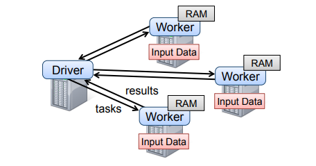
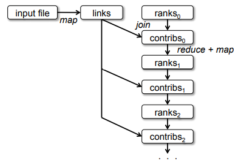
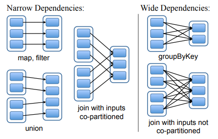
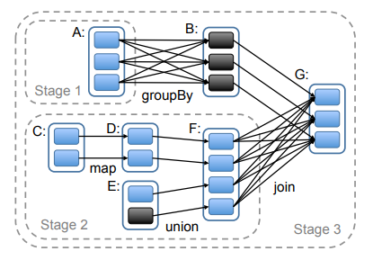

# [NSDI 2012] Resilient Distributed Datasets: A Fault-Tolerant Abstraction for In-Memory Cluster Computing

## 简介 Introduction

传统的集群计算框架如MapReduce**缺乏对分布式内存的充分利用**，大量采用了GFS类分布式文件系统来存储中间结果进行容错，参考[MapReduce执行流程](https://github.com/JasonYuchen/notes/blob/master/mit6.824/MapReduce.md#%E6%89%A7%E8%A1%8C%E6%B5%81%E7%A8%8B-execution-overview)，而迭代计算等需要充分缓存并利用中间结果的计算模型就会受到性能惩罚

Spark中设计了**弹性分布式数据集Resilient Distributed Datasets, RDDs**充分利用内存来加速计算，并从设计上实现了容错，并且允许应用程序使用一组算子operators精细粒度的设计数据分区、持久化策略、数据放置策略等

相比于传统的利用分布式内存的计算框架（容错的方式往往是复制replication，对数据量大时代价极大），RDD采用**原始数据+算子关系lineage**进行容错，在运行时仅需记录算子关系lineage而不是每次计算生成的中间结果，当RDD的数据分区丢失时只需要**根据原始数据和算子关系重新计算出丢失的数据**

## 弹性分布式数据集 Resilient Distributed Datasets, RDDs

### 1. 抽象 RDD Abstraction

RDD是**read-only partitioned**数据集，只能**通过确定性的deterministic操作从稳定存储或其他RDD上创建**，创建新RDD的操作叫做**transformation**，包括`map, filter, join`，并且RDD实际并不保存真实数据，而是保存如何从父RDD上诞生的计算关系，称为lineage，从而所有RDD都可以通过lineage最终追溯到唯一一份原始的稳定存储数据

应用程序可以从两个角度来控制RDDs：**持久化persistence**和**分区partitioning**，通过显式要求RDD存储策略或是指定分区的key来控制RDD

### 2. 编程接口 Spark Programming Interface

应用程序使用RDDs时通常首先通过**transformation操作**创建RDDs，例如`map, filter`，随后在RDDs上使用**action操作**进行计算获得结果或是输出结果给稳定存储，例如`count, collect, save`，并且所有操作都是**懒惰执行的lazy evaluation**，即只有在需要结果时才会真正执行计算

例如采用Spark设计一个从HDFS上抓取ERROR信息的程序：

```scala
// RDD backed by an HDFS file
lines = spark.textFile("hdfs://...")

// create new RDD by `filter` transformation
errors = lines.filter(_.startsWtih("ERROR"))

// explicitly ask an RDD to be persistence
errors.persist()

// calculate a result by `count` action
errors.filter(_.contains("MySQL")).count()
```

### 3. RDD的优势 Advantages of the RDD Model

|Aspect|Resilient Distributed Datasets, RDD|Distributed Shared Memory, DSM|
|:-:|:-:|:-:|
|**Reads**|Coarse- or fine-grained|Fine-grained|
|**Writes**|Coarse-grained|Fine-grained|
|**Consistency**|**Trivial** (immutable)|Up to app / runtime|
|**Fault recovery**|Fine-grained and low-overhead using **lineage**|Requires checkpoints and program rollback|
|**Straggler mitigation**|Possible using backup tasks|Difficult|
|**Work placement**|Automatic based on data **locality**|Up to app (runtimes aim for transparency)|
|**Behavior if not enough RAM**|Similar to existing data flow systems|Poor performance (swapping?)|

详细对比RDD和DSM如上表所示，其中RDD比较重要的优点为：

- RDD只需要**lineage就可以实现容错和恢复**，而DSM需要复杂耗时的checkpoint机制
- RDD是**不可变immutable类型**，从而可以轻易实现并行而不易出错，并且更容易**通过backup task来避免某个慢节点**
- RDD允许调度器根据数据局部性locality进行任务调度提升性能
- RDD在内存不足时可以**简单回退到基于扫描的操作**，不断从磁盘获取数据，获得类似基于磁盘的系统的性能

### 4. 不适合RDD的应用 Applications Not Suitable for RDDs

**RDD适合对数据批量执行相同操作的应用**，类似MapReduce的Map操作，从而对RDD包含的所有元素的修改，例如每个元素求平方和，只需要在lineage中记录一个操作`x -> x*x`即可，即RDD适合大数据分析型应用

## Spark Programming Interface

应用程序需要实现一个**driver**连接所有节点上的**workers**，由driver定义RDDs、执行操作以及追踪lineage，每一个节点上的worker是长期运行的服务，按需配给driver使用，将磁盘上的分布式数据读取进worker内存，并执行实际操作，如下图：



RDD提供的两大类操作如下（摘自论文原文，实际Spark目前支持的应该更多）：

- **Transformations**: `map, filter, flatMap, sample, groupByKey, reduceByKey, union, join, cogroup, crossProduct, mapValues, sort, partitionBy`
- **Actions**: `count, collect, reduce, lookup, save`

例如PageRank应用的一部分RDD算子关系图lineage如下：



## Representing RDDs

- **`partitions()`**: 返回一系列分区对象Partition objects
- **`preferredLocations(p)`**: 根据数据局部性，对分区`p`返回能够更快访问到的节点
- **`dependencies()`**: 返回一系列依赖
- **`iterator(p, parentIters)`**: 给定父分区`parentIter`的迭代器，通过父分区计算分区`p`的每个元素
- **`partitioner()`**: 返回RDD分区方式（hash/range）的分区元信息

在表达RDD依赖关系lineage时，将依赖关系分为一下两大类：

- **narrow**依赖：指父RDD的一个分区至多只被子RDD的一个分区依赖，例如`map`操作产生narrow依赖
  narrow依赖允许了**流水线执行操作pipelined**，例如`map -> filter`则在对RDD逐元素执行`map`时，执行完成的元素可以立即执行`filter`而不需要等待所有元素执行完`map`，同时在故障恢复时更简单，**仅需重新计算丢失父分区的单个子分区**即可，丢失不同父分区的子分区可以并行重新计算
- **wide**依赖：指父RDD的一个分区被子RDD的多个分区依赖，例如`join`操作产生wide依赖
  wide依赖要求所有父分区的数据都被计算完成并**通过`shuffle`操作重新分布**到所有节点上（类似MapReduce的中间过程），同时在故障恢复时更复杂，由于多个子分区依赖单个父分区，需要**所有子分区被重新计算**



## Implementation

### 1. 任务调度 Job Scheduling

当应用程序调用一个action操作时，调度器就会通过lineage生成执行策略图（**DAG of stages**），例如下图，在每个stage内部会包含尽可能多的**narrow依赖从而在stage内构建流水线**执行，而在**stage的边界就是wide依赖**：



调度器在执行任务时会将task基于数据的局部性分配到相应的服务器上，对于需要shuffle的wide依赖，每个节点将RDD计算的**中间结果物化存储materialized进行容错恢复**（类似MapReduce的中间过程），当一个task失败时，调度器就会在另一个节点上重新运行该task

### 2. 解释器集成 Interpreter Integration

由于Spark的全内存计算运行较快，因此通过集成解释器以允许交互式运行命令，并通过以下两点修改允许集群接收运行driver上的用户程序：

- Class shipping
- Modified code generation

### 3. 内存管理 Memory Management

Spark支持三种选项来持久化存储RDDs：

- 作为反序列化后的Java对象存储在内存中
- 作为序列化后的数据存储在内存中
- 存储在磁盘中

对于**所有的RDDs，采用LRU的方式进行内存管理**，当一个新的RDD分区需要被创建但是内存不足时，就会采用LRU汰换过时的分区（除非是同一个RDD下的另一个分区，往往同一个RDD内的分区短期会会被一起使用，此时会汰换另一个RDD的分区）

### 4. 快照支持 Support for Checkpointing

虽然采用原始数据和完整的lineage就可以进行任务的重新运行，但是考虑到计算的耗时（**尤其是wide依赖下需要重新计算所有分区数据**），Spark也支持在运行中进行快照checkpoint持久化保存中间结，从而减少故障恢复耗时

另外由于RDD都是**不可变对象immutable/read-only**且Spark并不关心一致性保证consistency，因此进行**异步checkpoint且不会阻塞正在执行的计算**，更为简单高效
