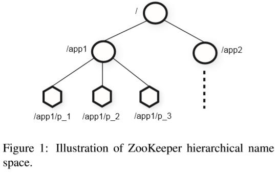
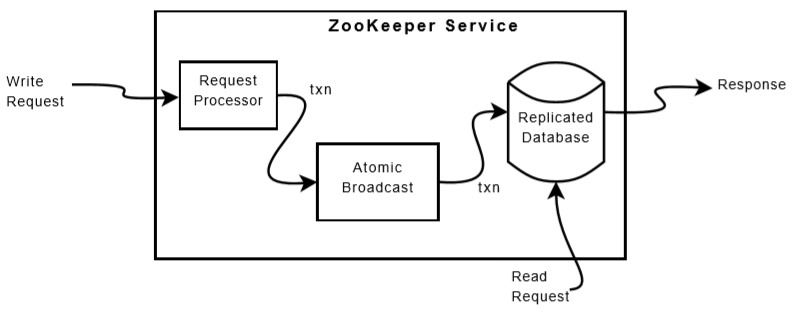

# [ATC 2010] ZooKeeper: Wait-free coordination for Internet-scale systems

## ZooKeeper服务

### 1. 服务概览 Service overview

ZooKeeper, ZK像向client提供一个层级命名空间hierarchical name space，类似UNIX系统的目录文件树，每个节点称为znode：



Client可以在ZK中操纵以下两种znode：

- **Regular常规节点**：client进行Regular节点的创建和删除
- **Ephemeral短暂节点**：client进行Ephemeral节点的创建和删除，或直到创建的session结束由ZK自动删除

同时在创建节点时，每个znode末尾会带上一个sequence number, SN，确保在**同一个父节点下，每个新创建的znode对应的SN一定不小于已经创建的znode的SN**，例如图中的`/app1/p_1, /app1/p_2, /app1/p_3`，继续创建就会生成`/app1/p_4`，而基础创建上一层的znode就会生成`/app3`

ZK提供一个**watch机制**，client可以在read操作时带上watch标志，从而ZK会在相应数据变化时主动通知client并且取消注册watch（即watch是单次的ont-time trigger，若session结束也会取消注册）

znode可以用来存储一些元数据，例如当一个分布式服务需要知道当前leader是谁，就可以通过读取该服务对应的znode从而获知leader写入的信息，即**服务发现service discovery**

Client每次连接到ZK都会创建一个相应的session，每个session有一个超时时间，当在超时时长内ZK没有收到任何数据时，就会被ZK直接结束，而在session内client可以透明的在多个ZK节点上读写，并且ZK保证client的请求都是顺序执行的FIFO

### 2. 客户端接口 Client API

`TODO`

### 3. ZooKeeper提供的保证 ZooKeeper guarantees

- **线性一致性写 Linearizable writes**：所有对ZK的update请求都是序列化的serializable
- **FIFO client order**：所有同一个client提交的请求都是按照发送顺序执行的，即一个client可以异步发送一系列请求，虽然后面的请求并非在前面的请求完成后才发送，但是ZK保证这些异步请求是按发送顺序执行的

注意，**读请求是直接在当前节点上执行的locally**，因此可能会读到非最新的数据，所以通常可以如下设计：

- 一个分布式应用的leader进行配置升级，删除ready node，进行配置修改，创建ready node，同时基于FIFO order，leader可以异步发送一系列配置升级的请求，ZK保证ready node在最后再被创建
- follower在见到ready node时才知道配置更新已完成，因为follower一定能看到ready node创建前的所有修改
- 如果follower先看到了删除前的ready node（设置了watch），则在看到修改了一半的配置前，一定先被watch机制通知了ready node的删除（[What ZooKeeper Guarantees about Watches](https://zookeeper.apache.org/doc/r3.4.0/zookeeperProgrammers.html#sc_WatchGuarantees)）

由于每个client实际读的是当前节点的数据，跨client并没有读同步（即**线性一致性读linearizable reads**），因此当client A完成写入并通过channle直接通知client B时，B若直接去读当前状态则可能会出现stale read，此时可以通过client B发起"write"进行序列化同步

### 4. 用法示例 Examples of primitives

## ZooKeeper应用

`TODO`

## ZooKeeper实现



### 1. 请求处理器 Request Processor

当收到用户请求时，ZK会计算出请求生效后的新状态，并将此状态包含在一个事务内，分配一个**事务号TXN**，ZK内的事务是幂等的idempotent

### 2. 原子广播 Atomic Broadcast

所有发给ZK的update请求都会被推送给ZK的leader，由leader进行请求处理并将修改用过ZooKeeper Atomic Broadcast, ZAB协议发送给ZK所有节点，ZAB协议内容见下述**2008 LADIS Asimple totally ordered broadcast protocol**

ZAB提供比AB更为严格的顺序保证，在leader上发生的所有修改，会按照修改的顺序发送给所有节点，同时若有新的leader，则**新leader会直到收到旧leader所有修改后，才会发送自身的修改给所有节点**，即类似Raft中只有log up-to-date的节点才会被选举为新leader

ZK使用ZAB选举出的leader作为ZK的leader，从而生成transaction的节点就是propose给ZAB的节点，由于ZAB并不持久化每条消息的id，因此在leader宕机恢复时可能会出现重复发送一条消息，但是ZK的transaction是幂等的，因此只要顺序一致即可

------------------------

> **2008 LADIS A simple totally ordered broadcast protocol**

#### 要求 Reuirements

在原子广播Atomic Broadcast的基础上，ZAB额外要求：

- **可靠传输 Reliable delivery**：若a被传达，则所有服务器上最终a都会被传达eventually
- **全序 Total order**：若一个服务器上a在b之前传达，则所有服务器上a都在b之前传达
- **因果 Causal order**：若b依赖a（即ab存在因果顺序），则a一定在b之前被传达

另外还要求：

- **前缀属性**：若leader已经传达了消息m，则所有在m之前的消息都已经被传达

ZAB考虑到下述两种因果关系causal relationships：

1. 如果propose的顺序是a,b，那么a因果上先于b
2. ZAB集群任意时刻内只允许有1个leader提供服务（强leader），并且一旦leader变更，则**旧leader的所有message都因果上先于新leader**，类似Raft新leader通过NoOP entry来隐式commit所有前任的message

#### Paxos与Zab的对比

`TODO: add comparison with Raft`

#### Zab协议 Protocol

Zab分为两个阶段**广播broadcast**和**恢复recovery**阶段，Zab首先进入recovery阶段进行snapshot加载、日志replay直到leader诞生且集群的majority和leader同步到最新阶段，就会进入broadcast阶段，broadcast阶段即Atomic Broadcast时只有leader能够发起broadcast，并且通过**限制recovery时诞生的leader就是broadcast阶段的leader**，从而**免除了需要从recover的leader（与majority同步且拥有最新数据）向broadcast的leader（只有此leader能够propose）发送message的要求**

1. **广播 broadcast**

    广播包含了简化的二阶段提交two-phase commit, 2PC：leader propose一个请求，收集votes，并commit；**一旦leader通过majority的votes确认并commit就会强制所有follower都接受该请求而不需要等到所有节点都确认**，并且如果失败也不存在回滚rollback，如果**失败通常说明leader不拥有quorum，此时会进入recovery模式等待合法的leader**

    通过使用**TCP协议来保证所有message都是FIFO**处理的（从而有client的FIFO保证），在propose一条消息时leader会赋予一个唯一的单调递增id即**zxid**，follower收到消息时就立即写入本地磁盘（尽可能批量化写入磁盘）后**返回ACK给leader**；当leader收到**majority的ACK时就会发送commit**并且deliver该消息，所有followers收到对应的commit时也会deliver该消息

    另外leader需要对每个follower都持续广播follower上还未有的消息，并且发送leader最新的commit值

2. **恢复 recovery**

   恢复时需要确保先前宕机的leader已经commit的消息在新leader上也会被commit，而先前leader上被跳过的消息（未能commit且新leader上已经有更新的commit）保持被跳过，通过**在选举时，确保leader一定含有最大的zxid来实现**，此时leader也一定有最新最全的消息从而不需要向follower获取最新的数据

   **zxid是一个64bit的数字，低32bit作为counter（类似Raft index），高32bit作为epoch（类似Raft term），每一次proposal都在当前counter上+1，而每次新leader出现时旧在当前epoch上+1且counter初始化为0**，从而确保在选举leader时直接比较zxid即可，高epoch的节点更新（更晚出现的leader），同epoch时高counter的节点更新

   当宕机重启的旧leader（较小的zxid）无法获取quorum并成为follower时，**leader会检查其epoch，并要求截断该epoch下committed proposal后的所有消息**

------------------------

### 3. 复制数据库 Replicated Database

ZK的每个节点都维护了一份内存中的replicated state machine, RSM，当节点宕机恢复时，就将ZK接收到的所有消息按顺序重放replay给RSM从而重建RSM的状态，同时为了减少磁盘空间占用以及减少重放时间，ZK会周期性的对RSM进行快照snapshot

**ZK在进行快照（ZK称为fuzzy snapshot）时并不会停止服务**，具体过程是ZK对tree进行DFS遍历并且原子的读取每个znode节点和数据持久化到磁盘上，因此由于并发快照和服务，所以所存储的快照并不等同于ZK的任一时刻的状态，但是由于**状态转换是幂等的，因此恢复时只要保证恢复的顺序**，同一个状态应用两次是不会有问题的，例如snapshot启动时，ZK此时包含有`/foo, f1, 1`和`/goo, g1, 1`，而在snapshot过程中ZK又收到了如下的transaction（从形式上可以明显看出是幂等的，保证transactions之间的顺序下，同一条transaction应用多次没有关系）：

```text
<transactionType, path, value, newVersion>

<SetDataTXN, /foo, f2, 2>
<SetDataTXM, /goo, g2, 2>
<SetDataTXM, /foo, f3, 3>
```

最终snapshot包含的状态可能是`/foo, f3, 3`和`/goo, g1, 1`，即`<SetDataTXN, /goo, g2, 2>`还未被包含进snapshot，此时如果宕机恢复，则首先应用snapshot，随后replay上述事务，从而状态就恢复到了`/foo, f3, 3`和`/goo, g3, 3`与宕机前一致（**replay从snapshot开始时后续收到事务开始，因此期间并发的事务可能会被应用多次，但保证replay结束即恢复完成时的状态与snapshot结束时的状态一致**）

### 4. Client-Server交互

- **处理写请求**
当ZK处理写请求时，会同时通知所有相关的watch，并且写请求独占而不会和其他写或读请求并发执行，从而确保了顺序，注意：**watch的触发是由client所连接的ZK节点单独负责的**

- **处理读请求**
读请求由所有ZK节点单独执行，每个读请求会被标记一个zxid，值为**当前节点所能看到的最新的一条transaction记录**，因此zxid相当于定义了部分顺序partial order，而**全局顺序是不能保证**的（例如其他节点已经commit了新的znode值，但是该节点还未收到这条transaction，导致本地读取到旧的znode值）

- **强制同步后的读请求**
ZK提供了`sync`命令可以显式强制同步当前节点到最新的transaction，从而后续发起`read`就可以返回执行`sync`命令时的最新数据；**`sync`命令充当一个屏障放在transaction队列中**，当leader在正常处理transaction时，随着commit到`sync`的位置，当前节点就确认此时已经有了最新的数据，若当前transaction队列为空，则需要 **显式添加一条noop transaction（通过commit此transaction才能确保leader依然是majority认可的合法leader，即数据是最新的，避免脑裂问题）** 后再跟随`sync`命令

- **连接到不同的ZK节点**
ZK在正常运行时，client请求的响应中会包含响应的zxid，即使系统空载时心跳中也包含了leader认可的最新zxid，从而当**client向其他ZK节点发起请求时，通过持有的zxid和ZK节点的最新zxid对比，当client zxid更大时，ZK节点就会在zxid追上client前拒绝建立新的session**，此时client可以寻找其他ZK节点或是等待，这样确保了client一定是单调读一致的monotonic read consistency，不会看到比已经看到的数据更旧的数据

- **session失败**
ZK通过超时来判断session的失效，因此当client没有任何请求时，需要定期发送心跳进行保活，同时如果client没有收到响应，也会尝试重新连接到其他ZK节点
