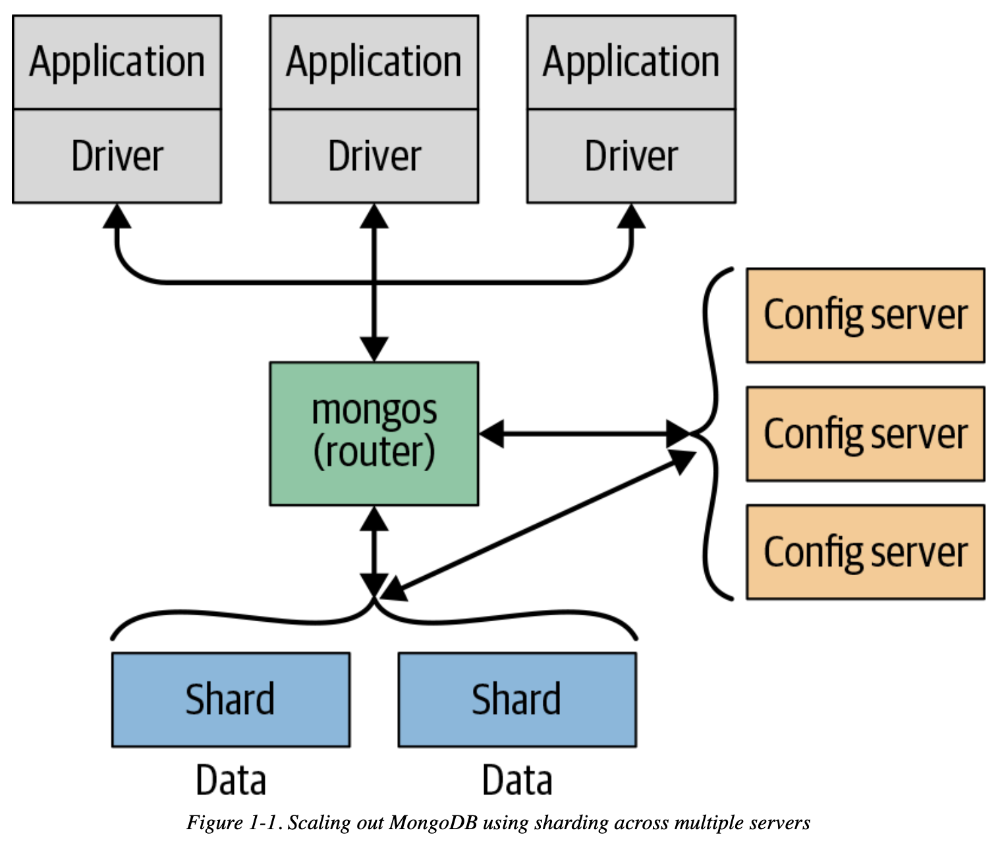

# Chapter 01 Introduction

- **Designed to Scale**

    

- **Features**
    - indexing, generic secondary indexes
    - aggregation, data processing pipelines
    - special collection and index types, TTL
    - file storage
- **Speed**
    - WiredTiger storage engine
