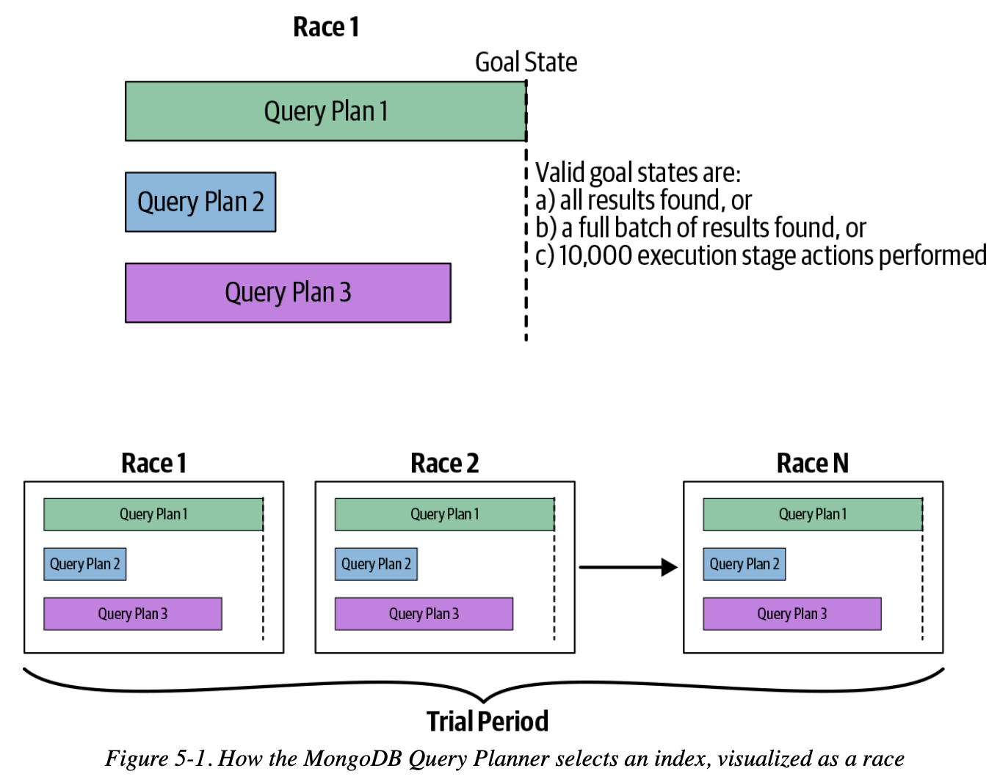

# Chapter 05 Indexes

## Introduction to Indexes

To enable MongoDB to respond to queries efficiently, all query patterns in your application should be supported by an **index**.

```
> db.users.createIndex({"username" : 1})
{
    "createdCollectionAutomatically" : false,
    "numIndexesBefore" : 1,
    "numIndexesAfter" : 2,
    "ok" : 1
}

// optimize the sort({"age" : 1, "username" : 1}) by a  compound index
> db.users.createIndex({"age" : 1, "username" : 1})
```

### How MongoDB Selects an Index

MongoDB chooses the best index by a **race**, and caches the winning index for subsequent queries with same query shape



### Using Compound Indexes

1. suppose we currently have these indexes

```
> db.students.createIndex({"class_id": 1})
> db.students.createIndex({"student_id": 1, "class_id": 1})
```

2. we want to query with following criteria

```
> db.students.find({"student_id": {"$gt": 500000}, "class_id": 54})
...          .sort({"student_id": 1})
...          .explain("executionStats")
```

3. the query plan used a compound index based on `student_id` and `class_id`

```
"totalKeysExamined": 850477,
"totalDocsExamined": 9903,
"nReturned": 9903,
"executionTimeMillis": 4325,

"winningPlan": {
  "stage": "FETCH",
  "inputStage": {
    "stage": "IXSCAN",
    "keyPattern": {
      "student_id": 1,
      "class_id": 1
    },”
```

4. the losing plan based on `class_id` was rejected because it needs in-memory sort on `student_id`

```
"rejectedPlans": [
  {
    "stage": "SORT",
    "sortPattern": {
      "student_id": 1
    },
```

5. use `hint` to override the query planner (not recommended way) as `class_id` could yield **higher selectivity**

```
> db.students.find({"student_id": {"$gt": 500000}, "class_id": 54})
...          .sort({"student_id": 1})
...          .hint({"class_id": 1})
...          .explain("executionStats")

"totalKeysExamined": 20076,
"totalDocsExamined": 20076,
"nReturned": 9903,
"executionTimeMillis": 272,
```

6. **create a best fit index for a query**, based on `class_id` and `student_id`

```
> db.students.createIndex({"class_id": 1, "student_id": 1})

"totalKeysExamined": 9903,
"totalDocsExamined": 9903,
"nReturned": 9903,
"executionTimeMillis": 37,
```

7. in-memory sort is always slower than sorting on indexed field, **try to avoid in-memory sort with a better index design**, e.g. an index based on `class_id` , `final_grade` and `student_id` will benefit following query

```
> db.students.find({"student_id": {"$gt": 500000}, "class_id": 54})
...          .sort({"final_grade": 1})
...          .explain("executionStats")

"executionTimeMillis": 136,
```

***Index schema notes***

- Keys for **equality filters** should appear first
- Keys **used for sorting** should appear before multi-value fields
- Keys for **multi-value filters** should appear last
- **Choosing key directions** for multi-key based sorting, `{"A": 1, "B": -1}` is the same as `{"A": -1, "B": 1}`
- **Using covered queries**, if an index already has all required values, which means actual documents are not needed, then the queries are covered
- **Implicit indexes**, if an index has N keys, then any **prefix of those keys** are implicit indexes

### How `$` Operators Use Indexes

- **Inefficient operators**

    negation (`$ne` , `$not`, `$nin`) is inefficient in general, need to scan almost the entire index, try to add other clauses to limit the result set for negation

- **Ranges**

    put fields that will be used in **exact matches first** (e.g. `"x": 1`) and **ranges last** (e.g. `"y": {"$gt": 3, "$lt": 5}`)

- **OR queries**

    MongoDB can only use on index per query, but for OR queries, `$or` can use **one index per `$or` clause**, and then merges the results, but doing two queries is much less efficient, **prefer `$in` to `$or`**

### Indexing Objects and Arrays

embedded object and array fields mostly behave the way normal index fields behave

- **Indexing embedded docs**

```
{
    "username" : "sid",
    "loc" : {
        "ip" : "1.2.3.4",
        "city" : "Springfield",
        "state" : "NY"
    }
}

> db.users.createIndex({"loc.city" : 1})
```

- **Indexing arrays**

    indexing an array creates an index entry for each element of the array, **more expensive** than single-value ones

```
> db.blog.createIndex({"comments.date" : 1})
```

- **Multi-key index implications**

    if any document has an array field for the indexed key, the index is flagged as a **multi-key index**, which is slower than normal index

### Index Cardinality

Cardinality refers to how many **distinct values** there are for a field in a collection. In general, **the greater the cardinality of a field**, the more helpful an index on that field can be.

try to create **indexes on high-cardinality keys** or at least **put high-cardinality keys first** in compound indexes

## `explain` Output

```json
> db.users.find({"age" : 42}).explain('executionStats')
{
    "queryPlanner" : {
        "plannerVersion" : 1,
        "namespace" : "test.users",
        "indexFilterSet" : false,
        "parsedQuery" : {
            "age" : {
                "$eq" : 42
            }
        },
        "winningPlan" : {
            "stage" : "FETCH",
            "inputStage" : {
                "stage" : "IXSCAN",
                "keyPattern" : {
                    "age" : 1,
                    "username" : 1
                },
                "indexName" : "age_1_username_1",
                
                // if this query used a multi-key index (array)
                "isMultiKey" : false,
                "multiKeyPaths" : {
                    "age" : [ ],
                    "username" : [ ]
                },
                "isUnique" : false,
                "isSparse" : false,
                "isPartial" : false,
                "indexVersion" : 2,
                "direction" : "forward",
                "indexBounds" : {
                    "age" : [
                        "[42.0, 42.0]"
                    ],
                    "username" : [
                        "[MinKey, MaxKey]"
                    ]
                }
            }
        },
        "rejectedPlans" : [ ]
    },
    "executionStats" : {
        "executionSuccess" : true,
        
        // the number of docs returned by the query
        "nReturned" : 8449,
        
        // the total execution time in milliseconds, lower is better
        "executionTimeMillis" : 15,
        
        // the number of index entries looked at, lower is better
        "totalKeysExamined" : 8449,
        
        // the numbder of times MongoDB had to follow an index pointer
        // to the actual document on disk, lower is better
        "totalDocsExamined" : 8449,
        "executionStages" : {
            "stage" : "FETCH",
            "nReturned" : 8449,
            "executionTimeMillisEstimate" : 10,
            "works" : 8450,
            "advanced" : 8449,
            "needTime" : 0,
            "needYield" : 0,
            "saveState" : 66,
            "restoreState" : 66,
            "isEOF" : 1,
            "invalidates" : 0,
            "docsExamined" : 8449,
            "alreadyHasObj" : 0,
            "inputStage" : {
                // MongoDB was able to fulfill this query using an index
                // "COLSCAN" means it had to perform a collection scan
                "stage" : "IXSCAN",
                "nReturned" : 8449,
                "executionTimeMillisEstimate" : 0,
                "works" : 8450,
                "advanced" : 8449,
                "needTime" : 0,
                
                // the number of times this query yielded (paused)
                // long running queries will preiodically release the
                // lock to allow a concurrent write request to proceed
                "needYield" : 0,
                "saveState" : 66,
                "restoreState" : 66,
                "isEOF" : 1,
                "invalidates" : 0,
                "keyPattern" : {
                    "age" : 1,
                    "username" : 1
                },
                "indexName" : "age_1_username_1",
                "isMultiKey" : false,
                "multiKeyPaths" : {
                    "age" : [ ],
                    "username" : [ ]
                },
                "isUnique" : false,
                "isSparse" : false,
                "isPartial" : false,
                "indexVersion" : 2,
                "direction" : "forward",
                
                // a description of how the index was used, giving
                // ranges of the index traversed
                "indexBounds" : {
                    "age" : [
                        "[42.0, 42.0]"
                    ],
                    "username" : [
                        "[MinKey, MaxKey]"
                    ]
                },
                "keysExamined" : 8449,
                "seeks" : 1,
                "dupsTested" : 0,
                "dupsDropped" : 0,
                "seenInvalidated" : 0
            }
        }
    },
    "serverInfo" : {
        "host" : "eoinbrazil-laptop-osx",
        "port" : 27017,
        "version" : "4.0.12",
        "gitVersion" : "5776e3cbf9e7afe86e6b29e22520ffb6766e95d4"
    },
    "ok" : 1
}
```

## When Not to Index

*Ideally, a good query planner should be aware of the statistics of the query and the data, make wise decisions accordingly*

| Indexes often work well for | Collection scans often work well for |
| :-------------------------- | ------------------------------------ |
| Large collections           | Small collections                    |
| Large documents             | Small documents                      |
| Selective queries           | Nonselective queries                 |

## Types of Indexes

### Unique Indexes

Unique indexes guarantee that **each value will appear at most once** in the index. (if some documents do not have indexed fields, consider **Partial Indexes** below)

```
> db.users.createIndex({"firstname" : 1}, 
... {"unique" : true, "partialFilterExpression":{"firstname": {$exists: true } } } )
{
    "createdCollectionAutomatically" : false,
    "numIndexesBefore" : 3,
    "numIndexesAfter" : 4,
    "ok" : 1
}

> db.users.insert({firstname: "bob"})
WriteResult({ "nInserted" : 1 })
> db.users.insert({firstname: "bob"})
WriteResult({
  "nInserted" : 0,
  "writeError" : {
    "code" : 11000,
    "errmsg" : "E11000 duplicate key error collection: test.users index: 
               firstname_1 dup key: { : \"bob\" }"
  }
})
```

compound unique indexes should have **a unique combination of values across all keys**

### Partial Indexes

combine the `unique` option with the `partial` option to allow unique indexes only if the key exists

## Index Administration

MongoDB holds all of the information about indexes in a system collection `sysmte.indexes`

```
> db.students.getIndexes()
[
    {
        "v" : 2,
        "key" : {
            "_id" : 1
        },
        "name" : "_id_",
        "ns" : "school.students"
    },
    {
        "v" : 2,
        "key" : {
            "class_id" : 1
        },
        "name" : "class_id_1",
        "ns" : "school.students"
    },
    {
        "v" : 2,
        "key" : {
            "student_id" : 1,
            "class_id" : 1
        },
        "name" : "student_id_1_class_id_1",
        "ns" : "school.students"
    }
]
```

### Identifying Indexes

by default, the name of an index is `keyname1_direction1_keyname2_direction2_...` , if the name is too long (`getLastError`), use `name` to manually assign a name to the index

```
> db.soup.createIndex({"a" : 1, "b" : 1, "c" : 1, ..., "z" : 1}, 
... {"name" : "alphabet"})
```

### Changing Indexes

```
> db.people.dropIndex("x_1_y_1")
{ "nIndexesWas" : 3, "ok" : 1 }
```

MongoDB uses a hybrid index build approach to build the index, only holds the lock at the beginning and the end of the index build. The build process **yields to interleaving read and write operations**.

**Creating indexes on existing documents is slightly faster** than creating the index first and then inserting all documents.
