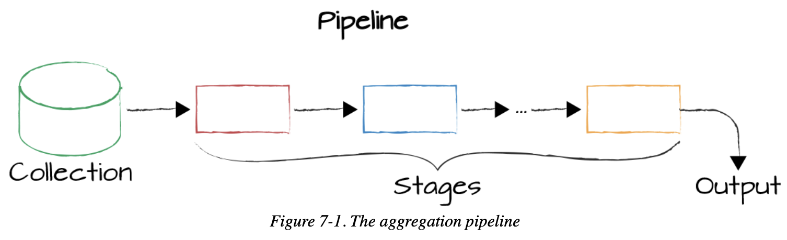
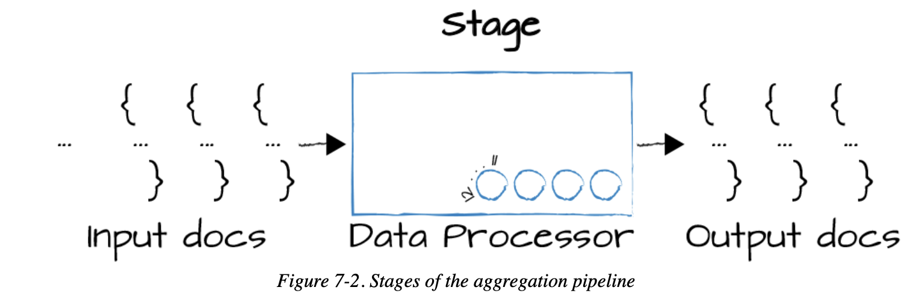
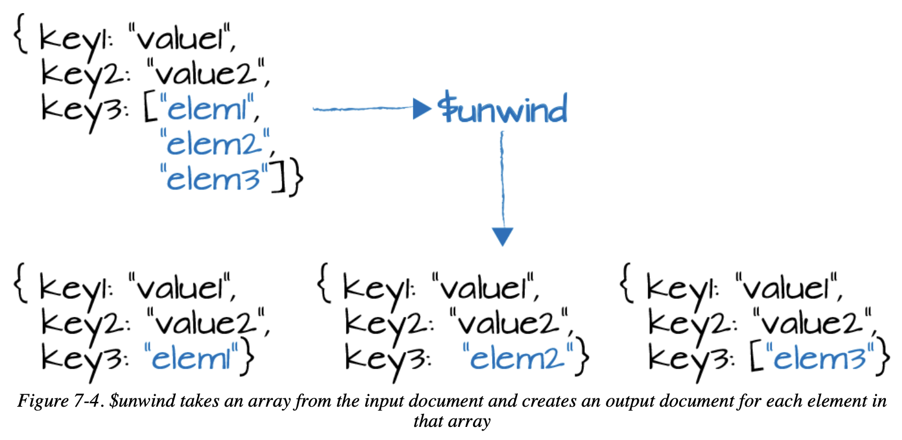

# Chapter 07 Introduction to the Aggregation Framework

## Pipelines, Stages, and Tunables





## Getting Started with Stages: Familiar Operations

Example document:

```
{
  "_id" : "52cdef7c4bab8bd675297d8e",
  "name" : "Facebook",
  "category_code" : "social",
  "founded_year" : 2004,
  "description" : "Social network",
  "funding_rounds" : [{
      "id" : 4,
      "round_code" : "b",
      "raised_amount" : 27500000,
      "raised_currency_code" : "USD",
      "funded_year" : 2006,
      "investments" : [
        {
          "company" : null,
          "financial_org" : {
            "name" : "Greylock Partners",
            "permalink" : "greylock"
          },
          "person" : null
        },
        {
          "company" : null,
          "financial_org" : {
            "name" : "Meritech Capital Partners",
            "permalink" : "meritech-capital-partners"
          },
          "person" : null
        },
        {
          "company" : null,
          "financial_org" : {
            "name" : "Founders Fund",
            "permalink" : "founders-fund"
          },
          "person" : null
        },
        {
          "company" : null,
          "financial_org" : {
            "name" : "SV Angel",
            "permalink" : "sv-angel"
          },
          "person" : null
        }
      ]
    },
    {
      "id" : 2197,
      "round_code" : "c",
      "raised_amount" : 15000000,
      "raised_currency_code" : "USD",
      "funded_year" : 2008,
      "investments" : [
        {
          "company" : null,
          "financial_org" : {
            "name" : "European Founders Fund",
            "permalink" : "european-founders-fund"
          },
          "person" : null
        }
      ]
    }],
  "ipo" : {
    "valuation_amount" : NumberLong("104000000000"),
    "valuation_currency_code" : "USD",
    "pub_year" : 2012,
    "pub_month" : 5,
    "pub_day" : 18,
    "stock_symbol" : "NASDAQ:FB"
  }
}
```

Example use of `match` , `project` , `sort` , `skip` , `limit` stages

```
db.companies.aggregate([
  {$match: {founded_year: 2004}},
  {$sort: {name: 1}},
  {$skip: 10},
  {$limit: 5},
  {$project: { _id: 0, name: 1}},
])

{"name": "1915 Studios"}
{"name": "1Scan"}
{"name": "2GeeksinaLab"}
{"name": "2GeeksinaLab"}
{"name": "2threads"}
```

## Expressions

- **Boolean**: `AND` , `OR` , `NOT`
- **Set**: intersection, union of more sets
- **Comparison**: range filters
- **Arithmetic**: calculate the ceiling, floor, etc
- **String**: concatenate, find substrings, etc
- **Array**: filter array elements, slice, etc
- **Variable**: work with literals, expressions for parsing date, conditional expressions, etc
- **Accumulators**: sums, descriptive statistics, etc

## `$project`

**Promoting nested fields**

- `_id: 0`: suppress the `_id`
- `name: 1`: include the `name`
- `$ipo.pub_year`: promote the nested field from `ipo`, make those the values of top-level fields in the output, use `$` to indicate that the values should be interpreted as field paths

```
db.companies.aggregate([
  {$match: {"funding_rounds.investments.financial_org.permalink": "greylock" }},
  {$project: {
    _id: 0, 
    name: 1,
    ipo: "$ipo.pub_year",
    valuation: "$ipo.valuation_amount",
    funders: "$funding_rounds.investments.financial_org.permalink"
  }}
]).pretty()

{
  "name" : "Facebook",
  "ipo" : 2012,
  "valuation" : NumberLong("104000000000"),
  "funders" : [
    [
      "greylock",
      "meritech-capital-partners",
      "founders-fund",
      "sv-angel"
    ],
    ...
  ]
}
```

## `$unwind`



```
db.companies.aggregate([
  {$match: {"funding_rounds.investments.financial_org.permalink": "greylock"} },
  {$project: {
    _id: 0,
    name: 1,
    amount: "$funding_rounds.raised_amount",
    year: "$funding_rounds.funded_year"
  }}
])

{
  "name" : "Digg",
  "amount" : [
    8500000,
    2800000,
    28700000,
    5000000
  ],
  "year" : [
    2006,
    2005,
    2008,
    2011
  ]
}
```

- `$unwind: "$funding_rounds"`: unwind the `funding_rounds` array

```
db.companies.aggregate([
  { $match: {"funding_rounds.investments.financial_org.permalink": "greylock"} },
  { $unwind: "$funding_rounds" },
  { $project: {
    _id: 0,
    name: 1,
    amount: "$funding_rounds.raised_amount",
    year: "$funding_rounds.funded_year"
  } }
])

{"name": "Digg", "amount": 8500000, "year": 2006 }
{"name": "Digg", "amount": 2800000, "year": 2005 }
{"name": "Digg", "amount": 28700000, "year": 2008 }
{"name": "Digg", "amount": 5000000, "year": 2011 }
{"name": "Facebook", "amount": 500000, "year": 2004 }
{"name": "Facebook", "amount": 12700000, "year": 2005 }
...
```

- use `$match` after `$unwind` to further refine the results, only keeps the funding rounds that `greylock` participated

```
db.companies.aggregate([
  { $match: {"funding_rounds.investments.financial_org.permalink": "greylock"} },
  { $unwind: "$funding_rounds" },
  { $match: {"funding_rounds.investments.financial_org.permalink": "greylock"} },
  { $project: {
    _id: 0,
    name: 1,
    individualFunder: "$funding_rounds.investments.person.permalink",
    fundingOrganization: "$funding_rounds.investments.financial_org.permalink",
    amount: "$funding_rounds.raised_amount",
    year: "$funding_rounds.funded_year"
  } }
])
```

## Array Expressions

- filter expression to select a subset of the elements in an array
    - user `as` to define a variable within filter expression
    - **use `$$` to reference a variable** defined within the expression we're working in

```
db.companies.aggregate([
  { $match: {"funding_rounds.investments.financial_org.permalink": "greylock"} },
  { $project: {
    _id: 0,
    name: 1,
    founded_year: 1,
    rounds: { $filter: {
      input: "$funding_rounds",
      as: "round",
      cond: { $gte: ["$$round.raised_amount", 100000000] } } }
  } },
  { $match: {"rounds.investments.financial_org.permalink": "greylock" } },
]).pretty()
```

- use `$arrayElemAt` operator to select an element at a particular slot

```
db.companies.aggregate([
  { $match: { "founded_year": 2010 } },
  { $project: {
    _id: 0,
    name: 1,
    founded_year: 1,
    first_round: { $arrayElemAt: [ "$funding_rounds", 0 ] },
    last_round: { $arrayElemAt: [ "$funding_rounds", -1 ] }
  } }
]).pretty()
```

- use `$slice` operator to return multiple items

```
db.companies.aggregate([
  { $match: { "founded_year": 2010 } },
  { $project: {
    _id: 0,
    name: 1,
    founded_year: 1,
    early_rounds: { $slice: [ "$funding_rounds", 1, 3 ] }
  } }
]).pretty()
```

- use `$size` to calculate the size of the array

```
db.companies.aggregate([
  { $match: { "founded_year": 2004 } },
  { $project: {
    _id: 0,
    name: 1,
    founded_year: 1,
    total_rounds: { $size: "$funding_rounds" }
  } }
]).pretty()
```

[Many more operators available in MongoDB](https://www.mongodb.com/docs/manual/reference/operator/aggregation/#aggregation-operators)

## Accumulators

- Using Accumulators in **Project** Stages (apply to **arrays** in a single document)

```
db.companies.aggregate([
  { $match: { "funding_rounds": { $exists: true, $ne: [ ]} } },
  { $project: {
    _id: 0,
    name: 1,
    largest_round: { $max: "$funding_rounds.raised_amount" }
  } }
])

{ "name" : "Wetpaint", "largest_round" : 25000000 }
{ "name" : "Digg", "largest_round" : 28700000 }
{ "name" : "Facebook", "largest_round" : 1500000000 }
{ "name" : "Omnidrive", "largest_round" : 800000 }
```

## Introduction to Grouping

- use `_id` to define how to organize the documents, i.e. `GROUP BY`

```
db.companies.aggregate([
  { $group: {
    _id: { founded_year: "$founded_year" },
    average_number_of_employees: { $avg: "$number_of_employees" }
  } },
  { $sort: { average_number_of_employees: -1 } }
])

{ "_id" : { "founded_year" : 1847 }, "average_number_of_employees" : 405000 }
{ "_id" : { "founded_year" : 1896 }, "average_number_of_employees" : 388000 }
{ "_id" : { "founded_year" : 1933 }, "average_number_of_employees" : 320000 }
{ "_id" : { "founded_year" : 1915 }, "average_number_of_employees" : 186000 }
{ "_id" : { "founded_year" : 1903 }, "average_number_of_employees" : 171000 }
...
```

## Writing Aggregation Pipeline Results to a Collection

- use `$merge` to write the results to any database and collection, sharded or not, and can create on-demand materialized views
