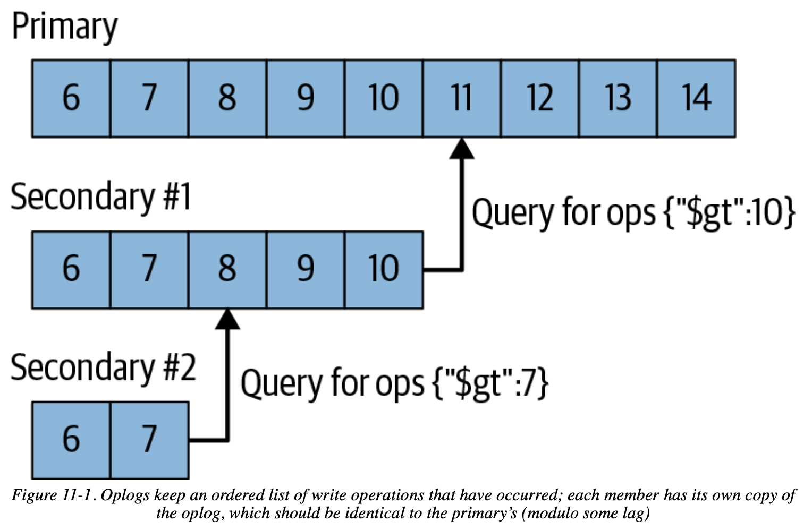

# Chapter 11 Components of a Replica Set

## Syncing

MongoDB keeps a log of operations, *oplog*, that is a capped collection lives in the local database



- **Initial Sync**

    initial sync to **copy all the non-local-database data** from one member of the replica set to another member, any existing data on the target member will be dropped

    **prefer restoring from a backup** to initial sync, restoring is often faster

- **Replication**

    secondary members copy the *oplog* from their sync source and **apply these (deterministic) operations in an asynchronous process**, the **sync source maybe changed as needed** based on the ping time and the state of other members' replication

- **Handling Staleness**

    a secondary becomes **stale** if falls too far behind (due to capped *oplog*) the sync source, and if there is no one with long-enough oplog, a stale member will halt and needs to be **fully resynced or restored** from a more recent backup

    have **a large enough oplog**, e.g. the oplog should cover 3 days' worth of normal operations.

## Heartbeats

a member sends out a *heartbeat* request to every other member of the set to check everyone's **member state**:

- `STARTUP`: first started, once the configuration has been loaded -> `STARTUP2`
- `STARTUP2`: throughout the initial sync process, once start to handle replication and election -> `RECOVERING`
- `RECOVERING`: is operating correctly but is not available for reads
- `ARBITER`: for arbiters only
- `DOWN`: unreachable members
- `UNKNOWN`: if a member has never been able to reach another member, its state is unknown
- `REMOVED`: has been removed from the set, once added back -> `NORMAL`
- `ROLLBACK`: is rolling back data, once completed -> `RECOVERING`

## Elections

A member will seek election if it **cannot reach a primary** and is itself **eligible to become primary**. If it did not receive a majority if votes, it will remain a secondary and may try to become a primary again later. (See RAFT paper, election)

## Rollbacks

If a primary does a write but soon goes down before the secondaries have a chance to replicate it (**not committed write**), the next primary elected may not have the write, then the restarted "primary" member will become secondary and **rollback its uncommitted write**. (See RAFT paper, replication flow control)

```
Fri Oct  7 06:30:35 [rsSync] replSet syncing to: server-1
Fri Oct  7 06:30:35 [rsSync] replSet our last op time written: Oct  7 
    06:30:05:3 
Fri Oct  7 06:30:35 [rsSync] replset source's GTE: Oct  7 06:30:31:1
Fri Oct  7 06:30:35 [rsSync] replSet rollback 0
Fri Oct  7 06:30:35 [rsSync] replSet ROLLBACK
Fri Oct  7 06:30:35 [rsSync] replSet rollback 1
Fri Oct  7 06:30:35 [rsSync] replSet rollback 2 FindCommonPoint
Fri Oct  7 06:30:35 [rsSync] replSet info rollback our last optime:   Oct  7 
    06:30:05:3
Fri Oct  7 06:30:35 [rsSync] replSet info rollback their last optime: Oct  7 
    06:30:31:2
Fri Oct  7 06:30:35 [rsSync] replSet info rollback diff in end of log times: 
    -26 seconds
Fri Oct  7 06:30:35 [rsSync] replSet rollback found matching events at Oct  7 
    06:30:03:4118
Fri Oct  7 06:30:35 [rsSync] replSet rollback findcommonpoint scanned : 6
Fri Oct  7 06:30:35 [rsSync] replSet replSet rollback 3 fixup
Fri Oct  7 06:30:35 [rsSync] replSet rollback 3.5
Fri Oct  7 06:30:35 [rsSync] replSet rollback 4 n:3
Fri Oct  7 06:30:35 [rsSync] replSet minvalid=Oct  7 06:30:31 4e8ed4c7:2
Fri Oct  7 06:30:35 [rsSync] replSet rollback 4.6
Fri Oct  7 06:30:35 [rsSync] replSet rollback 4.7
Fri Oct  7 06:30:35 [rsSync] replSet rollback 5 d:6 u:0
Fri Oct  7 06:30:35 [rsSync] replSet rollback 6
Fri Oct  7 06:30:35 [rsSync] replSet rollback 7
Fri Oct  7 06:30:35 [rsSync] replSet rollback done
Fri Oct  7 06:30:35 [rsSync] replSet RECOVERING
Fri Oct  7 06:30:36 [rsSync] replSet syncing to: server-1
Fri Oct  7 06:30:36 [rsSync] replSet SECONDARY
```
