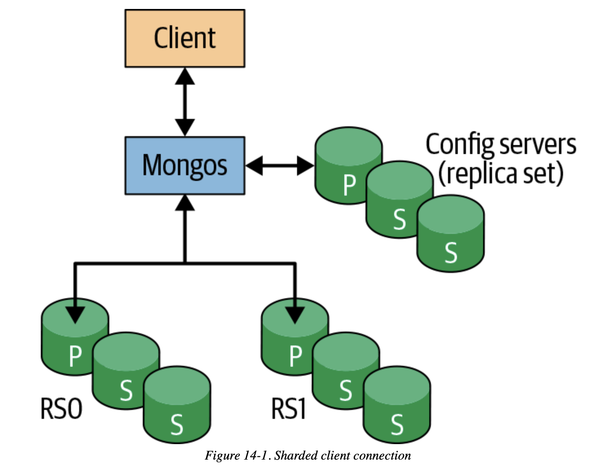
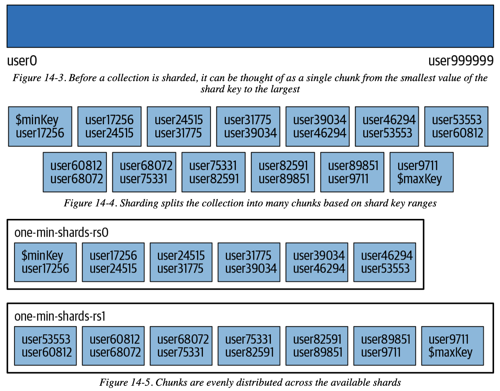

# Chapter 14 Introduction to Sharding

## What is Sharding?

```
st = ShardingTest({
  name:"one-min-shards",
  chunkSize:1,
  shards:2,
  rs:{
    nodes:3,
    oplogSize:10
  },
  other:{
    enableBalancer:true
  }
});
```

- 2 shards
- 3 replicas per shard
- all shards **must be replica sets**



- An **index** is required for the sharding key

```
> sh.enableSharding("accounts")
> db.users.createIndex({"username" : 1})
> sh.shardCollection("accounts.users", {"username" : 1})
```

- 13 chunks, `{"username": min} -->> {"username": max}`
- 6 chunks on shard0 `rs0`, 7 chunks on shard1 `rs1`



```
> sh.status()
--- Sharding Status --- 
sharding version: {
  "_id" : 1,
  "minCompatibleVersion" : 5,
  "currentVersion" : 6,
  "clusterId" : ObjectId("5a4f93d6bcde690005986071")
}
shards:
  {  "_id" : "one-min-shards-rs0", 
     "host" : 
       "one-min-shards-rs0/MBP:20000,MBP:20001,MBP:20002",  
     "state" : 1 }
  {  "_id" : "one-min-shards-rs1",  
     "host" : 
       "one-min-shards-rs1/MBP:20003,MBP:20004,MBP:20005",
     "state" : 1 }
active mongoses:
  "3.6.1" : 1
autosplit:
  Currently enabled: no
balancer:
  Currently enabled:  yes
  Currently running:  no
  Failed balancer rounds in last 5 attempts:  0
  Migration Results for the last 24 hours: 
    6 : Success
databases:
  {  "_id" : "accounts",  "primary" : "one-min-shards-rs1",  
     "partitioned" : true }
accounts.users
  shard key: { "username" : 1 }
  unique: false
  balancing: true
  chunks:
    one-min-shards-rs0	6
    one-min-shards-rs1	7
    { "username" : { "$minKey" : 1 } } -->> 
      { "username" : "user17256" } on : one-min-shards-rs0 Timestamp(2, 0) 
    { "username" : "user17256" } -->> 
      { "username" : "user24515" } on : one-min-shards-rs0 Timestamp(3, 0) 
    { "username" : "user24515" } -->> 
      { "username" : "user31775" } on : one-min-shards-rs0 Timestamp(4, 0) 
    { "username" : "user31775" } -->> 
      { "username" : "user39034" } on : one-min-shards-rs0 Timestamp(5, 0) 
    { "username" : "user39034" } -->> 
      { "username" : "user46294" } on : one-min-shards-rs0 Timestamp(6, 0) 
    { "username" : "user46294" } -->> 
      { "username" : "user53553" } on : one-min-shards-rs0 Timestamp(7, 0) 
    { "username" : "user53553" } -->> 
      { "username" : "user60812" } on : one-min-shards-rs1 Timestamp(7, 1) 
    { "username" : "user60812" } -->> 
      { "username" : "user68072" } on : one-min-shards-rs1 Timestamp(1, 7) 
    { "username" : "user68072" } -->> 
      { "username" : "user75331" } on : one-min-shards-rs1 Timestamp(1, 8) 
    { "username" : "user75331" } -->> 
      { "username" : "user82591" } on : one-min-shards-rs1 Timestamp(1, 9) 
    { "username" : "user82591" } -->> 
      { "username" : "user89851" } on : one-min-shards-rs1 Timestamp(1, 10) 
    { "username" : "user89851" } -->> 
      { "username" : "user9711" } on : one-min-shards-rs1 Timestamp(1, 11) 
    { "username" : "user9711" } -->> 
      { "username" : { "$maxKey" : 1 } } on : one-min-shards-rs1 Timestamp(1, 12) 
    {  "_id" : "config",  "primary" : "config",  "partitioned" : true }
config.system.sessions
  shard key: { "_id" : 1 }
  unique: false
  balancing: true
  chunks:
    one-min-shards-rs0	1
    { "_id" : { "$minKey" : 1 } } -->> 
      { "_id" : { "$maxKey" : 1 } } on : one-min-shards-rs0 Timestamp(1, 0)
```

- query on the sharding key (**targeted queries**), `"shards": [{...}]` hit `rs0`
- query for all shards (**scatter-gather / broadcast queries**), `"shards": [{...}, {...}]` need to access all shards

```
> db.users.find({username: "user12345"}}).explain()
{
  "queryPlanner" : {
    "mongosPlannerVersion" : 1,
    "winningPlan" : {
      "stage" : "SINGLE_SHARD",
      "shards" : [{
    "shardName" : "one-min-shards-rs0",
    "connectionString" :
      "one-min-shards-rs0/MBP:20000,MBP:20001,MBP:20002",
    "serverInfo" : {
        "host" : "MBP",
        "port" : 20000,
      "version" : "3.6.1",
      "gitVersion" : "025d4f4fe61efd1fb6f0005be20cb45a004093d1"
    },
    "plannerVersion" : 1,
    "namespace" : "accounts.users",
    "indexFilterSet" : false,
    "parsedQuery" : {
        "username" : {
         "$eq" : "user12345"
       }
    },
```
