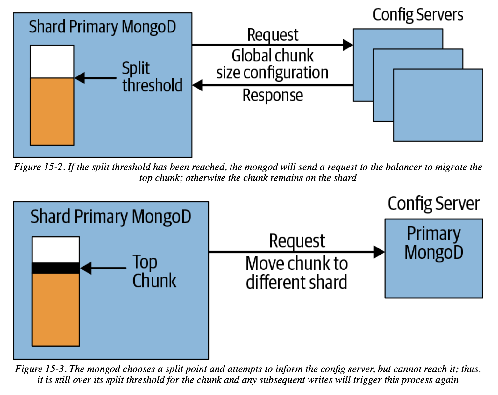

# Chapter 15 Configuring Sharding

## Starting the Servers

### Config Servers

Extremely important:

- enable journaling
- store data on non-ephemeral drives
- consist of at least 3 members
- be on a separate physical machine (preferable geographically distributed)
- deploy before any other components

```
$ mongod --configsvr --replSet configRS --bind_ip localhost,198.51.100.51 mongod 
  --dbpath /var/lib/mongodb
 
$ mongod --configsvr --replSet configRS --bind_ip localhost,198.51.100.52 mongod 
  --dbpath /var/lib/mongodb
 
$ mongod --configsvr --replSet configRS --bind_ip localhost,198.51.100.53 mongod 
  --dbpath /var/lib
```

```
> rs.initiate(
  {
    _id: "configRS",
    configsvr: true,
    members: [
      { _id : 0, host : "cfg1.example.net:27019" },
      { _id : 1, host : "cfg2.example.net:27019" },
      { _id : 2, host : "cfg3.example.net:27019" }
    ]
  }
)
```

### The `mongos` Processes

- no need of a data directory, `mongos` holds no data itself
- start a small number of `mongos` (at least 2, pooling)
- locate `mongos` as close to all the shards as possible

```
$ mongos --configdb \
  configRS/cfg1.example.net:27019,cfg2.example.net:27019,cfg3.example.net:27019 \
--bind_ip localhost,198.51.100.100 --logpath /var/log/mongos.log
```

### Adding a Shard from a Replica Set

1. find out primary and secondaries
2. restart the secondaries with `--shardsvr` option
3. connect to the primary and trigger election by `rs.stepDown()`
4. restart the former primary with `--shardsvr` option
5. connect to the `admin` database of the `mongos`
6. add a shard to the cluster by `sh.addShard()`
7. switch all clients to contacting the `mongos` immediately

### Adding Capacity

To add a new empty shard, create a replica set with a distinct name and `addShard`

### Sharding Data

Explicitly enable sharding for the database and the collection.

```
> db.enableSharding("music")
> sh.shardCollection("music.artists", {"name" : 1})
```

- An index is required for sharding key.
- Pre-splitting a large collections can reduce initial balancing time.

## How MongoDB Tracks Cluster Data

MongoDB groups documents into chunks (**range partition**), and **automatically splits** large chunks

### Chunk Ranges

```
> db.chunks.find(criteria, {"min" : 1, "max" : 1})
{
    "_id" : "test.users-age_-100.0",
    "min" : {"age" : -100},
    "max" : {"age" : 23}
}
{
    "_id" : "test.users-age_23.0",
    "min" : {"age" : 23},
    "max" : {"age" : 100}
}
{
    "_id" : "test.users-age_100.0",
    "min" : {"age" : 100},
    "max" : {"age" : 1000}
}
```

**Compound shard key**

```
{
    "_id" : "test.users-username_MinKeyage_MinKey",
    "min" : {
        "username" : { "$minKey" : 1 },
        "age" : { "$minKey" : 1 }
    },
    "max" : {
        "username" : "user107487",
        "age" : 73
    }
}
{
    "_id" : "test.users-username_\"user107487\"age_73.0",
    "min" : {
        "username" : "user107487",
        "age" : 73
    },
    "max" : {
        "username" : "user114978",
        "age" : 119
    }
}
{
    "_id" : "test.users-username_\"user114978\"age_119.0",
    "min" : {
        "username" : "user114978",
        "age" : 119
    },
    "max" : {
        "username" : "user122468",
        "age" : 68
    }
}
```

### Splitting Chunks

- one chunk is too large -> **split** to two chunks
    - having a variety of values for the shard key is important
- one shard has too many chunks -> **rebalance** to other shards



**split storm**: if config server is down, mongod repeatedly requests splitting and fails, degrading the whole system

## The Balancer

The balancer is a background process on the primary of the config server replica set.

## Collations

Collations in MongoDB allow for the specification of **language-specific** rules for string comparison. requirements:

- an index whose prefix is the shard key
- a collation on the index `{ locale: "simple" }`

## Change Streams

Change Streams (CDC) allow applications to track real-time changes to the data in the database.

In a sharded cluster, all change stream operations must be issued against a `mongos`, and the changes are ordered based on a **global logical clock**
