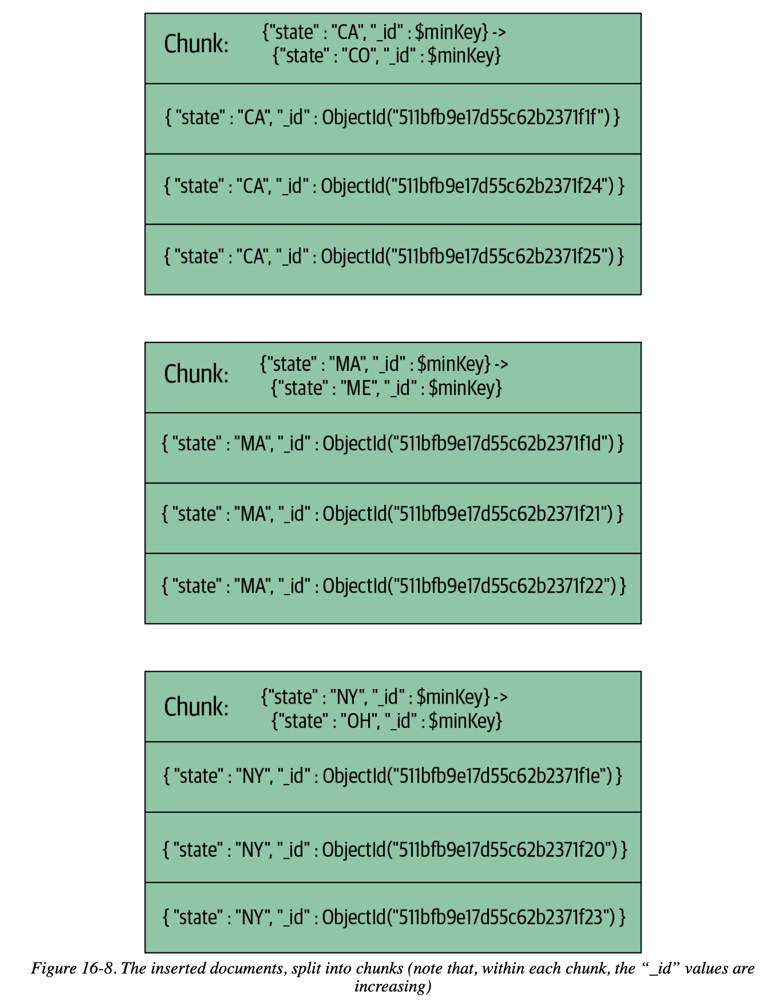

# Chapter 16 Choosing a Shard Key

## Taking Stock of Your Usage

- How many shards are you planning to grow to?
    - Avoid firing off queries that can hit all shards
    - Almost all queries must **include the shard key**
- Are you sharding to decrease read or write latency?
- Are you sharding to increase read or write throughput?
- Are you sharding to increase system resources?

## Picturing Distributions

- **Ascending Shard Keys**

    E.g. object id, date, every subsequent insert will be into the max chunk

    - the max chunk will be the only one growing and splitting
    - more difficult to keep chunks evenly balanced

- **Randomly Distributed Shard Keys**

    E.g. UUIDs, usernames, emails, the inserts should hit every chunk fairly evenly due to the data's random nature

    - shards should grow at roughly the same rate
    - not efficient at randomly accessing data beyond the size of RAM

- **Location-Based Shard Keys**

    E.g. user's IP, address, a location-based key is a key where documents with ***some similarity fall into a range*** based on this field, especially useful for putting data close to its users and fulfill some legal requirement like GDPR

    - **Zoned Sharding**
    - **Zone-aware Rebalancing**, balancer will attempt to move chunks with those ranges to those shards (background process, not immediate)

    ```
    > sh.addShardToZone("shard0000", "USPS")
    > sh.addShardToZone("shard0000", "Apple")
    > sh.addShardToZone("shard0002", "Apple")

    > sh.updateZoneKeyRange("test.ips", {"ip" : "056.000.000.000"}, 
    ... {"ip" : "057.000.000.000"}, "USPS")

    > sh.updateZoneKeyRange("test.ips", {"ip" : "017.000.000.000"}, 
    ... {"ip" : "018.000.000.000"}, "Apple")
    ```

## Shard Key Strategies

- **Hashed Shard Key**

    for loading data as fast as possible, a hashed shard key can make any field randomly distributed

    - use **an ascending key in a lot of queries** but want **writes to be randomly distributed**
    - can never do a **targeted range query**

    ```
    > db.users.createIndex({"username" : "hashed"})
    > sh.shardCollection("app.users", {"username" : "hashed"})
    { "collectionsharded" : "app.users", "ok" : 1 }
    ```

- **Hashed Shard Keys for GridFS**

    an hashed index on the `files_id` field of the GridFS chunks is a good option

    - files will be randomly distributed across the cluster
    - a file (with GridFS chunks) will always be contained in a single sharding chunk
    - `fs.files` collection may or may not need to be sharded as it will be much smaller than `fs.chunks`

    ```
    > db.fs.chunks.ensureIndex({"files_id" : "hashed"})
    > sh.shardCollection("test.fs.chunks", {"files_id" : "hashed"})
    { "collectionsharded" : "test.fs.chunks", "ok" : 1 }
    ```

- **The Firehose Strategy**

    let **powerful servers handle proportionally more load** by **zoned sharding**

    - all inserts will be routed to the `10x` zone
    - setup a cronjob to update the key range of the zone to allow moving old chunks to other shards

    ```
    > sh.addShardToZone("<shard-name>", "10x")
    > sh.updateZoneKeyRange("<dbName.collName>", {"_id" : ObjectId()}, 
    ... {"_id" : MaxKey}, "10x")


    // e.g. update key range once a day
    > use config
    > var zone = db.tags.findOne({"ns" : "<dbName.collName>", 
    ... "max" : {"<shardKey>" : MaxKey}})
    > zone.min.<shardKey> = ObjectId()
    > db.tags.save(zone)
    ```

- **Multi-Hotspot**

    Standalone `mongod` servers are good at ascending/sequential writes, sharded clusters are good at evenly distributed writes, use a **compound shard key** to create multiple hotspots: **writes are evenly balanced across the cluster and ascending within a single shard**

    - the first value is a rough, random value with low-ish cardinality
    - the second value is an ascending key

    

## Shard Key Rules and Guidelines

- **Shard Key Limitations**

    cannot be arrays, most special types of indexes cannot be used for shard keys

- **Shard Key Cardinality**

    as with indexes, sharding performs better on high-cardinality fields, try to use compound shard key for low-cardinality fields

## Controlling Data Distribution

- **Using a Cluster for Multiple Databases and Collections**

    use **zoned sharding** to manually specify the data placement, e.g. only high value collections should be placed at powerful shards

    assigning a zone key range to a collection does not affect it instantly. It is **an instruction to the balancer** stating that, when it runs, these are the viable targets to move the collection to.

    ```
    > sh.addShardToZone("shard0000", "high")
    > // shard0001 - no zone
    > // shard0002 - no zone
    > // shard0003 - no zone
    > sh.addShardToZone("shard0004", "low")
    > sh.addShardToZone("shard0005", "low")

    // for all values in super.important, store them on *high* shards
    > sh.updateZoneKeyRange("super.important", {"<shardKey>" : MinKey}, 
    ... {"<shardKey>" : MaxKey}, "high")

    // for some.logs, store them on *low* shards
    > sh.updateZoneKeyRange("some.logs", {"<shardKey>" : MinKey}, 
    ... {"<shardKey>" : MaxKey}, "low")

    // modify the shard-zone mapping
    > sh.removeShardFromZone("shard0005", "whatever")

    // modify the zone range
    > sh.removeRangeFromZone("some.logs", {"<shardKey>" : MinKey}, 
    ... {"<shardKey>" : MaxKey})
    ```

- **Manual Sharding**

    by **turning off the balancer and using `moveChunk` command**, you can manually control the placement of chunks

    - always prefer MongoDB's automatic sharding
    - use zoned sharding if have special requirements of placement
    - do manual sharding with great care

    ```
    > sh.stopBalancer()

    > sh.moveChunk(
    ... "test.manual.stuff", 
    ... {user_id: NumberLong("-1844674407370955160")}, 
    ... "test-rs1")
    ```
