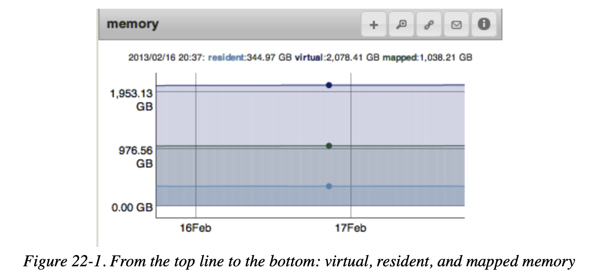
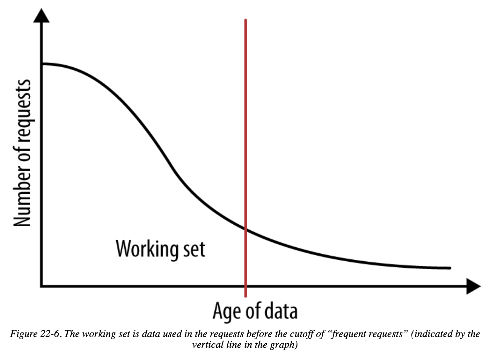
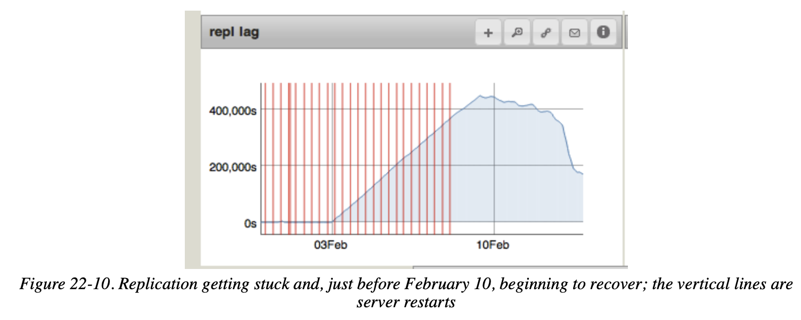

# Chapter 22 Monitoring MongoDB

## Monitoring Memory Usage

### Tracking Memory Usage

- **Resident Memory**

    MongoDB explicitly owns in RAM, if the dataset fits entirely in memory, the resident memory should be approximately the size of the dataset

- **Virtual Memory**

    operating system abstraction, typically twice the size of the mapped memory

- **Mapped Memory**

    includes all of the data MongoDB has every accessed (all the pages of data it has addresses for), usually the same size of the dataset



### Tracking Page Faults

how often the data MongoDB is looking for is not in RAM

```
> db.adminCommand({"serverStatus": 1})["extra_info"]
{ "note" : "fields vary by platform", "page_faults" : 50 }
```

### I/O Wait

Page faults in general are closely tied to how long the CPU is idling waiting for the disk, called I/O wait. increasing I/O wait means the disk is getting overloaded

## Calculating the Working Set

1. the entire dataset in memory
2. **the working set in memory (most common choice)**
3. the indexes in memory
4. the working set of indexes in memory
5. **no useful subset of data in memory (avoid this whenever possible)**



## Tracking Performance

- page faults
- I/O wait
- read/write queue size

## Tracking Free Space

**monitor the disk usage and plan in advance**

- if using sharding, add another shard
- remove unused indexes (`$indexStats` to identify unused indexes)
- try a compaction operation on a secondary
- shut down each member of the replica set (one at a time) and copy its data to a larger disk
- remove an old member and add a new member with a larger drive (allow **new member to catch up** with others, one at a time for the whole replica set)

## Monitoring Replication

**Replication lag** and **oplog length** are important metrics to track. **The lag should be as close to 0 as possible**, and it is generally on the order of milliseconds.

**If a collection is missing an `_id` index, take the server out of the replica set**, start it as a standalone server, and build the `_id` index. Make sure you create the `_id` index as a unique index. Once created, the `_id` index cannot be dropped or changed (other than by dropping the whole collection).



- it’s common for **secondaries to fall behind on overloaded** systems
- In general, **oplogs should be as long as you can afford** the disk space to make them.
