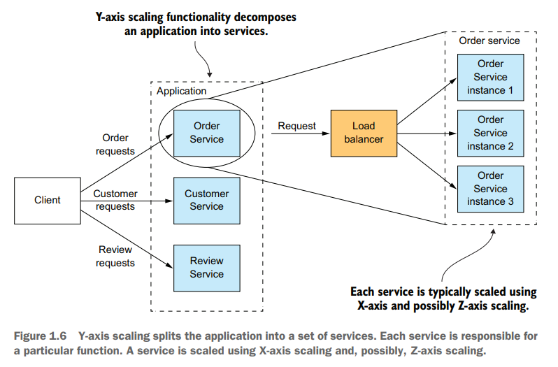
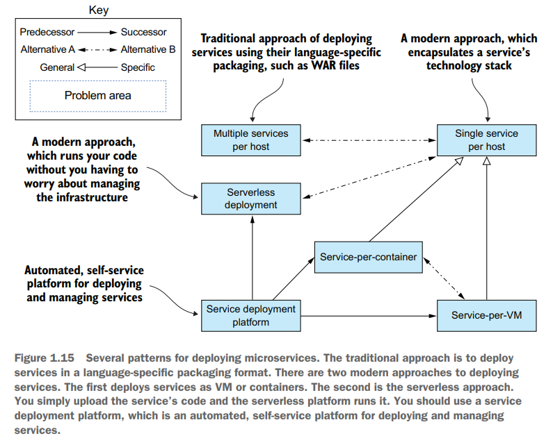

# Chapter 01 Escaping Monolithic Hell

## The slow march toward monolithic hell

**monolithic的优点**：

- 开发简单：所有开发工具、IDE等专注于一整个单体应用程序
- 可以实施大的变更：例如修改数据库schema等
- 易于测试：通过E2E测试，启动程序、调用Rest接口、采用Selenium测试UI
- 易于部署：整个应用程序部署即可
- 易于扩容：在负载均衡后简单线性扩容部署多个实例即可

但是随着业务发展、规模的扩大，**monolithic的局限**越来越明显：

- **Complexity intimidates developers**: 没有开发能够完全掌握整个程序，从而更难于添加新功能、修复bug
- Development is **slow**
- **Path from commit to deploeyment is long and arduous**: 开发人员的代码提交到最终部署过程过于漫长，很多问题混合在一起更难排查，一旦出现了问题可能已经混杂了非常多人的代码，与原始提交已经完全不一样
- **Scaling is difficult**: 单体应用中的不同模块对资源（CPU、RAM、IO、DB、Cache等）的需求不同，直接以整个单体为扩容单位非常浪费且不易
- **Delivering a reliable monolith is challenging**: 由于单体应用过于复杂、不同模块可能存在耦合，不充分的测试导致更难发现问题，从而其稳定性也往往堪忧，即缺乏**fault isolation**
- **Locked into increasingly obsolete technology stack**: 单体应用模块多、复杂，导致更难应用新技术（类似众口难调）而被锁死在立项初始时的技术栈

## Microservice architecture to the rescue

**Scale cube**以三个维度来描述可扩展性（出自*The Art of Scalability*）

- X轴代表了应用从one instance到many instances，即**horizontal duplication**，由负载均衡器将请求均匀分配给多个实例实现扩容

  

- Y轴代表了功能从an application到multiple services，即**functional decomposition**，，由进一步分割复杂的功能为多个简单功能的组合实现扩容

  

- Z轴代表了数据从one partition到many partitions，即**data partitioning**，数据根据业务特征选择key进行分区实现扩容

  

**Each service has its own database**，为了实现松散解耦的服务集合，最关键的特征在于每一个服务都有自己的数据存储，从而不同的服务可以独立的修改存储相关的逻辑而不影响其他服务，服务之间仅通过约定好的APIs进行通信（*并不是每个服务都需要有个独立的MySQL、Oracle数据库*）

## Benefits and drawbacks of the microservice architecture

**微服务架构的优点**：

- 容易实现大型复杂应用的CI/CD

  

- 每个服务更可控、易于维护
- 每个服务独立部署
- 每个服务独立扩容/缩容
- 易于实验/应用新技术
- 更稳健，即故障隔离

**微服务架构的缺点**：

- 如何分割服务不易确定
- 分布式系统的本质困难，包括开发、测试、部署，例如每个服务自己拥有数据存储从而需要分布式事务来保证数据一致性
- 功能被多个服务组合实现时，需要服务间谨慎协调careful coordination，例如全局唯一的资源需要分布式锁来保护
- 采用微服务架构的时机不易把握

## Patterns

- **Patterns for decomposing an application into services**
  - Decompose by business capability
  - Decompose by subdomain
- **Communication patterns**

  

- **Data consistency patterns for implementing transaction management**
  - Saga (2PC并不适合微服务)
- **Patterns for querying data in a microservice architecture**
  - API composition
  - Command query responsibility segregation, CQRS
- **Service Deployment patterns**

  

- **Observability patterns provide insight into application behavior**
  - Health check API
  - Log aggregation
  - Distributed tracing
  - Exception tracking
  - Application metrics
  - Audit logging
- **Patterns for the automated testing of services**
  - Consumer-driven contract test
  - Consumer-side contract test
  - Service component test
- **Patterns for handling cross-cutting concerns**
  - Externalized Configuration
  - Microservice Chassis
- **Security patterns**
  - Access token pattern, e.g. JWT

## Beyond microservices: Process and organization

***Move fast without breaking things***:

- Deployment frequency: 部署频率
- Lead time: 提交的修改到部署生效的时间
- Mean time to recover: 出现产线问题时回滚/回复所需要的平均时间
- Change failure rate: 所有修改中，导致产线故障的修改比例

***How people respond emotionally to a change***:

- Ending, Losing, and Letting Go
- The Neutral Zone
- The New Beginning
