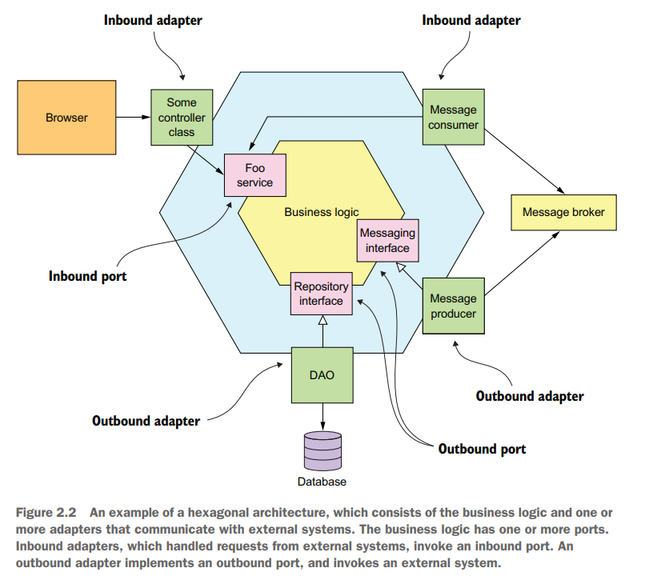
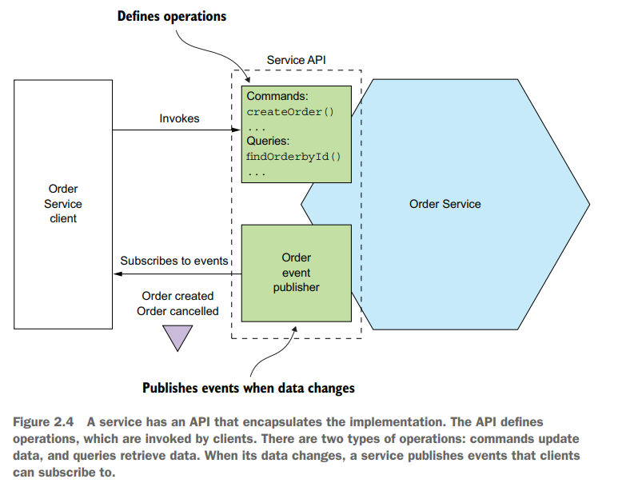
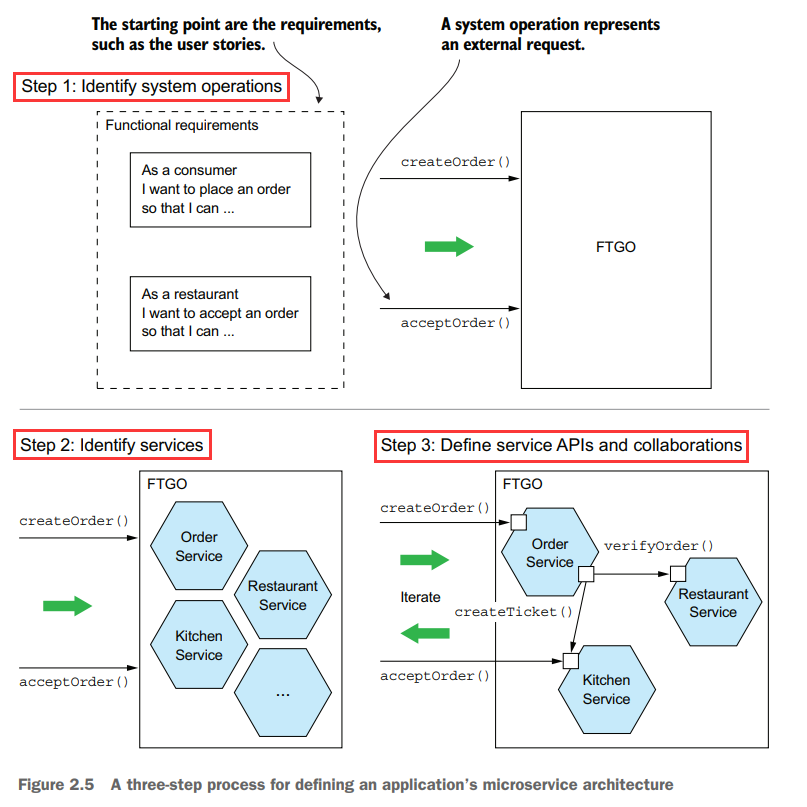
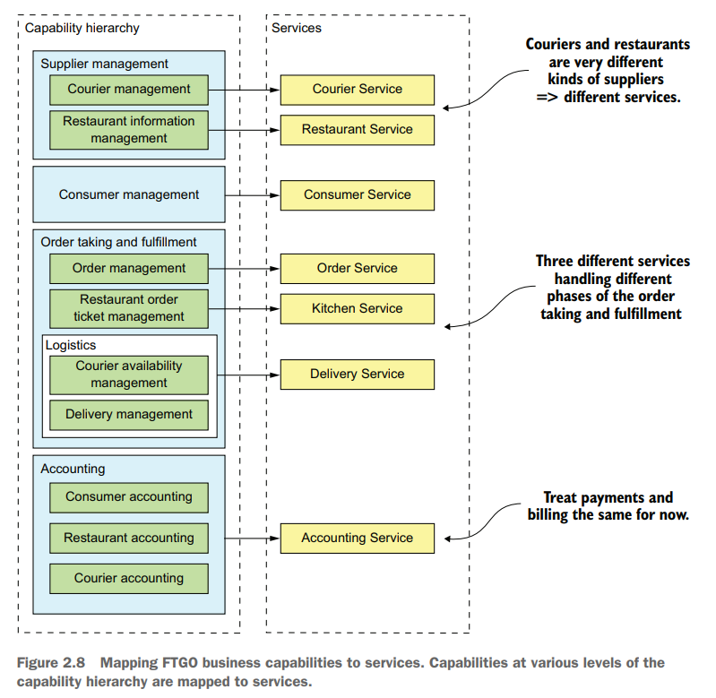
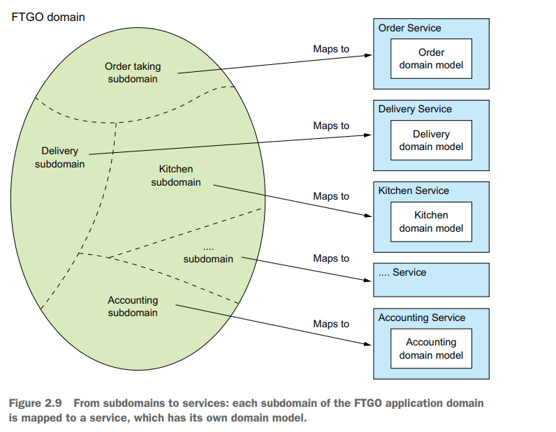

# Chapter 02 Decomposition Strategies

## Architectural styles

*The '4+1' View Model of Software Architecture*

- Logical view: 代码的组织形式，classes和packages，以及相互之间的关系（继承、组合、依赖等）
- Implementation view: 构建系统输出的结果，可执行文件或模块
- Process view: 模块在运行时的视图，每个元素是一个进程，元素之间的关系代表了进程间通信IPC
- Deployment: 进程映射到物理机器上，物理机器之间的关系代表了网络

架构风格architectural styles可以分为以下两类：

- **Layered**
  - Presentation layer: 实现用户接口或对外API的代码
  - Business logic layer: 业务逻辑代码
  - Persistence layer: 与数据库交互的代码
  
  层次化的架构最大的问题在于single presentation layer（事实上应用可能**被多个外部系统调用**）、single persistence layer（事实上应用可能**与不止一个数据库交互**）、业务逻辑往往定义为依赖持久化层（导致难以离开数据库**而单独测试业务逻辑**，采用mock database来测试实际上已经进入了Hexagonal架构）
- **Hexagonal**
  将business logic放在中心位置，应用可以有多个**inbound adapters**（取代presentation layer）来调用business logic处理外部的请求，并且有多个**outbound adapters**（取代persistence layer）来被business logic调用并进而调用外部（例如数据库、消息队列）的接口；这种架构与Layered的最大差别在于其满足了**adapters depend upon business logic**

  

  - **inbound adapter** (invoke inbound port): 例如Spring MVC Controller实现了一组REST endpoints
  - **outbound adapter** (invoke outbound port): 例如data access object DAO用于访问数据库对象

*Monolithic或Microservice代表了implementation view的组织形式，而对于logical view则都可以采用Hexagonal*

**松耦合Loose coupling**是微服务架构的核心特征，所有服务如上只需要保证提供的API即可，其实现可以根据需要任意修改，从而大大提升了maintainability、testability、deployability，并且每个服务有自身的数据存储、数据schema，从而可以任意修改，服务之间有良好的隔离性isolation，不会出现一个模块持有数据库的锁阻塞了另一个模块的流程这种情况

## Defining an application’s microservice architecture

- **Decompose by business capability**

  

- **Decompose by sub-domain pattern**

  

- **Decompostition principles**
  - Single Responsibility Principle: 单一责任原则，一个类的变化应只对应一个原因
    > A class should have only **one reason** to change.
  - Common Closure Principle: 共同封闭原则，会根据相同原因改变的多个类应被归属在相同的模块中
    > The classes in a package should be **closed together against the same kinds of changes**. A change that affects a package affects all the classes in that package.

- **Obstacles** to decomposing an application into services
  - Network **latency**: batch/pipeline/combine services
  - Reduced availability due to **synchronous** communication: async methods, e.g. messaging
  - Maintaining data **consistency** across services: distributed transaction, e.g. saga
  - Obtaining a **consistent view** of the data
  - **God classes** preventing decomposition: DDD, divide to **sub-domains**, each of services has its own domain model (sub-domain) with its version of the god class
