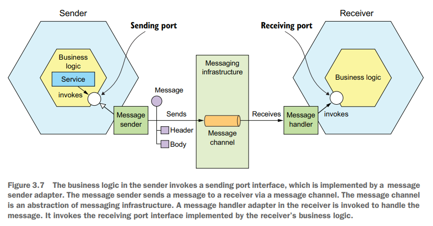

# Chapter 03 Interprocess Communication in a Microservice Architecture

## Overview of interprocess communication in a microservice architecture

|            | one-to-one                          | one-to-many           |
|:-          |:-                                   |:-                     |
|Synchronous |req/resp                             |-                      |
|Asynchronous|async req/resp, one-way notifications|pub/sub, pub/async resp|

- API需要考虑到升级和演化，因此需要采取版本管理 **semantic versioning**，即`MAJOR.MINOR.PATCH`
  - `MAJOR`: 打破兼容性的API变化
  - `MINOR`: 向下兼容的API升级
  - `PATCH`: 向下兼容的API bug修复

  对于`MINOR/PATCH`修改，需要遵循*Robustness Principle: Be conservative in what you do, be liberal in what you accept from others*，**服务端应该给缺少的字段提供合理的默认值，并且客户端应该忽略任何无法理解/多余的字段**，从而服务端就可以实现向下兼容的API升级，而对于`MAJOR`修改，可以通过**请求采用版本标识**，例如在URL上`/v1/...`、`/v2/...`，来区分处理不兼容的API请求
- 消息格式需要考虑到多语言支持，因此**不应该采用语言限定的格式**，例如Java serialization
  - text-based: 例如JSON和XML
  - binary-based: 例如Google Protocol Buffers和Avro，通常需要提供IDL来定义消息格式，并由相应的codegen来生成不同语言的实际代码

## Synchronous RPC

- **RESTful style**是目前较为流行的API实现方式
  - IDL: RESTful style本身并没有IDL的支持，而社区提供了IDL的支持，最活跃的是**Open API Specification**
  - 单次GET操作返回多个对象可以采用扩展的方式，例如`GET /orders/order-id-1234?expand=consumer`，更复杂的方式则是参考[GraphQL](https://graphql.org)
  - 优点: 简单易用，可以直接用浏览器/Postman等测试，并且不需要中间的broker，简化系统架构
  - 缺点: 仅支持req/resp的通信方式，客户端必须知道URLs，需要**service discovery mechanism**来定位服务端，并且多个操作难以完全匹配HTTP verbs
- **gRPC**
  - IDL: 采用Google Protocol Buffer的IDL
  - 优点: 容易设计出灵活丰富的接口，并且多种操作可以匹配接口，高效的二进制协议且支持双向streaming
  - 缺点: 需要额外的工作来支持gRPC-based API

服务可能出现故障导致不可用，从而依赖该服务的上游服务也可能会因此导致不可用，最终出现**级联失效**，正确的做法需要一个服务能够实现自我保护，避免被下游服务阻塞导致不可用，需要考虑的点包括（开源实现参考Netflix Hystrix和.NET Polly）：

- **Network timeouts**
  超时等待，不能无限阻塞等待其他服务的回应，避免资源被永久占用
- **Limiting the number of outstanding requests**
  限流，client或service应限制向另一个服务发起的请求数量（或service限制接受的请求数量），当已经达到处理能力后额外请求只会增加延迟、恶化服务健康状态
- **Circuit breaker**
  熔断，client或service应记录成功和失败的请求情况，一旦失败率超过阈值就触发熔断，在后续一段时间内都直接fail fast不再真正发出请求

由于服务故障导致的请求失败可能是client发起的请求链中的一个环节，从而处于前序请求已经成功而后序请求尚未发起的**部分故障状态partial failure**，此时必须根据业务需求和具体情况来选择恢复的措施，例如简单返回失败、回滚前序成功请求等

为了支持服务的扩容、容错、升级等，往往服务会动态调整上下线，从而需要有**Service Discovery服务发现**的机制来确保上游的client和service知道依赖的服务的网络地址，通常有两种主要做法：

- **Application-level service discovery**
  client和service都直接和service registry交互，包含两个子环节：
  - **Client-side discovery**: client询问想要访问的服务的地址，通常也会缓存这些地址减少网络请求数
  - **Self registration**: service则在上线时主动去service registry注册自己的地址，往往也会额外提供health check接口使得service registry可以周期性的检查服务的健康度，及时剔除失效的service节点

  

  采用这种服务发现模式的优点之一在于允许服务部署在多个不同的平台上，例如部分在K8S上而部分在传统环境中，基于K8S的服务发现只能用于K8S内，缺点在于若client有多种语言，则需要相应的多个库来支持client-side discovery，并且还需要管理维护service registry

- **Platform-provided service discovery**
  考虑到Application-level service discovery的缺点，现代化的部署平台例如K8S提供了内置管理维护的service registry以及相应的服务发现机制，包含两个子环节：
  - **3rd party registration**: 部署平台内置的**registrar**负责完成service registration，而不需要service自发注册
  - **Server-side discovery**: 部署平台内置的**router**负责接收client直接发送的正常请求，并根据service registry以及load balancing进行请求转发

  

  采用这种服务发现模式的优点在于**整个服务发现的机制全部被隐藏在部署平台内**，client和service均无感知，从而只需要采用相应的平台就自动获得了服务发现的能力，不需要client或service做额外的支持，缺点在于部署平台限定（现代系统通常都采用固定的部署平台，因宽泛来说也不算缺点）

## Asynchronous Messaging

- **Channels**
  - **point-to-point**
    发送者的消息仅会被一个消费者处理，点对点交互，例如命令Command往往通过这种channel
  - **publish-subscribe**
    发布的消息会被所有订阅者接收到，即one-to-many交互，例如事件Event往往通过这种channel
- **Interaction styles**
  - **asynchronous req/resp**

    

  - **one-way notification**
  - **publish/subscribe**
  - **publish/async response**
- **Brokerless messaging**
  没有broker，所有需要进行消息通信的实体建立**两两之间的channels**，例如ZeroMQ

  优点：
  - 在于更轻量的网络传输和更小的消息延迟
  - 避免了broker成为潜在的性能瓶颈和单点
  - 完全抹除了运维broker的开销

  缺点：
  - 服务需要有类似的服务发现机制来进行通信
  - 必须双方都存活时才能进行通信
  - 没有broker作为中间缓存，guaranteed delivery更难实现
- **Broker-based messaging**
  考虑到brokerless模式的缺点更加致命，因此大多数现代系统采用了broker-based messaging，即存在一个**中心化的messaging broker**，所有生产者和消费者都与broker交互而不需要构建服务之间的channels，例如ActiveMQ、RabbitMQ、Apache Kafka以及现在云服务厂商会提供的messaging service例如AWS SQS、AWS Kinesis

  选择具体的messaging broker时需要根据业务需要，考虑language、messaging standards、ordering、delivery guarantee、persistence、durability、scalability、latency、competing consumers，通常**不同的系统有不同的取舍tradeoff**

  优点：
  - **松耦合**，消息发送者只需要发送给broker上相应的channel，而不需要对消息消费者有任何感知
  - **缓冲**，broker可以作为channel的缓冲层，从而当消费者短暂故障时不会引起生产者的失败
  - **灵活**，容易支持p2p、pub/sub等多种模式

  缺点：
  - **潜在性能瓶颈**，broker可能约束了消息的吞吐量、增加了延迟
  - **单点**，broker必须有高可用的机制，否则可能成为整个系统的单点故障
  - **运维**，需要额外维护broker系统
- **Sharding/Partitioned and message ordering**
  参考[Apache Kafka](../kafka/03.Kafka_Producers.md#producer-overview)的设计

  

- **Duplication handling**
  通常实现**exactly once**的代价过大，绝大多数messaging service能够提供**at least once**的保证，由应用层根据具体情况和需求来决定重复消息的处理方式：
  - **Idempotent message handlers**，将处理消息的过程幂等化，从而重复的消息相当于无操作，就实现了exactly once
  - **Discarding duplicates**，记录下所有处理过的消息，并直接抛弃重复出现的消息，从而实现exaclty once，这往往额外**要求记录消息和处理消息变为原子操作**，即支持事务，由于NoSQL类的数据库对ACID支持有限，可以考虑直接将`message id`存入应用层的业务数据表，从而在支持row-level ACID的NoSQL中也可以实现事务记录和处理消息，但对于涉及到外部系统的业务例如发送email则依然无法去重

    

- **Transactional messaging**
  通常应用层希望发送消息和更新数据库是原子操作，但是采用分布式事务的代价较大，可扩展性和性能不佳，并且messaging service未必支持分布式事务，因此为了实现事务消息，还可以考虑：
  - **Transactional outbox**，采用数据库作为临时队列，从而**由数据库的ACID来实现发送消息和更新数据库事务化**，这种方式保证消息和更新数据库一起发生，但缺点在于发送消息可能多次，需要采用前述的去重措施

    
  - **Transaction log tailing**，采用**Change Data Capture, CDC**的方式，从而更新数据库的操作经由CDC被messing service读取解析从而触发消息的发送，属于**event driven**的模式，被广泛采用
  
    

## Messaging to Improve Availability

同步的通信机制会降低可用性，例如一个service需要同步通信多个下游service，则必须同步等待每个下游service响应，一旦某个service缓慢、超时就会导致整个链路出现不可用，采用messaging service将任务异步解耦，从而**即使下游service短暂不可用，数据也会缓存在队列中**，提高整个链路的可用性

