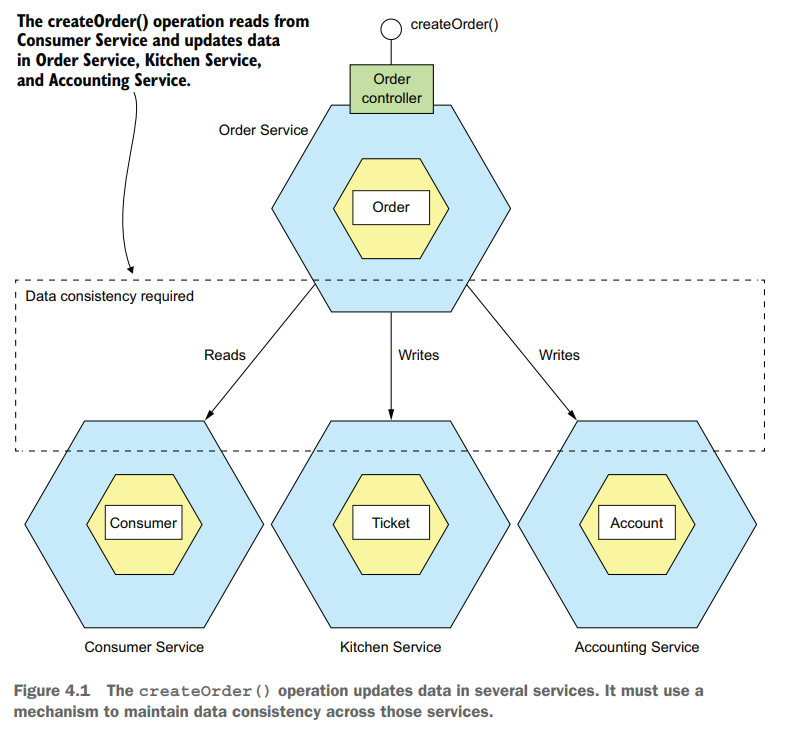
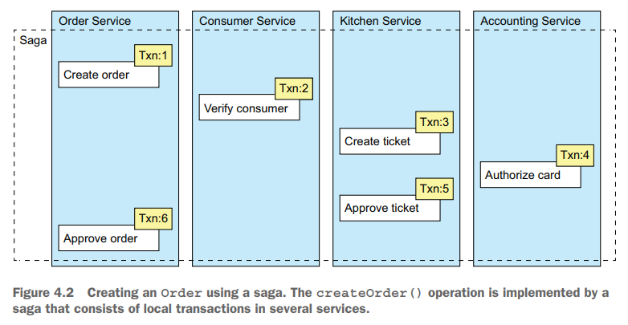
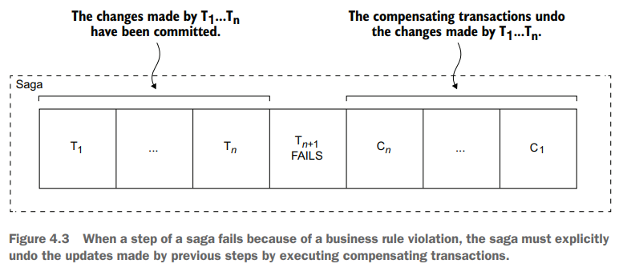
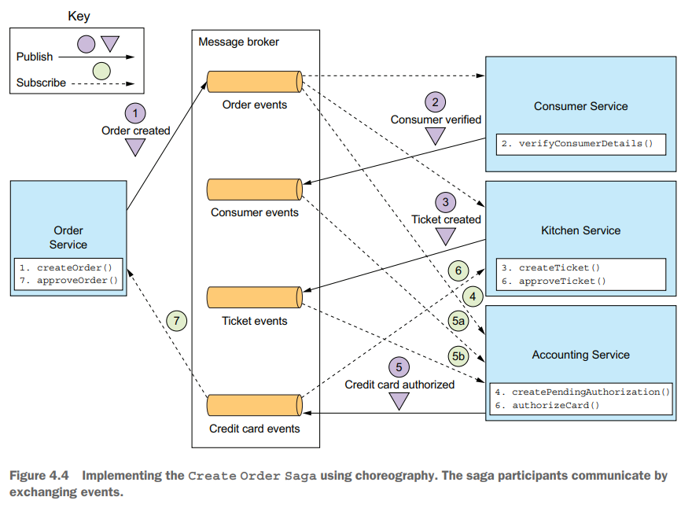
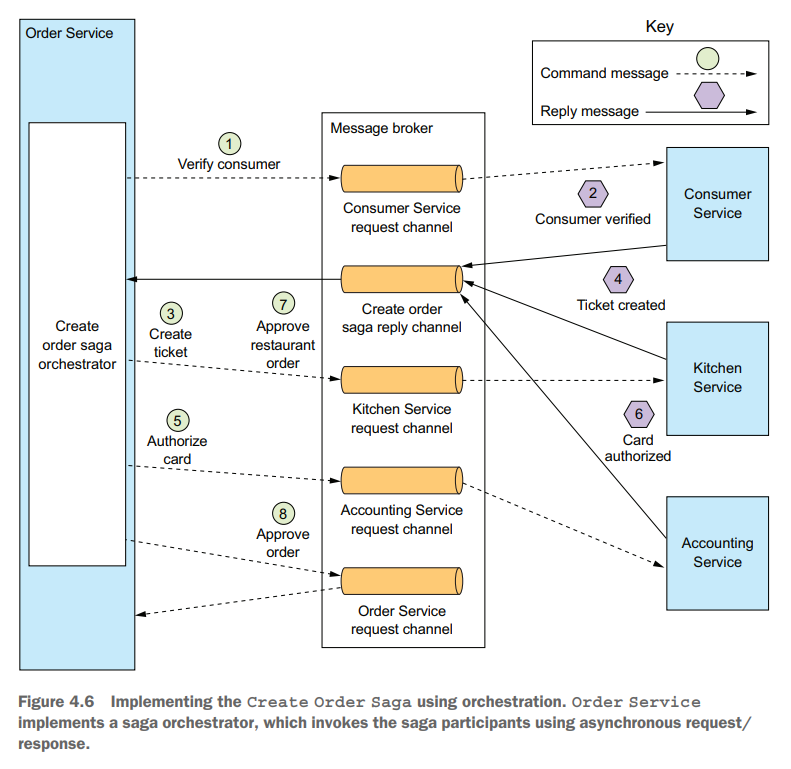
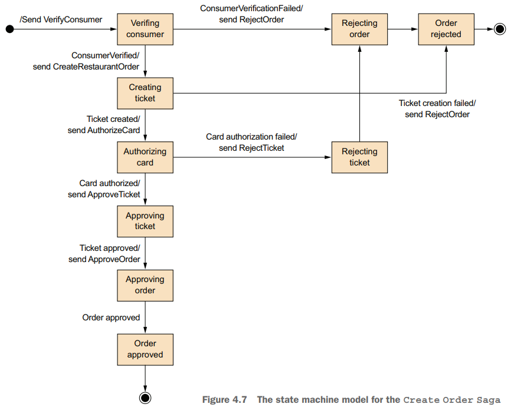
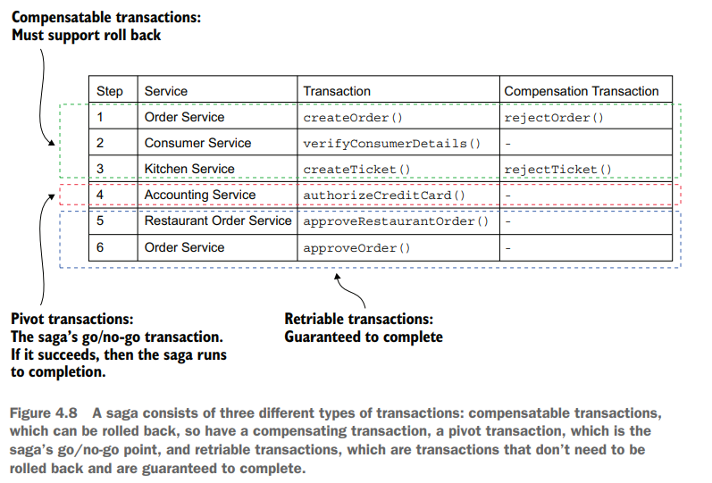
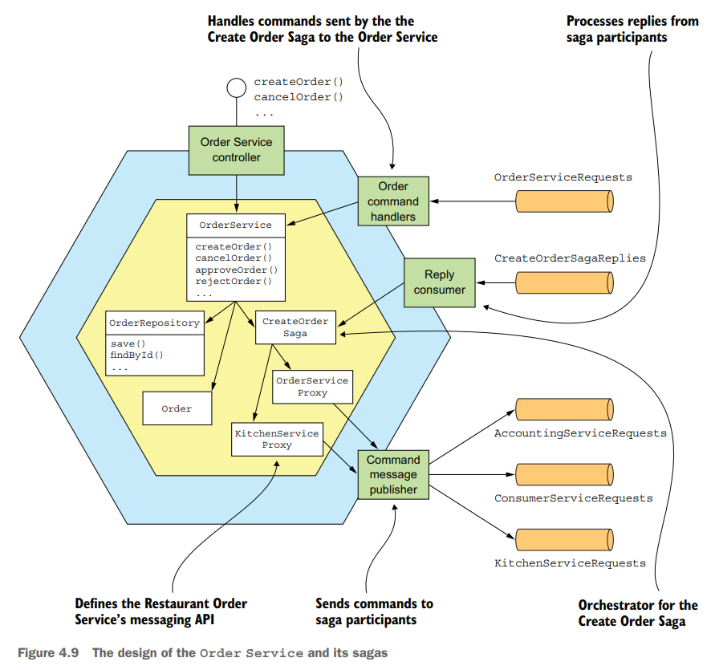

# Chapter 04 Managing Transactions with Sagas

## Transaction management in a microservice architecture

为了**确保数据的一致性**，单机应用总是会依赖数据库的ACID支持，而分布式的微服务架构也必须有类似的机制来保证安全：

分布式环境下，常规的分布式事务例如XA（底层实现是[2PC](../cmu15.445/23.Distributed_OLTP.md#两阶段提交-two-phase-commit-2pc)）会损害可用性，因为：

- 一旦某个事务参与节点故障，就会导致事务不可用，此时就必须引入Paxos等做法使得每个事务参与者都高可用，例如[Spanner](../mit6.824/13.Spanner.md)
- NoSQL、Kafka等广泛使用的组件并不支持事务，从而无法参与XA

采用**Saga模式**来实现分布式微服务环境下的一致性，Saga通过一系列受协调的异步**本地事务和补偿事务**来实现数据的一致性

**补偿事务用于撤销成功的事务带来的修改**，显然只读事务并不需要补偿，从而异步使得数据最终回滚到初始状态，例如：

| Step | Service             | Transaction              | Compensating transaction |
| :-   | :-                  | :-                       | :-                       |
| 1    | Order Service       | `createOrder()`          | `rejectOrder()`          |
| 2    | Consumer Service    | `verifyConsumerDetails()`| -                        |
| 3    | Kitchen Service     | `createTicket()`         | `rejectTicket()`         |
| 4    | Accounting Service  | `authorizeCreditCard()`  | -                        |
| 5    | Kitchen Service     | `approveTicket()`        | -                        |
| 6    | Order Service       | `approveOrder()`         | -                        |

## Cordinating sagas

Saga事务的协调执行有两种模式：

- **Choreography-based sagas**，类似Actor模式，每个参与者eventdriven基于事件独立做出响应，协调完成saga事务，对于失败回滚的场景也是通过发送事件触发回滚

  

  在这种模式中，由于本地数据库的**修改更新和发送消息也必须在一个事务中**完成，因此需要考虑[transactional messaging](03.Interprocess_Communication.md#asynchronous-messaging)的方法，并且所有消息的和数据都应该通过**correlation id**与client的一个请求相关联
  
  采用Choreography-based sagas的优点在于：
  - simplicity
  - loose coupling

  缺点在于：
  - difficult to understand
  - cyclic dependencies between services，服务之间存在环形依赖，虽然通过messaging channel解耦，但增加了复杂度
  - risk of tight coupling，一旦状态和牵涉的服务增多，每个服务都要订阅大量的messaging channel，因此仅适用于较简单saga事务的情形

- **Orchestration-based sagas**，中心化调度，由orchestrator节点主动调度执行完成saga事务，**在绝大多数场景下优于Choreography-based做法**

  

  显然saga事务的执行过程可以看作为一个**状态机变换过程**，从而能够更简单的测试saga事务状态机：

  

  采用Orchestration-based sagas的优点在于：
  - simpler dependencies，不存在环形依赖
  - less coupling，每个服务处理并相应orchestrator的事件，服务之间不需要处理事件
  - improve separation of concerns and simplifies the business logic，事务的全过程都在orchestrator中心化执行，因此更高内聚、易于理解维护

  缺点在于过于集中saga事务于orchestrator导致其功能复杂，但可以通过仅让orchestrator来编排事务的执行过程，抽象/简化业务逻辑的过程来减轻负载

## Handling the lack of isolation

Saga作为一系列本地事务和补偿事务的组合，具备了Atomicity、Consistency、Durability，而**缺乏Isolation**，因为本地事务一旦提交，sage事务的部分执行结果对外界就可见，从而可能出现一系列并发执行下的**[anomalies](../cmu15.445/16.Concurrency_Control.md#隔离性-isolation)**（具体各种隔离级别和一致性规则可以参考[此处](../consistency/Strong_consistency_models.md)）例如：

- **Lost updates**: 一个事务的结果被另一个事务覆盖丢失
- **Dirty reads**: 尚未提交的事务结果被读取，而该尚未提交的事务可能回滚终止
- **Fuzzy/nonrepeatable**: 由于并发执行的事务在修改数据，导致一个事务内的多次读取数据不一致

Saga事务可以具体分为三个类别：

- **Compensatable transactions**: 在pivot transaction前的事务，可能会做出数据修改，在回滚时需要相应的补偿事务compenstation transaction
- **Pivot transactions**: 临界点，当saga事务运行到此刻时能够保证成功
- **Retriable transactions**: 在pivot transaction后的幂等且保证能成功的事务

个人想法，*这种分类模式结合后续的操作，更像是**近似实现了[两阶段锁协议2PL](../cmu15.445/17.Two_Phase_Locking.md)的变种**，2PL可以保证serializable隔离级别，compensatable transactions阶段对应获得资源/锁阶段，pivot transactions和后续对应释放资源/锁阶段*

这种分类模式有助于分析并从monolithic迁移到microservice的改造，并且利于后续采用相应的**countermeasures**来应对anomalies：

- **Semantic lock**
  
  语义锁，原理和实现基本等同2PL协议，可以达到serializable隔离级别，因此可以解决上述的anomalies，根据业务的需求，对于操作的数据加入额外的字段代表当前状态，例如`Order.state`处于`*_PENDING`状态时，意味着已经有进行中的saga事务正在操作，此时其他并发开始的saga事务就可以选择：

  - 直接报错，由cient进行重试
  - 阻塞等待状态修改再开始执行，此时需要特别注意需要实现分布式的[死锁检测和打断算法](../cmu15.445/17.Two_Phase_Locking.md#死锁检测和避免-deadlock-detection--prevention)

- **Commutative updates**

  可以解决lost updates，将操作以可交换的形式实现，即执行A再执行B、执行B再执行A的结果等价，例如`x+=5, x+=10 => x+=10, x+=5`，从而可以有任意的调度顺序，相当于事务调度模型中的无冲突调度

- **Pessimistic view**

  可以解决dirty read，根据业务特点，重新编排saga事务的执行流程，以最悲观的方式执行事务，总是**将消耗资源的环节前置，将释放资源的环节后置**，从而若资源不满足则不会向下执行，而到了释放资源的环节则基本上都应该成功（类似于2PL的两阶段资源获取/释放），例如取消订单的请求总是在最后阶段才退回配额，防止提前退回配额导致配额超过限制值

- **Reread value**

  可以解决lost updates，原理和实现基本等同[optimistic concurrency control](../cmu15.445/18.Timestamp_Ordering.md#乐观并发控制-optimistic-concurrency-control)，在saga更新数据时重新读取一遍数据，满足前置条件/数据未被修改才真正执行更新，否则就直接放弃并回滚

- **Version file**

  某个服务记录操作顺序，并根据情况修改处理以实现commutative updates，例如Accounting Service先收到了Cancel Authorization请求，随后收到了Authorize Card请求，那么由于已经收到了Cancel，后续的Authorize会直接跳过真正的操作

- **By value**

  case-by-case根据业务情况，对重要流程采用2PC等分布式事务协议，对非重要流程采用上述的方式减轻/避免anomalies

