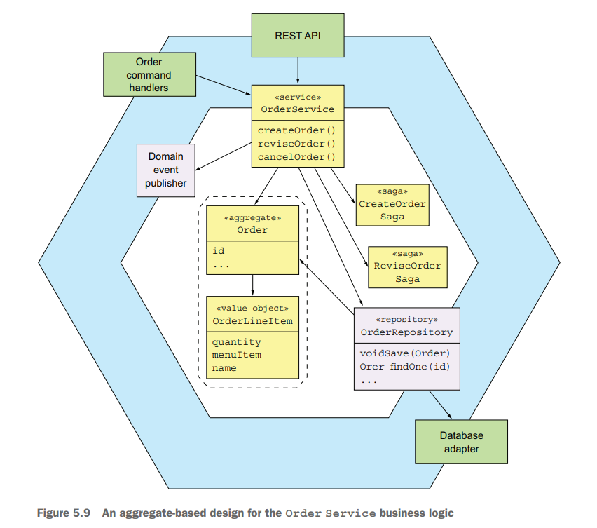

# Chapter 05 Designing Business Logic in a Microservice Architecture

## Business logic organization patterns

- **Transaction script pattern**

  面向过程式的风格，采用**Data Access Object, DAO**来操作数据库，而具体的数据库对象只有数据状态，而没有行为，优点在于简单好用，缺点在于一旦业务逻辑复杂之后有一个巨大的类用各种行为来操作数据实现业务逻辑，过程式的代码难以维护和扩展
  
  

- **Domain model pattern**
  
  面向对象式的风格，更多的对象同时有数据状态和行为，直接基于具体的问题领域来设计对象，优点在于**高内聚低耦合、不同的对象单一职责**，更容易理解、测试和维护业务逻辑，以及面向对象可以进一步结合OOP设计模式来简化、复用代码，缺点在于当业务逻辑少变更且极其简单时，采用这种模式显得臃肿

  

## Designing a domain model using the DDD aggregate pattern

- 传统的domain model没有清晰的边界，业务逻辑交织在一起，假如需要更新/删除一个Order，则影响到的流程以及真正要做的操作非常模糊，易于出错，不可控

  

- 采用**aggregates**的做法有清晰的边界，**每个aggregate root以及携带的value object构成一个单元**，从而整体从数据库中读取并操作，避免任何lazy loading导致的复杂度，并且在aggregate整个单元上保持了**不变量invariants和并发安全concurrency**，DDD对采用aggregates的要求如下：
  - **reference only the aggregate root**，只持有aggregate root的引用，并通过操作root来更新整个单元的任意部分数据，而不是直接操作具体部分数据，从而保证数据的invariants
  - **inter-aggregate references must use primary keys**，通过主键来关联不同的aggregates，而不是其他aggregates的对象，从而解耦不同单元、更简单的跨service引用对象、避免lazy loading
  - **one transaction creates or update one aggregate**，从而完美的让本地事务只处理单个aggregate，并限制在当前service内，单一责任，以及适应对ACID支持不良的NoSQL类数据库

  

采用aggregates模式需要考虑的核心点之一就是单个aggregate所包含的内容，即**aggregate granularity**，由于前述一个aggregate就是一个操作单元（序列化点、事务单元），从而：

- 越细的aggregate对应了**更高的并发**处理数量和更强的可扩展性
- 越粗的aggregate对应了**更好的原子性**，单次事务能够实现原子更新更多的数据

综合来说，**细粒度的aggregates更适应微服务的整体思路和架构**：可扩展、松耦合、单一原则



## Publishing domain events

通常一个aggregate会在被创建/显著修改时发布domain event（类似数据库的change data capture, CDC），通常也需要用[transactional messaging](03.Interprocess_Communication.md#asynchronous-messaging)来确保事件可靠传递

```java
public void accept(long ticketId, ZonedDateTime readyBy) {
  Ticket ticket =
    ticketRepository.findById(ticketId)
      .orElseThrow(() -> new TicketNotFoundException(ticketId));
  List<DomainEvent> events = ticket.accept(readyBy);  // update aggregate and get domain event
  domainEventPublisher.publish(Ticket.class, orderId, events);
}
```


## Order Service business logic


以**状态机**的形式设计aggregate的变换过程：


```java
public class Order {
  // ...

  public static ResultWithDomainEvents<Order, OrderDomainEvent>
    createOrder(long consumerId, Restaurant restaurant, List<OrderLineItem> orderLineItems) {
    // ... static method to return the order and domain event
  }

  public Order(OrderDetails orderDetails) {
    // ... initial state
    this.state = APPROVAL_PENDING;
  }

  public List<DomainEvent> noteApproved() {
    // ... based on current state, reject invalid transition, return domain event
    switch (state) {
      case APPROVAL_PENDING:
        this.state = APPROVED;
        return singletonList(new OrderAuthorized());
      default:
        throw new UnsupportedStateTransitionException(state);
    }
  }

  public List<DomainEvent> noteRejected() {
    // ... based on current state, reject invalid transition, return domain event
    switch (state) {
      case APPROVAL_PENDING:
        this.state = REJECTED;
        return singletonList(new OrderRejected());
      default:
        throw new UnsupportedStateTransitionException(state);
    }
  }
  // ...
}
```

一次创建order的业务流程：

```java
@Transactional
public class OrderService {
  public Order createOrder(OrderDetails orderDetails) {
    Restaurant restaurant = restaurantRepository.findById(restaurantId)
      .orElseThrow(() -> new RestaurantNotFoundException(restaurantId));

    // create order aggregate
    List<OrderLineItem> orderLineItems = makeOrderLineItems(lineItems, restaurant);
    ResultWithDomainEvents<Order, OrderDomainEvent> orderAndEvents =
      Order.createOrder(consumerId, restaurant, orderLineItems);
    Order order = orderAndEvents.result;

    // persists the order in the database
    orderRepository.save(order);

    // publish the domain events
    orderAggregateEventPublisher.publish(order, orderAndEvents.events);
  
    // create the Crate Order Saga
    OrderDetails orderDetails =
      new OrderDetails(consumerId, restaurantId, orderLineItems, order.getOrderTotal());
    CreateOrderSagaState data = new CreateOrderSagaState(order.getId(), orderDetails);
    createOrderSagaManager.create(data, Order.class, order.getId());
    return order;
  }

  // ...
}
```
