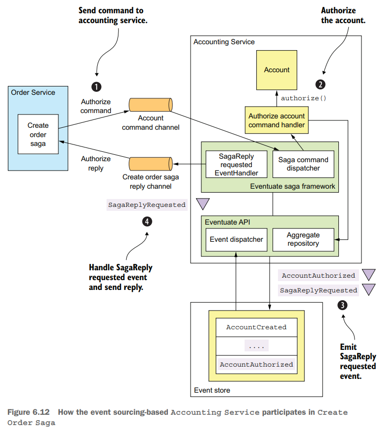

# Chapter 06 Developing Business Logic with Event Sourcing

## Developing business logic using event sourcing

[事件溯源event sourcing，log as a database的思路](../ddia/EX.Making_Sense_of_Stream_Processing.md)

传统的数据存储数据库的方式往往有以下四方面的问题：

- **Object-relational impedance mismatch**: 数据库以**表tabular**的形式存储数据，而业务逻辑的domain model往往以**图graphic**的形式关联，这种不匹配
- **Lack of aggregate history**: 传统的数据库存储只有最新的状态，而缺乏状态变化的历史
- **Implementing audit logging is tedious and error prone**: 由于数据库只有状态，从而应用层往往需要实现audit logging来记录状态的变化，追踪用户的操作等
- **Event publishing is bolted on to the business logic**: 传统的方式在更新完数据库后返回event并需要由业务层自己进行publish

采用事件溯源的方式（此时event就是required而非optional）可以解决上述困难，以记录变化历史的方式来记录aggregate，也称为**event store**，在读取时则需要以**基础数据/快照+回放事件**来计算出最新状态，而事件就通过event store数据库的**CDC**发布（属于transaction log tailing）

```java
Class aggregateClass = ...;
Aggregate aggregate = recreateFromSnapshot(aggregateClass, snapshot);
for (Event event : events) {
  aggregate = aggregate.applyEvent(event);
}
// use aggregate...
```


采用时间溯源的Order参考如下：

```java
public class Order {
  public List<Event> process(CreateOrderCommand command) {
    // ... validate and return OrderCreatedEvent
  }
  public void apply(OrderCreatedEvent event) {
    // apply OrderCreatedEvent to initialize the aggregate
  }

  public List<Event> process(ReviseOrder command) {
    // ... verify and return OrderRevisionProposedEvent
  }
  public void apply(OrderRevisionProposedEvent event) {
    // apply OrderRevisionProposedEvent to update the aggregate
  }

    public List<Event> process(ConfirmReviseOrder command) {
    // ... verify and return OrderRevisedEvent
  }
  public void apply(OrderRevisedEvent event) {
    // apply OrderRevisedEvent to update the aggregate
  }

}
```

当多个请求并发操作同一个数据实体时，就需要解决数据竞争问题，传统数据库存储可以采用**乐观锁/版本号**的方式如下处理，而时间溯源也采用类似的做法，即**将版本号携带在事件中**：

```SQL
UPDATE AGGREGATE_ROOT_TABLE
SET VERSION = VERSION + 1 ...
WHERE VERSION = <original version>
```

消息的**幂等性处理**非常重要，因为网络波动、节点宕机重启都有可能导致重复的消息被发送/接收（为了不丢数据，在不确定的情况下都会进行重试，因此引起重复），幂等性处理可以根据数据库的特点来实现：

- **RDBMS-based event store**
  
  数据库层支持ACID，从而只需要在单独的表`PROCESSED_MESSAGES`中**记录已经处理过的消息`ID`，并将其融入到业务逻辑的事务**过程中，从而在每次处理时首先检查是否处理过，若处理过直接跳过即可，由底层数据库保证了ACID以及消息处理的幂等性

- **NoSQL-based event store**

  NoSQL代表了不支持ACID的数据存储，从而无法通过单独的表记录消息并与业务逻辑融入同一个事务来实现去重，解决方式可以是在某条消息触发的业务逻辑处理时记录相应的消息`ID`，从而在每次处理时需要扫描检查最近的一系列events对应的`ID`是否已经出现过，已经出现过意味着已经处理过：

  ```text
  | Event ID | Business Operation | Message ID |
  |    4     |       ....         |     123    |
  |    5     |       ....         |     124    |
  |    6     |       ....         |     125    |
  ```

  - 当收到`Message ID=125`时检查到`EVENT ID=6`已经是该消息触发的业务逻辑，因此跳过
  - 当收到`Message ID=126`时没有事件符合，正常处理
  - 此时虽然采用了NoSQL，但依然要求**有一定限度的事务支持**（单行事务，写入`Business Operation`和`Message ID`必须原子化），即使业务包含多个步骤更新了不同的数据，只需要**每一次写入都采用这种消息处理方式**，记录`Message ID`并扫描查重，就可以支持**多步骤操作每一步的幂等化**
  - 对于不产生事件的消息处理，需要有类似**占位符消息pseudo events**存储`Message ID`，否则无法去重

事件溯源的优点:

- **Reliably publishes domain events**
- **Preserves the history of aggregates**
- **Mostly avoids the Objective/Relational impedance mismatch problem**: events能够代表各种修改aggregates的操作，从而解耦了aggregates本身的面向对象的结构和数据库关系型的结构
- **Provides developers with a time machine**

事件溯源的缺点:

- **Different programming model**
- **Complexity of a messaging-based application**: 通常框架只保证at-least-once消息传递，因此需要幂等性的消息处理
- **Evolving events is tricky**: 有时需要多套代码来处理不同schema的events/snapshots，可以通过批量转换到新格式、读触发数据更新等方式缓解
- **Deleting data is tricky**: 可以采用墓碑机制，soft delete，但是这与General Data Protection Regulation GDPR违背，后者强制要求数据被确保删除而不能是soft delete，可以参考的做法之一就是采用加密记录配合soft delete，当需要切实删除时，只需要删除解密的key即可
- **Querying event store is challenging**

## Implementing an event store

*以作者的[Eventuate](https://eventuate.io)为例*


- RDBMS以MySQL为例，Message Broker以Apache Kafka为例
- Event Relay以MySQL master/slave protocol读取MySQL的binlog（属于**Transactional Log Tailing**），并解析所关心的操作而忽略其他修改
- Event Relay将数据库中的event发送到Apache Kafka中，以aggregate ID作为partition key，从而aggregate级别保持顺序，不同的aggregate相互之间可以乱序以提供水平扩容的能力
- `events::triggering_event`用于记录触发的事件`ID`并提供去重的功能以实现**幂等性**
- `entities::entity_version`用于记录版本号以实现**并发安全**


## Using sagas and event sourcing together

### Implementing choreography-based sagas using event sourcing

在choreography-based之下，采用event sourcing实现saga事务非常自然，底层的事件溯源框架保证了消息处理的幂等性，但是这种方式最大的问题在于此时event既要作为事件溯源中aggregate状态的变化、也要作为saga事务的通知，即使aggregate没有变化但saga事务需要，也必须触发一个event，更不利的地方在于有可能一个saga事务参与者本身就不会创建aggregate，但因为saga事务需要也必须触发event

更推荐采用**复杂但更实用的orchestration-based saga与event sourcing整合**

### Creating an orchestration-based saga

- **RDBMS-based event store**

  采用RDBMS-based存储就可以实现在**事务内原子执行更新event store并创建saga orchestrator**

- **NoSQL-based event store**

  由于NoSQL对ACID的支持有限，因此需要采用更复杂的设计来**保证更新event store和创建saga orchestrator的原子性**，可以采用的做法例如：

  - 首先更新event store，例如采用`OrderCreatedEvent`更新aggregate
  - 发布`OrderCreatedEvent`，此时Order Service注册了相应的处理函数`OrderCreatedEventHandler`
  - 在**event处理函数中必须进行去重**，例如将对应的`Order ID`或是`Event ID`作为`Saga ID`，从而当处理重复的`OrderCreatedEvent`时不会重复创建saga

### Implementing an event sourcing-based saga participant

- **Idempotent command message handling**

  上游可能会发送重复的消息，at-least-once保证，则接收方saga participants直接采用消息幂等化处理，saga participant记录`Message ID`并确保一条命令不会被重复执行

- **Atomically sending reply messages**

  当开始处理数据，创建或更新aggregate时，同时与aggregate更新事件一起也存储`SagaReplyRequested`占位事件到event store中，从而相应的处理函数就会依据该事件做出回复

  

### Implementing saga orchestrators using event sourcing

- **Persisting a saga orchestrator using event sourcing**

  Saga orchestrator以事件溯源的方式存储非常简单，可以只有两个事件`SagaOrchestratorCreated`和`SagaOrchestratorUpdated`，事件中包含了必要的数据用于重建saga orchestrator的状态

- **Sending command messages reliably**

  若采用RDBMS-based event store，则在一个事务中更新event store并发布消息；若采用NoSQL-based event store，则采用`ID`作为key进行去重保证原子性；每一条saga命令都以`SagaCommandEvent`存储到event store中，随后通过**处理函数确保at-least-once（去重由消息接收方进行）发送给不同的下游**

  

- **Processing replies exactly once**

  作为saga participants回复消息的接收方，**saga orchestrator也需要对回复的消息去重再处理**，同样基于`ID`采用上述方式即可
