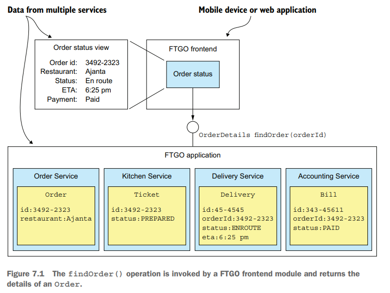
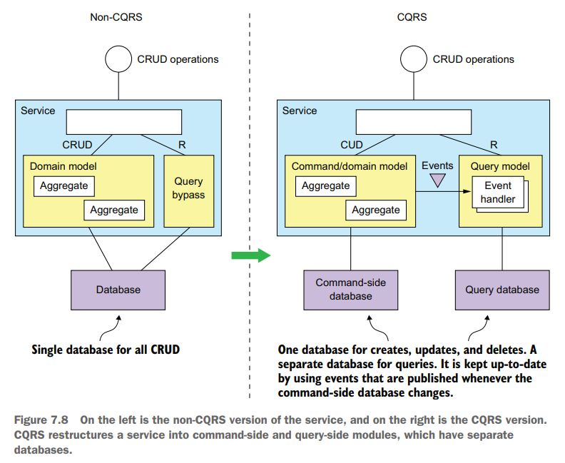
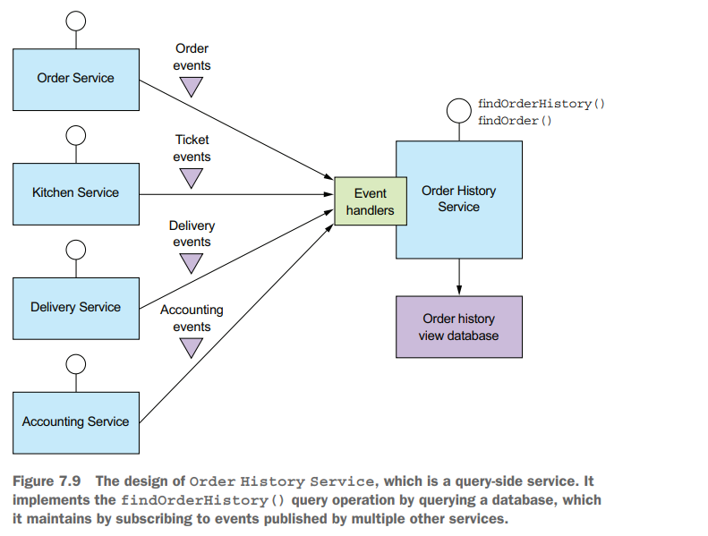
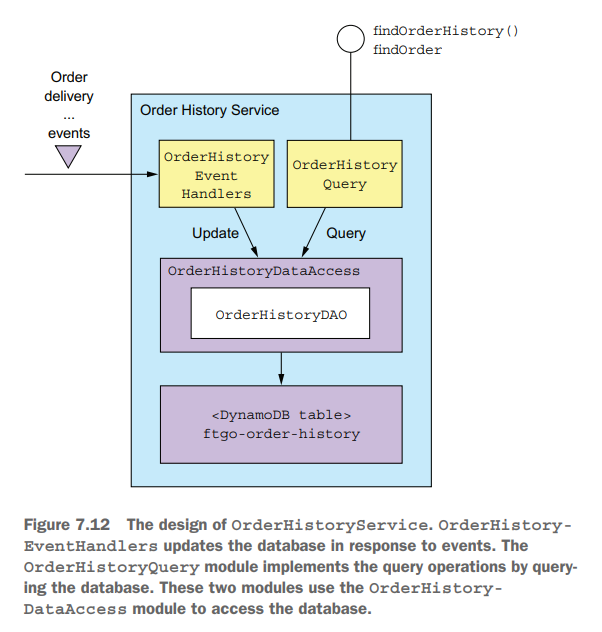

# Chapter 07 Implementing queries in a microservice architecture

## Querying using the API composition pattern

API composition的模式就是**向每一个微服务请求该服务拥有的数据**，最后在前端将所有数据整合并返回



- **API composer**
  - **选择前端/客户端**，负责分发查询并合并结果，但是发送多个请求有较多的网络开销且部分服务可能不适合暴露到公网上
  - **选择内部网关**，此时用户请求发送到网关，网关负责直接向内网分发查询并合并
  - **选择独立微服务**，可以同时服务内外网，并且可以适应更加复杂的查询/合并结果的逻辑
- **benefits**
  - simple
  - intuitive
- **drawbacks**
  - **increased overhead**，需要串行/并行发起多个请求，访问多个微服务和数据库，相比monolith有额外的开销，并且一些特殊的查询可能依赖大量数据的in-memory join，使得API composition模式难以适配
  - **risk of reduced availability**，由于依赖多个下游微服务来提供结果，可用性随着依赖的服务增多而下降，某个服务不可用会导致整个查询失败
  - **lack of transactional data consistency**，这种分布式查询没有ACID的支持，并不一定能获取该数据同一时刻的状态，不同部分也许并不一致

## Using the CQRS pattern

采用**CQRS**的主要动力在于传统（API composition等）方式难以解决的以下问题：

- 采用API composition方式从多个微服务获取数据并整合**可能会引入难以接受的in-memory joins**，例如查询包含过滤条件，而过滤条件所涉及的数据在一些微服务上并不存在，则无论是获取全部数据并在整合时再过滤、还是先访问有过滤条件数据的服务再利用key访问其他服务，都意味着**高资源开销和高延迟**
- 用于**处理业务的微服务不一定适合提供查询接口**，例如拥有并处理Restaurant业务的服务可能采用**利于业务的存储模式和数据库**，而这种设计并不利于支持空间搜索某个区域内的Restaurant，耦合在一起反而**性能低下且维护困难**
- 查询和业务处理耦合并不利于整体敏捷演进，需要考虑**separation of concerns**

CQRS能够有效的**将命令和查询分离**，通过[event](03.Interprocess_Communication.md#asynchronous-messaging)的方式保证两个（甚至更多）数据库的最终一致性，以充分适应不同查询的特点，最优化性能

- **service内部CQRS**

  

- **单独的查询专用service**

  

- **benefits**
  - **efficient queries**，针对每种查询来优化相应的存储模式
  - **query in an event sourcing-based application**，在事件溯源驱动的应用中也可以支持查询，event store往往只支持主键查询，采用CQRS能够在特定的存储模式上支持特定的查询
  - **separation of concerns**，查询和命令的隔离能够支持更高效的敏捷迭代
- **drawbacks**
  - **more complex architecture**
  - **replication lag**，基于CQRS的模式容易达到最终一致性，但存在查询的滞后，一种常见的做法就是**命令带上单调递增的版本号**，从而在查询时若最新版本不满足，则client等待并重试

## Designing CQRS views

- **选择合适的存储层**，用于查询的数据存储必须高效支持特定类型的event引起的更新操作
- **数据接口支持并发、幂等操作**，采用版本号等并发控制机制，以及[idempotent message handling](06.Developing_Business_Logic.md#implementing-an-event-sourcing-based-saga-participant)来实现
  
  例如当`event ID`单调递增的情况下，CQRS的数据存储仅需要维护`[aggregate type, aggregate ID] -> max(event ID)`的映射即可（或在`aggregate`表中有`max event id`列），这样在处理重复消息时通过**对比`event ID`即可幂等化**，同时每个命令操作会返回给client相应的`event ID`，当需要查询时携带该`event ID`而返回的数据一定有不小于的`event ID`来确保读己之写一致性，即**token fence**

- **快照+增量应用创建/更新CQRS视图**，采用single source of truth的command-side database的某一时刻快照来初始化query database，并在消息队列服务中开始缓存这一时刻后的所有事件，随后再增量式的将事件应用到query database来达成同步

## Implementing a CQRS view with AWS DynamoDB



- The `OrderHistoryEventHandlers` module

  处理上游的事件，并调用DynamoDB的接口更新数据

- **Data modeling and query design**
  - Design table

    `ftgo-order-history`表的主键为`<orderId>`

    | orderId | consumerId | orderCreationTime | status | lineItems | ... |
    | :-:     | :-:        | :-:               | :-:    | :-:       | :-: |
    | cde-fgh | xyz-abc    | 22939283232       | CREATED| `[{...}]` | ... |
    | ...     | ...        | ...               | ...    | ...       | ... |

  - Define an index for `findOrderHistory` query

    `ftgo-order-history-by-consumer-id-and-creation-time`全局二级索引（global secondary index由DynamoDB来维护并保证一致性）的主键为`<consumerId, orderCreationTime>`，在DynamoDB中复合主键需要采用`<partitionKey, sortKey>`的方式，并且还可以包含自动维护的non-key属性直接加速了部分需要访问`ftgo-order-history`主表才能获得的数据

    | consumerId | orderCreationTime | orderId | status | ... |
    | :-:        | :-:               | :-:     | :-:    | :-: |
    | xyz-abc    | 22939283232       | cde-fgh | CREATED| ... |
    | ...        | ...               | ...     | ...    | ... |

  - Implement `findOrderHistory` query

    采用在`sortKey`上的范围限制来实现时间范围查询，并在non-key属性上可以采用filter expression来过滤

  - Paginate the query results

    DynamoDB支持传入`pageSize`对结果分页，每一次分页数据请求都会包含`lastEvaluatedKey`用于下一次分页请求查询`exclusiveStartKey`参数

  - Update orders
  - Detecte duplicate events

    采用前述的记录`max(eventId)`作为数据属性的方式，直接拒绝小于等于该值的事件，从而实现去重

- Duplicates detection

  ```java
  public UpdateItemSpec addDuplicateDetection(UpdateItemSpec spec) {
    HashMap<String, String> nameMap = spec.getNameMap() == null ? new HashMap<>() : new HashMap<>(spec.getNameMap());
    nameMap.put("#duplicateDetection", "events." + aggregateType + aggregateId);
    HashMap<String, Object> valueMap = new HashMap<>(spec.getValueMap());
    valueMap.put(":eventId", eventId);
    return spec
      .withUpdateExpression(String.format("%s , #duplicateDetection = :eventId", spec.getUpdateExpression()))
      .withNameMap(nameMap)
      .withValueMap(valueMap)
      .withConditionExpression(Expressions.and(
        spec.getConditionExpression(),
        "attribute_not_exists(#duplicateDetection) OR #duplicateDetection < :eventId"));
  }

  private boolean idempotentUpdate(UpdateItemSpec spec, Optional<SourceEvent> eventSource) {
    try {
      // attribute_not_exists(<aggregateType><aggregateId>) OR <aggregateType><aggregateId> < :eventId
      table.updateItem(eventSource.map(es -> es.addDuplicateDetection(spec)).orElse(spec));
      return true;
    } catch (ConditionalCheckFailedException e) {
      // Do nothing
      return false;
    }
  }
  ```

- `OrderHistoryDaoDynamoDb` class

  ```java
  @Override
  public boolean addOrder(Order order, Optional<SourceEvent> eventSource) {
    UpdateItemSpec spec = new UpdateItemSpec()
      .withPrimaryKey("orderId", order.getOrderId()) 
      .withUpdateExpression(
        "SET orderStatus = :orderStatus, " + 
        "creationDate = :cd, consumerId = :consumerId, lineItems =" +
        " :lineItems, keywords = :keywords, restaurantName = " +
        ":restaurantName")
      .withValueMap(new Maps() 
        .add(":orderStatus", order.getStatus().toString())
        .add(":cd", order.getCreationDate().getMillis())
        .add(":consumerId", order.getConsumerId())
        .add(":lineItems", mapLineItems(order.getLineItems()))
        .add(":keywords", mapKeywords(order))
        .add(":restaurantName", order.getRestaurantName())
        .map())
      .withReturnValues(ReturnValue.NONE);
    return idempotentUpdate(spec, eventSource);
  }

  @Override
  public void notePickedUp(String orderId, Optional<SourceEvent> eventSource) {
    UpdateItemSpec spec = new UpdateItemSpec()
      .withPrimaryKey("orderId", orderId)
      .withUpdateExpression("SET #deliveryStatus = :deliveryStatus")
      .withNameMap(Collections.singletonMap("#deliveryStatus", DELIVERY_STATUS_FIELD))
      .withValueMap(Collections.singletonMap(":deliveryStatus", DeliveryStatus.PICKED_UP.toString()))
      .withReturnValues(ReturnValue.NONE);
    idempotentUpdate(spec, eventSource);
  }
  ```

- `findOrderHistory`

  ```java
  @Override
  public OrderHistory findOrderHistory(String consumerId, OrderHistoryFilter filter) {
    QuerySpec spec = new QuerySpec()
      // return the orders in order of increasing age
      .withScanIndexForward(false) 
      .withHashKey("consumerId", consumerId)
      // the maximum age of the orders to return
      .withRangeKeyCondition(new RangeKeyCondition("creationDate").gt(filter.getSince().getMillis()));

    // pagination
    filter.getStartKeyToken().ifPresent(token -> spec.withExclusiveStartKey(toStartingPrimaryKey(token)));

    Map<String, Object> valuesMap = new HashMap<>();
    String filterExpression = Expressions.and(
      keywordFilterExpression(valuesMap, filter.getKeywords()),
      statusFilterExpression(valuesMap, filter.getStatus()));

    if (!valuesMap.isEmpty()) {
      spec.withValueMap(valuesMap);
    }
    if (StringUtils.isNotBlank(filterExpression)) {
      spec.withFilterExpression(filterExpression);
    }

    // limit the number of results, pagination
    filter.getPageSize().ifPresent(spec::withMaxResultSize);

    // query the ftgo-order-history-by-consumer-id-and-creation-time index
    ItemCollection<QueryOutcome> result = index.query(spec);

    // construct orders
    return new OrderHistory(
      StreamSupport.stream(result.spliterator(), false).map(this::toOrder).collect(toList()),
      Optional.ofNullable(result.getLastLowLevelResult().getQueryResult().getLastEvaluatedKey()).map(this::toStartKeyToken));
  }
  ```
