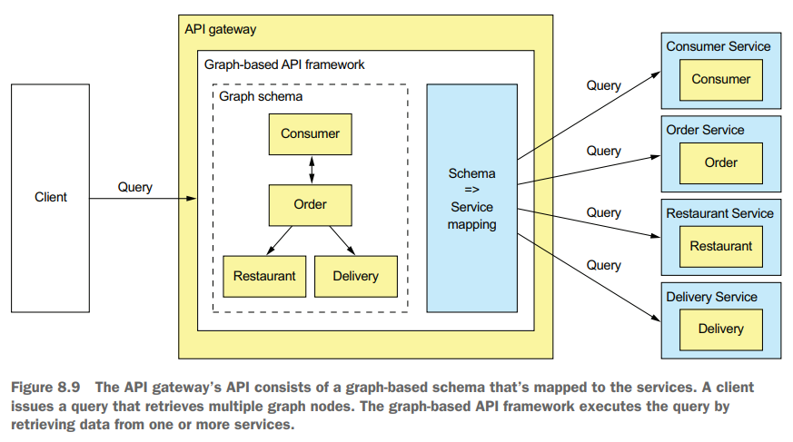

# Chapter 08 External API Patterns

## External API design issues

设计外部访问的API需要考虑到用户的环境，**不同的client环境应使用不同的接口**，在monolithic架构下往往只有同一套API接口供使用，而在microservices下则无法如此，主要因为：

- 不同的APIs分散在不同的微服务上，client为了**一个操作可能需要发起多个请求**访问不同的服务，导致额外的流量开销和延迟，这在mobile client上问题尤为严重，例如CQRS中的问题
- client需要感知所有后台微服务来组合各种请求，使得**后端服务对前端的透明、隔离变差**，甚至导致client的变更与service的变更锁死
- 后端微服务所采用的**IPC方式可能并不适合client**使用，例如部分服务可能采用HTTP、gRPC、AMQP等

## The API gateway pattern

采用**API gateway作为外部访问后端服务的唯一入口**，从而集成request routing、API composition、protocol translation、authentication等各种外部访问内部所需要的特有功能


- **Request Routing**: 类似采用反向代理的NGINX，根据HTTP method和url映射到对应的服务器
- **API Composition**: 即CQRS中提到的API Composition的实现
- **Protocol Translation**: 根据client和实际server的协议进行转换，例如调用内部服务采用gRPC，而向外部提供RESTful API接口
- **Client-specific API**: 不同的client可能有不同的调用需求，因此采用API gateway甚至可以为client提供特定的API接口，例如为iOS和Android提供不同的API使得更充分利用不同client的特性
- **Edge functions**
  - **Authentication**
  - **Authorization**
  - **Rate limiting**
  - **Caching**
  - **Metrics collection**
  - **Request logging**


采用**Backends for Frontends**模式可以解耦API gateway的权责，使得更灵活的迭代开发不同client和相应的gateway，而底层的公共层common layer则由API gateway team负责维护


API gateway设计需要考虑的问题

- **Performance and Scalability**: 作为所有后端服务的外部入口，且实现了诸多功能，API gateway必须是高性能且高可用的
- **Reactive Programming Abstractions**: 往往一个前端请求会对应多次后端请求（**fanout**），部分后端请求之间存在依赖关系，而所有请求串行执行则延迟高，从而应该充分**挖掘请求之间的依赖关系，对于无依赖的请求可以并发发出，并且采用响应式的编程接口来处请求的返回结果**，类似:
  
  ```cpp
  // serial
  auto resp1 = serviceA.blocking_call();
  auto resp2 = serviceB.blocking_call();
  auto resp3 = serviceC.blocking_call();
  respond_to_client(resp1, resp2, resp3);

  // reactive
  auto result_composer = [](auto resp) {
    handle(resp);
    if (completed) {
      respond_to_client(resp);
    }
  };
  serviceA.async_call(result_composer);
  serviceB.async_call(result_composer);
  serviceC.async_call(result_composer);
  wait_for_completion();
  ```

- **Handling Partial Failures**: 采用circuit breaker等模式避免被慢节点或宕机节点影响整个gateway的可用性，其他考虑的点有(idempotent) retry、hedging request等

## Implementing an API gateway

- 采用现有的API gateway产品
  - AWS API gateway
  - AWS Application Load Balancer, ALB
  - Kong
- 构建并维护自有的API gateway，通常基于现有的成熟开源框架
  - Netflix Zuul
  - Spring Cloud Gateway

    

    *代码示例见原文*

### GraphQL

- API gateway维护一个**graph schema包含了节点nodes、属性properties以及节点间的关系relationships**
- client的**查询请求包含所需节点和属性**，从而基于graph schema可以解析出所需要访问的服务
- **client对于想要返回的数据有完全的控制权**，即指定所需节点和属性，从而单个API gateway就可以支撑不同类型不同需求的client请求
- 通过graph schema来解析请求，client拥有了极大的灵活性，而server也不必在被client绑定，解耦了前后端，**类似于client发起SQL、server维护Database**，将SQL和Database的思想引入的前后端设计分离，*GraphQL*



> GraphQL clients can execute queries that **retrieve data** and mutations that **create and update data**.

以Apollo GraphQL为例:

- **GraphQL schema**定义了server-side的数据模型和支持的查询
- **Resolver functions**定义了schema内的元素到后端服务的映射关系
- **Proxy class**用于实际进行后端服务的调用


```graphql
type Query {
  orders(consumerId : Int!): [Order]
  order(orderId : Int!): Order
  consumer(consumerId : Int!): Consumer
}

type Consumer {
  id: ID
  firstName: String
  lastName: String
  orders: [order]
}

type Order {
  orderId: ID
  consumerId: Int
  consumer: Consumer
  restaurant: Restaurant
  deliveryInfo: DeliveryInfo
  ...
}

type Restaurant {
  id: ID
  name: String
  ...
}

type DeliveryInfo {
  status: DeliveryStatus
  estimatedDeliveryTime: Int
  assignedCourier: String
}

enum DeliveryStatus {
  PREPARING
  READY_FOR_PICKUP
  PICKED_UP
  DELIVERED
}
```

在使用过程中，client就可以发出如下查询请求，从而完全控制所想要获取的数据，非常灵活，例如简单、复杂、批量的查询:

```graphql
query {
  consumer(consumerId:1) {
    firstName
    lastName
  }
}

query {
  consumer(consumerId:1) {
    id
    firstName
    lastName
    orders {
      orderId
      restaurant {
        id
        name
      }
      deliveryInfo {
        estimatedDeliveryTime
        name
      }
    }
  }
}

query {
  c1: consumer(consumerId:1) { id, firstName, lastName }
  c2: consumer(consumerId:2) { id, firstName, lastName }
}
```

client发出的查询会通过GraphQL递归的模式来基于schema调用resolver填充所有数据，并且在过程中会发现一些重复调用的服务、重复获得的数据等，通过batching和caching来优化，**整体流程与Query Optimization/Execution非常相似**:


