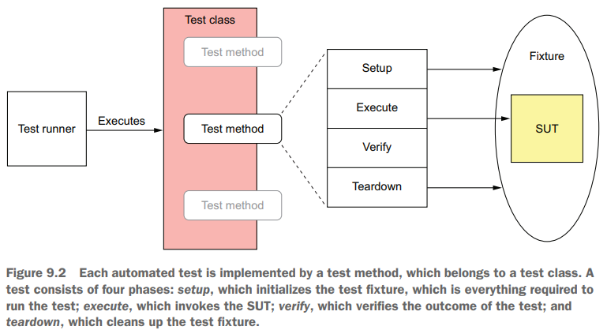
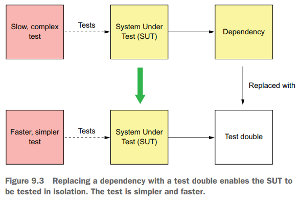
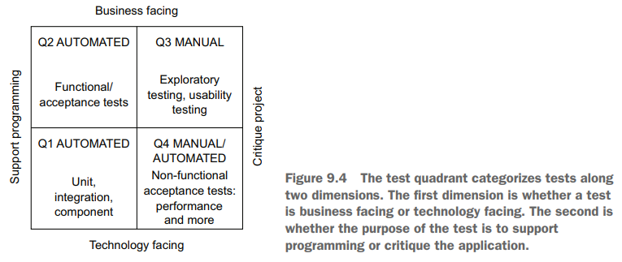
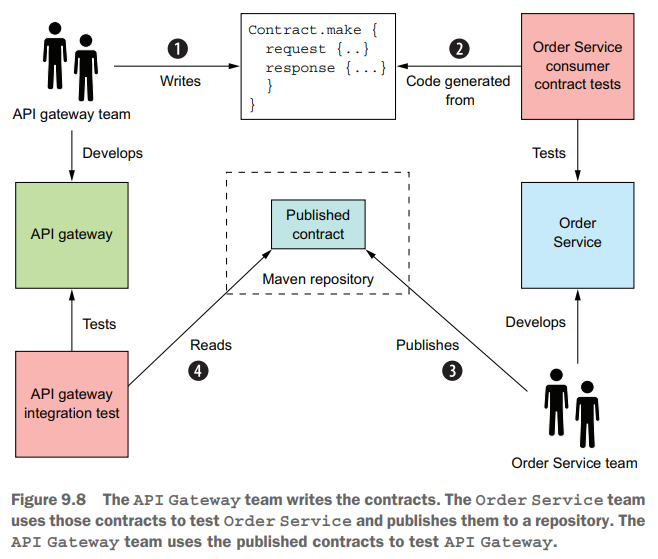
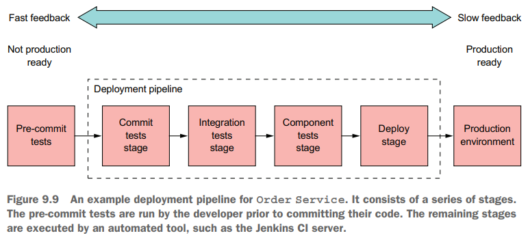
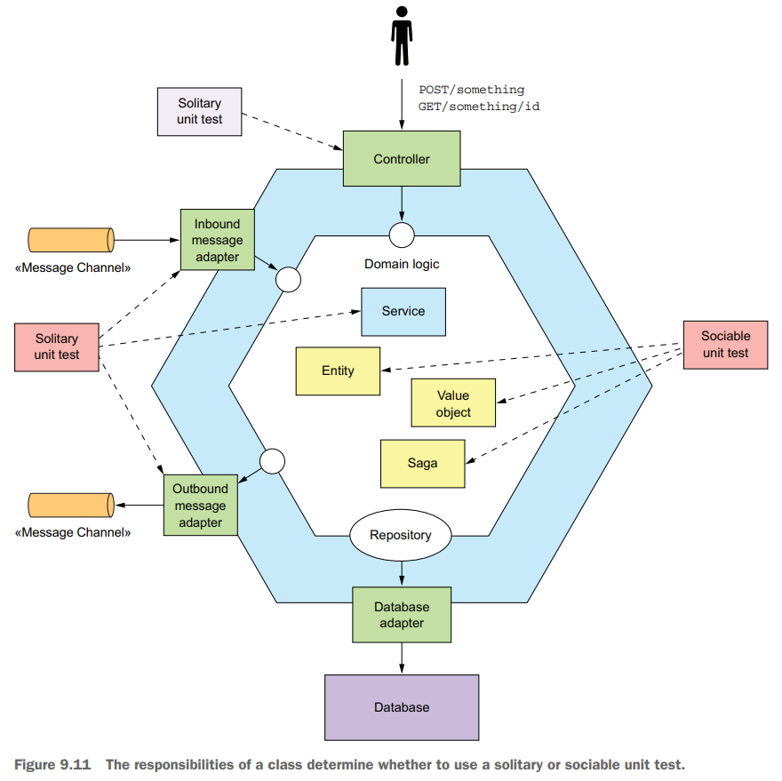

# Chapter 09 Testing Microservices: Part 1

## Testing Strategies for Microservice Architectures



对于被测服务，通常还需要将其依赖的服务替换为**mock/stub**来辅助测试和验证



采用Brian Marick's test quadrant对测试进行分类



**consumer-side contract test**用于测试不同服务/模块之间接口的稳定性，即接口能够完成数据交互，例如json schema是否匹配，而不在乎交互的数据是否符合业务逻辑的正确性，后者应该由下游业务团队的单元测试来保证





## Writing Unit Tests for a Service

通常一个服务内部的组件均采用sociable unit test来保证正确性，而所有涉及到外部依赖的组件，其外部依赖均采用mock进行solitary unit test

- **Solitary unit test**: 对类进行单元测试，并将被测对象的所有依赖全部替换为mock
- **Sociable unit test**: 对类进行单元测试，而被测对象的所有依赖都非mock而是正常的依赖对象



针对entities、value objects、sagas、domain services、controllers、messaging gateways的测试示例见原文，其中Saga的测试要点是以Orchestrator为例，采用**mock替换database和message broker**，并对saga相关的请求直接给出结果来加快saga业务流程测试:

```java
public class CreateOrderSagaTest {
  @Test
  public void shouldCreateOrder() {
    // happy path
    given().
      // Create the saga.
      saga(new CreateOrderSaga(kitchenServiceProxy),
           new CreateOrderSagaState(ORDER_ID, CHICKEN_VINDALOO_ORDER_DETAILS)).
    expect().
      // Verify that it sends a ValidateOrderByConsumer message to Consumer Service.
      command(new ValidateOrderByConsumer(CONSUMER_ID, ORDER_ID, CHICKEN_VINDALOO_ORDER_TOTAL)).
        to(ConsumerServiceChannels.consumerServiceChannel).
    andGiven().
      // Send a Success reply to that message.
      successReply().
    expect().
      // Verify that it sends a CreateTicket message to Kitchen Service.
      command(new CreateTicket(AJANTA_ID, ORDER_ID, null)).
        to(KitchenServiceChannels.kitchenServiceChannel);
  }

  @Test
  public void shouldRejectOrderDueToConsumerVerificationFailed() {
    // negative path
    given().
      saga(new CreateOrderSaga(kitchenServiceProxy),
           new CreateOrderSagaState(ORDER_ID, CHICKEN_VINDALOO_ORDER_DETAILS)).
    expect().
      command(new ValidateOrderByConsumer(CONSUMER_ID, ORDER_ID, CHICKEN_VINDALOO_ORDER_TOTAL)).
        to(ConsumerServiceChannels.consumerServiceChannel).
    andGiven().
      // Send a failure reply indicating that Consumer Service rejected Order.
      failureReply().
    expect().
      // Verify that the saga sends a RejectOrderCommand message to Order Service.
      command(new RejectOrderCommand(ORDER_ID)).
        to(OrderServiceChannels.orderServiceChannel);
  }
}
```

messaging gateway的mock辅助测试:

```java
public class OrderEventConsumerTest {
  private OrderService orderService;
  private OrderEventConsumer orderEventConsumer;

  @Before
  public void setUp() throws Exception {
  orderService = mock(OrderService.class);
  // Instantiate OrderEventConsumer with mocked dependencies.
  orderEventConsumer = new OrderEventConsumer(orderService); 
  }

  @Test
  public void shouldCreateMenu() {
    // Configure OrderEventConsumer domain handlers.
    given().
      eventHandlers(orderEventConsumer.domainEventHandlers()).
    when().
      aggregate("net.chrisrichardson.ftgo.restaurantservice.domain.Restaurant",AJANTA_ID).
      // Publish a Restaurant- Created event.
      publishes(new RestaurantCreated(AJANTA_RESTAURANT_NAME, RestaurantMother.AJANTA_RESTAURANT_MENU)).
    then().
      // Verify that OrderEventConsumer invoked OrderService.createMenu().
      verify(() -> {
        verify(orderService).createMenu(AJANTA_ID, new RestaurantMenu(RestaurantMother.AJANTA_RESTAURANT_MENU_ITEMS));
      });
  }
}
```
