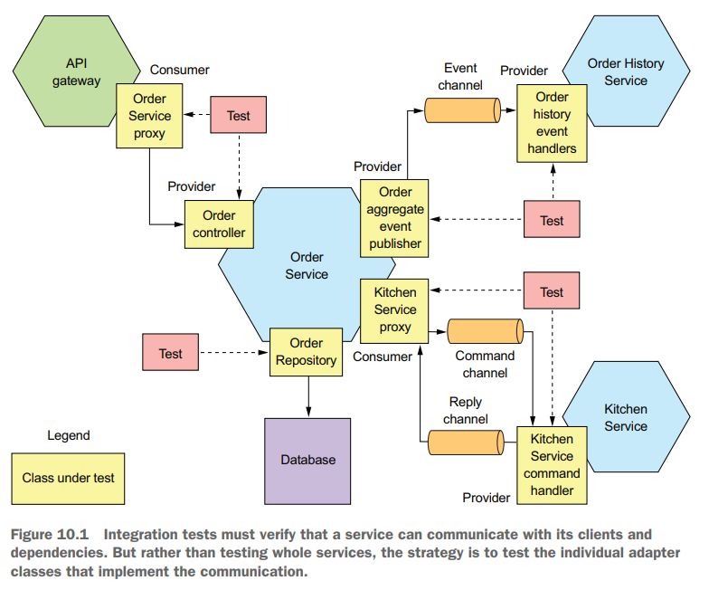
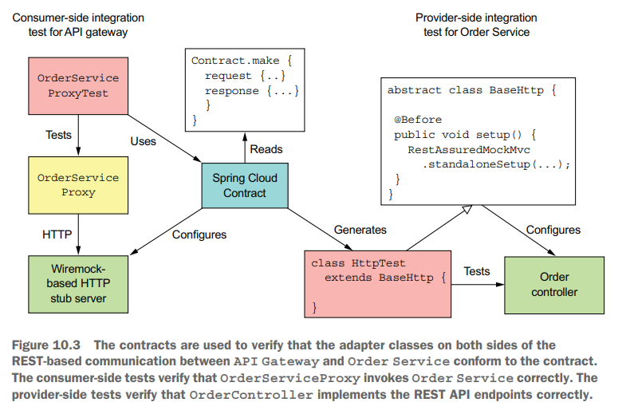
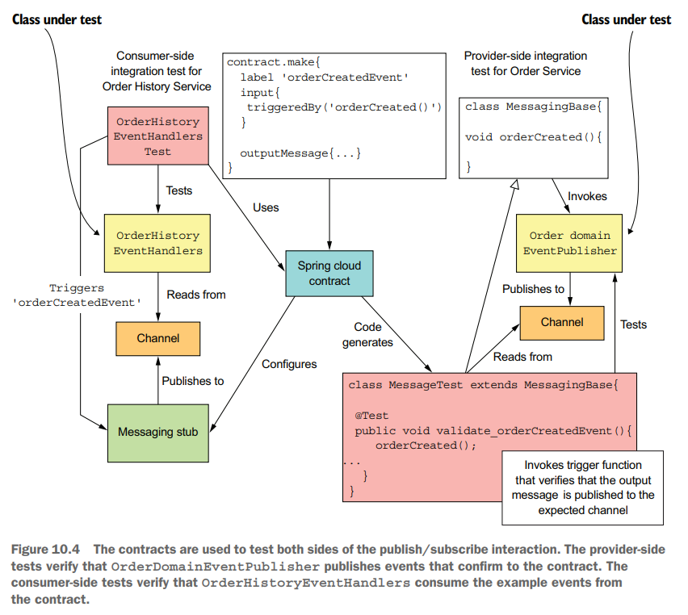
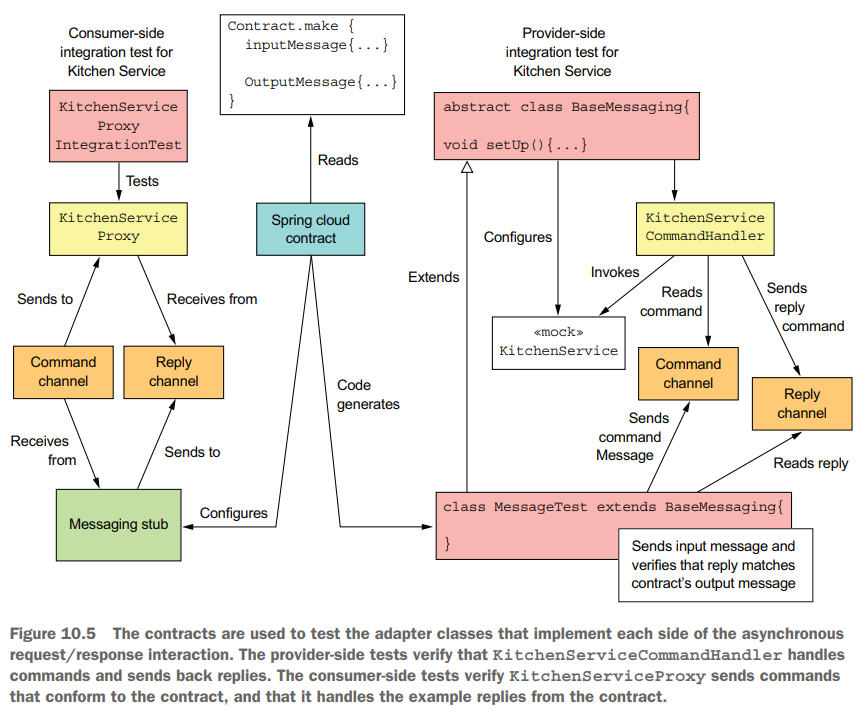
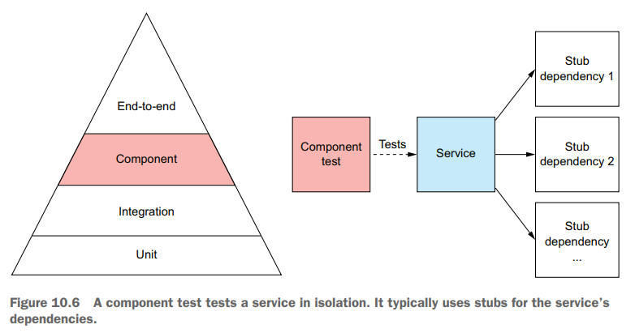
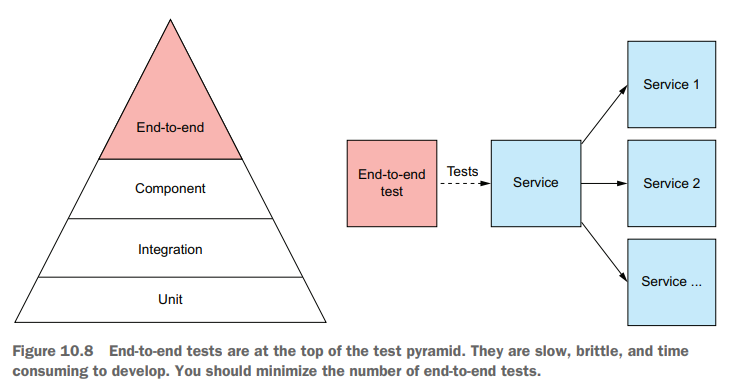

# Chapter 10 Testing Microservices: Part 2

## Writing Integration Tests

采用组件测试来测试单个服务，将服务的所有依赖均mock相应的接口，例如数据库接口、消息队列接口等，从而能够在不依赖其他设施的情况下进行高效测试单个服务本身的所有逻辑，因此对于**单个服务与其他服务的集成就需要依靠集成测试integration test来保证**，服务/基础设施之间的交互可以用*Contract*的方式定义，从而基于此并采用mock其他服务的方式来测试集成是否符合定义的行为

- testing **REST-based** interactions

  

- testing **pub/sub-based** interactions

  

- testing **async req/resp** interactions

  

## Developing Component Tests

**采用组件测试component tests来测试单个服务，将服务的所有依赖均mock相应的接口**，例如数据库接口、消息队列接口等，从而能够在不依赖其他设施的情况下进行高效测试单个服务本身的所有逻辑，测试用例可以基于该服务的实际业务场景撰写

## Writing End-to-end Tests

针对整个应用的测试，所有模块均是真实有效的模块，通常测试流程长，测试用例执行过程就是整个应用的实际使用过程

