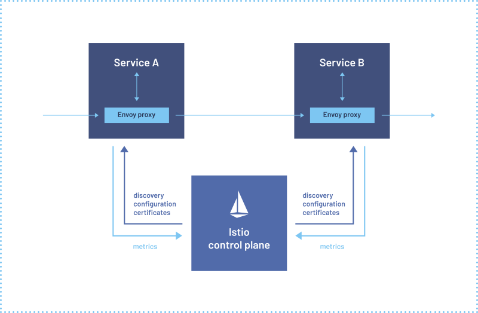

# Chapter 11 Developing Production-ready Services

## Developing Secure Services

### Authentication

**考虑采用成熟的安全框架来应用authentication/authorization**

采用API gateway来完成authentication而不是由每个service自身来完成，从而将authentication中心化处理:

- API clients
  1. 请求携带有credentials
  2. API gateway鉴权后创建security token并在调用后续服务时携带
- login-based clients
  1. 首先需要请求login
  2. API gateway鉴权后创建security token返回给client
  3. client后续请求都带上security token
  4. API gateway对security token鉴权后在调用后续服务时携带

### Authorization

采用API gateway只能完成role-based对URL path的鉴权，且容易将API gateway与具体不同URL对应的服务相耦合，因此更好的做法是每个**service实现role-based和ACL-based authorization**

- **JWT**
  
  JWT属于transparent token，包含了足够多的用户信息，并且由签发者，此处是API gateway，私钥签名，从而保证了token不会被签发者以外的恶意攻击者伪造，缺点在于irrevocable，因此通常通过限定token的有效期来缓解该问题

- **OAuth 2.0**

  OAuth 2.0标准化的框架提供了成熟稳定的鉴权服务，可以直接采用实现了OAuth 2.0的框架而不是手动基于JWT实现，OAuth 2.0的核心概念有:

  - **Authorization Server**: 提供API用于鉴权以及获取Access/Refresh Token
  - **Access Token**: 用于访问Resource Server，可以采用JWTs
  - **Refresh Token**: 长生命周期、且可以被撤回令牌，client采用Refresh Token来获得新的Access Token
  - **Resource Server**: 采用Access Token来授权访问的服务，在微服务架构中，所有业务服务均属于Resource Server
  - **Client**: 希望访问Resource Server的客户端，在微服务架构中，API gateway属于Client

  采用OAuth 2.0的鉴权过程，注意第一步API client采用基本的authentication提供credentials:

  

  对session-oriented client的鉴权过程，假如Access Token过期，则API gateway负责通过Refresh Token来获取新的Access Token:

  

## Designing Configurable Services

采用外部配置externalized configuration可以提高安全性，由服务在运行时访问配置中心来获取运行所需要的参数，具体包括push/pull两种模式

- **Push-based** externalized configuration

  依赖部署设施在创建服务实例时注入配置信息，优点在于简单，缺点在于当需要修改配置时往往需要销毁/重建当前实例以应用新配置

  

- **Pull-based** externalized configuration

  服务实例在运行时从配置中心（例如database、git、Hashicorp Vault、AWS Parameter Store等）读取配置信息，而配置中心本身的配置则是有push-based注入到服务中，采用这种模式的优点在于中心化的配置，易于管理和维护，更好的安全性，以及服务可以在运行中定期读取配置来应用最新的修改而不需要重启，缺点在于需要作为单独的服务来提供，提高了系统复杂度

  

## Designing Observable Services

- **Health check API**

  服务通过接口暴露自身的健康状态，例如返回`200`代表健康且可以接收请求，返回`503`代表有问题从而上层路由设施就不会将请求路由到该服务上，健康检查接口可以通过检测服务内部与基础设施的接口状态来获得整个服务的健康状态

  

- **Log aggregation**

  常见的日志框架比如ELK，即Elasticsearch、Logstash、Kibana

  

- **Distributed tracing**

  

- **Application metrics**

  通常也可以分为应用主动**上报指标的push模式**和服务器主动**轮询指标的pull模式**

  

- **Exception tracking**

  出现异常、coredump等往往预示着严重的事故，并且stacktrace往往难以通过正常的log aggregation来记录和告警，应通过独立的exception tracking框架来捕获并处理这类问题

  

- **Audit logging**

  审查并记录用户的行为，往往用于客户支持、安全合规、风险审查等场景，可以考虑的audit logging方式有:
  - 直接在业务逻辑中增加相应的日志
  - 采用aspect-oriented programming AOP
  - 采用事件溯源event sourcing

## Microservice Chassis Pattern

前述提到的各种组件均是微服务会需要涉及的通用组件，因此有相当多的现成框架整合了这些功能，可以直接采用，即**microservice chassis**

## Service Mesh

采用microservice chassis的问题在于，假如整个系统包含多个语言，则每个语言都必须采用各自的框架，这些框架之间可能还存在一些兼容性问题，service mesh模式则可以进一步简化系统架构，服务仅需要支持最小化的功能例如健康检测、配置中心访问等，而服务间的流量、负载均衡、服务发现、指标等均通过**proxy与service mesh control plane控制**，例如[istio](https://istio.io)

