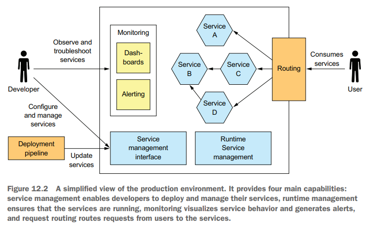
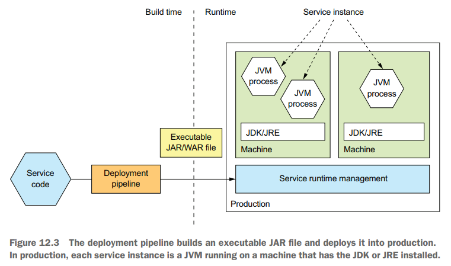
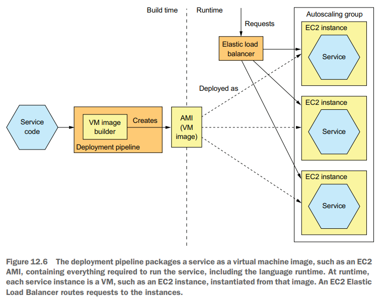
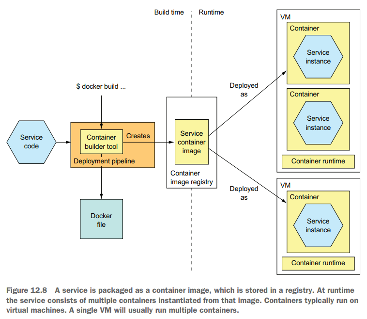
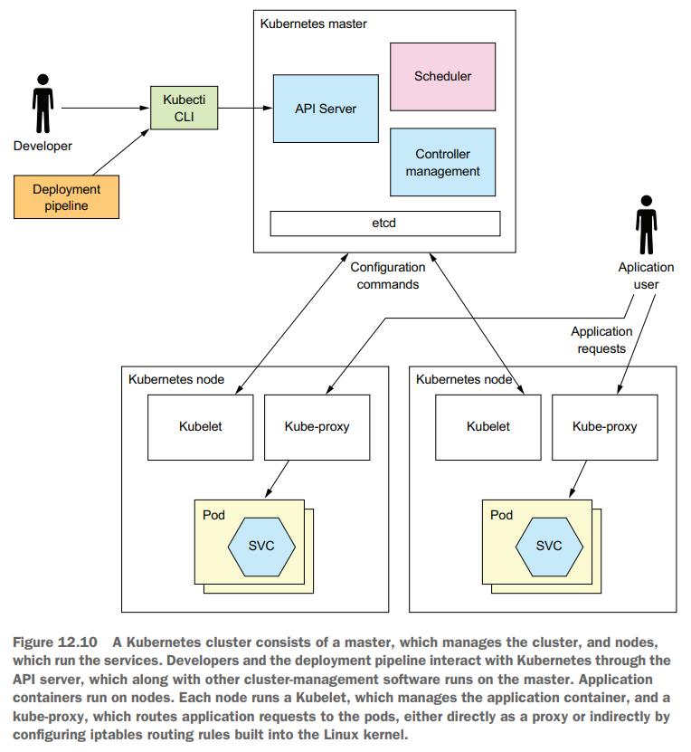
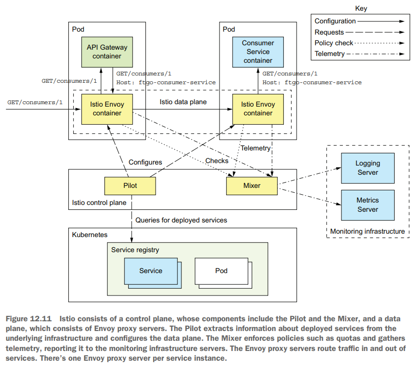
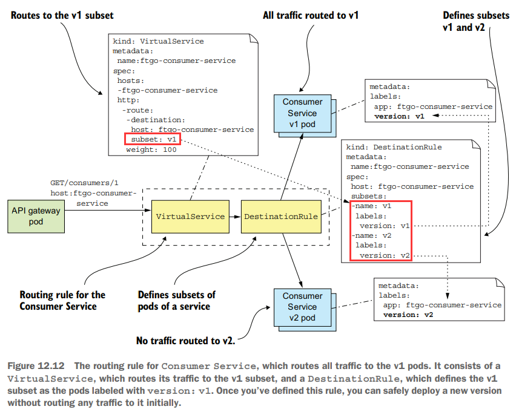
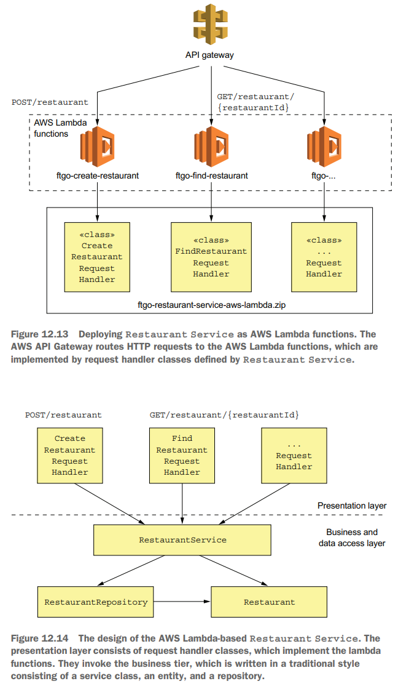

# Chapter 12 Deploying Microservices



## Language-specific Pattern

采用语言特定的封装格式进行部署，例如JAR/WAR的形式部署Java服务、源码和模块的形式部署NodeJS服务、操作系统特定的可执行二进制形式部署GoLang服务等

**优点:**

- 快速部署
- 资源利用率高、额外的开销小（尤其是多个服务实例在同一个物理机器/进程内）

**缺点:**

- 技术栈没有隔离，例如出现A服务依赖的dep和B服务依赖的dep版本不同且无法兼容，则部署将会非常困难
- 难以单独限制某个服务实例的资源，即混合部署容易相互影响
- 多个服务实例共享物理机器，没有隔离，即混合部署容易相互影响
- 扩容或上线新服务时难以决定部署的位置



## Service as a Virtual Machine Pattern

配置服务作为一个虚拟机，包含了其运行所需要的所有依赖环境，从而以虚拟机作为部署、扩容的最小单位

**优点:**

- 虚拟机封装了技术栈，提供了隔离性
- 不同服务实例之间相互隔离，不会影响
- 可以充分利用成熟的云计算基础设施IaaS

**缺点:**

- 由于整个虚拟机只允许一个服务实例，资源利用率较低
- 部署相对较慢，配置创建一个虚拟机需要一定时间
- 系统管理有额外的开销



## Service as a Container Pattern

容器化部署，由操作系统提供的虚拟化机制实现，每个容器中运行一个服务进程，并包含了其所需要的环境，同时还可以通过image registry来简化部署上线流程

**优点:**

- 容器封装了技术栈，同时容器提供API用于管理
- 服务实例相互隔离，且可以单独限制资源使用量
- 比虚拟机更加轻量，构建部署更快速
- 资源利用率更高，额外开销少

**缺点:**

- 需要维护并管理容器平台，或者选择云计算基础设施Google Container Engine或AWS ECS



## Kubernetes



定义Restaurant Service示例:

```yaml
apiVersion: extensions/v1beta1
# Specifies that this is an object of type Deployment
kind: Deployment
  metadata:
    # The name of the deployment
    name: ftgo-restaurant-service
  spec:
    # Number of pod replicas
    replicas: 2
      template:
        metadata:
          labels:
            # Gives each pod a label called app whose value is ftgo-restaurant-service
            app: ftgo-restaurant-service 
          # The specification of the pod, which defines just one container
          spec: 
            containers:
              name: ftgo-restaurant-service
              image: msapatterns/ftgo-restaurant-service:latest
              imagePullPolicy: Always
              ports:
                  # The container’s port
                - containerPort: 8080 
                  name: httpport
              # The container’s environment variables, which are read by Spring Boot
              env: 
                - name: JAVA_OPTS
                  value: "-Dsun.net.inetaddr.ttl=30"
                - name: SPRING_DATASOURCE_URL
                  value: jdbc:mysql://ftgo-mysql/eventuate
                - name: SPRING_DATASOURCE_USERNAME
                  valueFrom:
                    # Sensitive values that are retrieved from the Kubernetes Secret called ftgo-db-secret
                    secretKeyRef:
                      name: ftgo-db-secret
                      key: username
                - name: SPRING_DATASOURCE_PASSWORD
                  valueFrom:
                    secretKeyRef:
                      name: ftgo-db-secret 
                      key: password
                - name: SPRING_DATASOURCE_DRIVER_CLASS_NAME
                  value: com.mysql.jdbc.Driver
                - name: EVENTUATELOCAL_KAFKA_BOOTSTRAP_SERVERS
                  value: ftgo-kafka:9092
                - name: EVENTUATELOCAL_ZOOKEEPER_CONNECTION_STRING
                  value: ftgo-zookeeper:2181
              # Configure Kubernetes to invoke the health check endpoint.
              livenessProbe:
                httpGet:
                  path: /actuator/health
                  port: 8080
                initialDelaySeconds: 60
                periodSeconds: 20
              readinessProbe:
                httpGet:
                  path: /actuator/health
                  port: 8080
                initialDelaySeconds: 60
                periodSeconds: 20
```

配置service用于路由请求和服务发现:

```yaml
apiVersion: v1
kind: Service
metadata:
  # The name of the service, also the DNS name
  name: ftgo-restaurant-service 
spec:
  ports:
  # The exposed port
  - port: 8080
    # The container port to route traffic to
    targetPort: 8080
  selector:
    # Selects the containers to route traffic to
    app: ftgo-restaurant-service 
---
```

**Zero-downtime deployments，即滚动升级**，当需要版本更新时，K8S会确保始终有节点能够处理请求，通过`readinessProbe`探测确保新上线/新版本的pod已经可以开始接收请求时，才会将旧节点在请求处理完成后关闭回收资源，而若新版本出现问题时，K8S可以轻松回滚到之前的部署版本；但另一方面，若是新的部署存在逻辑上的问题，在真正处理请求过程中存在错误，则K8S并不能感知到这一点而是会继续滚动升级，这里就需要**将Deployment与Release相分离**，前者代表部署上线在生产环境运行、而后者代表真正处理用户请求

### Service Mesh to Seprate Deployment from Release

通常更安全的部署上线流程是:

1. 部署新版本到生产环境中，并且所有请求依然只由旧版本处理
2. 在生产环境完成新版本的基本测试
3. 释放少量真实用户的请求到新版本中，观测所有数据、监控、指标情况，即**灰度发布**
4. 在没有出现问题的情况下，逐步扩大流量，直到所有真实用户的请求均由新版本来处理
5. 过程中若出现任何问题，则进行回滚，将新版本处理的流量重新切回旧版本

传统的部署模型不容易支持灰度发布这样的精确流量控制，采用service mesh则可以容易做到，以Istio为例:

- Istio由**控制面control plane**和**数据面data plane**组成
  - 控制面包含了管理、系统配置、按规则定义执行流量切分等
  - 数据面包括envoy proxies，每个服务实例以sidecar形式部署一个envoy来执行控制面的指令
- 控制面的主要组件有**pilot**和**mixer**
  - pilot负责从envoy获取整个系统的部署状态、健康有效的pods等，从而**进行规则定义的流量导向**，例如只将少部分用户导向新版本的服务
  - mixer负责从envoy收集统计信息telemetry用于监控告警，并**检查强化定义的规则**
- **Envoy proxies接管服务的所有in/out流量**，并根据控制面定义的规则进行处理，其支持TCP/HTTP等低级别协议、同样也感知Redis/MongoDB等高级别协议，并且支持限流、熔断、重试、TLS通信等机制



*采用Istio部署服务的示例见原文*，采用规则定义将流量全部导向旧版本（v1）的服务实例如下图:



通过简单配置来修改一部分流量目标导向新版本（v2）的配置实例如下:

```yaml
apiVersion: networking.istio.io/v1alpha3
kind: VirtualService
metadata:
  name: ftgo-consumer-service
spec:
  hosts:
  - ftgo-consumer-service
  http:
      # Matches a nonblank testuser header
      # and routes test users to v2
    - match:
      - headers:
          testuser:
            regex: "^.+$" 
      route:
      - destination:
        host: ftgo-consumer-service
        subset: v2 
    - route:
      - destination:
        host: ftgo-consumer-service
        subset: v1


      # Alternative: weighted routing
    - route:
      - destination:
        host: ftgo-consumer-service
        subset: v1
        weight: 95
      - destination:
        host: ftgo-consumer-service
        subset: v2
        weight: 5
```

## Serverless Pattern

由云计算厂商负责非业务层的一切设施，用户只需要提供所需要运行的函数，即**Function as a Service**，例如AWS Lambda、Google Cloud Function

**优点:**

- Integrated with many cloud services, e.g. AWS
- Eliminates many system administration tasks
- Elasticity
- Usage-based pricing

**缺点:**

- Long-tail latency
- Limited event/request-based programming model

## RESTful service using AWS Lambda and AWS Gateway


