# Chapter 13 Refactoring to Microservices

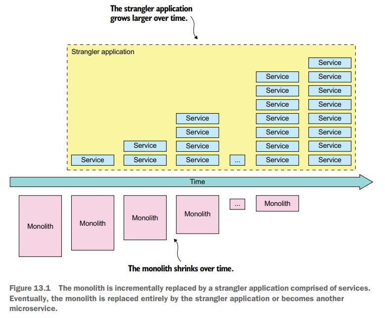

## Strategies for Refactoring a Monolith to Microservices

- **Implement new features as services**

  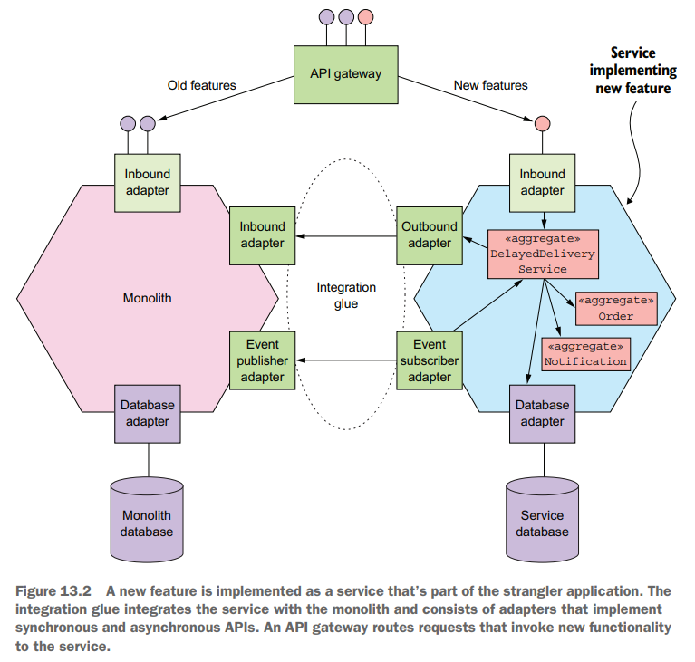

- **Separate the presentation tier from the backend**

  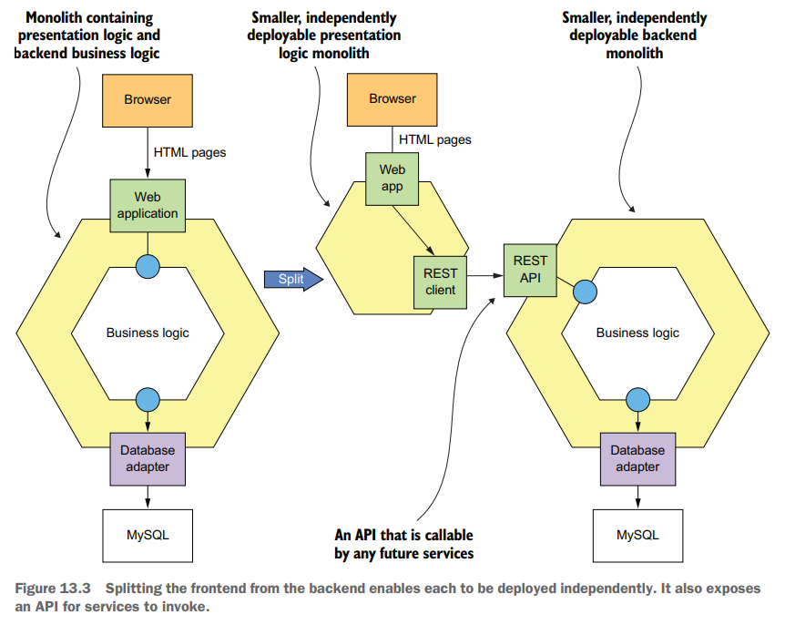

- **Extract business capabilities into services**

  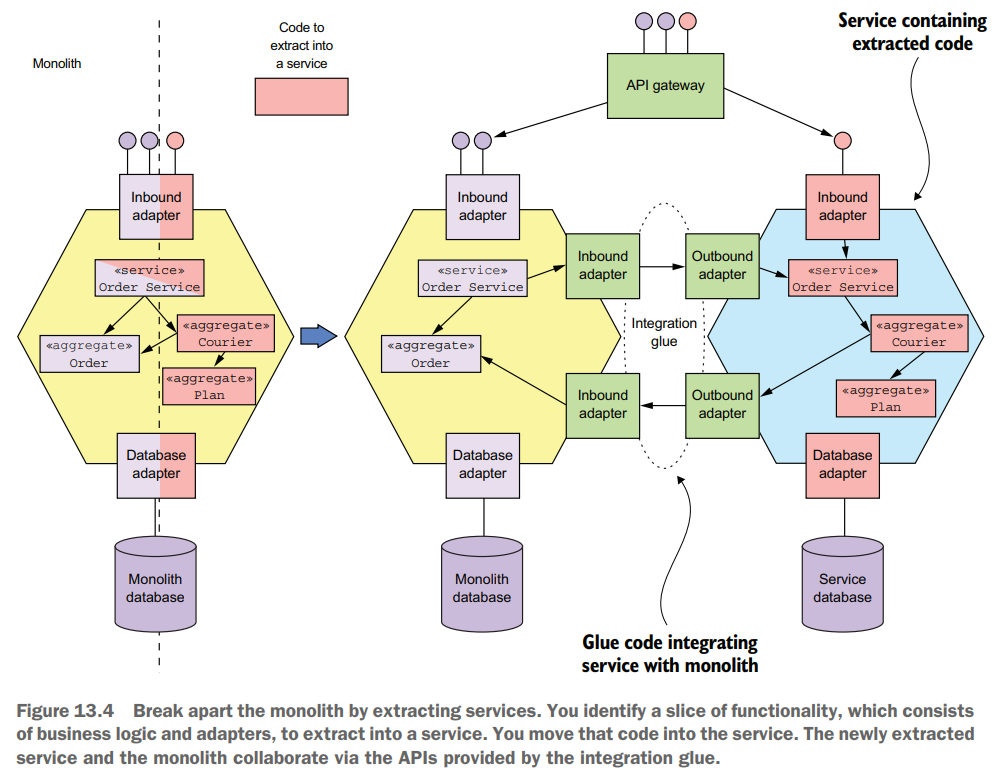

  - **Splitting the domain model**: 原本直接组合的对象此时有可能跨越了不同的服务边界，可以通过外键来进行解耦

    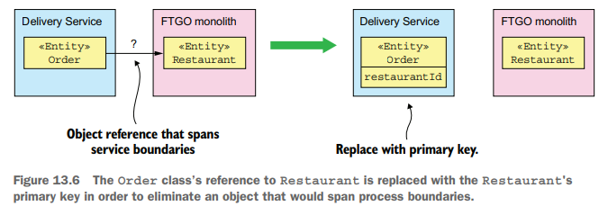
  
  - **Refactoring the database**: 分库分表、读写分离等原则
  - **Replicate data to avoid widespread changes**

    Preserve the original schema for **a transition period** and use triggers to **synchronize the original and new schemas**.

    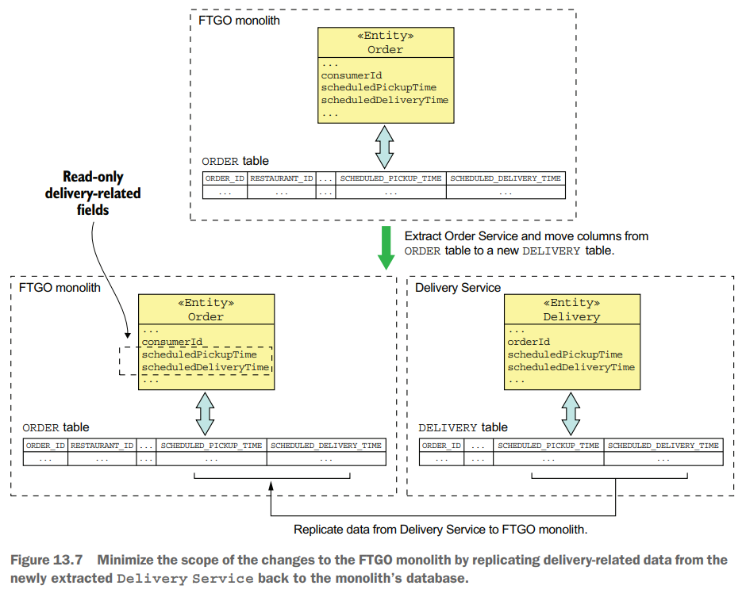

## Designing How the Service and the Monolith Collaborate

- **Designing the integration glue**
  - interaction API
  - interaction style/IPC mechanism
  - **anti-corruption layer**: 避免将monolith的数据/对象直接暴露给新的服务，污染新的服务，必须采用anti-corruption层包装monolith的数据/对象，只提供所需要的最小部分，最小责任原则

    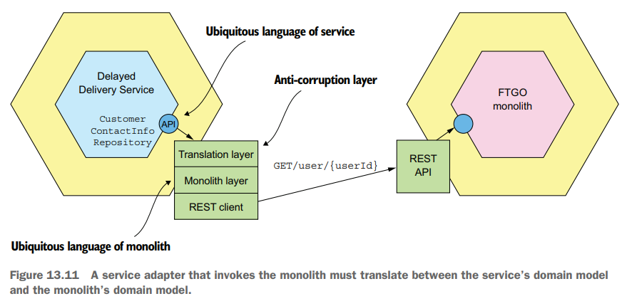

- **Maintaining data consistency across a service and a monolith**
  
  分布式系统中常见的Saga事务可能很难引入monolith，核心在于monolith无法轻易支持Saga所需要的**compensating transactions**

  较好的做法在于选择monolith中合适的服务进行抽取，假如**在monolith后其他服务的事务均是不可能失败的retriable transactions**，即**pivot transaction / no-return point出现不晚于monolith中的事务**，则意味着monolith中的事务一旦正常完成就不需要提供compensating transactions，从而monolith可以很容易的作为参与者实现Saga

  具体调整事务顺序以达到monolith不需要提供compensating transactions的例子:

  - 抽取出`Order Service`
    1. `Order Service`: create an `Order` in an `APPROVAL_PENDING` state
    2. **Monolith, pivot transaction**
       - verify that the consumer can place an order
       - validate order details and create a `Ticket`
       - authorize consumer’s credit card
    3. `Order Service`: change state of `Order` to `APPROVED`
  - 抽取出`Consumer Service`
    1. `Order Service`: create an `Order` in an `APPROVAL_PENDING` state
    2. `Consumer Service`: verify that the consumer can place an order
    3. **Monolith, pivot transaction**
       - validate order details and create a `Ticket`
       - authorize consumer’s credit card
    4. `Order Service`: change state of `Order` to `APPROVED`
  - 抽取出`Kitchen Service`
    1. `Order Service`: create an Order in an `APPROVAL_PENDING` state
    2. `Consumer Service`: verify that the consumer can place an order
    3. `Kitchen Service`: validate order details and create a PENDING `Ticket`
    4. **Monolith, pivot transaction**
       - authorize consumer’s credit card
    5. `Kitchen Service`: change state of `Ticket` to `APPROVED`
    6. `Order Service`: change state of `Order` to `APPROVED`
  - 抽取出`Accounting Service`
    1. `Order Service`: create an Order in an `APPROVAL_PENDING` state
    2. `Consumer Service`: verify that the consumer can place an order
    3. `Kitchen Service`: validate order details and create a PENDING `Ticket`
    4. `Accounting Service`: authorize consumer’s credit card
    5. `Kitchen Service`: change state of `Ticket` to `APPROVED`
    6. `Order Service`: change state of `Order` to `APPROVED`

- **Handling authentication and authorization**

  在monolith中加入`LoginHandler`来集成authentication/authorization服务

  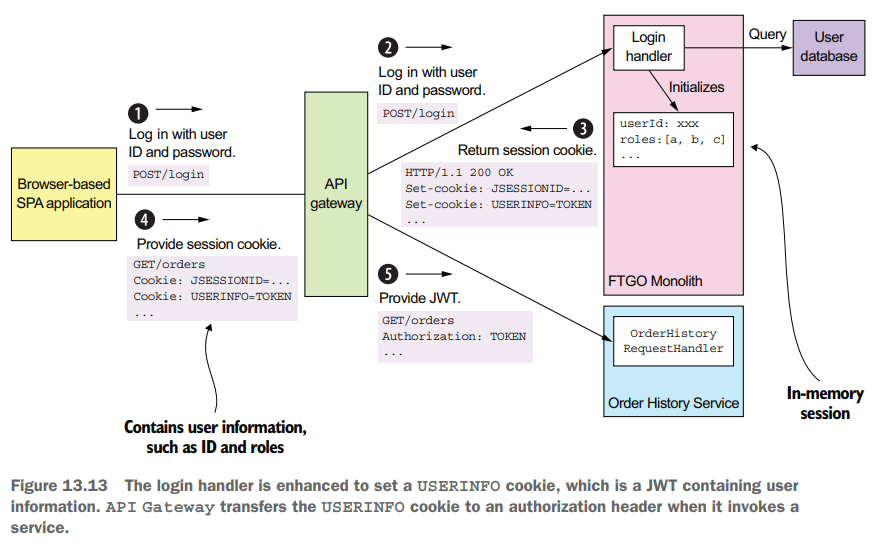

## Implementing a New Feature as a Service: Delayed Order Service

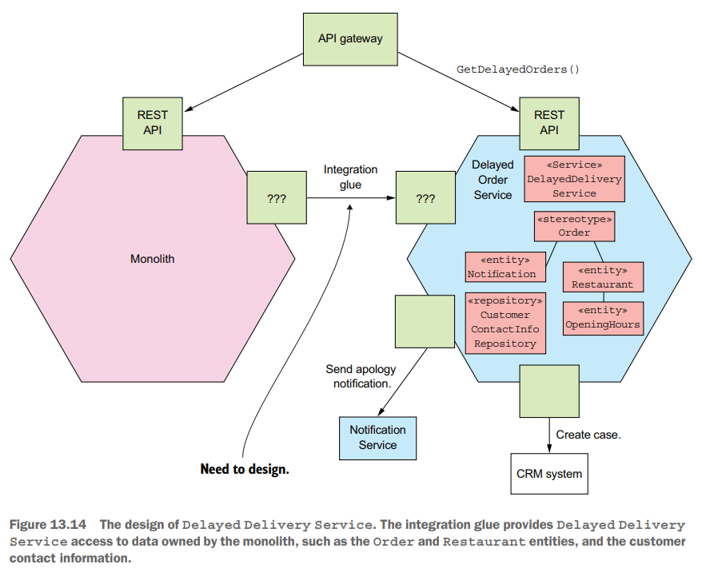

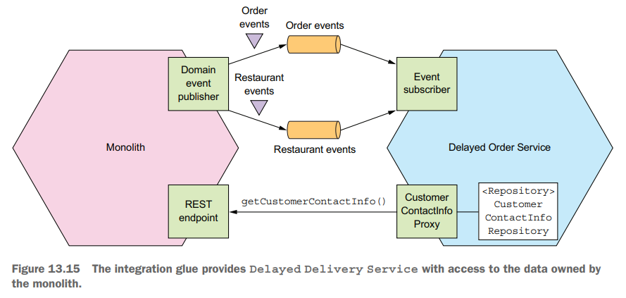

## Breaking Apart the Monolith: Delivery Service

- **identify entities**

  首先根据数据对象的字段，判断属于哪个服务，进行domain model的拆分和设计

  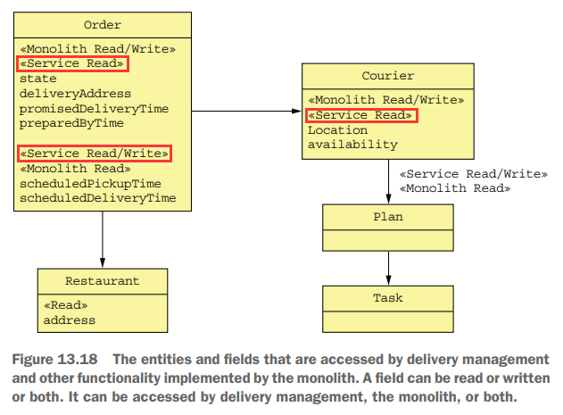

- **design integration glue**

  基于新服务的domain model，设计相应的访问API以及与其他单体/微服务的交互方式

  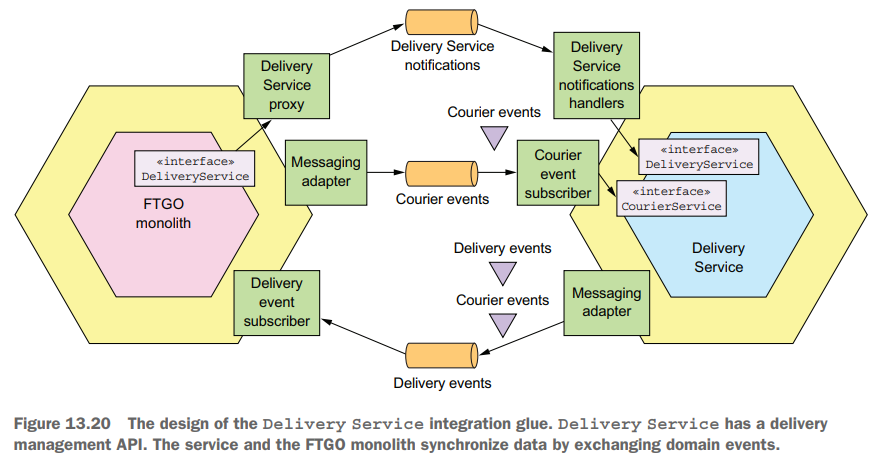

- **feature toggles**

  **采用配置开关来动态选择是否启用新服务**，启用Delivery Service还是依然采用旧的monolith中的流程，从而在出现问题时可以及时切回到原先的方案，并且在稳定一段时间后再彻底移除feature toggles和monolith中相关的逻辑

  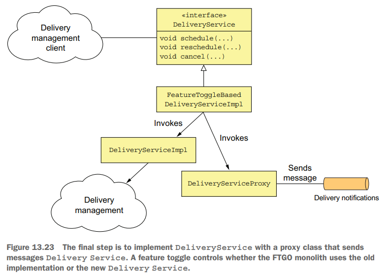
