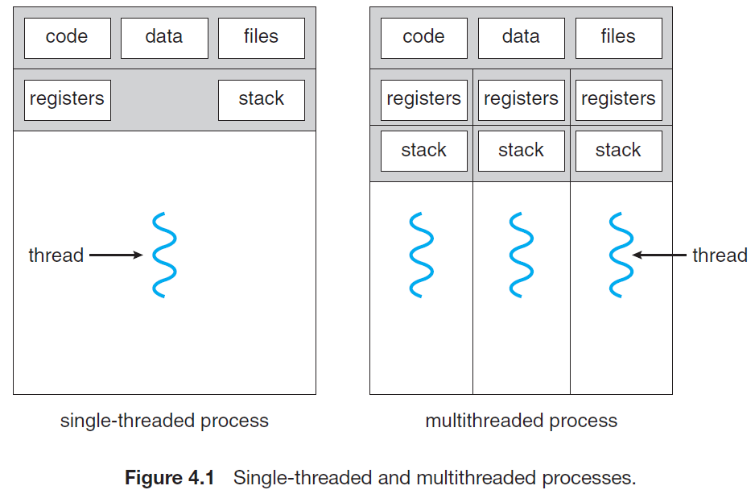
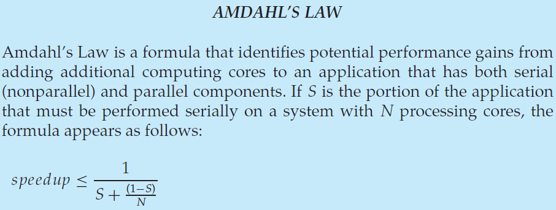
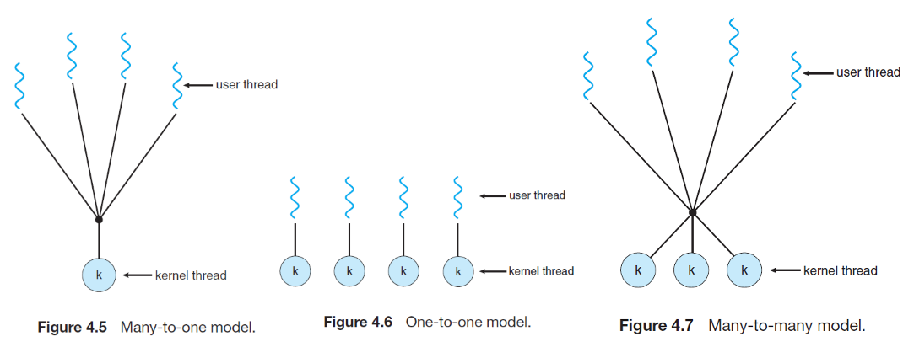

# Chapter 04. Threads

## 1. 线程概念 Thread Concept

线程**独立拥有线程TID、程序计数器PC、寄存器集合和栈**，并于其他同进程线程**共享代码、数据和系统资源**

## 2. 多核编程 Multicore Programming

**并行性parallelism**和**并发性concurrency**概念不同，前者指一个系统可以同时执行多个任务（但某个瞬间可以只执行一个任务，通过快速上下文切换来提供同时运行的幻象），而后者指一个系统可以同时推进多个任务即同时执行

## 3. 多线程模型 Multithreading Models

- **多对一 Many-to-One Model**
  多个用户线程对应一个内核线程，线程管理在用户空间实现，由于只对应一个内核线程，因此实际上并不能由多核处理器并发执行，缺陷明显
- **一对一 One-to-One Model**
  一个用户线程对应一个内核线程，提高了并发性，但由于每个用户线程都要创建一个内核线程，有一定的开销（context switch），因此往往会限制线程数量
- **多对多 Many-to-Many Model**
  多个用户线程对应多个内核线程，提高了并发性同时也没有对用户线程数的限定

## 4. 线程的要点 Threading Issues

- fork()和exec()系统调用
  在多线程下，某个线程调用fork()或exec()会导致整个进程改变还是导致调用者的线程改变取决于具体实现
  
  注意：**多线程下除了fork-exec的场合，禁止使用fork**
  
  > 多线程下某线程调用fork()，**仅将此线程复制并作为子进程的主线程**，其余线程在子进程中均立即停止并消失，并不会调用清理函数或是局部变量的析构函数，但是全局变量和pthread对象（mutex, condition等）会在子进程中保留，就会出现无法解锁、数据不一致等难题

- **信号处理 Signal Handling**
  无论是**同步信号**（信号由自身产生）还是**异步信号**（信号由外部产生），都有以下流程：
  1. 事件发生时，产生一个信号
  2. 信号被送到具体进程
  3. 一旦接收到信号，必须处理
  多线程下增加了信号处理的复杂度，一般有以下选择：
  - 将信号送给**信号作用的具体线程**
  - 将信号送给进程的**所有线程**
  - 将信号送给**特定的某个线程**
  - **指定某个线程**来接收所有信号并处理
- **线程取消 Thread Cancellation**
  线程取消指在线程正常运行完成之前就结束运行，分以下情况：
  - **异步取消 Asynchronous cancellation**：目标线程**被立即取消**，资源部分被操作系统回收
  - **延迟取消 Deferred cancellation**：目标线程**周期性确认是否要取消**执行，若要被取消则可以提前处理好资源问题，使得操作系统安全回收资源
- **线程本地存储 Thread-Local Storage, TLS**
  每个线程有一些自己私有的数据，称为线程本地存储（TLS）数据，不同于局部变量
