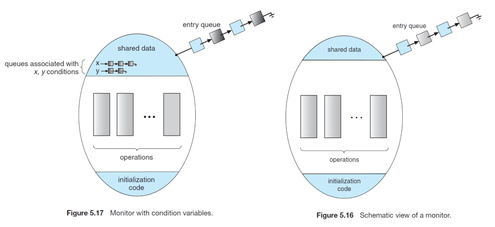

# Chapter 05. Process Synchronization

## 1. 临界区问题 The Critical-Section Problem

**竞争 race condition**：多个线程并发操作同一份数据，并且数据最终结果依赖于线程的操作顺序

- **临界区（critical section）**：进程可能改变共同数据的代码部分
- 进入区（entry section）：进程请求进入临界区的代码部分
- 退出区（exit section）：进程执行退出临界区的代码部分
- 剩余区（remainder section）：进程不在临界区中的代码部分
- 临界区问题的解答需要满足以下三点：
  - **互斥（Mutual exclusion）**：只有一个进程在临界区执行
  - **前进（Progress）**：若没有进程在临界区，则不在剩余区且申请进入临界区的进程需要被选择
  - **有限等待（Bounded waiting）**：一个进程提出申请到进入之前的等待时间是有限的，或一个进程提出申请后，其他进程能进入临界区的次数是有限的
- 操作系统内的临界区问题解法：**抢占preemptive**内核、**非抢占non-preemptive**内核

## 2. Peterson算法

```cpp
// for process i
do {
    flag[i] = true;
    trun = j;
    while (flag[j] && turn == j);

    {
        CRITICAL_SECTION;
    }

    flag[i] = false;

    {
        REMAINDER_SECTION;
    }
} while (true);
```

- **算法流程**
  `bool flag[]`表示`flag[i]`进程是否想要进入临界区，`turn`表示当前进入临界区的进程标识
  1. 首先`i`进程设置`flag[i] = true`表明申请进入临界区，并且**还未进入**，因此可以允许`j`进程进入，设置`turn = j`
  2. `while`循环检查，若`j`进程申请进入临界区`flag[j] == true`**且当前正在临界区中`turn == j`**，则`i`忙碌等待
  3. 若`j`进程退出了临界区`flag[j] = false`，则`i`可以进入，或者若当前允许`i`进程进入`turn = i`，则`i`可以进入
  4. `i`进入临界区处理，退出临界区时设置`flag[i] = false`并进入剩余区，此时若`j`在等待则j可以进入
- **正确性**
  - 互斥：`turn`只可能等于`i`或者`j`，则若`i`和`j`都希望进入临界区`flag[i]=flag[j]=true`，则必定有一者在等待，互斥性满足
  - 前进：若`i`和`j`都希望进入临界区，则`turn`会被先后赋值`i`、`j`或`j`、`i`，即一定有一者会进入临界区，前进条件满足
  - 有限等待：当`i`正在临界区中，`j`在等待时，一旦`i`退出临界区`flag[i]=false`，则`j`等待的条件`flag[j] != true`，`j`可以进入临界区，不会无限等待，注意此时`turn=i`，退出后的`i`若再想进入会设置`turn=j`即`i`不能在退出后又多次进入临界区，也符合有限等待要求

## 3. 互斥锁 Mutex Locks

- 进入临界区前需要获得锁，锁是boolean的，一旦一个进程获得，其他进程就需要等待锁被释放
- **自旋锁spinlock**：某个进程要求获得锁而得不到时会不停的检查是否能得到锁，即**忙等待**，一方面忙等待会浪费CPU资源，另一方面若进行线程/进程切换也会有一定开销，因此需要权衡使用

## 4. 信号量 Semaphores

信号量S除了初始化外只能通过两个原子操作访问：`wait()`和`signal()`，即`P`和`V`操作

- 信号量的使用
  - 计数信号量：值域不受限制，`wait`操作减小值，`signal`操作增加值，`value<=0`后执行`wait`的进程阻塞
  - 二值信号量：值只能是0或1，即互斥锁
- 信号量的实现
  解决忙等待的实现：当某个进程对信号量S执行`wait`发现已经无资源时，将自己**阻塞在信号量S（添加进S的等待队列）**上而不是忙等待，随后当信号量S被其他进程执行了`signal`操作后重启进程（**从S的等待队列移入就绪队列**，但CPU是否会立即选择这个就绪队列里的操作取决于调度算法）
- 信号量的问题
  - `wait`和`signal`**操作必须是原子的**，单核下可以通过开关中断等实现，多核（SMP）下可以通过自旋锁等实现
  - 这里的`wait`和`signal`并**没有完全取消忙等**，而是将进入临界区的忙等转移到了操作`wait`和`signal`的临界区内
- **死锁和饥饿 Deadlocks and Starvation**
  - 死锁：进程等待一个不可能发生的事件，例如A等B结束，B等A结束，则两者都不可能结束
  - 饥饿：即无限期阻塞，某个进程要求资源但始终不得到满足无法运行，就会无限期阻塞
- 优先级反转 Priority Inversion
  低优先级进程反过来决定高优先级进程等待时间的现象

  假设有`L<M<H`三个优先级排序的进程，L占用了A资源且在运行，H也申请了A资源，但被L占用而堵塞，此时M出现并抢占了L的运行，此时M正在运行而L未运行完则无法释放A，因此H需要等待L，而L需要等待M，即H反常等待优先级低的M运行，解决方案如下：
  - 只有**两种优先级**
  - **优先级继承**：访问需要被高优先级进程使用资源的低优先级进程**临时调整到同样的高优先级**，以此来避免被介于两者之间的进程抢占，在结束运行后优先级被恢复

## 5. 经典同步问题 Classic Problems of Synchronization

- 有限缓存问题
- **读者写者问题**
  - 第一类读者写者问题：读者优先，写者可能饥饿
  - 第二类读者写者问题：写者优先：读者可能饥饿

  **读写锁read-write lock**：分为读模式锁和写模式锁，多个只读进程可以并发获得读模式锁，只有一个写进程可以获得
- 哲学家进餐问题
  通过信号量或互斥锁来解决，注意：所有哲学家都饥饿并先拿起左手边的筷子同时在等待右侧哲学家手中的筷子，死锁发生，其解决方法可以是：
  - 限制哲学家的数量小于筷子的数量：**增加资源**
  - 只有两只筷子都能拿起时，才开始拿筷子，临界区里拿筷子，进入区里同时检测两侧筷子：尝试获得所需的所有资源，**不能都获得就全都不持有**
  - 使用非对称解，奇数哲学家先拿左边筷子，偶数哲学家先拿右边筷子：**按特定顺序获得资源**
  以上解法**没有解决饥饿**，某个哲学家可能会饿死

## 6. 管程 Monitors

信号量和互斥锁的使用易出错，管程类型封装这些操作，提供了一组**由程序员定义、在管程内互斥**的操作



- 管程的使用
  条件变量，只能用`wait`和`signal`来操作条件变量，`x.wait`意味着调用的进程被挂起直到另一进程使用`x.signal`，每个条件变量上都挂载了一队列的挂起进程，若无挂起进程则`signal`操作无影响

  若P调用了`x.signal()`，此时P继续执行还是立即让给`x.signal()`唤醒的Q来执行存在两种可能：
  - **唤醒并等待**：P调用了`signal`后等待Q运行，或等待其他条件
  - **唤醒并继续**：P调用`signal`后继续运行，或等待其他条件

- 哲学家进餐问题的管程解决

    ```cpp
    monitor DiningPhilosophers
    {
        // 5个哲学家的三个状态
        enum {THINKING, HUNGRY, EATING} state[5];
        // 5个哲学家的条件变量
        condition self[5];
        void pickup(int i) {
            // 进入饥饿（申请获得筷子）
            state[i] = HUNGRY;
            // 测试是否进食
            test(i);
            //若测试完未能进食就等待，使用wait挂起自己
            if (state[i] != EATING)
                self[i].wait();
        }
        void putdown(int i) {
            // 结束进食并测试左右侧哲学家是否进食
            state[i] = THINKING;
            test((i + 4) % 5);
            test((i + 1) % 5);
        }
        void test(int i) {
            if ((state[(i + 4) % 5] != EATING) &&
                (state[i] == HUNGRY) &&
                (state[(i + 1) % 5] != EATING)) {
                // 若左侧和右侧均未进食且自身需要进食，就进食
                state[i] = EATING;
                // 同时唤醒自己
                self[i].signal();
            }
        }
        initialization code() {
            // 初始化，所有哲学家进入思考
            for (int i = 0; i < 5; i++)
                state[i] = THINKING;
        }
    }
    ```

- 管程内进程重启
  当管程一个条件变量上挂载了多个进程时，**决定重启哪一个进程可用条件等待来处理**，例如重启时可以通过优先级来确定优先重启哪个进程，然而管程概念可能会出现以下问题，这些问题同样出现在信号量等结构中：
  - 进程没有获得访问权限就访问资源
  - 进程获得权限后不释放资源
  - 进程试图释放一个没有请求过的资源
  - 进程可能请求同一资源两次
