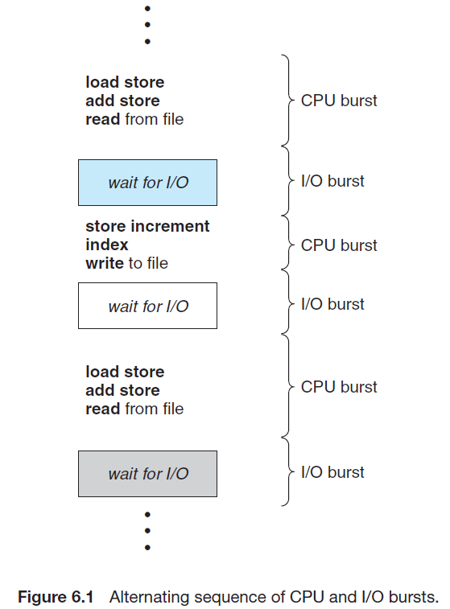

# Chapter 06. CPU Scheduling

## 1. 基本概念 Basic Concepts

- CPU-I/O区间周期
  
- CPU调度器
  由短期调度程序或CPU调度程序执行，从内存中选择一个能够执行的程序并分配CPU
- 抢占调度 preemptive
- 分派程序
  将CPU控制权移交给调度器选择的进程

## 2. 调度准则 Scheduling Criteria

`TODO`

## 3. 调度算法 Scheduling Algorithms

- **先到先服务 First-Come, First-Served Scheduling，FCFS**
- **最短作业优先 Shortest-Job-First Scheduling，SJF**
- **优先级调度 Priority Scheduling**
  可能导致无限堵塞或饥饿，可以通过**老化**（即优先级随时间流逝而提升）解决
- **轮转法调度 Round-Robin Scheduling，RR**
- **多级队列调度 Multilevel Queue Scheduling**
  不同进程被分配到不同队列中，每个队列有自己的调度算法，队列之间的调度也由算法来决定，一般队列之间是优先级抢占调度
  
- **多级反馈队列调度 Multilevel Feedback Queue Scheduling**
  与多级队列调度相比，允许进程在队列之间移动，由此不同进程分配到不同队列中，不同队列有调度算法，如何在队列之间移动有调度算法，每个队列长度不同，最复杂但广泛被采用

## 4. 线程调度 Thread Scheduling

操作系统调度的是内核线程，用户线程由线程库管理，当用户线程需要运行时必须被**直接映射**到或通过**轻量级进程（LWP）间接映射**到内核线程上才能进一步被操作系统调度

- **进程竞争范围 Process Contention Scope, PCS**
  线程库调度用户线程到一个LWP上运行，并**不意味该线程就在CPU上运行**了
- **系统竞争范围 System Contention Scope, SCS**
  操作系统调度内核线程到CPU上运行

## 5. 多处理器调度 Multiple-Processor Scheduling

- **多处理器调度方式**
  - **同构处理器 Symmetric Multi-Processing, SMP**
    所有处理器是对等的，每个处理器都可以访问数据结构，调度任务，考虑到调度的同步和互斥等，这种情况下调度复杂
  - **异构处理器 Asymmetric Multi-Processing**
    不同的处理器不对等
- **处理器亲和度 Processor Affinity**
  由于高速缓存的存在，若进程从一个处理器转移到另一个，则缓存也必须销毁和重建**cache bouncing**，因此SMP系统**倾向于尽量使得一个进程在一个处理器上运行**，pthread中可以通过`pthread_setaffinity_np`等函数控制亲和性，不禁止进程转移的称为**软亲和性**，严格要求进程不能转移到其他处理器的称为**硬亲和性**
- **负载均衡 Load Balancing**
  负载平衡要求将工作负载均匀分配到SMP系统的所有处理器上，通常用以下两种方式实现负载平衡：
  - push migration：从超载处理器推送任务到其他空闲处理器上
  - pull migration：使空闲处理器从超载处理器上获取任务
  
  注意，**负载平衡和处理器亲和性存在矛盾**，优劣取决于实际情况
- **多核处理器 Multiplecore Processors**
  单物理核心包括多逻辑核心（如Intel的超线程hyper-threading技术），由于CPU使用中从内存中等数据（缓存miss等原因）非常耗时而此时CPU是空闲的，因此进一步分割时间，使得当内存读取数据时立即切换执行另一个进程，**交叉切换可以获得单物理核心多逻辑核心**的状态
